TIREUR ET FILEUR D'OR
=====================

Contenant douze Planches. 

PLANCHE Iere.
-------------

[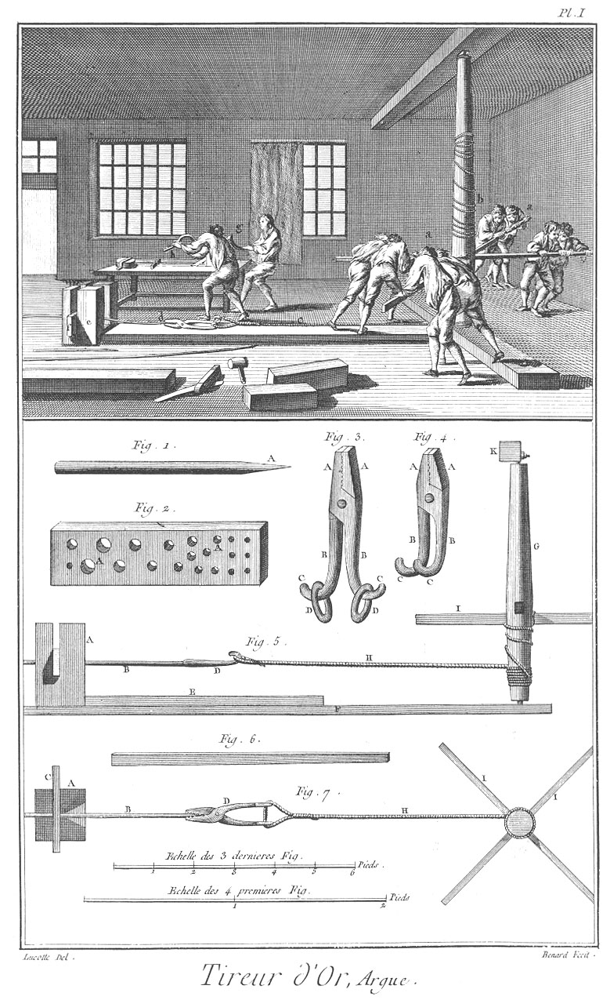](Planche_01.jpeg)

Le haut de cette Planche représente un attelier d'argue où plusieurs ouvriers sont occupés à tirer l'or.
	- a a, ouvrier tournant au moulinet.
	- b, le moulinet.
	- c, la corde.
	- d, la tenaille.
	- e, le billot.
	- f, la filiere.
	- g, ouvriers occupés à tirer la gavette.

Fig. 1. Cylindre doré ou barre de lingot prête à mettre en oeuvre.
	- A, la pointe qui se prend dans la tenaille.

2. Filiere d'argue.
	- A A, les trous de différentes grandeurs.

3. Tenaille.
	- A A, les mors.
	- B B, les branches.
	- C C, les crochets.
	- D D, les anneaux.

4. Autre tenaille.
	- A A, les mors.
	- B B, les branches.
	- C C, les crochets.

5. Elévation de l'argue.
	- A, le billot.
	- B, le cylindre C, la filiere.
	- D, la tenaille.
	- E, la plate forme.
	- F, le sommier.
	- G, le treuil du moulinet.
	- H, la corde.
	- I I, les leviers.
	- K, la piece du haut.

6. Levier du moulinet.

7. Plan de l'argue.
	- A, le billot.
	- B, le cylindre.
	- C, la filiere.
	- D, la tenaille.
	- G, le treuil du moulinet.
	- H, la corde.
	- I I, les leviers.

PLANCHE II.
-----------

[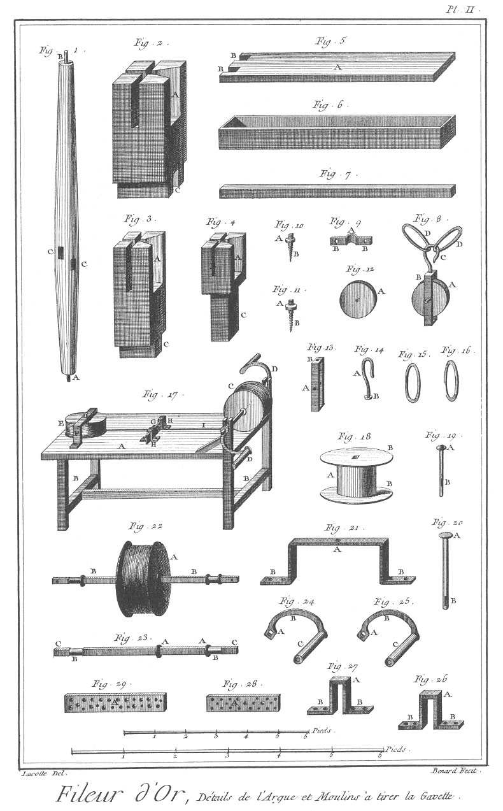](Planche_02.jpeg)

Fig.
1. Treuil du moulinet d'argue.
	- A, le pivot.
	- B, le tourillon.
	- C C, les mortaises des leviers.

2. &
3. &
4. Billots d'argue.
	- A A A, les échancrures pour la filiere.
	- B B B, les échancrures pour le cylindre.
	- C C C, les tenons.

5. Plate-forme.
	- A, la plate-forme.
	- B B, les mortaises.

6. Auge à tremper le lingot & la gavette.

7. Piece du haut du moulinet.

8. Poulie de l'argue.
	- A, la poulie.
	- P, la moufle.
	- C, le crochet.
	- D D, les anneaux.

9. Bride du tourillon du treuil.
	- A, la partie arrondie.
	- B B, les trous pour l'arrêter.

10. &
11. Vis de la bride.
	- A A, les têtes.
	- B B, les vis.

12. Poulie.
	- A, la noix.

13. Moufle de la poulie.
	- A, le trou du boulon B, celui du crochet.

14. Crochet.
	- A, le crochet.
	- B, la tête.

15. &
16. Anneaux.

17. Moulin à tirer la gavette.
	- A, la table.
	- B B, les piés.
	- C, le tambour à tirer.
	- P P, les manivelles.
	- E, le tambour à devider.
	- F, la bride du tambour à devider.
	- G, la filiere.
	- H H, les crampons.
	- I, le fil appellé gavette.

18. Tambour à devider.
	- A, le corps.
	- B B, les aîles.

19. Boulon de la moufle.
	- A, la tête.
	- B, la tige.

20. Boulon du tambour à devider.
	- A, la tête.
	- B, la tige.

21. Bride à patte du tambour à devider.
	- A, le trou du boulon.
	- B B, les pattes.

22. Tambour à tirer.
	- A, le tambour.
	- B B, l'arbre.

23. Arbre du tambour à tirer.
	- A A, les embases.
	- B B, les tourillons.
	- C C, les quarrés.

24. &
25. Manivelles.
	- A A, les clés.
	- B B, les tiges.
	- C C, les manches.

26. &
27. Crampons à pattes.
	- A A, les crampons.
	- B B &, les pattes.

28. &
29. Filiere.
	- A A, les trous.

PLANCHE III.
------------

[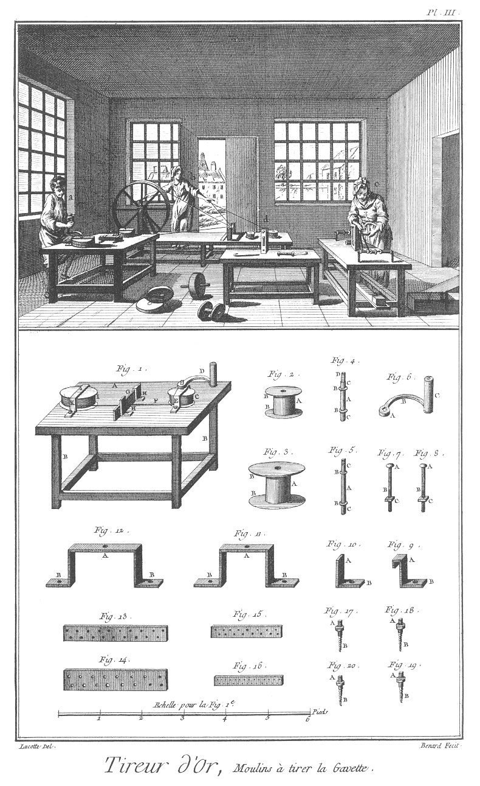](Planche_03.jpeg)

Le haut de cette Planche représente un attelier à préparer la gavette.
	- a, un ouvrier qui tire la gavette.
	- b, une ouvriere qui la devide.
	- c, une autre ouvriere qui l'applatit pour en faire la lame.
	- d, est un autre moulin à applatir. 

Fig. 1. Moulinet à gavette.
	- A, la table.
	- B B, les piés.
	- C, le tambour à tirer.
	- D, la manivelle.
	- E, la bride.
	- F, le fil ou gavette.
	- G, la filiere.
	- H H, les crampons à pattes.
	- I, le tambour à devider K, la bride.

2. Tambour à tirer.
	- A, le corps.
	- B B, les aîles.

3. Tambour à devider.
	- A, le corps.
	- B B, les aîles.

4. Arbre du tambour à tirer.
	- A, la tige.
	- B B, les embases.
	- C C, les tourillons.
	- D, le quarré.

5. Arbre du tambour à devider.
	- A, la tige.
	- B B, les embases.
	- C C, les tourillons.

6. Manivelle.
	- A, la clé.
	- B, la tige.
	- C, le manche.

7. &
8. Boulons des crampons de la filiere.
	- A A, les têtes.
	- B B, les vis.
	- C C, les écroux.

9. &
10. Crampons à pattes de la filiere.
	- A A, les crampons.
	- B B, les pattes.

11. &
12. Brides de pattes des tambours.
	- A A, les trous des arbres. B B &, les pattes.

13. &
14. &
15. &
16. Différentes filieres à gavette.

17. &
18. &
19. &
20. Vis à tête à chapeau des brides.
	- A A &, les têtes.
	- B B &, les vis.

PLANCHE IV.
-----------

[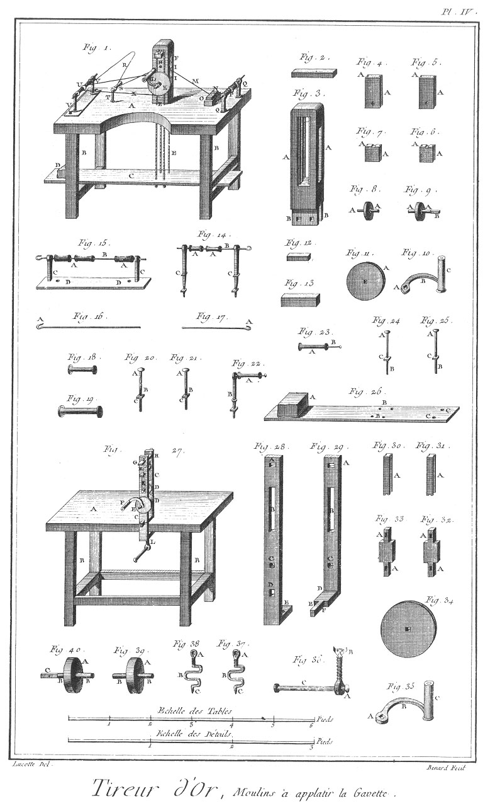](Planche_04.jpeg)

Fig.
1. Moulin à applatir le fil.
	- A, la table.
	- B B, les piés.
	- C, la planche.
	- D, le poids.
	- E E, les cordes.
	- F, la cage.
	- G, la traverse.
	- H, la coulisse.
	- I I, les meules.
	- K, la poulie.
	- L, la manivelle.
	- M, le fil non applati.
	- N, poids.
	- O, livret.
	- P, roquetins de fil.
	- Q Q, porte-roquetins de fils.
	- R, fil applati.
	- S, bobine.
	- T, porte bobine.
	- U, roquetins de lame.
	- V, porte-roquetins de lame.
	- X, corde.

2. Traverse du moulin.

3. Cage.
	- A A &, les montans à languette.
	- B B, les tenons.

4. &
5. Coulisses à rainures de dessus.
	- A A, les rainures.

6. &
7. Coulisses à rainures de dessous.
	- A A, les rainures.

8. &
9. Meules.
	- A A &, les tourillons.
	- B, le quarré.

10. Manivelles.
	- A, la clé.
	- B, la tige.
	- C, le manche.

11. Poulie.
	- A, la noix.

12. Poids du fil.

13. Pierre du fil.

14. Roquetins de fil.
	- A A, les roquetins.
	- B, la broche.
	- C C, les porte-roquetins.

15. Roquetins de lame.
	- A A, les roquetins.
	- B, la broche.
	- C C, les porte-roquetins.
	- D D, la planche.

16. Broche des porte-roquetins de lame.
	- A, le crochet.

17. Broche des porte-roquetins de fil.
	- A, le crochet.

18. &
19. Roquetins.

20. &
21. Boulons de la Planche des porte-roquetins de lame.
	- A A, les têtes.
	- B B, les vis.
	- C C, les écrous.

22. Bobine.
	- A, la bobine.
	- B, le porte-bobine.

23. Bobine avec sa broche.
	- A, la bobine.
	- B, la broche.

24. &
25. Boulons de la planche.
	- A A, les têtes.
	- B B, les vis.
	- C C, les écroux.

26. Planche de contrepoids.
	- A, le contrepoids.
	- B B, les trous des cordes.
	- C C, les trous des boulons.

27. Moulin à applatir à vis.
	- A, la table.
	- B B, les piés,
	- C C, les jumelles du moulin.
	- D D, les meules.
	- E, la poulie.
	- F, la manivelle.
	- G, la traverse du haut.
	- H H, les vis à ressorts.
	- I, la traverse d'appui.
	- K, les coulisses. L. les vis.

28. Jumelles de devant.
	- A, la mortaise de la traverse du haut.
	- B, la mortaise de la coulisse.
	- C, le trou de la meule d'en bas.
	- D, le trou du coude de l'autre jumelle.
	- E, l'écrou de la vis.

29. Jumelle de derriere.
	- A, la mortaise de la traverse du haut.
	- B, la mortaise de la coulisse.
	- C, le trou de la meule d'en bas.
	- D, le coude.
	- E, le tenon.
	- F, le trou de la broche du tenon.

30. &
31. Coulisse.
	- A A, les rainures.

32. &
33. Traverses du haut du moulinet.
	- A A, les tenons.

Fig.
34. Poulie cavée.

35. Manivelle.
	- A, la clé.
	- B, la tige.
	- C, le manche.

36. Vis.
	- A, la vis.
	- B, le touret.
	- C, la manivelle de la vis.

37. &
38. Vis à ressorts.
	- A A, les têtes.
	- B B, les ressorts.
	- C C, les pointes.

39. &
40. Meules.
	- A A, les meules. B B &, les tourillons.
	- C, le quarré.

PLANCHE V.
----------

[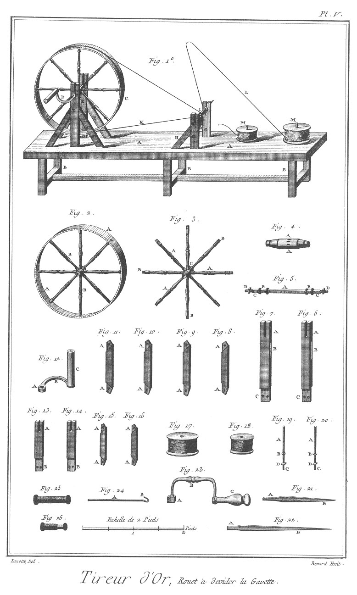](Planche_05.jpeg)

Fig.
1. Rouet à devider la gavette.
	- A A, la table.
	- B B &, les piés.
	- C, la roue.
	- D, la manivelle.
	- E E, les jumelles.
	- F F &, les contrefiches.
	- G G, les porte-roquetins.
	- H H, les supports des porte-roquetins.
	- I I, les roquetins.
	- K, la corde du rouet.
	- L, le fil ou la gavette.
	- M M, tambour des moulins à tirer.

2. Roue du rouet.
	- A A, le cercle.
	- B B, le chassis.

3. Chassis de la roue.
	- A A &, les rayons.
	- B B &, les tenons.
	- C, le moyeu.

4. Le moyeu de la roue.
	- A A, les mortaises des rayons.

5. Arbre de la roue.
	- A A, la tige.
	- B B, les tourillons.
	- C C, les quarrés.
	- D D, les vis à écrous.

6 & 7. Jumelle du rouet.
	- A A, les entailles.
	- B B, les mortaises des contrefiches.
	- C C, les tenons.

8. &
9. &
10. &
11. Contrefiches des supports.
	- A A &, les tenons.

12. Manivelle.
	- A, la clé.
	- B, la tige.
	- C, le manche.

13. &
14. Porte-roquetins.
	- A A, les entailles.
	- B B, les tenons.

15. &
16. Supports des porte-roquetins.
	- A A &, les tenons.

17. &
18. Tambours garnis de gavettes.

19. &
20. Broches des tambours.
	- A A, les tiges.
	- B B, les embases.
	- C C, les vis.
	- D D, les écrous.

21. &
22. Equarrissoir propre à aggrandir & polir les trous des filieres.
	- A A, les têtes.
	- B B, les tiges.

23. Fust de villerquin.
	- A, le quarré.
	- B, la poignée.
	- C, le manche à touret.

24. Broche.
	- A, la broche.
	- B, le crochet.

25. &
26. Roquetins.

PLANCHE VI.
-----------

[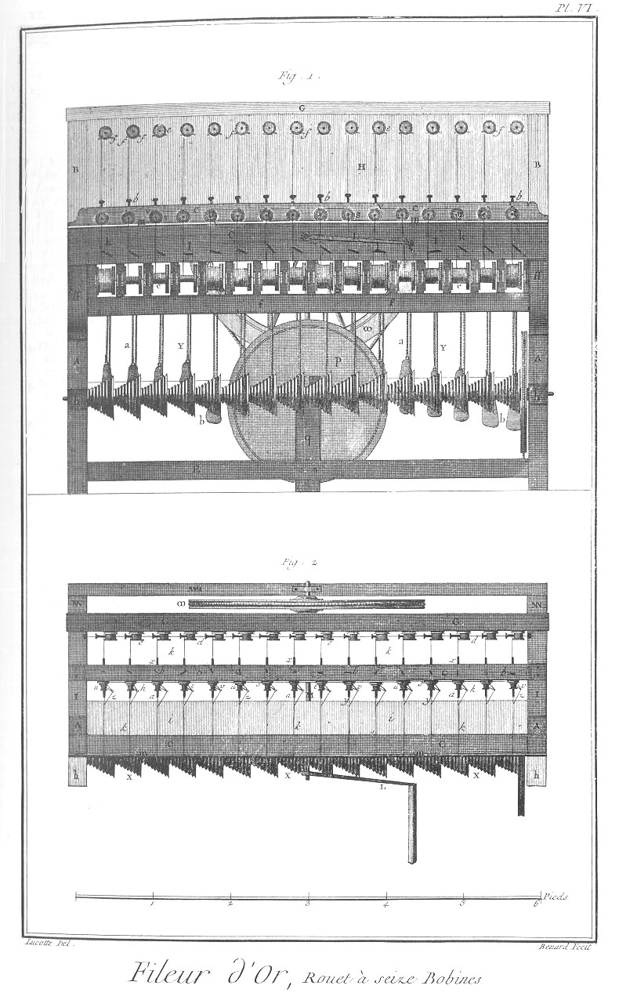](Planche_06.jpeg)

Fig.
1. Elévation par devant d'un rouet à filer l'or à seize bobines.

2. Plan du dessus du même rouet.

PLANCHE VII.
------------

[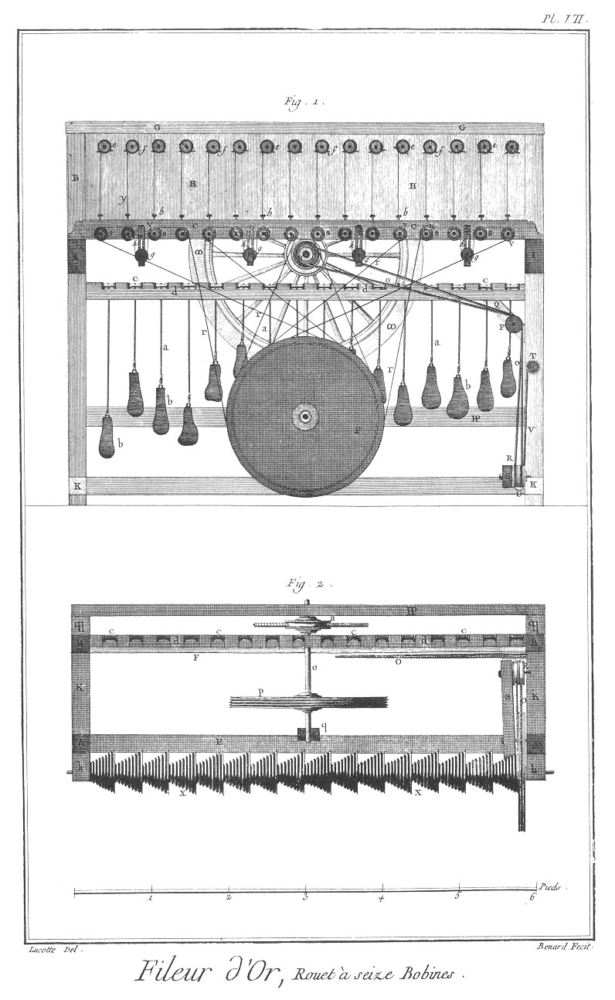](Planche_07.jpeg)

Fig.
1. Coupe longitudinale du même rouet.

2. Plan du dessous du même rouet.

PLANCHE VIII.
-------------

[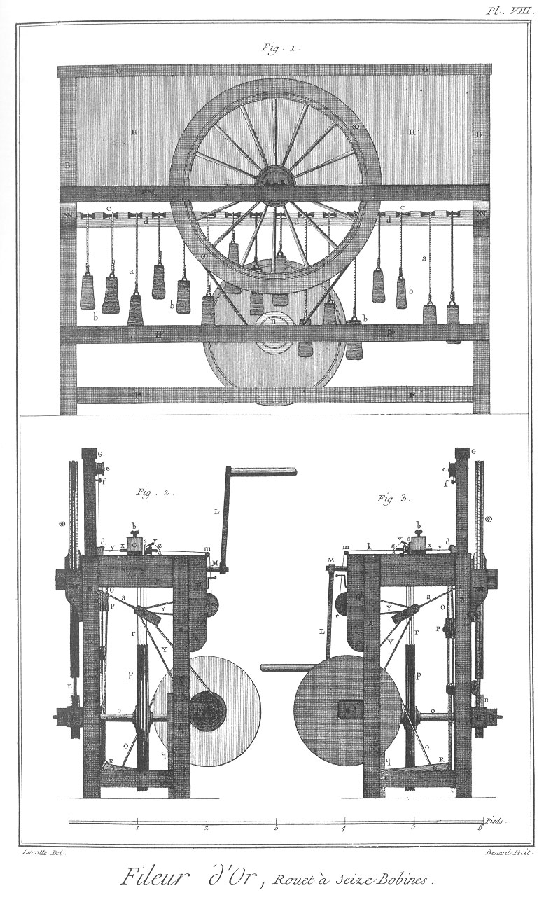](Planche_08.jpeg)

Fig. 1. Elévation par derriere du même rouet.

2. &
3. Elévation latérale du même rouet.

PLANCHE IX.
-----------

[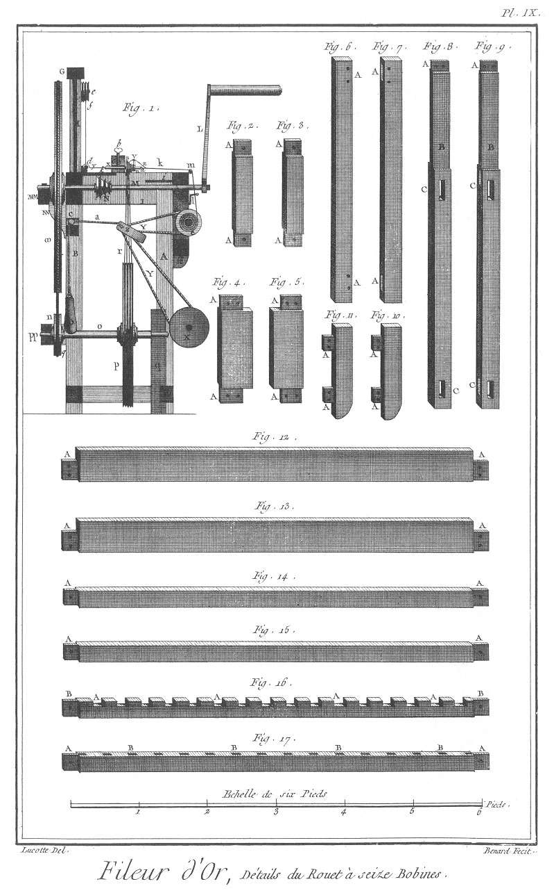](Planche_09.jpeg)

Fig.
1. Coupe transversale du même rouet.

Explication des termes des huit figures précédentes, contenues dans les Planches VI. VII. VIII. & IX. Pieces du chassis.

	- A A, montans de devant.
	- B B, montans de derriere.
	- C, traverse de devant du haut.
	- D, traverse de derriere du haut.
	- E, traverse de devant du bas.
	- F, traverse de derriere du bas.
	- G, traverse du haut servant de chapiteau.
	- H, panneau.
	- I I, traverses latérales d'en-haut.
	- K K, traverses latérales d'en bas.
	- L, manivelle, piece du rouet faisant tourner le rouet.
	- M M, support de la grande roue.
	- M, arbre de la grande roue. NN, consoles du support de la grande roue.
	- N, fusée servant à faire tourner l'arbre taillé en fusée. OO, grande roue.
	- O, la corde de l'arbre taillé en fusée.
	- P, poulies de renvoi vertical.
	- Q, support des mêmes poulies.
	- R, autres poulies de renvoi horisontal.
	- S,  supports des mêmes poulies.
	- T, vis d'attirage pour tendre la corde précédente.
	- V, corde d'attirage.
	- U, poulie d'attirage.
	- X, grand arbre taillé en seize fusées pour faire le filé plus ou moins couvert.
	- Y, cordes d'attirage.
	- Z, moufles d'attirage.
	- a, cordes des poids d'attirage.
	- b, poids d'attirage pour tendre les cordes.
	- c, bobines.
	- d, bobiniere.
	- e, cueilleux où s'enroule le filé.
	- f, porte-cueilleux du filé. ff, support des porte-cueilleux du filé.
	- g, entretoises des cueilleux. hh, support de l'arbre taillé en fusée.
	- i i &, support des cueilleux.
	- k, le filé.
	- i, conduit du filé.
	- m, baguette de verre sur laquelle passe le filé.
	- n, poulie mue par la grande roue pour donner le mouvement aux roquetins de lame.
	- o, arbre de la poulie.
	- p, petite roue cavée.
	- pp, support de derriere de la petite roue cavée.
	- q, support de la petite roue cavée.
	- qq, hausses du support de derriere de la petite roue cavée.
	- r r &, cordes de la petite roue cavée.
	- s s &, poulies mobiles des roquetins de lame.
	- t t &, poulies immobiles des roquetins de lame.
	- u u &, roquetins garni de lame.
	- v v &, support de la poulie de verre.
	- x x &, canons de fer sur lesquels tournent les roquetins.
	- y y &, soie autour de laquelle s'enveloppe la lame.
	- z z &, lame d'or.
	- a a &, perles de verre pour empêcher la lame de toucher au canon de fer & de noircir.
	- b b &, vis pour fixer les canons.
	- c c, piece portant les canons.
	- d d &, roquetins pour conduire la soie ; quelquefois c'est une baguette de verre.
	- e e &, cueilleux où est enroulée la soie.
	- f f &, vis pour fixer à volonté les mêmes cueilleux.
	- g g &, poulies d'attirage pour tendre les cordes qui font tourner les roquetins de lame.
	- h h, support des poulies d'attirage.
	- i i, tablette à déposer les lames quarrées.
	- k k, autre tablette de verre, la piece qui porte les canons. Pieces du chassis du rouet.

Fig.
2. &
3. Traverses latérales d'en-bas.
	- A A &, les tenons.

4. &
5. Traverses latérales du bas.
	- A A &, les tenons.

6. &
7. Montant du devant.
	- A A &, les mortaises.

8. &
9. Montant de derriere.
	- A A, les tenons.
	- B B, la partie du haut.
	- C C, les mortaises.

10. &
11. Pieces portant le porte-cueilleux.
	- A A &, les clés.

12. &
13. Traverses du haut de devant & de derriere.
	- A A &, les tenons.

14. &
15. Traverses du bas de devant & de derriere.
	- A A &, les tenons.

16. Bobiniere.
	- A A &, les entailles.
	- B B, les tenons.

17. Porte cueilleux du filé.
	- A A, les tenons.
	- B B, les mortaises.

PLANCHE X.
----------

[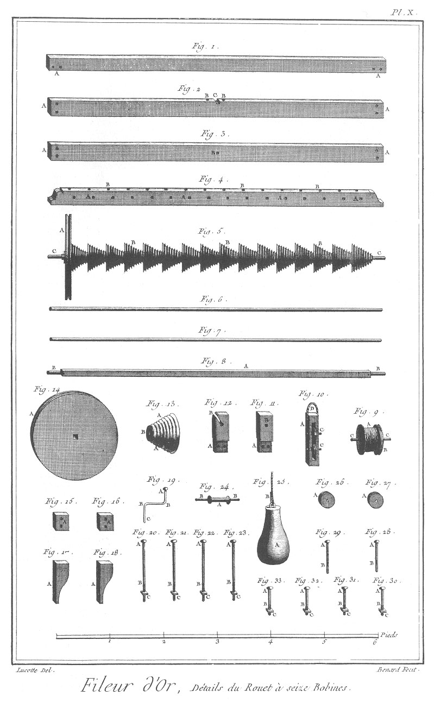](Planche_10.jpeg)

Fig.
1. Piece servant de chapiteau du chassis.
	- A A, les mortaises.

2. Support de l'arbre de la grande roue.
	- A A, les trous pour l'arrêter.
	- B B, les trous pour arrêter la piece de fer fixant l'arbre de la grande roue.
	- C, entaille du tourillon de l'arbre.

3. Support de la poulie d'en-bas.
	- A A, les trous pour l'arrêter.
	- B, le trou du tourillon de l'arbre de la poulie.

4. Piece portant les canons de fer.
	- A A &, les trous des canons.
	- B B &, les trous des vis pour les fixer.

5. Grand arbre taillé en fusée.
	- A, la poulie.
	- B B &, les fusées.
	- C C, les tourillons.

6. &
7. Baguette de fer sur laquelle passent la soie & le filé.

8. Arbre de l'arbre taillé en fusée.
	- A, l'arbre.
	- B B, les tourillons.

9. Cueilleux garnis de filé.
	- A, le filé.
	- B, la poulie.
	- C C, la broche.

10. Moufle des poids d'attirage.
	- A, la moufle.
	- B B, les poulies.
	- C C, les boulons.
	- D, la bonde.

11. &
12. Support de l'arbre taillé en fusée.
	- A A, les tenons.
	- B B, les trous & entailles des tourillons.

Fig.
13. Fusée.
	- A A, les noix.
	- B, le trou quarré.

14. Grande poulie qui fait tourner l'arbre.
	- A, la noix.

15. &
16. Hausses portant le support de la poulie d'en bas.
	- A A, les trous des boulons.

17. &
18. Hausses taillées en consoles, portant le support de la grande roue.
	- A A, les trous des boulons.

19. Crochet servant de conduit au filé.
	- A, la tête.
	- B B, les coudes.
	- C, la pointe entrant dans la traverse de devant.

20. &
21. &
22. &
23. Boulons faits pour retenir le support de la petite roue.
	- A A &, les têtes.
	- B B &, les vis.
	- C C &, les écrous.

24. Bobine sur laquelle roule la corde des poids d'attirage.
	- A, la bobine.
	- B B, la broche.

25. Poids d'attirage.
	- A, le poids.
	- B, la corde.

26 & 27. Poulie des moufles d'attirage.
	- A A, les noix.

28 & 29. Boulons des moufles d'attirage.
	- A A, les têtes.
	- B B, les tiges.

30. &
31. &
32. &
33. Boulons faits pour retenir les supports en consoles de la grande roue.
	- A A &, les têtes.
	- B B &, les vis.
	- C C, les écrous.

PLANCHE XI.
-----------

[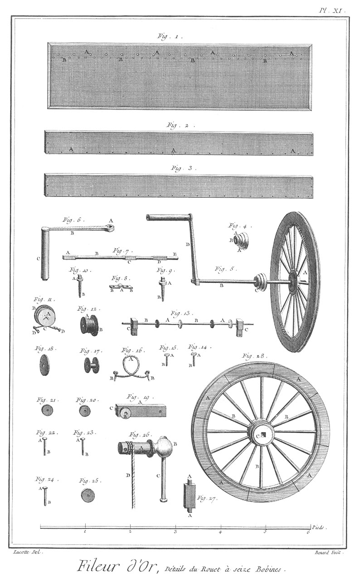](Planche_11.jpeg)

Fig.
1. Panneau.
	- A A &, les trous des cueilleux enroulés de la soie.
	- B B &, trous des vis à fixer les cueilleux.

2. Planche ou tablette à déposer les lames cavées.
	- A A &, les trous pour l'arrêter.

3. Autre tablette placée derriere la piece qui porte les canons.

4. Fusée faite pour conduire le grand arbre taillé en fusée.
	- A A, les noix.
	- B, le trou de l'arbre.

5. Grande roue garnie de son arbre & manivelle.
	- A, la grande roue.
	- B, l'arbre.
	- C, la fusée.
	- D, la manivelle.

6. Manivelle.
	- A, la clé.
	- B, la tige.
	- C, le manche.

7. Arbre.
	- A, le quarré de la manivelle.
	- B, la tige.
	- C, le quarré de la fusée.
	- D, le quarré de la roue.
	- E, le tourillon.

8. Bride pour arrêter l'arbre.
	- A, la partie atée.
	- B B, les trous pour l'arrêter.

9. &
10. Vis à tête à chapeau pour arrêter la bride.
	- A A, les têtes.
	- B B, les vis.

11. Cueilleux de soie.
	- A, le cueilleux.
	- B, la poulie.
	- C, la corde.
	- D D, les vis pour le fixer.

12. Cueilleux vu de côté.
	- a A, le cueilleux garni de soie.
	- B, la poulie.

13. Bobines faites pour conduire la soie dans les canons.
	- A A, les bobines.
	- B B, la broche.
	- C C, les supports.

14. &
15. Vis à fixer les cueilleux de soie.
	- A A, les têtes.
	- B B, les vis.

16. Corde à fixer des cueilleux de soie.
	- A, la partie enroulée autour de la poulie du cueilleux.
	- B B, les parties enroulées autour des vis à fixer.

17. Cueilleux dégarnis.

18. Poulie du cueilleux.

19. Porte-poulie du renvoi de la corde à faire tourner l'arbre taillé en fusée.
	- A, le porte-poulie.
	- B, les poulies.
	- C, le crampon à arrêter la corde de tirage.

20. &
21. Poulies de renvoi.

22. &
23. Boulons des poulies de renvoi.
	- A A, les têtes.
	- B B, les tiges.

24. Boulons de la poulie d'attirage.
	- A, la tête.
	- B, la tige.

25. Poulie d'attirage des poulies de renvoi.

26. Vis d'attirage des poulies de renvoi.
	- A, la vis.
	- B, la tête.
	- C, la manivelle.
	- D, la corde d'attirage.

27. Entretoise des cueilleux de filé.
	- A A, les tenons.

28. Grande roue.
	- A A, les jantes.
	- B B, les raies.
	- C, le moyeux. 

PLANCHE XII.
------------

[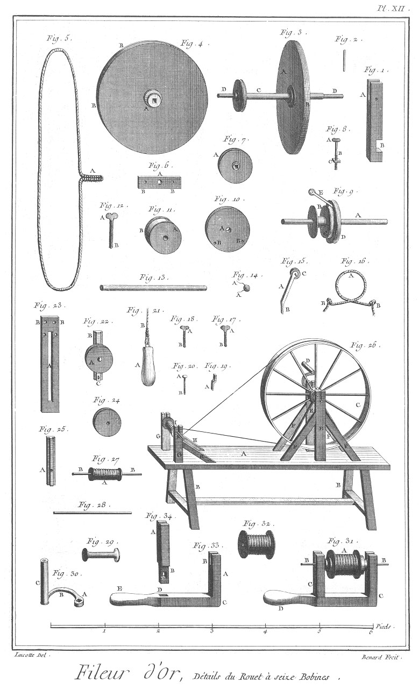](Planche_12.jpeg)

Fig.
1. Support de la petite roue cavée.
	- A, l'entaille du tourillon.
	- B, l'entaille pour l'arrêter dans la traverse du devant.

2. Broche pour arrêter l'arbre de la petite roue cavée dans son support.

3. Petite roue cavée.
	- A, la petite roue.
	- B, les rainures.
	- C, l'arbre.
	- D D, les tourillons.
	- E, la poulie.

4. Petite roue cavée.
	- A, le moyeux.
	- B B, les rainures.

5. Corde sans fin.
	- A, le noeud.

6. Platine pour supporter le tourillon de l'arbre de la petite roue.
	- A, le trou du tourillon.
	- B B, les trous pour l'arrêter.

7. Poulie cavée de la petite roue.
	- A, la partie cavée.

8. Boulon pour arrêter le support de la petite roue cavée dans la traverse du chassis.
	- A, la tête.
	- B, la vis.
	- C, l'écrou.

9. Roquetins de lame.
	- A, le canon.
	- B, le roquetin dégarni.
	- C, la poulie à fixer le roquetin.
	- D, la poulie mobile.
	- E, le support de la poulie de verre.

10. Poulie mobile du roquetin.
	- A, le trou du canon.
	- B B, les trous des vis à fixer le roquetin.

11. Roquetin garni de sa poulie.
	- A, le roquetin.
	- B, la poulie.

12. Vis à fixer le canon.
	- A, la tête.
	- B, la vis.

13. Canon.

14. Perle de verre pour empécher la lame de toucher au canon.
	- A A, les fils pour l'arrêter au canon.

15. Support de la poulie de verre.
	- A, le support.
	- B, la patte.
	- C, la poulie de verre.

16. Corde à fixer les roquetins de lame.
	- A, la partie enroulée autour de la poulie du roquetin.
	- B B, les parties enroulées autour des vis.

17 & 18. Vis à fixer les roquetins.
	- A A, les têtes.
	- B B, les vis.

19. Support à patte des broches des cueilleux.
	- A, la patte.

20. Boulon des poulies d'attirage des roquetins.
	- A, la tête.
	- B, la tige.

21. Poids d'attirage des roquetins de lame.
	- A, le poids.
	- B, la corde.

22. Poulie d'attirage des roquetins.
	- A, la poulie.
	- B, la coulisse.
	- C, le piton pour arrêter le poids.

23. Support de la poulie d'attirage.
	- A, la mortoise.
	- B B, les trous pour l'arrêter sur la piece qui porte les canons.

24. Poulie d'attirage.

25. Coulisse de la poulie d'attirage.
	- A, le trou du boulon.

26. Rouet à transporter le filé des cueilleux sur les bobines.
	- A, la table.
	- B B, les pieds.
	- C, la roue.
	- D, la manivelle.
	- E E, les jumelles.
	- F F &, les contrefiches.
	- G G, les supports des bobines.
	- H H, les contrefiches des supports.
	- I, bobine.
	- K, la broche.

27. Bobine garnie.
	- A, la bobine.
	- B B, la broche.

28. Broche.

29. Bobine dégarnie.

30. Manivelle.
	- A, la clé.
	- B, la tige.
	- C, le manche.

31. Dévidoir.
	- A, le cueilleux garni.
	- B B, la broche.
	- C C, le chassis.
	- D, la poignée ou manche.

32. Cueilleux garnis hors du dévidoir.

33. Chassis du dévidoir.
	- A, la partie coudée.
	- B, l'entaille de la broche du cueilleux.
	- C, le coude.
	- D, la mortaise.
	- E, le manche.

34. Jumelle du dévidoir.
	- A, l'entaille de la broche du cueilleux.
	- B, le tenon.
	- C, le trou pour le fixer sur le dévidoir.

[->](../11-Tonnelier/Légende.md)
