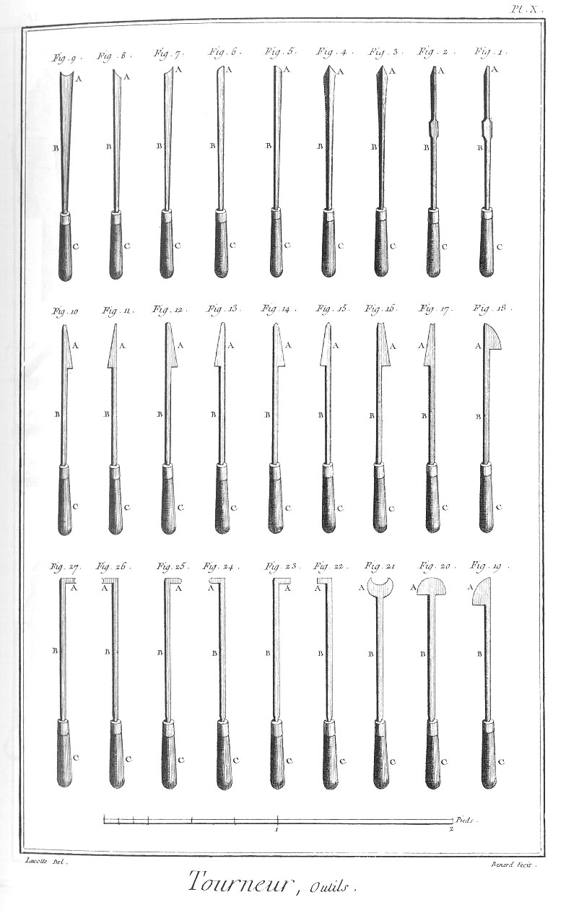
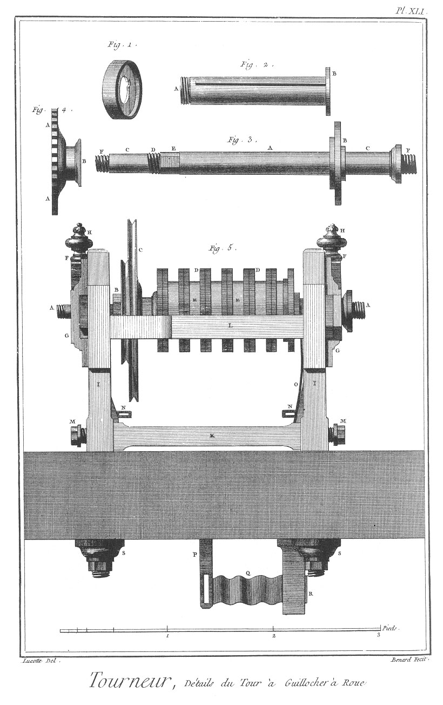
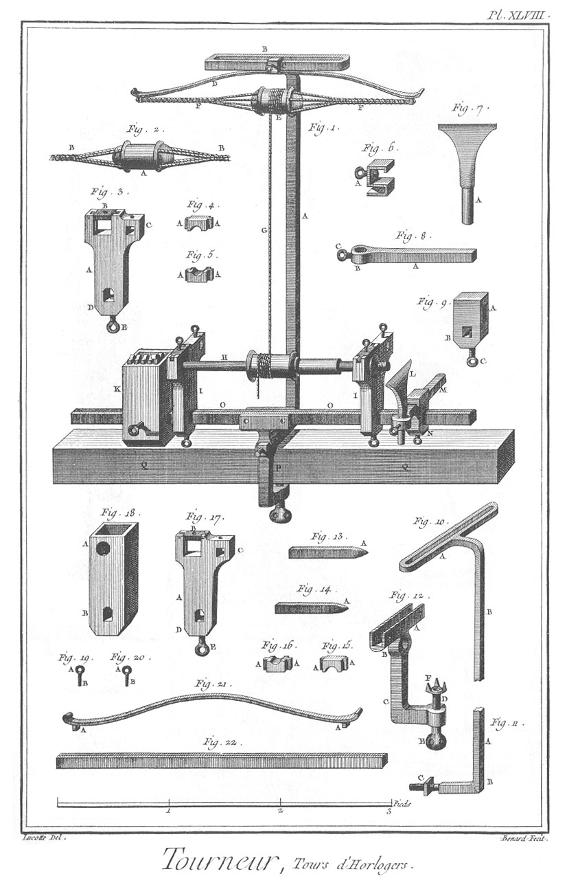

TOURNEUR ET TOUR A FIGURE
=========================

Contenant quatre-vingt-sept Planches. 

PLANCHE Iere.
-------------

Attelier.

Cette Planche représente un attelier de tourneur où plusieurs ouvriers sont occupés, l'un en A, à tourner le bois au pié, un autre en B, à tourner le fer à la roue, un autre en C, à en tourner la roue.

Cet attelier contient trois sortes de tours ; le premier marqué A, en bois ; le second, marqué B, en fer ; & le troisieme, marqué D, en l'air. La roue C est composée de deux arcs, la plus grande pour tourner les petits diametres, & la plus petite pour les grands diametres ; leurs surfaces partant moins vîte sous l'outil, ne le brûle point. E E sont les perches des tours au pié. F F &c, sont les rateliers où sont accrochés les outils.

PLANCHE II.
-----------

Tour en bois.

Le haut de cette Planche représente un petit attelier de tourneur, où sont deux tours au pié: l'un A monté, & l'autre B démonté; C C en représentent les établis; D D &c, les poupées; E, la perche; F, l'arc; G G, les rateliers où sont les outils, &c.

Fig.
1. Etabli de tour.
	- A, la table.
	- B B, les piés.

2. &
3. Poupées simples.
	- A A, les pointes.
	- B B, les queues.

4. &
5. Pointes des poupées démontées.
	- A A, les pointes. B B &c. les branches.

6. Barre de support.

7. &
8. Crochets du support.
	- A A, les crochets.
	- B B, les mortaises pour placer le support à volonté.

9. Arc.
	- A, l'arc.
	- B, le support.
	- C, la corde.
	- D. la poulie.

10. Poulie de l'arc.

11. &
12. Clés des poupées.

PLANCHE III.
------------

Tour en bois.

Fig.
1. Perche.
	- A, le bout d'arrêt.
	- B, le bout d'atterrage.
	- C, la corde.

2. Crampon de la perche.
	- A A, les bouts d'arrêts.

3. &
4. Clés des poupées, fig. 10 & 11.

5. &
6. Crochets de support.
	- A A, les crochets.
	- B B, les mortaises.

7. &
8. Clavettes des crochets.

9. Claviers de pédale.
	- A, le montant à tourillon.
	- B, le montant.
	- C, l'écharpe.

10. &
11. Poupées, l'une à pointe à vis, & l'autre à pointe à écrou.
	- A, la vis.
	- B, la pointe.
	- C C, les queues à mortaise.

12. &
13. Les pointes d'appui de la pédale.
	- A A, les trous pour les tourillons.
	- B B, les clés pour les arrêter dans les piés de l'établi.

14. Pointe à écrou de la poupée.
	- A, la pointe.
	- B, la tige quarrée.
	- C, la vis à écrou.

15. Pointe à vis de la poupée.
	- A, la pointe.
	- B, la vis.
	- C, la tête garnie de trous pour la tourner. Outils de tour en bois.

16. Ciseau droit.

17. Ciseau biais.

18. Beudâne.

19. Grande gouge.

20. Moyenne gouge.

21. Grain d'orge quarré.

22. Grain d'orge aigu.

23. Petit grain d'orge. 

Fig.
24. Petite gouge.
	- A A, &c. les taillants.
	- B B, &c. les manches.

25. Piece de bois ébauchée à la coignée.

26. La même piece de bois arrondie à la place disposée à être mise sur le tour.

27. Disposition de la piece montée sur le tour vu de profil.
	- A, la piece.
	- B, le support.
	- C, l'outil.

28. Disposition de la même piece montée sur le tour, vu de face.
	- A A, les pointes du tour.
	- B, la piece.
	- C C, les outils, selon leur différente situation.

29. Façon de creuser les pieces avec la gouge.
	- A, la partie de la piece.
	- B, la partie de la gouge.

30. Façon d'arrondir avec le grain d'orge.
	- A, la partie de la piece.
	- B, la partie du grain d'orge.

31. Façon d'arrondir avec les ciseaux droits.
	- A, la partie de la piece.
	- B B, la partie des ciseaux.

PLANCHE IV.
-----------

Tour en fer.

Le haut de cette Planche représente un tour en fer à roue, garni de toutes ses pieces.
	- A, représente le tour monté.
	- B, la roue.

Fig.
1. &
2. Poupée de tour en fer, l'une à pointe à écrou, & l'autre à pointe à vis.
	- A, la pointe.
	- B, la vis.
	- C C, les queues.
	- D D, les vis à tête.
	- E E, les traverses.

3. Coupe.

4. Elévation à face.

5. Elévation latérale de l'une des deux poupées.
	- A A, les têtes.
	- B B, les queues.
	- C, la vis à écrou pour l'arrêter sur l'établi.
	- D, la traverse.

6. &
7. Vis à écrou des poupées.
	- A A, les têtes.
	- B B, les traverses.
	- C C, les tiges.
	- D D, les vis.
	- E E, les écrous.

8. &
9. Traverses des vis.

10. Pointe à vis de poupée.
	- A, la pointe.
	- B, la vis.
	- C, la tête.

11. Pointe à écrou.
	- A, la pointe.
	- B, la tige quarrée.
	- C, la vis à écrou.

12. Virole de la pointe précédente.

13. Ecrou de la pointe précédente.

PLANCHE V.
----------

Tour en fer.

Fig.
1. Support de fer monté.
	- A, le support en bois.
	- B, le support en fer.
	- C, le té.
	- D, la vis à écrou.
	- E, la vis à tête, à chapeau.
	- F, la fourche.
	- G, la vis pour arrêter le support sur l'établi.

2. Fourche du support.
	- A A, les branches.

3. Support de fer coudé.
	- A, le trou du té.
	- B, le trou de la vis à tête.

4. Support de bois à fourche.
	- A A, les branches.

5. Support de bois coudé.

6. &
7. Autre support de bois simple.

8. Vis à tête à chapeau pour arrêter le support de fer sur la fourche.
	- A, la tête.
	- B, la vis.

9. Virole du té.

10. Ecrou du té.

11. Té pour fixer les supports de bois sur le support de fer.
	- A, le té.
	- B, la tige quarrée.
	- C, la vis à écrou.

12. Ecrou à patte de la vis à fixer le support sur l'établi.
	- A A, les pattes.

13. Traverse de la même vis.

14. Vis à tête du support pour le fixer sur l'établi.
	- A, la tête.
	- B, la traverse.
	- C, la tige.
	- D, la vis.
	- E, l'écrou à patte.

15. Clé à tourner les vis à fixer les supports en poupées sur l'établi.
	- A, la partie coudée.
	- C, la partie droite.

16. Clé des vis à écrou du support.
	- A, la clé de l'écrou.
	- B, la clé de la vis.
	- C, la tige.

17. Autre clé pour le même usage.
	- A, partie mobile & à charniere de la clé.

18. Elévation d'un côté.

19. Elévation latérale.

20. Elévation de l'autre côté.

21. Coupe de la poulie double du tour.
	- A A, les noix des poulies.
	- B B, clavier de fer à patte à vis pour fixer sur les pieces à tourner.
	- C C, &c. vis pour l'arrêter.

22. Clavier de fer de la double poulie précédente.
	- A A, le cercle.
	- B B B, les pattes.
	- C C C, les vis à tête quarrée.

23. &
24. &
25. Vis du clavier précédent.
	- A A A, les têtes.
	- B B B, les vis.

26. &
27. &
28. Vis à tête à chapeau pour arrêter le clavier sous la double poulie.
	- A A A, les têtes.
	- B B B, les vis.

29. &
30. &
31. Pattes du même clavier.
	- A A A, la partie à queue.

32. Clé des vis du même clavier.
	- A, la clé.
	- B, la tige.

PLANCHE VI.
-----------

Tour en bois & en fer.

Fig. 1. Disposition d'un support de tour en bois monté.
	- A, le support.
	- B B, les fourchettes coudées.
	- C C, les montans.
	- D D, les clés.

2. L'une des fourchettes du support garnie.
	- A, la fourchette.
	- B, le montant, C, la clé.

3. Plan du haut d'un support à lunette pour soutenir la trop grande longueur des pieces à tourner, & en empêcher le tremblement qu'on appelle broutage.

4. Elévation latérale.

5. Coupe.

6. Elévation perspective du même support à lunette.
	- A, le support.
	- B B, les coussinets.
	- C, la platine.
	- D D, les vis pour serrer la platine sur les coussinets.
	- E, les trous des serres ou des vis.
	- F, la vis à fixer le support.
	- G, la traverse.
	- H, le trou de l'écrou de la vis.

7. Vis & platine des coussinets du support à lunette.
	- A, la platine.
	- B B, les têtes des vis.
	- C C, les tiges.
	- D D, les écrous.

8. &
9. Coussinets en étain.
	- A A, les languettes.

10. Traverse de la vis à fixer.

11. Vis à fixer.
	- A, la tête.
	- B, la tige.
	- C, l'écrou.

12. Essaite.
	- A, la tête.
	- B, le taillant.
	- C, le manche.

13. Maillet.
	- A, le maillet.
	- B, le manche.

14. Coignée.
	- A, le taillant.
	- B, l'oeil.
	- C, le manche.

15. Hachette.
	- A, le taillant.
	- B, l'oeil.
	- C, le manche.

16. Hache.
	- A, le taillant.
	- B, l'oeil.
	- C, le manche.

17. Serpe.
	- A, le taillant.
	- B, le manche.

18. Billot à hacher le bois.

19. Plane.
	- A, le fer.
	- B, le taillant.
	- C C, les manches.

20. Vilebrequin.
	- A, le fût du vilebrequin.
	- A, la tête.
	- B, la meche.

21. Meche de vilebrequin.
	- A, la tête.
	- B, la meche.

22. Marteau.
	- A, la tête.
	- B, la paume.
	- C, le manche.

23. Plastron de bois à placer sur l'estomac, lorsque l'on plane.
	- A, le plastron.
	- B B, les courroies.

PLANCHE VII.
------------

Filiere à tarots.

Fig.
1. Filiere à vis de bois.
	- A, la platine inférieure.
	- B, la platine supérieure.
	- C C, les vis.
	- D, le trou à faire la vis.
	- E, l'outil.
	- F, le crampon de l'outil.
	- G, la vis à pousser l'outil à mesure que la vis se fait.
	- H H, les vis à serrer les platines.

2. Platine inférieure.
	- A A, les trous des vis.
	- B, le trou à faire la vis.
	- C, l'entaille de l'outil.
	- D, ressort à chasser l'outil.

3. Platine supérieure.
	- A A, les trous des vis.
	- B, le trou à conduire la vis. 

Fig.
4. &
5. Vis à serrer les deux platines ensemble.
	- A A, les vis.
	- B B, les têtes.
	- C C, les manivelles.

6. Vis préparée.
	- A, la grosseur du fond du filet.
	- B, la grosseur de la vis.
	- C, la tête.

7. Vis faite.
	- A, la vis.
	- B, la grosseur du filet.
	- C, la tête.

8. Triangle représentant la forme du filet de la vis.

9. Outil à couper le bois pour former le filet.
	- A, le taillant.

10. Tarot emmanché pour faire les écrous en bois.
	- A, la vis du tarot.
	- B, la tige.
	- C, le manche.

11. Tarot à tête plate.
	- A, la vis.
	- B, la tête.

12. Tarot à tête ronde.
	- A, la vis.
	- B, la tête.

13. Tarot à tête quarrée.
	- A, la vis.
	- B, la tête.

14. Crampon à patte de la filiere en bois.
	- A A, les pattes.
	- B, la vis.

15. Ressort à patte de l'outil de la même filiere.
	- A, la patte.

16. Tarot pour les écrous en fer.
	- A, la vis.
	- B, la tête.

17. Filiere pour les vis en fer. A A A, les trous.
	- B B, les bras.

18. Tourne à gauche pour tourner les tarots.
	- A, la mortaise.
	- B B, les bras.

PLANCHE VIII.
-------------

Filieres doubles & compas.

Fig.
1. Filiere double.
	- A A, les coussinets.
	- B B, les vis.
	- C C, les bras coudés.
	- D D, les vis à écrou pour les retenir ensemble.

2. &
3. Vis à serrer les coussinets l'un contre l'autre.
	- A A, les têtes.
	- B B, les vis.

4. Clé à vis & à écrou.
	- A, la clé à vis.
	- B, la clé à écrou.
	- C, la tige.

5. &
6. Bras coudés de la filiere.
	- A A, les coudes.
	- B B, les rainures des coussinets.
	- C C, les vis à écrou.
	- D D, les trous des vis à écrou.
	- E E, les trous des vis à tête.
	- F F, les branches.

7. &
8. Coussinets taraudés.
	- A A, &c. les languettes.

9. Autre filiere double.
	- A A, le clavier.
	- B, le bras à clavier.
	- C, le bras à vis.
	- D D, &c. les coussinets.

10. Clavier de la filiere.
	- A A, les rainures.
	- B, l'écrou du bras à vis.
	- C, le bras.

11. Bras à vis de la filiere.
	- A, la vis.
	- B, la tête.
	- C, le bras.

12. Tarot.
	- A, la vis.
	- B, la tête.

13. &
14. &
15. &
16. Coussinets.
	- A A, &c. les languettes.

17. Grand compas droit.
	- A, la tête.
	- B B, les pointes.

18. Petit compas droit.
	- A, la tête.
	- B B, les pointes.

19. Compas d'épaisseur.
	- A, la tête.
	- B B, les pointes.

20. Compas de proportion extérieure.
	- A, la charniere.
	- B B, les pointes.
	- C C, les branches.

21. Compas de proportion intérieure.
	- A, la charniere.
	- B B, les pointes.
	- C C, les branches.

22. Autre compas de proportion extérieure.
	- A, la charniere.
	- B B, &c. les pointes.

23. Petite scie tournante.
	- A, le clavier.
	- B, pivot à vis à écrou.
	- C, la virole du manche.
	- D, le fer.
	- E, le manche.

PLANCHE IX.
-----------

Outils.

- Fig. 1, 2, &c. & 13. Outils de tour pour le té, le plomb & étain.

1. &
2. &
3. Gouges de différente grandeur.

4. &
5. &
6. Burins droits.

7. &
8. Burins biais, l'une à droite & l'autre à gauche.

9. &
10. &
11. Grains d'orge.

12. &
13. Langues pointues.
	- A A, &c. les taillans.
	- B B, &c. les crocs pour les fixer sur les supports de bois.
	- C C, &c. les tiges.
	- D D, &c. les manches.

14, 15, &c. & 26. Outils de tour pour le cuivre, bois, pierre, &c.

14. &
15. &
16. Gouges.

17. &
18. Demi-gouges, l'une à droite & l'autre à gauche.

Fig.
19. &
20. &
21. Burins droits.

22. &
23. &
24. Grains d'orge.

25. Langue pointue.

26. Langue crochue.
	- A A, &c. les taillans.
	- B B, les tiges.
	- C C, les manches.

27. Goupillon pour arroser le fer, le plomb & l'étain pendant qu'on le tourne.
	- A, l'éponge.
	- B, le manche.

28. Sébille à contenir l'eau pour arroser.

PLANCHE X.
----------

Outils.

Fig.
1. Bec d'âne.

2. Gouge.

3. &
4. Grains d'orge, l'un à droite & l'autre à gauche.

5. &
6. Fermoirs, demi-ronds, l'un à droite & l'autre à gauche.

7. &
8. Fermoirs, demi-creux, l'un à droite & l'autre à gauche.

9. Fermoir creux droit.

10. &
11. Burins à crochet, l'un à droite & l'autre à gauche.

12. &
13. Gouges à crochet, l'une à droite & l'autre à gauche.

14. &
15. Grains d'orge à crochet, l'un à droite & l'autre à gauche.

16. &
17. Fermoirs creux à crochet, l'un à droite & l'autre à gauche.

18. &
19. Crochets ronds, l'un à droite & l'autre à gauche.

20. Crochet rond double.

21. Crochet creux double.

22. &
23. Mouchettes simples en burins.

24. &
25. Mouchettes simples en gouge.

26. &
27. Mouchettes simples en fermoirs creux.
	- A A, &c. les taillans.
	- B B, les tiges.
	- C C, les manches.

PLANCHE XI.
-----------

Outils.

Fig.
1. Mouchette double en burin.

2. Mouchette double en gouge.

3. Mouchette double en grain d'orge.

4. Mouchette double en fermoir creux.

5. &
6. Crochets à volute, l'un à droite & l'autre à gauche.

7. &
8. Mouchettes rondes en burin.

9. &
10. Mouchettes rondes en gouge.

11. &
12. Mouchettes rondes en grain d'orge.

13. &
14. Mouchettes rondes en fermoir creux.

15. &
16. Crochets ronds aigus, l'un à droite & l'autre à gauche.

17. &
18. Crochets ronds camus, l'un à droite & l'autre à gauche.

19. Grand croissant à creuser.

20. &
21. Petit croissant à creuser.

22. Peigne à faire des vis.

23. &
24. Peigne à faire des écrous, l'un à droite & l'autre à gauche.

25. Peigne à faire des vis à gros filets.

26. &
27. Peigne à faire des écrous à gros filets, l'un à droite & l'autre à gauche.
	- A A, &c. les taillans.
	- B B, les tiges.
	- C C, les manches.

PLANCHE XII.
------------

Meules.

Fig.
1. Pierre à aiguiser les outils, montée sur un billot.
	- A, outil.
	- B, la pierre.
	- C, le billot.
	- D, l'auge à contenir l'eau.
	- E E, les piés.

2. Meule à roue horisontale.
	- A, la meule.
	- B, la poulie.
	- C, l'arbre de la meule.
	- D, l'étrier de la meule.
	- E, la roue.
	- F, l'arbre de la roue.
	- G, la manivelle.
	- H, l'étrier de la roue.
	- I I, les crampons.
	- K, le coin.
	- L, l'établi.
	- M M, les piés.

3. Plusieurs meules à roue verticale montées entre deux pointes.
	- A A A, les meules.
	- B B, les poupées.
	- C C,  les pointes.
	- D D, les jumelles de la table E, la roue.
	- F, la poulie.

Fig.
4. Les meules montées.
	- A A A, les meules.
	- B, la poulie.
	- C C, la roue.

5. Roue verticale.
	- A, la roue.
	- B, l'arbre à manivelle.

6. Pointe à queue.
	- A, la pointe.
	- B, la queue.

7. Pointe à tête.
	- A, la pointe.
	- B, la tête.

8. Meule simple garnie de son auge.
	- A, la meule.
	- B, l'auge.
	- C, le support.
	- D, la calotte.
	- E E, les piés.
	- F, la pédale.

9. Meule.
	- A, la meule.
	- B, l'arbre.
	- C, la manivelle.

10. Support à poser les outils lorsque l'on aiguise.

11. Calotte pour empêcher l'eau de jaillir.

12. Boulon de la pédale.
	- A, la tête.
	- B, la vis à écrou.

13. Arbre de la meule.
	- A, l'arbre.
	- B B, les tourillons.
	- C, la manivelle.

14. Pédale, A. Le pivot, B.

PLANCHE XIII.
-------------

Tour en l'air.

Fig.
1. Poupée postérieure de la figure 8.
	- A, la poupée.
	- B B, les coussinets.
	- C, la platine à charniere.
	- D, la vis pour serrer les coussinets.
	- E E, les touches.

2. L'une des touches du clavier.
	- A, le point d'appui.
	- B, l'échancrure pour le passage de l'arbre.

3. Platine à charniere.
	- A, la platine.
	- B B, les charnieres.
	- C, la vis.

4. Elévation en face latérale des coussinets.
	- A A, &c. les noix.

5. Bouchon de la vis.
	- A, la tête.

6. Vis.
	- A, la vis.
	- B, le vase.

7. Poupée antérieure.
	- A, la poupée.
	- B B, les coussinets.
	- C, la platine à charniere.
	- D, la vis.

8. Les mêmes poupées montées.
	- A A, l'arbre.
	- B, la poulie.
	- C, la poupée postérieure.
	- D D, le clavier composé de plusieurs touches.
	- E, la poupée antérieure.

PLANCHE XIV.
------------

Poupées à lunettes.

Fig.
1. &
2. Poupée antérieure montée, vue des deux côtés.
	- A, la poupée.
	- B, la queue.
	- C, la lunette inférieure immobile.
	- D, la lunette mobile supérieure.
	- E, la platine en laiton tenant les lunettes.
	- F F, &c. boutons retenant la platine.

3. La même poupée démontée.
	- A, le corps de la poupée.
	- B, la queue.
	- C C, les jumelles.

4. Lunette supérieure.
	- A, le point d'appui.
	- B, le coussinet.

5. Lunette inférieure.
	- A, le coussinet.

6. Platine de laiton retenant les lunettes.
	- A, l'échancrure de la lunette.

7. &
8. &
9. &
10. Boutons retenant la platine.
	- A A, &c. les têtes.
	- B B, les vis à écrou.

11. &
12. Poupée postérieure montée, vue de face & de côté.
	- A, la poupée.
	- B, la queue.
	- C, la lunette immobile.
	- D, la lunette mobile.
	- E, le coin.
	- F, la platine retenant les lunettes.
	- G G, les touches.
	- H, la platine retenant les touches.

13. La même poupée démontée.
	- A, le corps,
	- B, la queue.
	- C C, les jumelles.

14. L'une des touches.
	- A, le pivot.
	- B, l'échancrure de l'arbre.

15. Lunette immobile.
	- A, le coussinet.

16. Platine des lunettes.
	- A, l'échancrure de la lunette.

17. Platine des touches.

18. Le coin à volute de la lunette mobile.

19. Lunette mobile.
	- A, le pivot.
	- B, le coussinet.

20. Boutons des touches.
	- A, la tête.
	- B, la vis à écrou.

21. &
22. &
23. Boutons des lunettes.
	- A A A, les têtes.
	- B B B, les vis à écrou.

24. Autre poupée antérieure à lunette immobile.
	- A, la poupée.
	- B, la queue.
	- C, la lunette.
	- D, le té à vis.
	- E, le bouton.

25. Poupée postérieure à lunette mobile.
	- A, la poupée.
	- B, la queue.
	- C, la lunette.
	- D, le té à vis.

Fig.
26. Lunette immobile A, la charniere.
	- B, la bride.
	- C, la vis.
	- D, la jumelle immobile.
	- E, la jumelle mobile.

27. Bouton de la lunette précédente.
	- A, la tête.
	- B, la vis à écrou.

28. Le te à vis de la même lunette.
	- A, le té.
	- B, la vis à écrou.

29. Lunette mobile.
	- A, le trou.
	- B, la fourche.

30. Le té de la lunette mobile.
	- A, le té.
	- B, la vis à écrou.

31. Petit tarot emmanché.
	- A, le tarot.
	- B, la tige.
	- C, le manche.

32. Boëte qui se place au bout des arbres en l'air.

PLANCHE XV.
-----------

Poupées à lunettes.

Fig.
1. Poupée postérieure montée à lunette tournante.
	- A, la poupée.
	- B, la lunette circulaire.
	- C, le bouton.

2. La même poupée démontée.
	- A, la poupée.
	- B, l'échancrure du haut.
	- C, le trou du boulon du milieu.
	- D, le trou du boulon d'arrêt.
	- E, la queue.

3. Lunette circulaire.
	- A, le trou du boulon.

4. Boulon de milieu.
	- A, la tête.
	- B, la vis à écrou.

5. Boulon d'arrêt.
	- A, la tête.
	- B, la vis à écrou.

6. Poupée postérieure à lunette mobile.
	- A, la poupée.
	- B, la lunette.
	- C, le té.
	- D, le boulon.

7. La même poupée démontée.
	- A, la poupée.
	- B, l'échancrure du haut.
	- C, le trou du té.
	- D, le trou du boulon.
	- E, la queue.

8. Té.
	- A, le té.
	- B, la vis à écrou.

9. Boulon.
	- A, la tête.
	- B, la vis à écrou.

10. Lunette mobile.
	- A, le trou de la lunette.
	- B, la mortaise du té.
	- C, la mortaise du boulon.

11. Autre poupée antérieure montée à lunette à pointe mobile.
	- A, la poupée.
	- B, la lunette.
	- C, la pointe.
	- D, le crampon.
	- E, le boulon d'arrêt.

12. La même poupée démontée.
	- A, la poupée.
	- B, la queue.
	- C, l'échancrure du haut.
	- D D, les trous du crampon.
	- E, le trou du boulon.

13. Lunette mobile.
	- A A, les trous taraudés.

14. Crampon.
	- A, le crampon.
	- B B, les vis à écrou.

15. Pointe de la lunette.
	- A, la pointe.
	- B, la vis.

16. Poupée antérieure montée.
	- A, la poupée.
	- B B, les coussinets.
	- C C, les coins.
	- D D, les coulisses.
	- E, la platine.

17. La même poupée démontée.
	- A, la poupée.
	- B B, les jumelles.
	- C, la queue.

18. &
19. Coulisses du haut.
	- A A, les trous du coin.

20. &
21. Coussinets.
	- A A, les mortaises.

22. Boulons des coulisses.
	- A, la tête.
	- B, la vis à écrou.

23. Platine des coussinets.
	- A, l'échancrure pour le passage de l'arbre.
	- B B, les chevilles de conduite.

24. &
25. Coins des coussinets.

26. Coulisse d'en-bas.

27. Poupée postérieure à lunette à coulisse montée.
	- A, la poupée.
	- B, la platine.
	- C, la lunette à coulisse.
	- D, le coin.

28. La même poupée démontée.
	- A, la poupée.
	- B, l'échancrure pour le passage de la lunette à coulisse.
	- C, l'échancrure pour le passage de la clé.
	- D, la queue.

29. Lunette à coulisse.
	- A A, &c. les trous de la lunette.

30. Clé de la lunette.

31. Platine de la poupée.

PLANCHE XVI.
------------

Poupées à lunettes.

Fig.
1. Autre poupée antérieure à charniere montée.
	- A, la poupée.
	- B, la boëte à charniere.
	- C, la plate-bande à talon.
	- D, le tasseau.
	- E, la vis à écrou.

2. La même poupée démontée.
	- A, le corps.
	- B, la queue.
	- C C, les jumelles.

3. Boëte à charniere.
	- A, la boëte.
	- B B, le clavier.
	- C, la charniere.

4. Porte-coussinet supérieur.
	- A, le coussinet.

5. Porte-coussinet inférieur.
	- A, le coussinet. 

Fig.
6. Plate bande à talon.
	- A, le talon.
	- B, le trou de la vis à écrou.

7. Le tasseau.

8. Vis à écrou.
	- A, la vis en bois.
	- B, l'écrou.

9. Poupée postérieure à touche montée.
	- A, la poupée.
	- B B, &c. les touches.
	- C C, les coins des touches.
	- D D, la lunette à charniere.
	- E E, les coins de la lunette.
	- F F, les hausses.
	- G, la platine.

10. La même poupée démontée.
	- A A, les jumelles.
	- B, la queue.

11. Lunette.
	- A, la charniere.
	- B, l'échancrure.

12. L'une des touches.
	- A, le point d'appui.
	- B, l'échancrure.

13. L'un des coins.

14. Platine garnie de ses hausses.
	- A, la platine.
	- B B, les hausses.

15. Autre poupée antérieure à lunette montée.
	- A, la poupée.
	- B, la lunette.
	- C C, les coins.
	- D D, les platines.

16. La même poupée démontée.
	- A, le corps.
	- B B, les jumelles.
	- C, la queue.

17. Platines.
	- A A, les platines.
	- B B, les entretoises.

18. Lunette à charniere garnie de ses coins.
	- A, la charniere.
	- B, l'échancrure.
	- C C, les coins.

19. Poupée postérieure à touches, montée.
	- A, la poupée.
	- B B, les coussinets.
	- C, la plate-bande.
	- D D, les vis à serrer les coussinets.
	- E, les touches.

20. La même poupée démontée.
	- A, le corps.
	- B, la queue.
	- C, la boëte.
	- D D, les mortaises des touches.
	- E E, les rainures des coussinets.

21. L'une des touches à volute.
	- A, la pointe d'appui.
	- B, l'échancrure.
	- C, la volute.

22. Plate-bande à serrer les coussinets.

23. &
24. Coussinets, l'un inférieur & l'autre supérieur.
	- A A, &c. les languettes.

25. Cale à serrer les coussinets.

26. Vis à serrer les coussinets.
	- A, la tête.
	- B, la vis.

27. &
28. Vis à serrer la plate-bande des coussinets.
	- A A, les têtes.
	- B B, les vis.

29. Arbre de tour en l'air.
	- A, la boëte.
	- B, l'écrou pour serrer la boëte.
	- C C, &c. différens pas de vis.
	- D, petite noix.
	- E, l'embase à vis.
	- F, l'embase à écrou.

PLANCHE XVII.
-------------

Tours montés.

Fig.
1. Tour en bois.
	- A A, les jumelles d'établi.
	- B, les poupées.
	- C, le support.
	- D D, les crochets du support.

2. Tour en fer.
	- A A, les jumelles d'établi.
	- B, la poupée à vis.
	- C, la poupée à pointe.
	- D, le support en fer.

3. Tour en l'air.
	- A A, les jumelles d'établi.
	- B, la poupée à pointe.
	- C, la poupée antérieure.
	- D, la poupée postérieure.

4. Tour en vis.
	- A A, les jumelles d'établi.
	- B, la poupée antérieure à touche.
	- C, la poupée postérieure à lunette.
	- D, le support en bois.

PLANCHE XVIII.
--------------

Poupées à guillocher.

Fig.
1. Poupée antérieure à lunette à ressort montée.
	- A, la poupée.
	- B, la lunette.
	- C, le point d'appui.
	- D, le ressort.
	- E E, les supports des ressorts.
	- F, la platine.
	- G, la lumiere des rencontres.
	- H, la bride de la lunette.
	- I I, les coussinets.
	- K, le chapiteau des coussinets.

2. La même poupée garnie de sa platine & de ses brides.
	- A, la poupée.
	- B, la platine.
	- C C, les brides.

3. La même poupée démontée de toutes ses pieces.
	- A, le corps,
	- B, la queue.
	- C C, les jumelles.
	- D D, les lumieres des rencontres.

4. Lunette démontée.
	- A, le point d'appui.
	- B B, les jumelles.

5. Chapiteau des coussinets.
	- A, la vis à écrou pour lever & desserrer les coussinets.

6. &
7. Coussinets.

Fig.
8. Platine de cuivre de la lunette.
	- A, le point d'appui.
	- B B, les jumelles.

9. &
10. Brides des jumelles de la poupée.
	- A A, &c. les coudes.

11. Ressort.

12. &
13. &
14. &
15. Vis pour lever les rencontres.
	- A A, les têtes.
	- B B, les vis.

16. Bride de la lunette.
	- A A, les coudes.
	- B B, les pattes.

17. &
18. Supports de ressorts.
	- A A, les yeux.
	- B B, les pattes.

19. Rencontre à té.
	- A, le té.
	- B, la tige.

20. Rencontre à biseau.
	- A A, les biseaux.

21. Entretoise des rencontres.
	- A A, les tenons.

22. Rencontre à roulette.
	- A, la moufle.
	- B, la tige.

23. Roulette de la rencontre précédente.

24. Poupée postérieure à lunette à contrepoids montée.
	- A, la poupée.
	- B, la lunette.
	- C C, les coussinets.
	- D, la platine des coussinets.
	- E, la bride.
	- F, la poulie de renvoi.
	- G, le contrepié.
	- H H, les brides des jumelles.

25. La même poupée démontée.
	- A, la poupée.
	- B, la queue.
	- C C, les brides des jumelles.

26. &
27. Ecroux à oreilles des vis de la lunette.

28. Platine de la lunette.

29. Lunette.
	- A, le point d'appui.
	- B, la tige.
	- C C, les jumelles.
	- D D, les vis.
	- E, l'anneau.

30. Bride de la lunette.

31. &
32. Boutons de la bride.
	- A A, les têtes.
	- B B, les vis à écroux.

33. Bouton servant de pivot à la lunette.
	- A, la tête.
	- B, la vis à écrou.

34. &
35. Brides des jumelles des poupées.
	- A A, les brides.
	- B B, &c. les pattes.
	- C C, &c. les vis à écroux à oreilles.
	- D D, les platines.

36. Rencontre à roulette.
	- A, la roulette.
	- B, la tige.

37. Rencontre à biseau.
	- A A, les biseaux.

38. &
39. Coussinets.
	- A A, &c. les rainures.

40. &
41. Vis de la poulie de renvoi.
	- A A, les têtes.
	- B B, les vis.

42. Poulie de renvoi.
	- A, la poulie.
	- B, la chappe.

PLANCHE XIX.
------------

Poupées à guillochis rampans.

Fig.
1. Poupée antérieure pour les guillochis rampans, appellée à chassis.
	- A, la poupée.
	- B B, &c. les touches.
	- C, le porte-lunette.
	- D, la lunette à coulisse.
	- E, la bride.
	- F, l'équerre.
	- G, le contrepoids de derriere.
	- H, le support de l'équerre.
	- I, la poulie de renvoi.
	- K, le contrepoids de côté.
	- L, l'écrou de la rencontre.

2. La même poupée démontée.
	- A, la poupée.
	- B B, les touches.
	- C, l'échancrure pour serrer la rencontre.
	- D, la queue.

3. L'une des touches.
	- A, le point d'appui.

4. Coin pour faire lever les touches.

5. Bouton de la lunette.
	- A, la tête.
	- B, la tige.

6. Porte-lunette à coulisse.
	- A, le point d'appui.
	- B, la tige.
	- C, la coulisse.

7. Equerre.
	- A, le point d'appui.
	- B B, les branches.

8. Bride de la lunette.

9. &
10. Boutons du support de l'équerre.
	- A A, les têtes.
	- B B, les vis à écroux.

11. &
12. Coussinets.
	- A A, &c. les rainures.

13. Lunette à coulisse.
	- A, le chassis.
	- B, la branche d'attirage.
	- C C, les jumelles.
	- D D, les coussinets.
	- E, la platine supérieure.
	- F F, les vis à écroux.
	- G, les platines à vis servant de coulisse.

14. Support de l'équerre.
	- A, la moufle.
	- B, la patte.

15. Grand bouton servant de pivot commun aux lunettes des deux poupées antérieure & postérieure.
	- A, la tête.
	- B, la tige.
	- C, la vis à écrou à oreille.

16. Rencontre à roulette, coudée.
	- A, la roulette.
	- B, la chappe.
	- C, le coude.
	- D, la vis à écrou.

17. Poulie de renvoi.
	- A, la poulie.
	- B, l'échappe.
	- C, la patte.

18. Platine de la rencontre.
	- A A, les pattes.

19. &
20. Autres rencontres. 

Fig.
21. Poupée postérieure à chassis.
	- A, la poupée.
	- B, la lunette.
	- C, le boulon.
	- D, le boulon de coulisse.

22. Autre poupée postérieure.
	- A, la poupée.
	- B, la lunette à canon.
	- C, le boulon.
	- D, le boulon de coulisse.

23. La même poupée démontée.
	- A, le corps de la poupée.
	- B, la queue.
	- C C, les jumelles.
	- D, la mortaise de coulisse.
	- E, le trou du boulon de pivot.

24. Lunette à coussinets.
	- A, le point d'appui.
	- B B, les jumelles.
	- C C, les coussinets.
	- D, le chapiteau à vis.

25. &
26. Coussinets de la lunette.
	- A A, &c. les rainures.

27. Canon à ressort monté.
	- A, le canon.
	- B, la vis.

28. Canon démonté.

29. Ressort de fil de fer ou laiton pour être contenu dans le canon.

30. Extrémité d'un arbre entrant dans le canon.
	- A, le bout entrant dans l'intérieur du ressort.

31. Vis pour déterminer la course de l'arbre.
	- A, la tige.
	- B, la vis.
	- C, la tête.

32. Lunette à canon.
	- A, le pivot.
	- B, la tige.
	- C, le canon de la lunette.
	- D, la vis pour fixer le canon intérieur.

33. Entretoise servant de pivot aux lunettes des poupées.
	- A, l'anneau.
	- B B, les vis à écroux.

34. Rencontre à boëte.
	- A, la boëte.
	- B, la vis.

35. &
36. Entretoises des jumelles des poupées.
	- A A, les têtes.
	- B B, les tiges quarrées.
	- C C, les vis à écroux.

PLANCHE XX.
-----------

Poupées à guillochis rampans.

Fig.
1. Poupée antérieure à coulisse à ressort.
	- A, la poupée.
	- B, la coulisse.
	- C, la boëte quarrée.
	- D D, les platines.
	- E, la vis d'arrêt.
	- F, le ressort.
	- G, le crampon du ressort.

2. La même poupée dégarnie.
	- A, le corps.
	- B, la mortaise.
	- C, la queue.

3. Ressort.

4. Boëte quarrée.

5. Coulisse quarrée.

6. Platine.

7. Poupée postérieure.
	- A, la poupée.
	- B, la lunette.
	- C, le té.
	- D D, les coussinets à feuillure.
	- E E, boutons des coussinets.
	- F F, conduits des rencontres.

8. La même poupée dégarnie.
	- A, la poupée.
	- B, l'échancrure du haut.
	- C C, les entailles de la lunette.
	- D, le trou du té.
	- E, la queue.

9. &
10. Coussinets à feuillure.
	- A A, &c. les feuillures.

11. &
12. Conduits des rencontres.
	- A A, les tiges.
	- B B, les vis à écroux.

13. Le té de la lunette.
	- A, le té.
	- B, la tige.
	- C, la vis à écrou.

14. Lunette.
	- A A, les deux jumelles à feuillure.
	- B B, les branches de la fourche.

15. Rencontre à té.
	- A, le té.
	- B, la boëte.
	- C, la vis.

16. Poupée postérieure à lunette.
	- A, la poupée.
	- B B, les touches.
	- C C, les coins des touches.
	- D, la platine.

17. La même poupée dégarnie.
	- A, le corps.
	- B, la queue.
	- C C, les jumelles.
	- D D, les entailles des touches.

18. Platine.

19. &
20. &
21. &
22. Boutons de la platine.
	- A A, &c. les têtes.
	- B B, &c. les vis à écroux.

23. Touches pour les guillochis.
	- A A, les pivots.

24. Touches pour les figures rondes.
	- A A, les pivots.

25. &
26. Coins des touches.

27. Poupée postérieure.
	- A, la poupée.
	- B B, les coussinets.
	- C C, les coulisseaux.
	- D D, les gaches à vis.
	- E, la lumiere des rencontres.
	- F F, vis pour arrêter les rencontres.

28. La même poupée dégarnie.
	- A, le corps.
	- B, la queue.
	- C C, les jumelles.
	- D D, les entailles des touches.
	- E E, les lumieres des rencontres.

29. &
30. Coulisseaux.

31. &
32. Coussinets à coulisse.

33. &
34. Gaches à vis.
	- A A, &c. les pattes.

PLANCHE XXI.
------------

Poupées pour les guillochis rampans.

Fig.
1. Poupée antérieure à coulisse à ressort.
	- A, la poupée.
	- B, le bout de l'arbre.
	- C C, les coussinets.
	- D D, les touches.
	- E, le ressort.
	- F, le crampon à patte.
	- G, la cale pour arrêter le ressort lorsque l'on ne fait point de rampe.

2. La même poupée dégarnie.
	- A, le corps.
	- B, la jumelle.
	- C, la demi-jumelle.
	- D D, les lunettes.
	- E, la queue.

3. Crampon à patte.
	- A A, les pattes.

4. Canon qui se place dans la lunette de la jumelle.

5. Extrémité d'un arbre entrant dans le canon précédent.

6. Cale pour arrêter l'effet du ressort.

7. Ressort.
	- A, la patte.

8. Poupée antérieure à ressort pour les rampes.
	- A, la poupée.
	- B, le ressort.
	- C, la rencontre.
	- D, la vis.
	- E, le coulisseau à queue.

9. La même poupée.
	- A, le corps.
	- B, la queue.
	- C, l'entaille du ressort.
	- D, la rainure à queue du coulisseau.

10. Coulisseau.
	- A, le coulisseau.
	- B, la vis.

11. Rencontre à pointe.

12. Ressort.
	- A, la fourche.
	- B, la patte.

13. Poupée antérieure à ressort à lunette pour les rampes.
	- A, la poupée.
	- B, la lunette à ressort.
	- C, la bride.
	- D D, les vis de la bride.
	- E, la boëte à coulisse.
	- F, la rencontre.
	- H, le piton du té.
	- I, la vis à serrer le piton.

14. La même poupée dégarnie.
	- A, la mortaise du piton.
	- B, la mortaise du té.
	- C, la queue.

15. Lunette à ressort.
	- A A, les jumelles.
	- B B, les coussinets.
	- C, le chapiteau.
	- D, la vis du chapiteau.
	- E, le ressort.
	- F, la patte.

16. Bride de la lunette.

17. Piton du té.
	- A, le piton.
	- B, la tige.
	- C, la vis.

18. &
19. Boulon à vis de la bride.
	- A A, les têtes.
	- B B, les vis à écroux.

20. Té à coulisse de la rencontre.
	- A, le té.
	- B, la tige.

21. Boëte à coulisse.
	- A A, la boëte.
	- B, la vis.
	- C C, les coulisses.

22. Antérieure à lunette & à ressort pour les guillochis en ovales.
	- A, la poupée.
	- B, la lunette.
	- C C, les vis pour arrêter la lunette.
	- D, la vis à écrou de la rencontre.
	- E, le ressort.

23. La même poupée dégarnie.
	- A, le corps.
	- B, la queue.
	- C, la jumelle échancrée.
	- D, la jumelle pleine.

24. Poupée postérieure dégarnie.
	- A, le corps de la poupée.
	- B, la queue.

25. Lunette.
	- A A, les entailles des vis.
	- B, la coulisse de l'arbre.
	- C, la platine.
	- D D, les vis à écroux.
	- E, la vis à tête.

26. Ressort.
	- A, la patte.
	- B, la branche.

27. Platine de la lunette.
	- A A, les vis à écroux à oreille.
	- B, la vis à tête.

PLANCHE XXII.
-------------

Arbres & dépendances.

Fig.
1. Arbre à guillochis monté.
	- A A, l'arbre.
	- B, les rosettes.
	- C, le canon.
	- D, la poulie.
	- E, l'écrou.

2. Canon.
	- A, le corps.
	- B B, les embâses.

3. Ecrou.

4. Rosette à huit pans.

5. Rosette à demi rond plein.

6. Arbre dégarni.
	- A, le goujon à vis.
	- B B, les embâses.
	- C C, les noix.
	- D D, le corps de l'arbre.
	- E, le quarré.
	- F, la vis pour l'écrou.
	- G G, les vis de différente grosseur.
	- H, la pointe.

7. &
8. &
9. &
10. &
11. Rosettes de différentes formes pour les guillochis.

12. Arbre à rosette & couronne garnie.
	- A A, l'arbre.
	- B B, les rosettes.
	- C C C, les couronnes.
	- D D, les poulies.
	- E E E, les clavettes.

13. &
14. &
15. Couronnes de différentes formes & grandeurs pour les guillochis.

16. Arbre dégarni.
	- A, le goujon à vis.
	- B B, les embâses.
	- C C, les noix.
	- D D, le corps de l'arbre.
	- E, le quarré.
	- F F F, les trous des clavettes.
	- G G, les vis de différente grosseur.

Fig.
17. Arbre de bois garni à rosette, & rampe pour les guillochis rampans.
	- A A A, les poulies.
	- B B, l'arbre.
	- C C, les embâses.
	- D D, les rosettes.
	- E E, l'embâse à goujon.
	- F, la cheville.
	- G, la rampe.
	- H, le goujon.
	- I, la cheville.

18. L'embâse à goujon.
	- A, le goujon à vis.
	- B, l'embâse.
	- C, le goujon.
	- D, la cheville.

19. Oval de rampe.

20. &
21. &
22. Rosettes de différentes formes.

23. Goujon.
	- A, le goujon.
	- B, la noix.
	- C, la cheville.

PLANCHE XXIII.
--------------

Arbres & dépendances.

Fig.
1. Arbre à rosette, & rampe garnie.
	- A A, l'arbre.
	- B B, les rosettes.
	- C, la rampe.
	- D D, les boëtes.
	- E, les poulies.
	- F, l'écrou.

2. Rampe.

3. &
4. Boëtes.
	- A A A, les embâses.

5. Ecrou.

6. Arbre dégarni.
	- A, le goujon à vis.
	- B B, les embâses.
	- C, le quarré.
	- D, la vis à écrou.
	- E E, le corps de l'arbre.
	- F, la noix.
	- G G, les vis de différente grosseur.
	- H, la pointe.

7. Boëte quarrée pour former les rampes.
	- A A, différens conduits pour scier les rampes.

8. La même boëte garnie d'une rampe prête à scier.
	- A A, les conduits.
	- B, la rampe.

9. Rampe préparée.

10. Rampe sciée.

11. Arbre à couronne garnie.
	- A A, l'arbre.
	- B B, &c. les couronnes.
	- C C, &c. les entre-couronnes.
	- D D, les boëtes.
	- E, la poulie.
	- F, l'écrou.

12. &
13. Entre-couronnes.

14. &
15. Boëtes.
	- A A, les embâses.

16. Ecrou.

17. Arbre dégarni.
	- A, le goujon à vis.
	- B B, les embâses.
	- C, le quarré.
	- D, la vis à écrou.
	- E E, le corps de l'arbre.
	- F, la noix.
	- G G, les vis de différentes grosseurs.
	- H, la pointe.

18. &
19. &
20. &
21. Couronnes de différentes formes.

PLANCHE XXIV.
-------------

Arbres & dépendances.

Fig.
1. Arbre à rosettes de plusieurs formes.
	- A A, l'arbre.
	- B B, &c. les rosettes.
	- C C, les boëtes.
	- D, l'écrou.
	- E, la poulie. Détail des pieces de la figure précédente.

2. &
3. Boëte de l'arbre.
	- A A A, les embâses.

4. Ecrou à huit pans.

5. Arbre de fer.
	- A, le goujon à vis.
	- B B, les embâses.
	- C, la tige.
	- D, le quarré.
	- E, la vis à écrou.
	- F, la poulie à noix.
	- G G, vis de différentes grosseurs.
	- H, la pointe.

6. &
7. &
8. &
9. Rosettes de différentes formes & grandeurs.

10. &
11. &
12. &
13. Boëtes de séparation.

14. Poulie.

15. &
16. &
17. &
18. &
19. &
20. Différens développemens de rosette.

PLANCHE XXV.
------------

Arbre & dépendances.

Fig.
1. Arbre & rosette ovale.
	- A A, l'arbre.
	- B B, les canons.
	- C C, les ovales.
	- D, la boëte.
	- E, la virole pour l'arrêter.
	- F, la poulie. Détail des pieces de la figure précédente.

2. &
3. Ovales servant de rosettes.

4. Poulie.

Fig.
5. &
6. Coins pour arrêter la poulie dans la boëte de l'arbre.

7. Boëte de l'arbre.
	- A A, les noix.
	- B, le quarré.
	- C, l'embâse.

8. Petit canon.
	- A, l'embâse.

9. Ecrou de l'arbre.

10. Virole pour arrêter la poulie dans la boëte de l'arbre.

11. Clé pour serrer les écroux.

12. Petit canon à pointe.
	- A A, les embâses, dont l'une est garnie de pointes.

13. Ecroux de l'arbre.

14. Arbre dégarni.
	- A, la tige quarrée.
	- B B, les goujons à vis à écroux.

15. &
16. &
17. &
18. Rosettes circulaires gaudronnées.

19. &
20. &
21. &
22. Rosettes ovales gaudronnées.

PLANCHE XXVI.
-------------

Arbres pour les tours ovales.

Fig.
1. Arbre monté.
	- A, la verge.
	- B, son écrou.
	- C, l'écrou du petit canon.
	- D, l'écrou du grand canon.
	- E, le grand canon.
	- F, la platine postérieure.
	- G, la platine à coulisse. Détail des pieces de la figure précédente.

2. Ecrou du grand canon.

3. Ecrou du petit canon.

4. Ecrou de la verge.

5. Grand canon.
	- A, la tige.
	- B, la vis.
	- C, l'embâse.
	- D, la patte.

6. Petit canon.
	- A, la tige.
	- B, la vis.
	- C, la tête à queue d'aronde.

7. Verge de fer A, la tige.
	- B, la patte à coulisse.
	- C, la vis.

8. Extérieur de la platine postérieure.

9. Coupe des deux platines réunies.

10. Extérieur de la platine à coulisse.

11. Plan des deux platines réunies.
	- A, la platine postérieure.
	- B, la platine à coulisse.
	- C C, les trous pour arrêter la patte du grand canon.
	- D D, les coulisses.

12. Extérieur.

13. Plan.

14. Elévation latérale.

15. Intérieur de la platine à coulisse.
	- A A, les biseaux.
	- B B, les platines formant rainure pour la patte de la verge.

16. &
17. Platines à rainures pour l'intérieur de la platine à coulisse.

18. &
19. Boutons pour arrêter les dernieres platines.

PLANCHE XXVII.
--------------

Arbres pour les tours ovales.

Fig.
1. Intérieur de la platine postérieure.
	- A A, les petites platines.

2. &
3. Platines.

4. &
5. Coulisses.

6. &
7. Boulons de coulisses.

8. Intérieur de la platine à coulisse garnie.
	- A, la verge.
	- B, la coulisse en fer à cheval.
	- C C, les petites platines.
	- D D, la platine à coulisse.

9. Verge montée.
	- A, la verge.
	- B, la coulisse.
	- C, la noix.

10. Verge.
	- A, la tige.
	- B, la patte à coulisse.

11. Coulisse en fer à cheval.

12. Noix.

13. Autre arbre à ovale monté.
	- A, la verge.
	- B, le petit canon.
	- C, le grand canon.
	- D, l'écrou.
	- E E, les rosettes.
	- F F, les boëtes.
	- G, la poulie.
	- H, la platine postérieure.
	- I, la platine à coulisse. Détail des pieces de la figure précédente.

14. Grand canon.
	- A, la vis.
	- B, la tige.
	- C C, les claviots.
	- D, la patte.

15. Petit canon.
	- A, la tige.
	- B, la vis.
	- C, la tête à queue d'aronde.

16. Verge.
	- A, la tige.
	- B, la patte à coulisse.
	- C, la vis. 

Fig.
17. Ecrou à oreille de la verge.

18. Ecrou à oreille du petit canon.

19. &
20. Boëtes.

21. Ecrou du grand canon.

PLANCHE XXVIII.
---------------

Arbres pour les tours ovales.

Fig.
1. Extérieur de la platine à coulisse.

2. Coupes des deux platines réunies.

3. Extérieur de la platine postérieure.

4. Plan de la même platine.
	- A, la platine postérieure.
	- B, la platine à coulisse.
	- C C, les coulisses.

5. Extérieur.

6. Plan.

7. Coupe de la platine à coulisse.
	- A A, les biseaux.

8. &
9. &
10. &
11. Vis pour arrêter les coulisses.

12. &
13. Contrepieces des coulisses servant d'écroux.

14. &
15. Coulisses.

16. Poulie.

17. &
18. Platines à rainures.

19. Noix à coulisse.

20. Verge montée.
	- A, la tige.
	- B, la patte.
	- C, la boëte.
	- D, la coulisse en fer à cheval.
	- E, le noyau.

21. Extrémité de la verge.
	- A, la tige.
	- B, la patte à coulisse.

22. &
23. Rosette à pans.

24. Coulisse en fer à cheval.

25. Noyau.
	- A, la rainure.
	- B, le goujon.

26. Sabot à écrou.
	- A, la vis.
	- B, l'écrou servant à arrêter l'ouvrage pour le travailler.

27. Sabot à vis.
	- A A, les vis.

PLANCHE XXIX.
-------------

Machines à ovale.

Fig.
1. Machine à ovale montée.
	- A A, les poupées.
	- B, la lunette postérieure.
	- C, la lunette antérieure.
	- D, l'arbre garni de ses rosettes, poulies & platines.
	- E E, les touches.
	- F F, les contrepoids. Détails.

2. Poupées montées.
	- A A, les poupées.
	- B, l'entretoise des poupées.
	- C C, les barres.

3. Lunette postérieure démontée.
	- A A, les jumelles.
	- B, le point d'appui.

4. Faux coussinet de la lunette postérieure.

5. &
6. Coussinets.
	- A A, les languettes.

7. Platine de cuivre pour garnir la lunette postérieure.

8. Lunette antérieure.
	- A A, les jumelles.
	- B, le point d'appui.

9. Faux coussinet de la lunette antérieure.
	- A A, les languettes.

10. &
11. Coussinets de la même lunette.
	- A A, &c. les languettes.

12. Grand boulon à vis pour retenir les lunettes.

13. Touche.
	- A, la touche.
	- B, la vis pour l'arrêter.

14. Ecrou de la touche.

15. Machine à ovale figurée, montée sur quatre piliers.
	- A, l'arbre garni de poulie, rosette & platine.
	- B B, les lunettes.
	- C, l'entretoise des lunettes.
	- E E, &c. les piles.
	- F F, les queues garnies de clé.
	- I I, les jumelles d'établi.

PLANCHE XXX.
------------

Machine à ovale figurée. Details.

Fig.
1. Elévation.

2. Coupe du chassis de la machine précédente.
	- A A, les piliers.
	- B B, les traverses.
	- C, les lunettes.
	- D, l'entretoise des lunettes.
	- E E, les porte-lunettes.
	- F F, les queues.
	- G G, les clés.
	- H H, les jumelles de l'établi.
	- I, le pivot des lunettes.

3. Coupe latérale.

4. Coupe transversale d'une partie du chassis.
	- A A, les lunettes.
	- B, l'entretoise des lunettes.
	- C, le boulon.
	- D D, les porte-lunettes.
	- E E, les traverses.

5. Machine à ovale à une seule poupée.
	- A, la platine postérieure à poulie.
	- B, le canon.
	- C, la platine à coulisse.
	- E, la poupée. Détails.

Fig.
6. Poupée.
	- A, le trou à huit pans de la tête.
	- B, la queue.

7. Coupe de la machine.
	- A, la platine à coulisse.
	- B, la platine postérieure à poulie.
	- C, le canon.

8. Canon à pan.
	- A, la tête à queue d'aronde.
	- B, la vis.

9. Ecrou du canon.

10. Verge.
	- A, la tête.
	- B, la vis.

11. Verge montée garnie de sa coulisse dans une de ses situations.
	- A, la verge.
	- B, la coulisse.
	- C, la noix.

12. La même verge aussi garnie de sa coulisse dans la situation opposée.

13. Coulisse en fer à cheval.
	- A, le noyau.

PLANCHE XXXI.
-------------

Machines à ovales.

Fig.
1. Machine à ovale par le moyen d'un anneau.
	- A, la poupée postérieure.
	- B, la poupée antérieure.
	- C C, l'arbre.
	- D D, les supports à touches.
	- E, la lunette.
	- F, le contrepoids.
	- G G, les jumelles de l'établi. Détails.

2. Arbre de la machine précédente.
	- A, l'arbre de fer.
	- B, la poulie.
	- C, l'écrou.
	- D D, les boëtes pour maintenir l'anneau.
	- E, l'anneau.
	- F, autre anneau tournant.
	- G, le tourillon de l'arbre.

3. Extrémité du même arbre en perspective.
	- A, la tige de l'arbre.
	- B, l'anneau tournant.
	- C, la platine.
	- D D, les vis pour la maintenir.
	- E, le tourillon de l'arbre.
	- F, le goujon à vis.

4. Anneau.
	- A A, les pattes.

5. Platine de l'anneau.
	- A A, les queues.

6. Anneau simple.

7. Boëtes coupées obliquement.

8. Ecrou de l'arbre.

9. Touche à té à roulette.
	- A, la roulette.
	- B, le té.
	- C, la queue à vis à écrou.

10. Touche à té simple.
	- A, le té.
	- B, la queue à vis à écrou.

11. Touche à platine.
	- A, la platine.
	- B, la queue à vis à écrou.

12. La même platine vue géométralement.
	- A, la platine.
	- B, la vis à écrou.

13. Machine à ovale du Potier d'étain.
	- A, l'arbre garni de rosettes, poulies & boëtes.
	- B, la pointe à vis.
	- C C, le chassis à lunette.
	- D D, les supports du chassis.
	- E, la touche.
	- F, le support à patte.
	- G, le té.
	- H H, les jumelles de l'établi. Détails.

14. Ecrou à oreille de la pointe à vis.

15. Pointe à vis.
	- A, la tête.
	- B, la pointe.

16. Chassis à lunette.
	- A, le montant de la pointe à vis.
	- B, le montant à lunette.
	- C, la traverse.

PLANCHE XXXII.
--------------

Machines à ovales.

Fig.
1. Elévation perspective.

2. Coupe d'une machine à ovale par le moyen d'un anneau.
	- A, l'arbre garni de boëte, poulie & anneau.
	- B, le chassis ou l'arbre.
	- C, la pointe à vis.
	- D, la pointe à écrou.
	- E E, les poupées.
	- F, le support servant de touche.
	- G, le contrepoids.
	- H, la poulie.
	- I I, les jumelles de l'établi. Détails.

3. Pointe à vis.
	- A, la tête.
	- B, la pointe.
	- C, la vis à écrou à oreille pour la fixer.

4. Chassis servant de support à l'arbre.
	- A, la lunette de la pointe à vis.
	- B, la lunette des coussinets.

5. Coupe géométrale de l'anneau monté sur l'arbre.
	- A,  l'arbre.
	- B B, l'anneau.
	- C, l'arbre de l'anneau.
	- D, le coin.
	- E E, les quarts de cercle pour maintenir l'anneau.

Fig.
6. Arbre.
	- A, le tourillon.

7. Le même arbre garni de son anneau en perspective.
	- A, l'arbre.
	- B, l'anneau.
	- C, l'arbre de l'anneau.
	- D, le coin.
	- E E, les quarts de cercles.
	- F F, les vis pour l'arrêter.

8. Arbre de l'anneau.
	- A, la rainure du coin.

9. Coin de l'arbre de l'anneau.

10. Anneau garni.
	- A, l'anneau.
	- B, son arbre.
	- C C, les quarts de cercles.

11. &
12. Coupe & élévation géométrale du même anneau.
	- A, l'anneau.
	- B B, le cercle intérieur.
	- C, l'arbre.

13. Machine à guillochis montée entre quatre lunettes paralleles.
	- A A, l'arbre garni de poulie, couronne, rosettes & boëtes.
	- B, le support à touche.
	- C, le ressort.
	- D D, les lunettes extérieures.
	- E E, les lunettes intérieures.
	- F, le boulon.
	- G G, les jumelles de l'établi.

14. Ressort.
	- A, la tête.
	- B, la queue.

15. Lunette intérieure.
	- A, les coussinets placés en longueur.

16. Lunette extérieure.
	- A, les coussinets placés en largeur.
	- B, la tige.
	- C, la queue.

17. Boulon des lunettes.

PLANCHE XXXIII.
---------------

Tours à chassis.

Fig.
1. Elévation perspective.

2. Coupe géométrale d'un tour à chassis garni de rosette.
	- A A, l'arbre garni de poulie, rosettes & boëtes.
	- B B, les montans à coussinets du chassis.
	- C, la traverse d'en-haut.
	- D, la traverse d'en-bas.
	- E E, les poupées.
	- F F, les poulies à vis de pivot.
	- G G, les pointes à vis d'arrêt.
	- H, le support de la touche à couronne.
	- I, le support de la touche à rosette.
	- K, le contrepoids.
	- L L, les jumelles de l'établi.
	- M, le ressort. Détails.

3. &
4. Montans du chassis.
	- A A, les lunettes des coussinets.
	- B B, les yeux du pivot.
	- C C, les trous de la traverse d'en-bas.
	- D D, les tenons de la traverse d'en-haut.

5. Coussinets.

6. Rouleau du contrepoids.
	- A, le rouleau.
	- B B, les platines.

7. Traverse du haut du chassis.
	- A A, les mortaises.

8. Traverse du bas du chassis.
	- A A, les tenons.

9. Support à fourche de la touche à couronne.

10. Ressort de l'arbre.
	- A, l'oeil.

11. Support de la touche à rosette.
	- A, la tête.
	- B, la patte à fourche.

12. Machine à ovale, dite boëte tabarine ou taburine, à cause de sa ressemblance à un tambour.
	- A, la poupée.
	- B, la queue.
	- C, la boëte. Détails.

13. Coupe du tambour.
	- A, l'arbre.
	- B, l'écrou.
	- C, la platine postérieure.
	- D, la platine antérieure.
	- E, la platine intérieure.
	- F, le noyau.

14. &
15. Elévation en coupe de la platine postérieure.
	- A, la mortaise.

16. &
17. Elévation en coupe de la platine intérieure.
	- A, la mortaise.

18. &
19. Elévation en coupe de la platine antérieure.
	- A, la vis.
	- B, le goujon à vis.

20. Ecrou de l'arbre.

21. Arbre.
	- A A, les languettes.
	- B, la tête à rainure à queue d'aronde.
	- C, la vis.

22. Tête du même arbre vu de face.
	- A, la rainure.
	- B, le noyau.

23. &
24. Elévation latérale & en face du noyau.
	- A, la tête à écrou.
	- B, la patte à queue d'aronde.

25. Vis du noyau.

PLANCHE XXXIV.
--------------

Autre boete tabarine.

Fig.
1.
	- A, la poupée.
	- B, la boëte. Detail.

2. Poupée dégarnie.
	- A, la tête.
	- B, la mortaise.
	- C, la queue.

3. Coupe de la boëte.
	- A, l'arbre.
	- B, la platine postérieure.
	- C, la boëte.
	- D, le noyau.

4. &
5. Elévation en coupe de la platine postérieure.
	- A, la mortaise.

6. &
7. Elévation en coupe de la boëte.
	- A, la rainure du noyau.

8. Noyau.
	- A A, les feuillures.
	- B, le goujon.

9. Tête de l'arbre percée de plusieurs trous pour le goujon du noyau.

10. Arbre.
	- A, la tige plate.
	- B, la tête.
	- C, la vis.

11. Ecrou à oreille de l'arbre.

12. Autre machine à ovale simple.
	- A, la poupée.
	- B, la boëte.

13. Poupée.
	- A, la tête.
	- B, l'oeil à huit pans.
	- C, la queue.

14. &
15. Coupe & élévation extérieure de la machine ovale.
	- A, l'arbre.
	- B, l'écrou.
	- C, la poulie.
	- D, la platine postérieure.
	- E, la platine à coulisse.
	- F F, les coulisseaux à patte.

16. &
17. Coupe & élévation de la poulie.
	- A, trou du milieu percé en entonnoir.

18. Ecrou de l'arbre.

19. &
20. &
21. &
22. Elévation intérieure, coupe, élévation extérieure, & plan de la platine à coulisse.
	- A A, les coulisses des petites platines.
	- B B, les biseaux.
	- C, l'écrou servant de sabot.

23. &
24. Petites platines pour l'intérieur de celle à coulisse.

25. &
26. &
27. &
28. Vis des coulisseaux.

29. &
30. Coulisseaux.
	- A A, &c. les pattes.

31. Face de la tête de l'arbre.
	- A, la rainure.
	- B B, les trous pour placer le noyau à volonté.

32. Arbre.
	- A, la tige à pans.
	- B, la tête à rainure à queue d'aronde.
	- C, la vis.

33. &
34. &
35. Plan, coupe & élévation perspective du noyau.
	- A, la tête.
	- B, la patte à queue d'aronde.

36. Vis du noyau.

PLANCHE XXXV.
-------------

Roues.

Fig.
1. Roue placée au-dessous d'un établi de tour.
	- A, la roue.
	- B, l'arbre.
	- C, la manivelle.
	- D, le support.
	- E, la jumelle à coulisse.
	- F, la clé.
	- G G, les jumelles de l'établi.
	- H, le pié.

2. Support de la roue.
	- A A, les jumelles.
	- B, la patte.
	- C, le sommier.

3. Jumelle à coulisse.
	- A, la mortaise continue.
	- B, la mortaise de la clé.
	- C, la tête.

4. Arbre de la roue.
	- A A, les embâses.
	- B B, les tourillons.
	- C, le quarré.

5. Manivelle.
	- A, la clé.
	- B, le bouton.

6. Coin de la jumelle à coulisse.

7. Coin de la patte du support.

8. Pédale à tourner au pié.

9. Roue montée séparément.
	- A, la roue.
	- B, la manivelle.
	- C, le support.
	- D, le coussinet.
	- E, le coin du coussinet.

10. Roue démontée.

11. Support de la roue.
	- A A, les jumelles.
	- B B, les coins pour élever les coussinets.
	- C C, les écharpes.
	- D D, les sommiers.
	- E E, les piés.

12. Coussinet.
	- A A, les jumelles.
	- B B, les platines.

13. Roue élevée au-dessus de l'établi.
	- A, la roue.
	- B, la manivelle.
	- C, l'anneau.
	- D D, le support de la roue.
	- E E, le support de la potence.
	- F, la vis pour élever le support, & par-là bander la corde de la roue.

14. Anneau de la manivelle.

15. Pédale à deux branches.

16. Support de la roue.
	- A A, les jumelles.
	- B B, &c. les  écharpes.
	- C C, les sommiers.
	- D, la traverse.
	- E, l'essieu.

Fig.
17. Alonge de la pédale.
	- A, la patte.

18. Boulon pour arrêter l'alonge de la pédale.

19. Vis pour élever le support de la roue.
	- A, la tête.
	- B, la vis.

PLANCHE XXXVI.
--------------

Tour à guillocher à roue.

Fig.
1 & 2. Elévation perspective & coupe d'un tour à roue à guillocher.
	- A, support à lunette postérieure.
	- B, support à lunette antérieure.
	- C, lunette antérieure.
	- D D, barre à té des lunettes.
	- E, branche de la barre.
	- F, poulie.
	- G, petite roue.
	- H, volant.
	- I, vis pour serrer la corde.
	- K, boëte à coussinets.
	- L L, &c. piliers.
	- M M, barres de touche.
	- N, touche à vis.
	- O, ressort pour faire mouvoir les lunettes.
	- P, tringle de tirage.
	- Q, vis des supports de lunettes.
	- R, vis des piliers.
	- S, support montant de la roue.
	- T T, établi.
	- V, pointe à vis.
	- X, ressort de l'arbre.
	- Y Y, &c. rosettes.
	- Z Z, &c. boëtes.

PLANCHE XXXVII.
---------------

Tour à guillocher & supports composés.

Fig.
1. Elévation géométrale du tour précédent.
	- A A, l'arbre.
	- B, le goujon à vis.
	- C C, les lunettes.
	- D, les poulies.
	- E E, les rosettes.
	- F F, &c. les boëtes.
	- G, l'écrou de l'arbre.
	- H H, la barre à té.
	- I, la queue de la barre à té.
	- K K, épaisseur de l'établi.
	- L, le ressort. Détail.

2. Vis à écrou de la poupée suivante.

3. Poupée du tour.
	- A, la tête.
	- B, la patte.
	- C, la pointe à vis.
	- D, la queue.
	- E, la vis.
	- F, l'écrou.

4. Pointe à vis.
	- A, la tête.
	- B, la pointe.

5. &
6. &
7. Face latérale, coupe & élévation perspective d'un support composé.
	- A A, les jumelles.
	- B B, les pattes à fourche.
	- C, la vis longitudinale.
	- D, le support mobile.
	- E, la vis pour l'arrêter.
	- F, l'écrou.
	- G G, les coulisseaux mobiles.
	- H H, les vis des coulisseaux.
	- I, la coulisse.
	- K, l'outil.
	- L L, les vis pour l'arrêter.
	- M, la vis pour pousser l'outil.
	- N, la manivelle de la vis.
	- O O, les vis pour arrêter la coulisse sur la largeur.
	- P, le pivot.
	- Q Q, les vis pour fixer le pivot.
	- R R, les vis à écrou pour arrêter le support à patte à fourche dans sa coulisse.
	- S S, la plate-forme.
	- T T T, mortaises pour arrêter le tour sur l'établi par le moyen des tés.

PLANCHE XXXVIII.
----------------

Supports composés.

Fig.
1. Support à pivot.
	- A, la vis longitudinale.
	- B, la manivelle de la vis.
	- C, la coulisse.
	- D, la platine à coulisse servant à tenir l'outil.
	- E, la vis pour la pousser.
	- F, l'écrou de la vis.
	- G, le support à patte.
	- H H, les vis pour les retenir.
	- I, le pivot.
	- K, la vis du pivot.
	- L, le plateau.
	- M, la coulisse du té.

2. Vis transversale.
	- A, la vis.
	- B, la tête quarrée.

3. &
4. Outils.
	- A A, les taillans.

5. Vis des pattes du support.
	- A, la tête.
	- B, la vis.

6. Clé de la vis.

7. Support à patte.
	- A A, les rainures intérieures.
	- B B, les pattes.

8. Vis du pivot.
	- A, la tête à pan.
	- B, la vis.

9. Support à pivot.
	- A A, les coulisses des pattes.
	- B, le plateau.

10. Platine de l'outil.
	- A A, les biseaux.
	- B B, les crampons.
	- C C, les vis.

11. Support à coulisse.
	- A, la coulisse.
	- B, la vis.
	- C, l'écrou.
	- D, le trou de la vis longitudinale.
	- E E, les languettes.

12. Plateau.
	- A, le trou du pivot.

PLANCHE XXXIX.
--------------

Supports simples.

Fig.
1. Support à queue.
	- A A, les rainures du support.
	- B, la queue.

2. Support à fourche.
	- A, le support.
	- B, la vis du pivot.
	- C, la fourche.
	- D, le té.
	- E, le sabot.

3. Fourche.
	- A, le trou du pivot.
	- B B, les branches.

4. Support.
	- A, le trou du pivot.

5. Té.
	- A, la tête du té.
	- B, la vis à écrou.

6. Vis de pivot.
	- A, la tête à chapeau.
	- B, la vis à écrou.

7. Sabot.
	- A, le trou de la vis.
	- B, la mortaise de la clé.

8. Autre support à fourche.
	- A, le support.
	- B, le boulon à pivot.
	- C, la fourche.

9. Fourche.
	- A, le trou du pivot.
	- B B, les branches.

10. Support.
	- A, le trou de pivot.

11. Boulon de pivot.
	- A, la tête.
	- B, la vis à écrou.

12. Té.
	- A, la tête.
	- B, la virole.
	- C, la vis.
	- D, l'écrou à oreille.

13. Autre support à lumiere.
	- A, le support.
	- B, la lumiere.
	- C, la plate-bande.
	- D, la fourche.

14. Fourche.
	- A, le trou de pivot.
	- B B, les branches.

15. Support.
	- A, le trou du pivot.
	- B B, les trous pour l'arrêter.

16. Boulon à pivot.
	- A, la tête.
	- B, la vis à écrou.

17. Support.
	- A, la lumiere.
	- B, la plate-bande.

18. Support de fer.
	- A, le support.
	- B, la patte.

19. Support de fer en fourche.
	- A, le support à patte.
	- B, le boulon à vis de pivot.
	- C, la fourche.

20. Boulon à vis du support.
	- A, la tête.
	- B, la vis à écrou.

21. Clé.
	- A, la clé à vis.
	- B, la clé à écrou.

PLANCHE XL.
-----------

Tour à guillocher à roue.

Elévation perspective d'un tour à guillocher à roue.
	- A, l'arbre.
	- B B, les rosettes.
	- C C, les boëtes.
	- D, la poulie.
	- E, le cric.
	- F, le cliquet.
	- G, la corde de la poulie.
	- H, la roue.
	- I, l'arbre.
	- K, le volant.
	- L, le boulon servant de manivelle.
	- M, l'anneau.
	- N, la corde de la pédale.
	- O, le coussinet.
	- P, la coulisse du coussinet.
	- Q, la vis du coussinet.
	- R, le support montant de la roue.
	- S S, les lunettes à coulisses.
	- T T, &c. les crampons de coulisse.
	- V V, les supports des lunettes.
	- U U, les traverses du bas.
	- X, la coulisse de touche servant de traverse.
	- Y, la touche.
	- Z, la vis de la touche.
	- A, le chassis à té à pivot de l'arbre.
	- B, le ressort.
	- C, la pointe à pivot.
	- D, la branche à té.
	- E, la barre de la branché à té.

PLANCHE XLI.
------------

Détail du tour à guillocher à roue.

Fig.
1. Boëte de l'arbre.

2. Canon de l'arbre.
	- A, la vis.
	- B, la virole.
	- C, la languette.

3. Arbre.
	- A, la tige.
	- B, l'embâse.
	- C C, les tourillons.
	- D, la vis.
	- E, la place du cric.
	- F F, les goujons à vis.

4. Cric.
	- A, les dents.
	- B, l'embâse.

5. Elévation en face géométrale du tour à guillocher.
	- A A, l'arbre.
	- B, l'écrou.
	- C, la poulie.
	- D D, les rosettes.
	- E E, les boëtes.
	- F F, les lunettes à coulisse.
	- G G, les crampons à patte des lunettes.
	- H H, les vis pour serrer l'arbre.
	- I I, les montans des supports des lunettes.
	- K, la traverse du bas des supports des lunettes.
	- L, la coulisse de touche servant de traverse du haut.
	- M M, les pointes à pivot.
	- N N, partie du chassis à té.
	- O, le ressort de l'arbre.
	- P, branche du té.
	- Q, le ressort de la branche à té.
	- R, le support du ressort à té.
	- S S, les vis à écrou des supports de lunettes.

PLANCHE XLII.
-------------

Détails du même tour à guillocher.

Fig.
1. Support à coulisse.
	- A A, les jumelles de la coulisse. 
	- B B, les pattes coudées.
	- C, le support à pivot.
	- D D, les écroux pour arrêter la coulisse.
	- E E, le pivot.
	- F, le plateau.
	- G, la rainure du té.

Fig.
2. Coulisse du support pour montrer la façon de tenir l'outil.
	- A, la coulisse.
	- B, l'outil.
	- C, le levier à crochet.

3. Touche.
	- A, le chapiteau.
	- B, la vis.

4. Ecrou à tête ronde de la touche.

5. Face latérale du tour à guillocher.
	- A, la poulie.
	- B, la lunette à coulisse.
	- C, la vis.
	- D, la plate-bande à charniere.
	- E, le coussinet supérieur.
	- F, l'arbre.
	- G G, les crampons à patte de la lunette.
	- H H, l'étrier coudé servant de support à la lunette.
	- I, la traverse latérale.
	- K K, quarrés pour arrêter la lunette.
	- L, l'étrier à té à pivot.
	- M, la pointe à vis du pivot.
	- N, la branche à té.
	- O, l'écrou.
	- P, la moufle de la branche à té.
	- Q, la barre de la branche à té.
	- R, support de la barre.
	- S S, coupe de l'établi.

6. &
7. Elévation latérale & en face d'une touche à deux roulettes.
	- A, la touche.
	- B, la queue.
	- C C, les roulettes.

8. Touche à une seule roulette.
	- A, la moufle.
	- B, la queue.
	- C, la roulette.

9. Té du support. fig. 1.
	- A, la tête.
	- B, la vis.
	- C, la virole.
	- D, l'écrou.

10. Levier à crochet.
	- A, la tige.
	- B, le crochet.

PLANCHE XLIII.
--------------

Tour à guillochis avec outils mobiles.

Elévation perspective d'un tour à roue à guillochis, droit & rampant à volonté, garni de support, avec outils montés sur coulisses à ressorts.

PLANCHE XLIV.
-------------

Tour à guillochis avec outils mobiles.

Elévation géométrale du même tour à roue à guillochis.

PLANCHE XLV.
------------

Détail du même tour à guillochis.

Fig.
1. &
2. Elévation latérale & plan du support à lunette.

3 & 4. Elévation latérale & plan du support à outil mobile. Détail des pieces.

A, l'arbre.
	- B, la grande poulie.
	- C C, les rosettes.
	- D D, les boëtes.
	- E, la boëte graduée pour changer les rosettes de place.
	- F, l'anneau rampant.
	- G, le support postérieur.
	- H, les coussinets.
	- I, la plate-bande des coussinets.
	- K K, les vis à écrou pour arrêter la plate-bande.
	- L, la vis pour serrer les coussinets.
	- M, le support antérieur.
	- N, la lunette à coulisse.
	- O, les coussinets.
	- P, vis pour serrer les coussinets.
	- Q, la coulisse à queue d'aronde.
	- R R, les goujons.
	- S S, les vis des goujons.
	- T, le support à touche.
	- U U, les touches.
	- V, le té du support à touche.
	- X X, les supports des outils mobiles.
	- Y Y, les coulisses.
	- Z Z, les patines des outils.
	- a a, les cramponets.
	- b b, les vis des cramponets.
	- c c, les outils.
	- d d, les bascules.
	- e e, les ressorts.
	- f f, les cordes de la poulie de l'arbre.
	- g, la poulie du rouage pour le mouvement des outils.
	- h, l'arbre du rouage.
	- i i, le grand arbre pour le mouvement des outils.
	- k k, les petites lunettes.
	- l l, les cylindres.
	- m m, les lanieres pour le tirage des outils.
	- n n, les cordes de la roue.
	- o, la petite roue.
	- p, l'arbre de la petite roue.
	- q, le volant.
	- r, la manivelle.
	- s, la corde de la pédale.
	- t, la boëte contenant les coussinets de l'arbre de la roue.
	- u, la vis pour bander les cordes de la roue.
	- v v, les supports montans de la roue.
	- x x, les traverses.
	- y, la vis à écrou du support postérieur de l'arbre.
	- z, la vis à écrou du support à lunette.
	- a, la vis à écrou du support à touche.
	- b b, les vis à écrou des supports à outils mobiles.
	- c, le ressort de l'arbre.
	- d, l'étrier pour arrêter le ressort.
	- e, la vis à écrou du ressort.
	- g g, les vis pour bander le ressort.
	- h, la vis à écrou pour arrêter la boëte du rouage.
	- i i les mortaises pour le passage des ressorts des outils mobiles.
	- k k la plate-forme.
	- l l, les jumelles de l'établi. Autre détail du même tour.

Fig.
5. Petite lunette du grand arbre pour le mouvement des outils.
	- A A, les coussinets.
	- B, la vis pour les serrer.
	- C, le pié.
	- D, portion du grand arbre.
	- E, le cylindre pour le tirage.
	- F, la laniere.
	- G, le crochet.

6. Coulisse de l'outil mobile.
	- A A, les biseaux.
	- C, la platine de l'outil.
	- D D, les cramponets.
	- E E, les vis des cramponets.

7. Ressort en bascule de l'outil mobile.
	- A, le ressort.
	- B, la bascule.
	- C, la charniere.
	- D, la fourche.

8. Ecrou du té du support à touche.

9. Té du support à touche.
	- A, la tête.
	- B, la vis.

10. Douille faisant partie du grand arbre pour le mouvement des outils.
	- A, la douille.
	- B, la tige.

11. Intérieur de la boëte pour le mouvement des outils.
	- A, le grand arbre.
	- B, le cylindre pour le tirage de l'outil.
	- C C, les roues dentées.
	- D D, les vis sans fin.
	- E E, les arbres des vis sans fin.
	- F, la petite poulie du rouage indiquée en g dans les Planches XLIII. & XLVI.

12. &
13. Outils.

PLANCHE XLVI.
-------------

Moulures.

Fig.
1. Filet droit.

2. Filet oblique.

3. Plate-bande droite.

4. Plate-bande oblique.

5. &
6. Baguettes.

7. &
8. Tores.

9. &
10. &
11. &
12. Gorges.

13. &
14. &
15. &
16. Scoties.

17. &
18. &
19. &
20. Quarderons droits.

21. &
22. &
23. &
24. Quarderons renversés.

25. &
26. &
27. &
28. Carets droits.

29. &
30. &
31. &
32. Carets renversés.

33. &
34. &
35. &
36. Talons droits.

37. &
38. &
39. &
40. Talons renversés.

41. &
42. &
43. &
44. Doucines droites.

45. &
46. &
47. &
48. Doucines renversées.

49. &
50. &
51. &
52. Becs de corbin.

PLANCHE XLVII.
--------------

Ouvrages simples.

Fig.
1. Calotte en plein ceintre.

2. Calotte surbaissée.

3. Viret tranchant.

4. Viret en doucine.

5. Bouton rond.

6. Bouton plat.

7. Olive.

8. Gland.

9. Pomme.

10. Noix unie.

11. Noix échancrée.

12. Noix à ceinture.

13. Poire droite.

14. Poire renversée.

15. OEuf uni.

16. OEuf à ceinture.

17. OEuf échancré.

18. Cul de lampe.

19. Pavillon.

20. Pivot.

21. Pilon.

22. &
23. Bordures à doucinet. 

Fig.
24. Bordure à bec de corbin.

25. &
26. Moulures.

27. Chapiteau de colonne dorique.

28. Base attique.

29. Piédouche.

30. Balustre.

31. Vase.

PLANCHE XLVIII.
---------------

Tours d'Horlogers.

Fig.
1. Tour portatif monté à l'usage des horlogers.
	- A, le support de l'arc.
	- B, la coulisse de l'arc.
	- C, la boëte de l'arc.
	- D, l'arc ou ressort.
	- E, la bobine.
	- F F, la corde à boyau de la bobine.
	- G, la corde du tour.
	- H, l'arbre.
	- I I, les poupées à tourner en l'air ou entre deux pointes.
	- K, la poupée à registre.
	- L, le support.
	- M, le piton.
	- N, la boëte du piton.
	- O O, la barre.
	- P, le support de la barre du tour.
	- Q Q, l'établi.

2. Bobine de l'arc.
	- A, la bobine.
	- B B, les cordes à boyaux torses.

3. Poupée postérieure.
	- A, la poupée.
	- B, le faux coussinet.
	- C, le trou de la pointe.
	- D, le trou de la barre.
	- E, la vis pour l'arrêter sur la barre.

4. &
5. Coussinets de la poupée.
	- A A, les languettes.

6. Boëte du ressort.
	- A, la vis pour l'arrêter sur la coulisse.

7. Support à queue d'aronde.
	- A, la tige.

8. Piton.
	- A, la tige.
	- B, le piton.
	- C, la vis pour arrêter le support.

9. Boëte du piton.
	- A, le trou du piton.
	- B, le trou de la barre.
	- C, la vis pour l'arrêter.

10. Extrémité supérieure du support montant la coulisse de l'arc.
	- A, la coulisse.
	- B, la tige.

11. Extrémité inférieure du même support.
	- A, la tige.
	- B, le coude.
	- C, la vis à écrou.

12. Support de la barre du tour.
	- A, la fourche.
	- B, le trou de la vis du support de l'arc.
	- C, la tige.
	- D, la vis.
	- E, la tête.
	- F, le té à touret.

13. &
14. Pointe du tour.
	- A A, les pointes à écrou.

15. &
16. Coussinets de la poupée suivante.
	- A, les languettes.

17. Poupée antérieure.
	- A, la poupée.
	- B, le faux coussinet.
	- C, le trou de la pointe.
	- D, le trou de la barre.
	- E, la vis pour l'arrêter sur la barre.

18. Poupée à registre.
	- A, le trou de l'arbre.
	- B, le trou de la barre.

19. &
20. Vis pour arrêter les pointes dans les poupées.
	- A A, les têtes.
	- B B, les vis.

21. Arc ou ressort.
	- A A, les cramponets.

22. Barre du tour.

PLANCHE XLIX.
-------------

Tours d'Horlogers.

Fig.
1. Tour à main.
	- A A, les poupées.
	- B B, les pointes.
	- C, la barre.
	- D D, les moufles du support.

2. &
3. Poupées.
	- A A, les échancrures de l'arbre à tourner en l'air.
	- B B, les trous des pointes.
	- C C, les vis pour les fixer.
	- D D, les trous de la barre.
	- E E, les vis pour les fixer sur la barre.

4. &
5. Pointes.
	- A A, les pointes.

6. Barre du tour.

7. Support du tour.

8. &
9. Moufles du support.
	- A A, les moufles.
	- B B, les barres des moufles.

10. &
11. Elévation perspective à coupe d'un autre tour monté sur consoles.
	- A A, les poupées.
	- B B, les pointes.
	- C, le support.
	- D D, les moufles du support.
	- E E, les jumelles à coulisse.
	- F, la console à fourchette.
	- G, le boulon à té.

12. Poupée garnie de ses pieces.
	- A, l'échancrure des coussinets.
	- B, la pointe.
	- C, l'équerre.
	- D, la vis pour arrêter la pointe.
	- E, le boulon pour arrêter la poupée.

13. Poupée dégarnie.

14. Support mobile.
	- A, le support.
	- B, le plateau.
	- C, le boulon pour l'arrêter.

Fig.
15. Support.
	- A, le support.
	- B, la vis.
	- C, l'écrou pour l'arrêter sur le plateau.

16. Plateau.
	- A, le trou du pivot.
	- B, la mortaise.

17. &
18. Equerres.
	- A A, les coulisses des pointes.
	- B B, les branches supérieures.
	- C C, les branches inférieures.

19. &
20. Vis à tête quarrée pour fixer les pointes dans les coulisses des équerres.

21. &
22. Moufles de support.
	- A A, les moufles.
	- B B, les vis.
	- C C, les barres à coulisses.

23. Vis pour arrêter les moufles dans les barres à coulisses.

24. Boulon du support mobile.
	- A, la tête.
	- B, la plate-bande.
	- C, la vis à écrou.

25. Boulon de poupée.
	- A, la tête à té.
	- B, la vis à écrou.

26. &
27. Consoles à fourchette.
	- A, l'entaille pour placer les jumelles.
	- B B, les branches des fourches.

PLANCHE L.
----------

Tours d'Horlogers.

Fig.
1. &
2. Elévation perspective & coupe du tour portatif à pointe.
	- A A, les pointes.
	- B B, les poupées.
	- C C, les coulisses du support.
	- D D, la barre de support.
	- E, le support.
	- F, la coulisse des poupées.
	- G G, les supports à patte du tour.

3. &
4. Pointes du tour.

5. &
6. Vis de la tête des poupées pour y fixer les pointes.

7. Support à coulisse.
	- A, la vis pour le fixer sur la barre.

8. Barre du support.

9. &
10. Support à patte du tour.
	- A, la tige.
	- B, la vis.
	- C, l'écrou.
	- D, la patte.
	- E, le coude.
	- F, la vis pour fixer le tour en place.

11. &
12. Coulisse de la barre du support.
	- A A, les goujons.

13. &
14. Poupées.
	- A A, les têtes.
	- B B, mortaises des coulisseaux.
	- C C, les queues.
	- D D, les vis à écrou pour les fixer sur le tour.

15. Coulisse des poupées du tour.

16. &
17. Elévation perspective en coupe géométrale d'un tour portatif à pointe.
	- A A, les pointes.
	- B B, les poupées.
	- C, la barre de support.
	- D D, les supports.
	- E E, les pitons.
	- F F, les moufles.
	- G G, les jumelles du tour.
	- H H, les supports à pattes.
	- I I, les vis pour les fixer.

18. &
19. Pointes du tour.

20. &
21. Supports de la barre.
	- A A, les fourchettes.
	- B B, les vis à fixer la barre.
	- C C, les goujons.

22. &
23. Pitons des supports.
	- A A, les tiges.
	- B B, les pitons.

24. &
25. Poupées.
	- A A, les têtes.
	- B B, les queues.
	- C C, les vis à écrou.

26. Moufle pour arrêter les pitons.
	- A, la moufle.
	- B, la vis à écrou.

27. Barre du support.

PLANCHE LI.
-----------

Tours d'Horlogers.

Fig.
1. &
2. Elévation perspective en coupe d'un tour en l'air portatif.
	- A, l'arbre.
	- B, la poupée postérieure.
	- C, le piton à coulisseau.
	- D, le coulisseau.
	- E, la poupée à lunette.
	- F, le support.
	- G, le piton du support.
	- H, la moufle pour le fixer.
	- I I, les jumelles du tour.
	- K K, les supports à patte.
	- L L, les vis pour fixer le tour.
	- M M, les pattes.

3. Coulisse de l'arbre.

4. Support.
	- A, la queue.

5. Moufle du piton du support.
	- A, la moufle.
	- B, la vis à écrou.

6. Piton du coulisseau.
	- A, la tige.
	- B, la douille.
	- C, la vis à fixer le coulisseau.

7. Piton du support.
	- A, la tige.
	- B, la douille.
	- C, la vis à fixer le support.

8. Poupée à lunette.
	- A A, les jumelles.
	- B, la queue.
	- C, la vis à écrou. 

Fig.
9. Poupée postérieure.
	- A, la tête.
	- B, la queue.
	- C, la vis à écrou.

10. Faux coussinet.
	- A, la charniere.
	- B, trou du coin.

11. Coin du faux coussinet.

12. Crochet du coin du faux coussinet.

13. Coussinets de la poupée à lunette.

14. &
15. Elévation perspective en coupe d'un autre tour en l'air portatif.
	- A, l'arbre.
	- B, les poulies de l'arbre.
	- C, la poupée postérieure.
	- D, le ressort.
	- E, les coussinets.
	- F, la poupée à lunette.
	- G G, les coussinets.
	- H, le coin des coussinets.
	- I, le support.
	- K, le piton du support.
	- L L, les supports à patte du tour.
	- M M, les pattes.
	- N N, les vis pour les fixer.

16. Piton du support.
	- A, la tête.
	- B, la tige.

17. Support.
	- A, la tête.
	- B, la queue.

18. Poupée antérieure.
	- A A, les jumelles de la lunette.
	- B, la queue.
	- C, la vis à écrou.

19. Poupée postérieure.
	- A, la tête.
	- B, la queue.
	- C, la vis à écrou.

20. Ressort du support.

21. Support à patte des coussinets de la poupée postérieure.

22. Coussinets de la poupée antérieure.

PLANCHE LII.
------------

Tours d'Horlogers.

Fig.
1. Elévation perspective d'un tour à pointe à main à poulie.
	- A A, les pointes.
	- B B, les vis pour les fixer.
	- C C, les poupées.
	- D D, les vis pour les fixer.
	- E E, la barre.
	- F F, le support à coulisse coudé.
	- G, le passage de la poulie du tour.
	- H H, les vis à écrou à oreille pour le fixer.

2. Pointe à vis.
	- A, la tête.
	- B, la vis.

3. Pointe quarrée.
	- A, la pointe.

4. &
5. Vis pour fixer les poupées sur la barre.
	- A A, les têtes.
	- B B, les vis.

6. Barre du tour.

7. Support à coulisse.
	- A A, les coulisses.
	- B, le coude pour le passage de la poulie.

8. &
9. Boulons pour retenir le support sur les poupées.
	- A A, les têtes.
	- B B, les viroles.
	- C C, les vis à écrou.

10. &
11. Poupées.
	- A A, les têtes.
	- B B, les vis pour fixer les pointes.
	- C C, les yeux pour le passage de la barre du tour.

12. Elévation perspective d'un autre tour à pointe & à patte.
	- A A, les pointes coudées pour faciliter d'approcher le support tout près de l'ouvrage.
	- B B, les vis pour les fixer.
	- C C, les poupées.
	- D, la coulisse des poupées.
	- E E, les pattes du tour.
	- F F, le support.
	- G, la coulisse du support.

13. &
14. Pointes coudées du tour.

15. Coulisse du support.
	- A A, les jumelles de la coulisse.
	- B, la queue.
	- C, la vis à écrou.

16. Support.
	- A A, le support.
	- B, l'échancrure pour le passage de la poulie du tour.
	- C, la vis à oreille pour le fixer sur sa coulisse.

17. &
18. Poupées.
	- A A, les têtes.
	- B B, les vis pour fixer les pointes.
	- C C, les queues.
	- D D, les vis à écrou à oreille pour les fixer sur la coulisse du tour.

19. Petit tour à pointe à main.
	- A A, les pointes.
	- B B, les vis pour les fixer.
	- C C, les têtes de l'étrier.
	- D, l'étrier.

20. Petit tour en l'air à main.
	- A, l'arbre.
	- B, la vis.
	- C, l'écrou à oreille de la vis.
	- D D, les lunettes de l'étrier.
	- E, l'étrier.

PLANCHE LIII.
-------------

Machine Angloise à pointes de diamans.

Fig.
1. Coupe longitudinale.

2. Plan du chassis supérieur.

3. Plan du chassis inférieur.

4. Elévation du côté de la vis.

5. Elévation du côté opposé à la vis.

6. Coupe transversale d'une machine Angloise propre à tailler des manches de couteaux en pointe de diamans.
	- A A, les jumelles du chassis supérieur mobile.
	- B B, les charnieres.
	- C C, les traverses.
	- D D, les coins pour retenir.
	- DD DD, les arcs de conduite.
	- E E, les vis pour fixer le chassis supérieur à la hauteur convenable.
	- EE EE, les supports pour le soutenir à la hauteur.
	- F, la vis à conduire le rabot.
	- G, le rabot.
	- H, la regle figurée.
	- I, la goupille pour l'arrêter dans le rabot.
	- K K, les jumelles du chassis inférieur immobile.
	- L L, les trous pour le passage des arcs de conduite.
	- M M, les trous pour les passages des goujons à charniere.
	- N N, &c. les traverses.
	- O, la pointe à vis pour arrêter le manche.
	- OO OO, les coins pour les retenir.
	- P, le manche.
	- Q, l'arbre à moulinet.
	- R, le moulinet.
	- S, le moyeu du contrepoids.
	- T, le bras du contrepoids.
	- U, le contrepoids.
	- V, la table supérieure.
	- X, partie creusée pour la grosseur des manches.
	- Y, la table inférieure.
	- Z, le support de l'outil. &, l'outil. Détail.

Fig.
7. &
8. &
9. &
10. Différentes regles figurées.
	- A A, &c. les trous pour les arrêter dans le rabot.

11. Arbre à moulinet.
	- A, l'arbre.
	- B, le moyeu.
	- C, le bras du moulinet.
	- D, la douille dans laquelle se fixe le bout du manche de couteau.

12. Vis à filet quarré du rabot.
	- A, la vis.
	- B, la tête quarrée.

13. Manivelle à tourner la vis du rabot.
	- A, la manivelle.
	- B, le manche.

14. Pointe à vis à fixer le manche de couteau.
	- A, la pointe.
	- B, la vis.
	- C, la tête.

15. Support de l'outil.
	- A, le support.
	- B B, les pattes.

16. Rabot de l'outil.
	- A, le passage de l'outil.
	- B B, les languettes & rainures.

17. Outil.
	- A, le taillant.
	- B, la queue à vis.
	- C, l'écrou à oreille.

18. Manche de couteau.

19. &
20. Goujons à charniere.
	- A A, les yeux.

21. &
22. Supports pour soutenir le chassis supérieur à la hauteur convenable.
	- A A, les yeux à vis.

23. &
24. Arcs de conduite.

PLANCHE LIV.
------------

Machine à raiseau.

Fig.
1. Coupe longitudinale.

2. Plan du chassis supérieur.

3. Plan du chassis inférieur.

4. Elévation latérale du côté de la tête de la vis.

5. Elévation latérale du côté opposé.

6. Coupe transversale d'une machine propre à tailler des colonnes, balustres, vases & autres ouvrages en raiseau.
	- A A, jumelles du chassis supérieur.
	- B B, les charnieres.
	- C C, les traverses.
	- D D, les arcs de conduite.
	- DD DD, les coins pour les retenir.
	- E E, les vis pour les fixer.
	- F, le rabot.
	- F F, l'outil du rabot.
	- G, l'étrier du rabot.
	- H, la vis pour le faire mouvoir.
	- H H, la regle figurée.
	- I I, les jumelles du chassis inférieur.
	- K K, les mortaises des goujons à charniere.
	- L L, les mortaises des arcs de conduite.
	- M M, les traverses.
	- N N, les coins pour les retenir.
	- O, la colonne ou autre ouvrage.
	- P, l'écrou de l'arbre.
	- Q, la boëte de l'arbre.
	- R, le moyeu du contrepoids.
	- S, le bras du contrepoids.
	- T, le contrepoids.
	- U U, la table.
	- V V, la partie creusée pour la grosseur des ouvrages.
	- X, écrou à oreille de l'arbre.

7. Intérieur de l'une des jumelles du chassis supérieur, qui fait voir la direction de la rainure du rabot conforme au profil de l'ouvrage à raiseau.
	- A A, les rainures.
	- B B, les mortaises des traverses.
	- C, la mortaise de l'arc de conduite.
	- D, la charniere.

8. Arbre à moyeu.
	- A, la tige.
	- B, la vis à écrou.
	- C, la boëte à canon servant de tourillon.
	- D, les pointes pour fixer la colonne.
	- E, le goujon à vis à écrou pour fixer le moyeu.

9. Colonne. 

Fig.
10. Moyeu.
	- A, le moyeu.
	- B B, les bras de la regle figurée.
	- C, le bras du contrepoids.
	- D, le contrepoids.

11. Vis à filet quarré pour pousser le rabot.
	- A, la vis.
	- B, la tête quarrée.
	- C, le goujon à vis pour arrêter la vis dans l'étrier du rabot.

12. Regle figurée.
	- A, le trou de la goupille pour la fixer dans le rabot.

13. Petit canon du haut de l'arbre servant de tourillon.

14. Etrier à patte pour arrêter la vis.

15. Rabot.
	- A, la rainure de l'écrou à oreille à virole.
	- B, la mortaise de la regle figurée.
	- C C, les languettes.

16. Bout de la vis à filet quarré, garnie de son écrou prêt à être placé dans l'étrier.
	- A, le bout de la vis.
	- B, l'écrou.

17. Manivelle à tourner la vis.
	- A, la manivelle.
	- B, le manche.

18. Outil.
	- A, le taillant.
	- B, la tige.
	- C, la vis.
	- D, l'écrou à oreille à virole.

PLANCHE LV.
-----------

Tours à faire les simples torses & ovales.

Fig.
1. Tour à faire des vis.
	- A, la poupée à coussinets à vis.
	- B, la vis pour les fixer.
	- C, la poupée à coussinets simples.
	- D, la vis pour les fixer.
	- E, la vis de conduite.
	- F, le rouleau disposé pour faire une vis.
	- G, le cylindre de conduite.
	- H, la corde de l'arc.
	- I I, les jumelles de l'établi du tour.
	- K K, les clés. Détail.

2. Rouleau disposé pour faire une vis.
	- A, le rouleau.
	- B B, les goujons pour l'arrêter dans les boëtes.

3. Vis de conduite.
	- A, la vis.
	- B, la boëte.
	- C, le trou du goujon.
	- D D, les vis pour le fixer.

4. Cylindre de conduite.
	- A, le cylindre.
	- B, la boëte.
	- C C, les vis pour arrêter le goujon du rouleau.

5. Vis des coussinets.
	- A, la tête.
	- B, la vis.

6. Coussinet.

7. Poupée à ovale.
	- A, la poupée.
	- B, le chapeau.
	- C, la vis du chapeau pour serrer les coussinets.
	- D D, les écrous à oreille pour arrêter le chapeau.
	- E E, les bras de la poupée.
	- F F, les bras de la coulisse.
	- G G, les vis.
	- H, la platine postérieure du tambour.
	- I I, la platine à coulisse du tambour.
	- K K, les coulisseaux.

8. Poupée démontée.
	- A A, les jumelles.
	- B B, les vis à écroux à oreilles.
	- C C, les bras.
	- D, la queue.

9. Vis du chapeau de la poupée.
	- A, la tête.
	- B, la vis.

10. Chapeau.
	- A, l'écrou de la vis.
	- B B, les trous des vis pour l'arrêter.

11. Faux coussinets.
	- A A, les languettes.

12. Coussinets.
	- A, le coussinet supérieur.
	- B, le coussinet inférieur.
	- C C, les languettes.

13. &
14. Boulons à vis des bras de la coulisse.
	- A A, les têtes.
	- B B, les vis à écroux.

15. Cercle à coulisse.
	- A, le cercle.
	- B B, les bras à coulisse.

16. &
17. Coupe & élévation du tambour.
	- A, la platine à coulisse.
	- B B, la platine postérieure.
	- C C, étotiots pour renvoyer le mouvement autour du cercle à coulisse.

PLANCHE LVI.
------------

Machine à canneler & onder.

Fig.
1. Elévation géométrale.

2. Plan.

3. Elévation latérale.

4. Coupe d'une machine propre à canneler & onder des colonnes, manches, &c.
	- A, la colonne ou le manche.
	- B, la vis.
	- C C, les rosettes.
	- D D, les touches.
	- E E, les supports immobiles.
	- F, le support mobile.
	- G, le rabot.
	- H H, les lunettes.
	- I, la charniere de lunette.
	- K, la vis pour serrer les coussinets.
	- L L, les contrepoids.
	- M M, les poulies du contrepoids.
	- N, la regle figurée.
	- O, la piece à coulisse de conduite.
	- P P, les pattes.
	- Q, l'outil.

Fig.
5. Coupe du rabot.
	- A, le rabot.
	- B, la lumiere pour la piece à coulisse.
	- C, le ressort.
	- D, la boëte contenant l'outil.

6. Boëte contenant l'outil.
	- A, la platine coudée.
	- B, le cramponet.
	- C, l'outil renfermé dans le cramponet.

7. Coupe de la regle figurée.

8. Plan de la regle figurée.
	- A A, les trous pour l'arrêter dans le support mobile.

9. &
10. Elévation perspective & coupe d'une machine propre à tracer & tailler une torse simple, ondée, gaudronnée.
	- A, la torse.
	- B B, les rosettes.
	- C, la barre de touche.
	- D, la vis.
	- E E, les lunettes immobiles.
	- F F, les lunettes mobiles.
	- G G, les contrepoids.
	- H H, les poupées.
	- I I, les poulies des contrepoids.

11. Manivelle pour tourner la vis.
	- A, la manivelle.
	- B, le manche.

12. Lunette immobile.
	- A, la lunette.
	- B, le pivot.
	- C, le coussinet.

13. La lunette mobile.
	- A, la lunette.
	- B, le pivot. Maniere de tracer les torses.

14. Dessein de torse simple.

15. Dessein de torse croisée.

16. Dessein de torse en spirale.

17. Dessein de torse sans fin.

PLANCHE LVII.
-------------

Tour à gaudronner à vis, & machine à rosettes.

Fig.
1. &
2. Elévation perspective & coupe d'un tour à gaudronner dont l'outil est mobile.
	- A, la piece à gaudronner.
	- B B, les rosettes.
	- C C, les vis à serrer les coulisses du support.
	- D D, les coulisses du support.
	- E E, les touches mobiles.
	- F F, les écroux des touches pour les arrêter sur le support.
	- G, le support mobile.
	- H H, les ressorts.
	- I I, les poupées.
	- K K, les queues.
	- L L, les coins.
	- M M, les jumelles de l'établi.

3. Coupe de la maniere dont l'on retient l'outil sur le support.
	- A, coupe du support.
	- B, l'outil.
	- C, la fourche à crochets.
	- D, la branche sur laquelle on appuie.

4. Fourche.
	- A, la fourche à crochets.
	- B, le manche sur lequel on appuie pour fixer l'outil sur le support.

5. Elévation perspective d'un tour propre à faire toutes sortes de vis.
	- A, la corde de l'arc.
	- B, l'arbre.
	- C C, les boëtes de différentes grosseurs, suivant la finesse du pas de la vis.
	- D, la pédale.
	- E, le levier de la bascule de la pédale.
	- F, la bascule de la pédale.
	- H, la bascule du contrepoids.
	- I, le support du contrepoids.
	- K, le contrepoids.
	- L L, les poupées.
	- B B, l'établi.

6. Autre levier de la bascule de la pédale pour servir lorsque l'on veut rendre les pas de la vis serrés de plus en plus.
	- A, le pivot.
	- B, la rainure pour la corde de la pédale.

7. &
8. Elévation perspective & géométrale d'une machine propre à former toutes sortes de contours possibles de rosettes, espece de pantographe, l'oracle de M. Grammare.
	- A, la regle inférieure.
	- B, la regle supérieure.
	- C, le tambour à ressort.
	- D, la corde du tambour.
	- E, le point d'appui de la corde.
	- F, la touche.
	- G, l'outil.
	- H, le pivot.

9. Regle inférieure.
	- A A, les différens trous du pivot.
	- B B, la rainure.
	- C, le point d'appui de la corde du tambour.

10. Regle supérieure.
	- A A, les piés.
	- B B, la rainure.
	- C C, le trou pour arrêter le tambour.

11. Tambour garni intérieurement d'un ressort de pendule.
	- A, l'essieu.

12. Outil.
	- A, le taillant.
	- B, la vis à écrou à oreille.

13. Touche.
	- A, la pointe.
	- B, la vis. 

PLANCHE LVIII.
--------------

Machines à polygones, simples & figurées.

Fig.
1. &
2. Elévation perspective & latérale d'une poupée à faire toutes sortes de polygones.
	- A, la poupée.
	- B, la queue.
	- C, la coulisse.
	- D, la corde de l'arc.
	- E, la corde de pédale.
	- F F, les coulisseaux.
	- G, la platine graduée.
	- H, la platine pour recevoir l'ouvrage.
	- I, le polygone.
	- K, l'outil.
	- L, le support.

3. Coulisse.
	- A, le trou pour attacher la corde de l'arc.
	- B, le trou pour attacher la corde de la pédale.

4. &
5. Coulisseaux.
	- A A, les trous pour les arrêter sur la poupée.

6. Platine graduée pour la justesse des polygones.

7. Platine sur laquelle on arrête l'ouvrage.

8. &
9. &
10. Plan en grand des coulisseaux, & coulisse pour montrer leurs rainures & languettes.
	- A, la coulisse.
	- B B, les coulisseaux.

11. &
12. Elévation d'une machine par M. de la Condamine, imitant les mouvemens du tour propre à faire toutes sortes de polygones simples & figurés, avec une seule rosette quarrée circulaire ou ovale.
	- A, la rosette.
	- B, l'arbre de la rosette.
	- C, la touche à patte.
	- D D, les coulisses.
	- E E, les cramponets des coulisses.
	- F, le cric du tambour contenant le ressort.
	- G, le cliquet.
	- H, le ressort du cliquet.
	- I I, les platines.
	- K K, les piliers des platines.
	- L, la coulisse qui correspond à la touche.
	- M M, le porte-crayon tenant lieu d'outil.
	- N, la figure qu'il trace.
	- O, le tambour contenant le papier à tracer.
	- P, le cercle gradué pour la justesse des figures.
	- Q, la vis pour fixer la platine au tambour.

13. Intérieur des platines.
	- A, l'arbre du tambour.
	- B, l'arbre de la rosette.
	- C, D, E, autres arbres où l'on peut placer la rosette pour varier à l'instant les polygones figurés.

14. Tambour.
	- A A, le couvercle.
	- B B, la boëte garnie de son cercle gradué.
	- C, la vis pour le fixer.

15. Coupe du couvercle.

16. Coupe de la boëte.
	- A A, le cercle gradué.
	- B, la douille de l'arbre.

17. Touche.
	- A, la touche.
	- B B, les pattes.
	- C C, les coudes.
	- D, la tige qui doit entrer dans la douille de la figure suivante.

18. Porte-crayon à coulisse.
	- A, la douille.
	- B, la coulisse de la douille.
	- C, la coulisse du porte-crayon.
	- D, boulon à vis pour les fixer ensemble.
	- E E, le porte-crayon.

19. Touche à patte.
	- A, la touche.
	- B B, les pattes.

PLANCHES LIX & LX.
------------------

Contours figurés.

Ces deux Planches représentent des contours figurés dont les rosettes sont quarrées, ovales ou circulaires; les lignes ponctuées indiquent la forme & grandeur de la rosette; T, le point où la touche est placée sur la rosette; & P, le point où le crayon est placé sur la figure.

PLANCHE LXI.
------------

Tours excentriques & sphériques.

Fig.
1. Molette à tourner excentriquement.
	- A, la molette.
	- B, la platine à demi-lune.
	- C C C, les boulons à vis à écrou pour la retenir.
	- D, piece à tourner.

2. Molette dégarnie de sa piece à tourner.
	- A, la molette.
	- B, la platine demi-lune.
	- C C C, les boulons.

3. &
4. Elévation en coupe de la molette.
	- A, la molette.
	- B, le trou de l'arbre.
	- C, la platine demi-lune.
	- D, le boulon.

5. La platine demi-lune.

6. La piece à tourner composée de sept demi-spheres.

7. &
8. Coupe géométrale & élévation perspective d'une autre molette à coulisse pour tourner excentriquement.
	- A, la molette.
	- B, la coulisse.
	- C, la platine inférieure.
	- D, la platine supérieure.
	- E E, les boulons à vis à écrou.

Fig.
9. Platine supérieure.
	- A A, &c. les trous des boulons.

10. Platine inférieure.
	- A A, la mortaise pour le passage de la douille de la coulisse.

11. Molette.
	- A, la coulisse.
	- B B, les trous des boulons.

12. Coulisse.
	- A, la douille.
	- B, le plateau.

13. &
14. Ouvrages excentriques, especes de petites dames rondes, soutenues chacune de son pivot. Maniere de tourner la sphere.

15. Cylindre préparé pour en tourner une sphere.
	- A, la ligne du milieu.

16. Sabot contenant le cylindre.
	- A, le sabot.
	- B, le cylindre.

17. Platine sur laquelle est posée une demi-sphere.
	- A, la platine.
	- B, la demi sphere.

18. Sphere montée sur pointe.
	- A, le sabot.
	- B, la sphere.
	- C, la pointe à vis.
	- D, la poupée.

19. Sphere tournée. Maniere de tracer la massue fig. 23. pour la disposition à être tournée.

20.
	- Premiere opération. Divisez le diametre perpendiculaire  en sept parties égales ; tirez les cordes à la deuxieme & à la cinquieme division : formez un cercle dont le diametre égalera la longueur de l'une des deux cordes, fig. 21.

	- Seconde opération. Divisez la circonférence de ce cercle en dix parties égales, à chacune desquelles formez un cercle, fig. 22.

	- Troisieme opération. Vous percerez alternativement ces cercles, au travers de chacun desquels vous tournerez excentriquement chacune des pointes de la massue, fig. 23.

PLANCHE LXII.
-------------

Divers Ouvrages réunis.

Fig.
1. &
2. Elévation géométrale & plan d'un vase gaudronné, creusé en dedans de la même maniere, garni de son couvercle.

3. Elévation géométrale d'un vase à panier gaudronné.

4. Elévation géométrale de vases contenus dans des polygones solides, la tige rampante & le pied gaudronné, suivant le plan fig. 5.

6. Espece de bâton où sont réunis les ouvrages les plus difficiles qui puissent se faire sur le tour. 

PLANCHE LXIII.
--------------

Cette Planche représente l'élévation en face.

PLANCHE LXIV.
-------------

Cette Planche représente l'élévation par derriere.

PLANCHE LXV.
------------

Fig.
1. &
2. Les deux faces latérales.

PLANCHE LXVI.
-------------

Fig.
1. & 2. Le plan du volan & des roues.

2. Le plan de l'établi.

3. Le plan de la pédale.
	- A, le volan.
	- B, la grande roue.
	- C, la petite roue.
	- D, la boëte.
	- E, le vase.
	- F, la manivelle.
	- G, l'arbre.
	- H, la vis de rappel.
	- I I, les supports.
	- K K, les entretoises.
	- L, le tirage.
	- M, l'arbre du tour.
	- N, le support à lunette simple.
	- O, le support a lunette à coulisse.
	- P P, les supports, l'un portant la touche & l'autre l'outil.
	- Q, l'établi.
	- R, le ressort de renvoi de l'arbre.
	- S, son support.
	- T, pattes de l'établi.
	- V, le support de l'établi.
	- X, la table.
	- Y Y, les tablettes.
	- Z Z, les supports de la table. &, la pédale.
	- a b, direction de l'arbre de renvoi.
	- c c, position des supports.
	- d, boëte de l'arbre de renvoi.
	- e, arbre de renvoi.
	- f f, supports de l'arbre de renvoi.
	- g g, arcs-boutans des supports.
	- h, bascule de renvoi de la pédale.
	- i, support de ladite bascule.

PLANCHE LXVII.
--------------

Arbre & ses détails.

Fig.
1. Arbre du tour vu de face.

2. Le même vu du côté de la boëte.

3. Le même vu du côté de la contre-boëte.

4. Coupe du même arbre.
	- A A, l'arbre.
	- B, boëte à portrait.
	- C, la contre-boëte à portrait.
	- D, la rosette à quart de cercle.
	- E, le quart de cercle.
	- F, la vis pour le fixer.
	- C, la grande poulie.
	- H, la petite poulie.
	- I, la rosette de division.
	- K, l'aiguille de division.
	- L L, rosettes de différente figure.
	- M M, les rondelles.
	- N N, la croisée de la poulie.
	- O, la place du portrait.
	- P, la place du contre-portrait.

5. &
6. Contre-portraits.

7. &
8. Portraits.

9. &
10. Elévation & coupe de la boëte à portrait.
	- A,  la place du portrait.
	- B, l'écrou pour le visser dans l'arbre.

Fig.
11. &
12. Elévation & coupe de la contre-boëte à portrait.
	- A, la place du contre-portrait.
	- B, l'écrou pour le visser dans l'arbre.

PLANCHE LXVIII.
---------------

Arbre & ses rosettes.

Fig.
1. Arbre.
	- A, la vis de la boëte à portrait.
	- B, la rainure du coussinet à fixer l'arbre.
	- C C, moulures.
	- D, rainure du ressort.
	- E, vis de la poulie.
	- F, embâse de l'arbre.
	- G, emplacement des rosettes.
	- H, corps de l'arbre.
	- I, vis de la contre boëte.

2. &
3. Elévation & coupe de la grande poulie.
	- A A, le cercle de la poulie.
	- B B, les branches de la croisée.
	- C C, les oreillons de la croisée.
	- D, l'écrou de la vis de l'arbre.
	- E, les noix de la poulie.

4. Elévation perspective.

5. Elévation en face.

6. Elévation du côté du quart de cercle.

7. Coupe latérale de la rosette à quart de cercle.
	- A, la rosette.
	- B, le quart de cercle.
	- C, la moulure du milieu.
	- D D, les écroux pour fixer le quart de cercle.

8. &
9. Ecroux du quart de cercle.

10. Quart de cercle.
	- A, la portion circulaire.
	- B B, les vis du quart de cercle.

11. Coupe.

12. Dessous.

13. Dessus.

14. Elévation perspective de la petite poulie servant d'écrou.
	- A A, les noix.
	- B, la vis à écrou.
	- C C, les trous pour loger la clé pour le tourner.

15. Elévation perspective.

16. Vue latérale.

17. Coupe de la rosette de division.
	- A A, les cercles de division.
	- B, le passage de l'arbre.
	- C, dégorgement de la rosette.

18. Vue perspective.

19. Face du gros bout.

20. Face du petit bout.

21. Coupe du canon portant les rosettes.
	- A, le canon.
	- B, la languette.
	- C, l'embouchure.
	- D, la vis de la derniere rosette de corne.
	- E, la vis de la premiere rosette portant l'aiguille de division.

22. Languette du canon.
	- A, le corps de la languette.
	- B B, les trous des vis.

23. &
24. Vis à tête fraisée de la languette.
	- A A, les vis.
	- B B, les têtes.

Fig.
25. Aiguille de division.
	- A, l'aiguille.
	- B, la vis.

26. &
27. &
28. Coupe, devant & derriere de la premiere rosette de cuivre portant l'aiguille de division.
	- A, l'aiguille.
	- B, la rosette.
	- C, l'écrou.
	- D, l'écrou de l'aiguille.
	- E E, les compartimens.

29. &
30. &
31. Devant, derriere & coupe de la premiere rondelle.
	- A, la rondelle.
	- B, la partie saillante.
	- C, rainure de la languette.

PLANCHE LXIX.
-------------

Rosettes à ressort.

Fig.
1. &
2. &
3. Devant, derriere & coupe de la deuxieme rosette.
	- A, fond de la rosette.
	- B, compartimens.
	- C, rainure de la languette.

4. &
5. &
6. Devant, coupe & derriere de la deuxieme rondelle.
	- A, la rondelle.
	- B, la partie saillante.
	- C, la rainure de la languette.

7. &
8. &
9. Devant, derriere & coupe de la troisieme rosette.
	- A, fond de la rosette.
	- B, compartimens.
	- C, rainure de la languette.

10. &
11. &
12. Vue géométrale, vue perspective & coupe de la troisieme rondelle.
	- A, la rondelle.
	- B, intérieur de la rondelle.
	- C, rainure de la languette.
	- D, écrou de la vis à fixer.

13. &
14. &
15. Derriere, devant & coupe de la quatrieme rosette.
	- A, fond de la rosette.
	- B, compartimens.
	- C, rainure de la languette.

16. &
17. &
18. &
19. Faces de la cinquieme, sixieme & septieme rosette en cuivre, & la huitieme en corne.

20. Coupe desdites rosettes.
	- A A, &c. les rosettes.
	- B, les compartimens.
	- C, les rainures de la languette.

21. &
22. Elévation en face & latérale du ressort de l'arbre.
	- A, le ressort.
	- B, le croissant.
	- C C, les vis pour lui donner sa bande.
	- D, le crampon.
	- E, l'équerre évidée.
	- F F, les branches de l'équerre.
	- G G, les vis pour l'arrêter.

23. &
24. Vis à bander le ressort.
	- A A, les têtes.
	- B B, les vis.

25. Ressort démonté.
	- A, le corps du ressort.
	- B, le croissant.
	- C, la vis.
	- D, l'écrou.

26. &
27. &
28. Elévation en face, élévation latérale & plan de l'équerre à patte.
	- A, la branche évidée.
	- B B, les pattes.
	- C, le trou de la vis du ressort.

29. Crampon du ressort.
	- A A, les branches.
	- B, le trou du ressort.

PLANCHE LXX.
------------

Fig.
1. &
2. &
3. &
4. &
5. Devant géométrale, derriere, face latérale, coupe, & vue perspective de la poupée à lunette à coulisse.
	- A, le corps de la poupée.
	- B, la coulisse.
	- C C, les platines.
	- D D, les vis pour les fixer.
	- E, le chassis des coussinets.
	- F, les coussi nets.
	- G, la platine à crampon.
	- H, l'écrou.
	- I, la vis à vase.
	- K, la vis à fixer la lunette à coulisse.
	- L, le quarré sur lequel on fixe la lunette à coulisse.

6. Corps du support à lunette.
	- A, le corps.
	- B B, les trous à fixer les platines.
	- C, l'ovale.
	- D, l'embâse.
	- E, le quarré.
	- F, la vis.

7. Vis à vase.
	- A, le vase.
	- B, la vis.

8. Plan du même support à lunette.
	- A, le support.
	- B, la coulisse.
	- C, la platine.
	- E, le chassis à coussinets.
	- K, la vis à fixer la coulisse.
	- I, le quarré sur lequel on la fixe.

9. &
10. Face & partie latérale de la coulisse jointe à la platine à coussinets.
	- A, la coulisse.
	- B, la platine de conduit.
	- C C, les vis.
	- D, les coussinets.
	- E, le chassis.
	- F F, les vis à têtes fraisées pour fixer le chassis à la coulisse.
	- G, la platine supérieure.
	- H H, les vis de la platine.
	- I, la vis pour serrer les coussinets.
	- K, la vis à fixer la coulisse.

11. &
12. Face latérale & élévation de la coulisse simple.
	- A, la coulisse.
	- B B, les trous des vis fraisées.
	- C, le trou du milieu.
	- D D, les chanfreins.

13. Platine supérieure du chassis à coussinets.
	- A A, les trous des vis.
	- B, le trou de la vis à presser les coussinets. 

Fig.
14. &
15. Elévation & plan du chassis des coussinets.
	- A, la partie inférieure.
	- B B, les montans.
	- C C, les oreillons.

16. &
17. Coussinets.
	- A A, les coulisses.

18. &
19. Vis de la platine du chassis.
	- A, la tête.
	- B, la vis.

20. Platine de la coulisse.
	- A, la platine.
	- B B, les chanfreins.
	- C, le quarré à fixer.

21. Vis à vase de la platine du chassis.
	- A, la tête.
	- B, la vis.

22. Vis à fixer la coulisse.
	- A, la tête quarrée.
	- B, le vase.
	- C, la vis.

23. &
24. Vis pour arrêter la platine de la coulisse.
	- A, la tête.
	- B, la vis.

25. Platine à crampon de la poupée.
	- A, le crampon.
	- B, le demi-crampon.
	- C, le trou pour passer la vis.

26. Ecrou de la poupée.

PLANCHE LXXI.
-------------

Etabli & ses détails.

Fig.
1. Platine supérieure de la coulisse.
	- A A A, les trous des vis fraisées.

2. Platine inférieure de la coulisse.
	- A A, les trous des vis fraisées.

3. Quarré servant à fixer la coulisse.
	- A, la vis.
	- B, le quarré.
	- C, la tête.

4. &
5. Vis à tête fraisée des précédentes platines.

6. Elévation.

7. &
8. Coupes.

9. Plan de l'établi.
	- A, le devant.
	- B, la jumelle.
	- C, la contre-jumelle.
	- D, la courbe.
	- E, la patte supérieure.
	- F, le boulon.
	- G, le vase.
	- H, la tête du boulon.
	- I, la patte inférieure.
	- K, la vis de la contre-jumelle.
	- L, l'entre-jumelle.
	- M, l'écrou.
	- N, lumiere des poupées.

10. Coupe de l'établi sur la ligne a b du plan, fig. 9.

11. Coupe du même sur la ligne c d du même plan.
	- A, devant de l'établi.
	- B, lumiere des poupées.
	- C, jumelle.
	- D, entre jumelles.
	- E, contre-jumelles.
	- F, vis de la contre-jumelle.

12. Patte de l'établi.
	- A, l'entre-jumelle.
	- B, la courbe.
	- C, la patte inférieure.
	- D, la patte supérieure.

13. Boulon de la patte de l'établi.
	- A, la vis.
	- B, la tête.

14. Vase servant d'écrou au précédent boulon.

15. &
16. Goujons des pattes.
	- A, la vis.
	- B, le quarté.
	- C, l'écrou.

17. Boulon de la contre-jumelle.
	- A, la vis.
	- B, la tête.

18. Elévation perspective du devant de l'établi.
	- A A, le devant.
	- B C, les lumieres des poupées.

19. &
20. Jumelle & contre-jumelle.
	- A A, les trous des goujons.
	- B, le trou du boulon.

PLANCHE LXXII.
--------------

Fig.
1. &
2. &
3. &
4. &
5. Devant, derriere, face latérale, coupe & vue perspective de la poupée à lunette à bascule.
	- A, le corps de la poupée.
	- B, la platine supérieure.
	- C, la vis supérieure.
	- D, le coussinet supérieur.
	- E, le coussinet inférieur.
	- F, la bascule.
	- G, la platine à crampon.
	- H, l'écrou.
	- I, la vis de la bascule.
	- K, le boulon de la bascule.

6. &
7. Vis à tête fraisée de la platine supérieure.
	- A, la tête.
	- B, la vis.

8. Corps de la poupée.
	- A, le corps.
	- B B, les jumelles.
	- C, la vis.

9. Platine supérieure.
	- A A, les pattes.
	- B, le trou à écrou de la vis.

10. Vis à vase de la platine supérieure.
	- A, la vis.
	- B, le vase.

11. Platine à crampon.
	- A, le crampon.
	- B, le demi-crampon.

12. Ecrou de la poupée.

13. &
14. Coussinets supérieur & inférieur.
	- A, le repos de la vis.
	- B B, les coulisses.
	- C C, l'emplacement de l'arbre.

15. Bascule de la poupée.
	- A, la charniere.
	- B, la queue.
	- C, le demi-cercle pour fixer l'arbre.
	- D, l'emplacement du boulon à vase.

Fig.
16. Vis de la bascule.
	- A, la tête.
	- B, la vis.

17. Boulon à vase de la bascule.
	- A, la tête à vase.
	- B, la vis.

18. Plan du corps de la poupée.
	- A, le coussinet.
	- B B, les jumelles montantes.

19. &
20. &
21. Plan, face latérale & élévation du ressort de renvoi de la lunette à coulisse.
	- A, ressort.
	- B, pattes du té.
	- C, tête du té à patte.
	- D, vis pour bander le ressort.
	- E, clous à vis à écrou.

22. Vis à anneau pour bander le ressort précédent.
	- A, l'anneau.
	- B, la vis.

PLANCHE LXXIII.
---------------

Fig.
1. Ressort de la lunette à coulisse.
	- A, le corps du ressort.
	- B, la patte.
	- C, la tête.

2. &
3. Boulons des pattes du té.
	- A, la tige.
	- B, la tête.
	- C, la vis.

4. Clous à vis à écrou du ressort.
	- A, la tête.
	- B, l'écrou.

5. Té à patte du même ressort.
	- A, la tête.
	- B B, les pattes.

6. &
7. &
8. &
9. Vue perspective, élévation latérale, derriere & devant de l'un des deux supports, portant l'un l'outil à travailler, & l'autre le renvoi.
	- A, le corps du support.
	- B, la bascule.
	- C, le ressort.
	- D, la vis du ressort.
	- E, le crochet de la coulisse.
	- F, le crampon portant outil. G & H, les platines immobiles.
	- I I, les vis pour serrer l'une des platines.
	- K, la coulisse.
	- L, l'écrou.
	- M, la platine à talon.

10. Vis du ressort.
	- A, la vis.
	- B, la tête à vase.

11. Crochet de la coulisse.
	- A A, les crochets.

12. Ressort.
	- A, la patte.
	- B, l'extrémité du ressort.

13. Bascule.
	- A, le milieu.
	- B, la patte.
	- C, la charniere.

14. Plan du support supérieur.

15. Coulisse du support.
	- A, la coulisse.
	- B B, les pitons.
	- C, le crampon.
	- D, le support de l'outil.

16. &
17. Coulisseau & contre-coulisseau.
	- A A, &c. les trous pour les fixer.

18. &
19. Vis pour arrêter les coulisseaux.
	- A, la tête.
	- B, la vis.

20. Vis pour fixer l'outil sur la coulisse.
	- A, la tête à chapeau.
	- B, la vis.

21. Platine à talon.
	- A, le talon.
	- B, la charniere.

22. Ecrou du support.

23. &
24. Outil à travailler ou à repousser.

PLANCHE LXXIV.
--------------

Fig.
1. Support simple.
	- A, le corps du support.
	- B B, les queues d'aronde portant les vis de rappel de l'un des coulisseaux.
	- C, la vis.

2. Face latérale de la boëte de l'arbre de renvoi.
	- A, coupe de l'établi sur lequel elle est montée.
	- B, platine latérale de la boëte.
	- C, arbre de renvoi.
	- D, arbre de la poulie de renvoi.
	- E, sabot.

3. Face latérale de l'un des supports de l'arbre de renvoi.
	- A, coupe de l'établi.
	- B, tige du support.
	- C C, arcboutans.
	- D, lunette.

4. &
5. Elévation & plan de l'arbre de renvoi & de toutes ses pieces.
	- A, l'établi.
	- B, corps de l'arbre.
	- C C, supports.
	- D, boëte.
	- E, poulie de renvoi.
	- F, sabot.

PLANCHE LXXV.
-------------

Fig.
1. &
2. &
3. Coupe en face, plan & coupe latérale de la boëte de l'arbre de renvoi.
	- A, l'établi.
	- B, le sabot.
	- C, le boulon pour fixer la boëte.
	- D, platines latérales.
	- E, platine de devant.
	- F, platine de derriere.
	- G, chapiteau.
	- H, poulie de renvoi.
	- I, vis sans fin donnant le mouvement à la roue K, qui le rend par la vis sans fin L à la roue M, faisant tourner l'arbre de renvoi N.
	- O, platine inférieure.

4. Platine de devant de la boëte.
	- A A, les pattes.

5. Platine de derriere de la boëte.
	- A A, les pattes.
	- B, mortaise pour le passage de la roue qui conduit l'arbre de renvoi.

6. Boulon de la boëte.
	- A, la tête.
	- B, la tige.
	- C, la vis à écrou.

7. &
8. Platines latérales.
	- A A, les pattes.
	- B B, les trous  de la premiere vis sans fin.
	- C C, les trous de l'arbre de renvoi.

Fig.
9. &
10. Platine inférieure & chapiteau.
	- A, le trou du boulon.
	- B B, les mortaises des pattes.

11. Sabot pour exhausser la boëte.
	- A A, les pattes.

12. Premiere vis sans fin.
	- A, la vis.
	- B B, les viroles de la vis.
	- C, la poulie de renvoi.

13. La même vis sans fin.
	- A, la vis.
	- B B, les tourillons.
	- C C, les viroles.
	- D, la tige à huit pans de la poulie.
	- E, la virole de la poulie.

14. La même vis sans fin simple.
	- A, la vis.
	- B B, les tourillons.
	- C, la tige à huit pans.

15. &
16. &
17. Vue perspective, élévation & coupe de la poulie de renvoi.
	- A, le trou de la tige à huit pans.
	- B B, les gorges.
	- C C, les noix.

18. &
19. &
20. &
21. Goupilles des platines.

22. &
23. Vis pour arrêter le sabot.

24. &
25. Rondelles des tourillons de la premiere vis sans fin.

26. Rondelle de la tige de la poulie de renvoi.

27. Deuxieme vis sans fin montée.
	- A, la vis.
	- B B, les viroles.
	- C C, les tourillons.
	- D, la roue dentée.

28. &
29. Vue perspective & coupe de la roue dentée.
	- A A, les dents.
	- B, le trou de la tige.

30. Deuxieme vis sans fin simple.
	- A, la vis.
	- B, l'embâse.
	- C, la tige à huit pans.
	- D D, les tourillons.

31. Arbre de renvoi monté.
	- A, l'arbre.
	- B B, les viroles.
	- C, la roue dentée.

32. Arbre de renvoi simple.
	- A, l'arbre.
	- B, la virole.
	- C C, les goujons.

33. &
34. Viroles de la deuxieme vis sans fin.

35. &
36. &
37. &
38. Viroles de l'arbre de renvoi.

39. Roue dentée de l'arbre de renvoi.
	- A A, les dents.
	- B, le trou de l'arbre.

40. Arbre de renvoi à douille.
	- A, la douille.
	- B, la vis pour le fixer sur le goujon.
	- C, la roulette de renvoi.
	- D, la vis pour la fixer sur l'arbre.
	- E, tige de l'arbre.

41. Le même arbre de renvoi simple.

42. Coupe du même.
	- A, la douille.
	- B, le trou de la vis pour le fixer.
	- G, corps de l'arbre.

43. Vis à fixer la roulette de renvoi.
	- A, la tête.
	- B, la vis.

44. Vis à tête à chapeau, servant à fixer l'arbre à douille sur l'arbre de renvoi.

PLANCHE LXXVI.
--------------

Fig.
1. &
2. Vue perspective de deux roulettes de renvoi à canon.
	- A, la roulette.
	- B, la rainure.
	- C, le canon.
	- D, le trou pour la fixer.

3. &
4. Vue perspective & coupe d'une roulette de renvoi simple.
	- A, la rainure.
	- B, le trou de l'arbre.
	- C, le trou pour la fixer sur l'arbre.

5. &
6. Vue perspective & coupe d'une autre roulette de renvoi à canon.
	- A, la rainure.
	- B, le trou de l'arbre.
	- C, le canon.
	- D, le trou pour la fixer.

7. Roulette montée de son tirage.
	- A, la roulette.
	- B, le trou de l'arbre.
	- C, le crochet.
	- D, la bandelette de ressort.
	- E, le crochet pour accrocher au piton de la coulisse du support portant outil.

8. Crochet.

9. Portion de la bandelette.
	- A, l'anneau du crochet.

10. Autre portion de la bandelette.
	- A, le trou du crochet.

11. Crochet à queue.
	- A, la queue d'aronde pour l'arrêter sur la roulette.

12. &
13. &
14. Vue perspective, élévation géométrale & coupe de l'autre partie de l'arbre de renvoi à douille.
	- A, la douille.
	- B, le corps de l'arbre.
	- C, la roulette.
	- D, la vis à tête à chapeau pour le fixer.

15. &
16. Vue perspective & coupe d'une grande roulette.
	- A, la rainure.
	- B, le trou de l'arbre.
	- C, le trou de la vis pour la fixer.

17. &
18. Vue perspective & coupe d'une petite roulette.
	- A, la rainure.
	- B, le trou de l'arbre.
	- C, le trou de la vis pour la fixer.

19. L'un des deux supports de l'arbre de renvoi.
	- A, la tige.
	- B, la vis.
	- C, l'écrou.
	- D, la platine.
	- E, l'embâse.
	- F, la boule sphérique.
	- G, le vase.
	- H, le chassis.
	- I I, les coussinets.
	- K, le chapiteau.
	- L, la vis.

Fig.
20. Vis à tête à chapeau pour fixer l'arbre.
	- A, la tête.
	- B, la vis.

21. Vis à fixer les roulettes.
	- A, la tête.
	- B, la vis.

22. &
23. Coupe & élévation géométrale du corps du support.
	- A, la fourche du haut pour embrasser le chassis des coussinets.
	- B, le vase.
	- C, la graine.
	- D, la base.
	- E, le trou de la tige à vis.

24. &
25. Plan du support sans chassis, & le même avec chassis.
	- A A, &c. les cercles sphériques de la boule.
	- B, la ceinture.
	- C, la fourche.
	- D, le coussinet.
	- E E, les montans du chassis.

26. Tige du support.
	- A, la vis entrant dans le support de cuivre.
	- B, le quarré.
	- C, la vis du bas.

PLANCHE LXXVII.
---------------

Fig.
1. Chapiteau du chassis du support.
	- A A, les pattes.
	- B, le trou de la vis pour serrer les coussinets.

2. &
3. Elévation & plan du chassis des coussinets du support.
	- A A, les jumelles.
	- B B, les trous des vis du chapiteau.
	- C C, les trous des vis des arcboutans.

4. &
5. Coussinets supérieur & inférieur du support.
	- A A, les rainures.

6. &
7. Vis à tête fraisée du chapiteau.
	- A, la tête.
	- B, la vis.

8. Platine du bas du support.
	- A A, les pattes.

9. Ecrou de la tige du support.

10. Vis du dessus du chapiteau du support.
	- A, la tête.
	- B, la vis.

11. &
12. Vis du haut des arcboutans.
	- A, la tête.
	- B, la vis.

13. &
14. Vis des pattes des arcboutans.
	- A, la tête.
	- B, la vis en bois.

15. &
16. Arcboutans du support.
	- A, la patte du haut.
	- B, le talon.
	- C, la patte du bas.

17. Bascule de renvoi de la pédale.
	- A, la moufle servant de point d'appui.
	- B, la tringle.
	- C, l'anneau pour le tirage du bas.
	- D, l'anneau pour le tirage du haut.

18. Tringle de la bascule.
	- A, l'anneau de la moufle.
	- B, l'anneau du tirage du bas.
	- C, l'anneau du tirage du haut.

19. Tige à moufle.
	- A, la moufle.
	- B, l'embâse.
	- C, la vis à écrou.

20. &
21. Elévation en face & latérale de la même moufle.
	- A, la moufle.
	- B, le boulon.
	- C, la tige.

22. Extrémité de la bascule de renvoi avec anneau à vis.
	- A, l'anneau à vis.

23. Anneau à vis de la bascule.
	- A, l'anneau.
	- B, la vis.
	- C, l'écrou.

24. Rondelle de l'anneau à vis.

25. Ecrou de l'anneau à vis.

26. Rondelle de la tige de la moufle.

27. Ecrou de la tige de la moufle.

PLANCHE LXXVIII.
----------------

Fig.
1. &
2. Faces latérales du grand volan monté.

3. &
4. Elévation & coupe de la grande roue simple.

5. Croisée de la grande roue.

PLANCHE LXXIX.
--------------

Fig.
1. Elévation en face du grand volan monté.

2. &
3. Elévation & coupe du grand volan simple.

4. Croisée du grand volan.

PLANCHE LXXX.
-------------

Fig.
1. Coupe latérale du grand volan monté.

2. &
3. &
4. Coupe latérale, plan & coupe transversale de l'intérieur de la boëte du grand volan. Renvoi des figures des trois dernieres Planches.

	- A, cercle du grand volan.
	- B, croisée du grand volan. 
	- C, tenons de la croisée du grand volan.
	- D, trou de l'arbre du grand volan.
	- E, vase de fer du grand volan.
	- F, manivelle du volan.
	- G, écrou de la manivelle.
	- H, boëte du volan.
	- I, vase de la boëte.
	- K, vis de rappel.
	- L, cercle de la grande roue.
	- M, croisée de la grande roue.
	- N, trou de l'arbre.
	- O, noix de la grande roue.
	- P, petite roue.
	- Q, arbre du volan.
	- R R, montans servant de supports.
	- S, entretoise à vase.
	- T, le vase de l'entretoise.
	- V, entretoise à piton.
	- X, piton.
	- Y, vis pour éloigner la boëte de renvoi.
	- Z, platines.
	- &, vis à écrou.
	- a, contre-montans.
	- b, coussinet.
	- c, écrou de la vis de rappel.

Fig.
5. Coussinet de l'arbre du grand volan.
	- A, l'emplacement de l'arbre.
	- B B, les feuillures.

6. &
7. Contre-montans fixés dans la boëte.
	- A A, les trous pour les fixer.
	- B B, les tenons.

8. Ecrou de la vis de rappel.
	- A A, les trous pour le fixer.

9. L'une des vis à fixer l'écrou de la vis de rappel.
	- A. la tête.
	- B, la vis.

10. Vis de rappel.
	- A, la tête à vase.
	- B, la vis.

11. Ecrou des vis des montans.

PLANCHE LXXXI.
--------------

Fig.
1. L'un des grands montans du volan.
	- A, le tenon du haut.
	- B B, les trous à fixer la boëte.
	- C, le coude.
	- D D, les trous des entretoises.
	- E, l'embâse.
	- F, la tige à vis.

2. Chapiteau de la boëte.
	- A, le trou du vase.

3. Platine du bas de la boëte.
	- A A, les échancrures des grands montans.
	- B B, les mortaises des contre-montans.

4. &
5. Platines latérales.
	- A A, les échancrures pour le passage de l'arbre.
	- B B, les trous à fixer sur les grands montans.
	- C C, les trous à fixer sur les petits montans.

6. &
7. Platines de devant & de derriere de la boëte.
	- A A, les piés.

8. Arbre du grand volan.
	- A, l'arbre.
	- B, la manivelle.
	- C, le bouton.
	- D D, les embâses.
	- E, la petite roue.

9. Arbre simple.
	- A, le quarré de la manivelle.
	- B, la vis à écrou.
	- C, la vis du grand volan.
	- D, la vis de la grande & petite roue.

10. Manivelle.
	- A, le quarré de l'arbre.
	- B, le trou du bouton.

11. &
12. &
13. Coupe, élévation & perspective de la petite roue.
	- A, l'écrou.
	- B B, les noix.

14. Bouton de la manivelle.
	- A, le vase.
	- B, le goujon pour être rivé.

15. Rondelle à écrou de l'arbre.

16. Rondelle à quarré de l'arbre.

PLANCHE LXXXII.
---------------

Fig.
1. Entretoise à vase des montans du grand volan.
	- A, le trou du vase.
	- B B, les quarrés.
	- C C, les vis.

2. &
3. Ecroux de l'entretoise à vase.

4. &
5. Platines supérieure & inférieure des mêmes montans.
	- A A, les trous pour les tiges des montans.

6. Vase de l'entretoise.
	- A, la vis.
	- B, le vase.

7. Entretoise à piton des mêmes montans.
	- A, le trou du piton.
	- B B, les quarrés.
	- C C, les vis.

8. &
9. Ecroux de l'entretoise à piton.

10. Vis du piton.
	- A, la tête à chapeau.
	- B, la vis.

Fig.
11. Piton.
	- A, le trou de la vis.
	- B, la vis.

12. Support de l'établi.
	- A, la console.
	- B, la patte du haut.
	- C C, les pattes du bas.

13. Boulon à tête.
	- A, la tête.
	- B, la vis.

14. Espece de vase applati du grand volan.

15. &
16. Vis du vase du grand volan.
	- A, la tête.
	- B, la vis.

17. &
18. Especes d'anneaux de cuivre ou autre métal placé au bouton de la manivelle.

19. &
20. Vis en bois à tête ronde du support de l'établi.
	- A, la tête.
	- B, la vis en bois.

PLANCHE LXXXIII.
----------------

Fig.
1. Pédale faisant mouvoir la manivelle du volan qui donne le mouvement au tour.
	- A, la pédale de bois.
	- B, le bouton du tirage.
	- C, la pédale de fer.
	- D, le pivot.
	- E E, espece de poupées ou supports à pivots.
	- F F, les vis.
	- G, la platine.

2. Pédale de fer.
	- A, la platine.
	- B B, les trous pour l'arrêter.
	- C C, les pointes du pivot.

3. Vis à bouton du tirage.
	- A, la vis.
	- B, le bouton.

4. Pédale de bois.
	- A, la pédale.
	- B, le bouton du tirage.
	- C C, les trous pour la fixer à la pédale de fer.

5. Platine des supports à pivots.
	- A A, les trous des supports.
	- B B, les trous pour la fixer au parquet.

6. &
7. Supports à pivot.
	- A, le trou de la vis.
	- B, le tenon.

8. &
9. Vis des supports à pivots.
	- A, la tête.
	- B, la vis.

10. &
11. Côtés de l'armoire servant de support à l'établi.
	- A A, les rainures des tablettes.

12. Coupe de la même armoire.
	- A, le côté.
	- B, le derriere.
	- C C, les tablettes à rainure dans le côté.

PLANCHE LXXXIV.
---------------

Fig. 1. Elévation latérale.

2. Elévation par devant.

3. Elévation par derriere.

4. Plan.

PLANCHE LXXXV.
--------------

Fig.
1. Vue perspective d'un support à pivot portant outil à travailler.
	- A, le plateau immobile.
	- B, la rainure pour le fixer sur l'établi du tour.
	- C, le plateau mobile & à pivot.
	- D, la vis pour le fixer.
	- E, le support à fourche.
	- F F, les vis pour le fixer sur le plateau mobile.
	- G, la vis pour le monter ou descendre à volonté.
	- H, la manivelle.
	- I, la vis de rappel pour promener l'outil.
	- K, la coulisse de l'outil.
	- L, la vis pour le reculer ou avancer à volonté.
	- M, la platine du milieu formant la rainure pour la fourche.

2. Support à fourche.
	- A A, les fourches.
	- B, le trou de la vis.
	- C, le support de l'outil.
	- D, la rainure pour le passage de la vis fixant la coulisse de l'outil.

3. &
4. Platine servant de rainure aux fourches du support de l'outil.
	- A A, les trous pour les fixer au support mobile.

5. &
6. &
7. &
8. Vis à tête fraisée pour fixer les platines précédentes.
	- A, la tête.
	- B, la vis.

9. Support mobile & à pivot.
	- A, le plateau.
	- B, le trou de la vis pour le fixer sur le plateau immobile.
	- C, le trou de la vis pour élever ou baisser à volonté le support à fourche.
	- D D, rainures des fourches du support.

10. Ecrou de la vis à monter ou descendre le support à fourches.
	- A A, les trous pour le tourner.

11. Vis à monter ou descendre le support à fourche.
	- A, la vis.
	- B B, les trous pour la tourner. 

Fig.
12. Vis à fixer le support mobile.
	- A, la vis.
	- B, la tête.
	- C C, les trous pour la tourner.

13. Grand plateau immobile.
	- A, la mortaise pour porter l'écrou de la vis à fixer le support mobile.
	- B, le trou par où passe ladite vis.

PLANCHE LXXXVI.
---------------

Fig.
1. Coulisse de l'outil du support mobile.
	- A, l'outil.
	- B B, les cramponets.
	- C C, les vis pour fixer l'outil.
	- D, la coulisse.
	- E E, les coulisseaux.
	- F F, les vis pour fixer les coulisseaux.
	- G, l'écrou de la vis de renvoi.
	- H, vis de renvoi.
	- I, l'anneau de la vis de renvoi.
	- K, écrou de la vis de rappel.

2. &
3. Vis à tête large pour fixer les fourches du support.
	- A, la tête.
	- B, la fente.
	- C, la vis.

4. Coulisse.
	- A, les mortaises des piés des cramponnets.
	- B, l'écrou de la vis de renvoi.

5. Vis de rappel.
	- A, la vis.
	- B, le tourillon.
	- C C, les rondelles.
	- D, l'écrou.
	- E, la manivelle.

6. &
7. Rondelles de cuivre de la vis de rappel.

8. Vis de renvoi.
	- A, la vis.
	- B, la tête.

9. Vis de rappel simple.
	- A, la vis.
	- B, le tourillon.
	- C, le quarré de la manivelle.
	- D, la vis à écrou de la manivelle.

10. Manivelle de la vis de rappel.
	- A, la clé.
	- B, la broche.

11. Ecrou de la vis de rappel.

12. &
13. Vis à tête plate des coulisseaux de la coulisse.
	- A, la tête.
	- B, la vis.

14. &
15. Coulisseaux de la coulisse.
	- A A, les chanfreins.
	- B B, les trous des vis pour les fixer.
	- C C, les entailles des pieces de rappel.

16. Outil.
	- A, le tranchant.

17. Vis à fixer la coulisse en dessous sur le support à fourche.
	- A, la tête.
	- B, la vis.

18. Platine portant la coulisse.
	- A, l'écrou de la vis de rappel.
	- B B, les trous à fixer les coulisseaux.
	- C, l'entaille pour le passage de l'écrou de la vis de renvoi.

19. Petite vis de la piece de rappel.
	- A, la tête.
	- B, la vis.

20. L'une des pieces de rappel des coulisseaux.
	- A, le trou de la vis.
	- B B, les trous pour la fixer sur la platine.

21. &
22. Cramponnets de l'outil.
	- A A, les piés.
	- B B, les trous des vis.

23. Vis à tête ronde de l'un des cramponnets.
	- A, la tête.
	- B, la vis.

24. Vis à tête plate de l'autre cramponnet.
	- A, la tête.
	- B, la vis.

25. Té à fixer le support à pivot.
	- A, le té.
	- B, le corps à huit pans.
	- C, la vis.
	- D, l'écrou à tête.

26. Plan de la clé à main.

27. Clé à main.
	- A, la clé.
	- B, la main.

28. Touche à guillochis.
	- A, la touche.
	- B, le crampon.
	- C, la vis à le fixer.

PLANCHE LXXXVII.
----------------

Fig. 1. Clé des écroux à huit pans & à trous.
	- A, la clé à huit pans.
	- B, la clé à fourche.
	- C, la tige.

2. Clé à vis.
	- A, la clé.
	- B, la queue.

3. Clé à écroux à trou.
	- A, la clé à fourche.
	- B, la queue.

4. Autre clé à écroux à trou.
	- A, la fourche.
	- B, la queue.

5. Clé à vis.
	- A, la clé.
	- B, la queue.

6. Clé à vis ou écroux fendus.
	- A, la clé en hache.
	- B, la queue.

7. Clé à fourche à charniere.
	- A A, les branches.
	- B, la charniere.
	- C, la queue.

8. Petite clé à vis à tête plate.
	- A, la clé.
	- B, la queue.

9. Grande clé à vis à tête plate.
	- A, la clé.
	- B, la queue. 

Le Tour à figures que nous venons de décrire est au Palais Royal, & appartient à Son Altesse Sérénissime Monseigneur le Duc d'Orléans.

[->](../13-Vannier/Légende.md)
