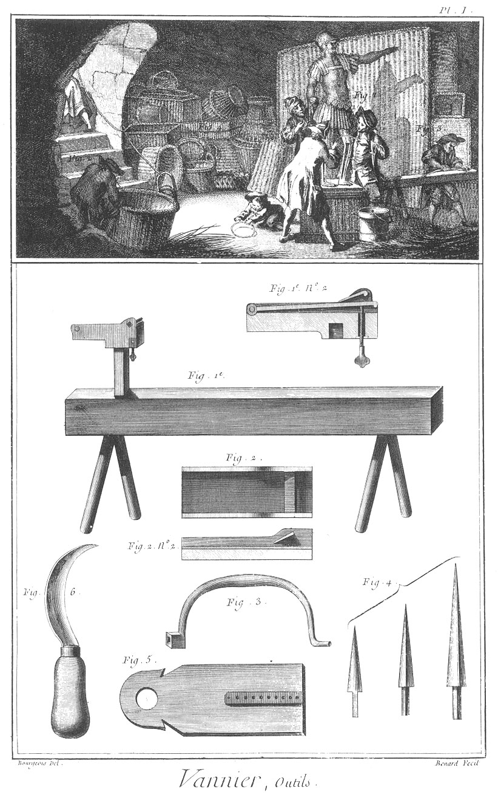
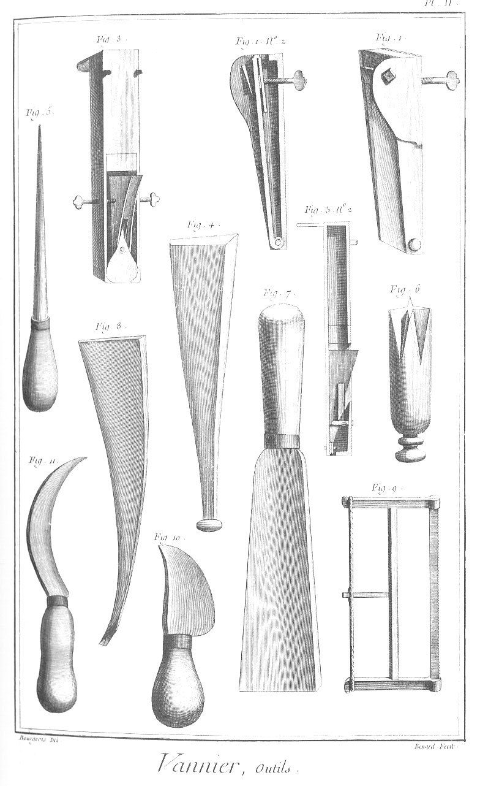

VANNIER
========

Contenant trois Planches. 

PLANCHE Iere.
-------------

Vignette.

Fig.
1. Compagnon qui travaille à finir une figure d'osier.

2. Ouvrier qui travaille à un panier.

3. Ouvrier qui tire de l'osier.

4. Différens ouvrages de Vannerie. Bas de la Planche.

Fig.
1. Banc à planete.
	- n°. 2. Coupe de la planete.

2. Planete d'une autre forme.
	- n°. 2. Coupe de la figure 2.

3. le fer du vilebrequin.

4. Différens vilebrequins.

5. Planchette.

6. Serpette. 

PLANCHE II.
-----------

Fig.
1. Planete à main ou portative.
	- n°. 2. Coupe de la figure précédente.

3. Ecarissoir à main.
	- n°. 2. Coupe de l'écarissoir à main.

4. Batte.

5. Poinçon.

6. Mandoire.

7. Serpe.

8. Fer à clore.

9. Scie.

10. Epuchoir.

11. Autre épuchoir.

PLANCHE III.
------------

Fig.
1. &
2. &
3. &
4. &
5. &
6. &
7. &
8. &
9. &
10. Différens Ouvrages de Vannerie.

11. &
12. Outils de Vannier.

[->](../14-Verrerie/Légende.md)
