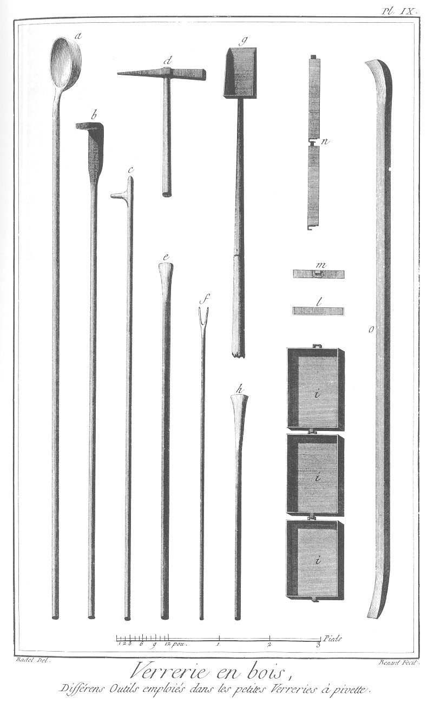

VERRERIE EN BOIS, ou PETITE VERRERIE A PIVETTE
==============================================

Contenant vingt-neuf Planches à cause de sept doubles ; PREMIERE SECTION, Petits Ouvrages en Verrerie, comme verres à boire & autres ustensiles. 

PLANCHE Iere.
-------------

Cette Planche représente l'intérieur d'une halle de petite Verrerie.
	- a a, four.
	- b, vue extérieure de l'arche où l'on met recuire la marchandise.
	- c, porte de l'arche par où l'on passe les marchandises.
	- d d, trous pour communiquer de l'air à l'arche.
	- e e e, ancres de fer pour soutenir l'arche.
	- f f f, joues ou petits murs en terre glaise pour garantir les ouvriers de la chaleur.
	- g, crochets de fer sur la joue pour tenir la canne au réchauffage.
	- h h, ouvraux ou trous par où l'on travaille dans les pots à verre.
	- i, tablette sur laquelle les ouvriers posent leur canne.
	- l l, tisards ou ouverture par où l'on chauffe le four.
	- m, maître ou paraisonnier qui cueille la matiere avec la canne dans le pot.
	- n, maître soufflant la poste & la roulant sur le marbre.
	- o o, ouvriers sur le banc roulant la canne pour donner la forme à la poste.
	- p, ouvrier soufflant la poste au chauffage.
	- q, petit garçon nettoyant le verre qui est attaché à la canne dans l'auge aux groisils ou recoupe de verre.
	- r, tambour ou cheminée par où l'on jette les pivettes ou bois secs du haut de la halle.
	- s, pivettes ou bois prêts à être mis dans le tisard.
	- t, tiseur prenant la pivette pour la porter au tisard.
	- u, tiseur mettant la pivette ou bois sec au tisard.
	- v, petit talut ou chemin du tisard.
	- x x, baquets & tonneaux dans lesquels on met rafraîchir les cannes.
	- y y, auges pour les recoupes.
	- z, marbre sur lequel on roule la poste. &, moule cannelé dans lequel on roule la poste. & &, chaudiere dans laquelle l'on met le sel de soude provenant de l'écume des pots à verre.
	- a a, pivettes ou bois qui seche sur le haut de la halle.

PLANCHE II.
-----------

Cette Planche représente le plan géométral d'une halle de petite Verrerie à pivette avec son four au centre & toutes ses dépendances.
	- a a, plan du four au niveau du tisard.
	- b b, talus qui conduisent au tisard.
	- c c, ouvertures du tisard.
	- d d, évasemens du tisard pour gagner l'oeil.
	- e, cercle ponctué qui marque l'oeil.
	- f, massif en brique pour soutenir le banc des pots à verre g g, massif en brique pour soutenir l'arche qui communique du four au cabinet de l'arche.
	- h, porte passant par-dessous l'arche.
	- i, grilles ou trois barres de fer pour soutenir les pivettes dessus les trous de la cave au travers desquels passe la braise.
	- l, calcaise ou carcaise, ou four à cuire les pots pour les postes lorsqu'il y en a de cassés.
	- m, calcaise ou four pour cuire les compositions.
	- n n, &c. disposition des bancs pour le travail des ouvriers.
	- o, cabinet du maître tiseur pour serrer ses compositions & ustensiles.
	- p, partie de l'attelier où l'on fend le bois pour en former des pivettes.
	- q, grande caisse où l'on mêle la composition cuite mêlée avec le groisil.
	- r r r, auges de bois creusées dans un arbre pour recevoir les recoupes des cannes & pilots.
	- s, tambour ou cheminée par où l'on précipite le bois sec ou pivettes, de la partie supérieure de la halle.
	- t, cabinet de l'arche où l'on reçoit & dépose les marchandises recuites.
	- u, caisse de planches pour recevoir les marchandises.
	- v, croisée du cabinet de l'arche.
	- x x x, portes d'entrée de la halle.
	- y y y, poteaux de charpente servant à soutenir la halle. 

PLANCHE III.
------------

Fig.
1. Coupe d'un four de la petite Verrerie à pivettes, avec toutes ses dépendances sur les lignes ponctuées A B des plans géométraux.
	- a, intérieur du four.
	- b b b, petites arcades pour contenir les pots dans lesquels sont percés les ouvraux ou trous par lesquels on puise la matiere.
	- c c c, pots placés dans le four sur le banc.
	- d, coupe d'un pot.
	- e, ouvraux placés vis à-vis du pot.
	- f, oeil du tisard pour communiquer la chaleur dans le four.
	- g g, banc construit en brique pour soutenir les pots.
	- h, oeil de la couronne pour donner de la chaleur à l'arche.
	- i, coupe de l'arche où l'on met recuire les marchandises.
	- l l, voûte de l'arche construite en brique.
	- m, porte de l'arche pour mettre cuire les marchandises.
	- n, tisard où l'on met le bois ou pivette pour chauffer le four.
	- o, grilles ou trois barres de fer pour soutenir le bois & pour l'échappée de la braise dans la cave.
	- p, talut ou pente en avant du tisard.
	- q q, voûte de la cave. r cave à recevoir la braise provenant du tisard.
	- s, portes de la cave.
	- t, passage de communication à la cave.
	- u, petite niche contre le four où les ouvriers font cuire leur manger.
	- v, porte de communication pour l'attelier.
	- x, massif en brique soutenant l'arche.
	- y, communication de l'arche au cabinet.
	- z, couronne du four ou voûte construite en brique.

2. Plan d'un four de petite Verrerie pris au niveau de l'arche.
	- a, chemin de l'arche.
	- b, oeil de la couronne pour donner de la chaleur à l'arche.
	- c c, petites portes pour mettre les marchandises faites à l'arche.
	- d d d, trous pour communiquer l'air à l'arche.
	- e e e, piles ou couronne du four construites en brique.
	- f f, disposition des ferraces ou caisse de tôle pour tenir & emmener dans l'arche les marchandises à la cuisson.
	- g g, joues ou petits murs en terre pour garantir les ouvriers de la chaleur des ouvraux.
	- h h h, trous ou ouvraux par lesquels les ouvriers puisent la matiere dans le pot.
	- i, talut des tisards.

3. Coupe de la cave à braise prise sur le talut & en face des tisards.
	- a, face du tisard.
	- b, tisard ou trous par où l'on met le bois.
	- c, cave à braise.
	- d, construction de la voûte & cave en brique.

4. Plan du four au niveau des pots.
	- a a a, disposition des différens pots sur le banc dans le four. b banc du four pour soutenir les pots.
	- c, oeil du tisard pour donner de la chaleur dans le four.
	- d, pot du canton pour la cuite du verre. e pot de verre du travail.
	- f, g, pots de verre de fonte.
	- h, pot de verre de travail.
	- i, pot de verre verd.
	- l, pot de verre brun.
	- m m m, ouvraux ou trous par où les ouvriers puisent la matiere.
	- n n n, petits ouvraux à pontis.
	- o o o o, plans des piles à couronnes en brique.
	- p p p, massifs en brique pour soutenir l'arche.
	- q, niche pour la cuisson du manger des ouvriers.
	- r, porte de communication par dessous l'arche.
	- s s, talut du tisard.
	- t t, joues ou petits murs en terre pour garantir les ouvriers de la chaleur des ouvraux.

PLANCHE IV.
-----------

Construction du four.

Fig.
1. Coupe & plan en perspective du four où l'on voit la disposition des pots & les ouvriers qui construisent le massif du banc.
	- a, ouvrier posant une brique crue & la frottant sur les anciennes posées, pour en égaliser le lit.
	- b, baquet où l'on met le mortier composé avec la raclure de brique non cuite, pulvérisée & broyée avec de l'eau.
	- c, construction du massif du banc des pots en terre crue.
	- d, chemin du tisard.
	- e, entrée du tisard.
	- f, oeil du tisard pour donner de la chaleur au four.
	- g g, premier massif en brique cuite.
	- h, construction de l'entrée du tisard en brique crue.
	- i, ceintre de fer pour soutenir l'entrée du tisard.
	- l l, petit mur en brique cuite pour soutenir le terrein de chaque côté du talut du tisard.
	- m, talut du tisard.
	- n, brique de construction pour soutenir la couronne.
	- o o o, massif en terre glaise pour fermer le passage des pots, & pour former les ouvraux.
	- p, place d'un pot.
	- q q q, pots en place contenant la matiere.
	- r r r, construction de la couronne ou voûte du four en brique crue.
	- s, barre de fer pour soutenir l'arche.
	- t, oeil de la couronne pour donner de la chaleur à l'arche.
	- u, joue en terre glaise ou petit mur pour garantir les ouvriers de la chaleur des ouvraux.
	- v, ouvrier passant la canne par l'ouvroir pour prendre de la matiere dans le pot.
	- x, banc.
	- y, marbre.

2. a ouvrier portant des briques pour la construction du four.
	- b b, briques crues prêtes à être posées.

3. Ouvriers occupés à broyer dans un tonneau de la terre provenant des raclures des briques crues & pulvérisées pour la liaison des briques du four.

4. Briques posées pour sécher.

5. Ouvriers occupés à poser en liaison des briques pour la construction du four.
	- a, ouvrier ou maçon posant une planche sur la brique en liaison, & frappant avec force sur la planche pour extraire de la liaison le trop de mortier.
	- b, planche.
	- c c c, carreaux de brique en liaison.
	- d, mâçon ôtant avec la truelle le trop de mortier sortant du joint des briques.

PLANCHE V.
----------

Moules & proportions des briques pour la construction du sour.

Fig.
1. Chassis pour les grandes briques du fond.
	- a, épaisseur & largeur de la brique.

2. Chassis pour les briques de l'oeil du tisard.
	- b, proportion & mesure de la brique.

3. Chassis pour les briques des piliers de la couronne.
	- c, épaisseur & largeur de la brique.

4. Autre chassis pour les briques des piliers de la couronne.
	- d, proportion de la brique.

5. Chassis pour les briques de la couronne ou voûte.
	- e, proportion de la brique.

6. Chassis pour les briques en claveaux de la couronne.
	- f, proportion des briques.

7. Batte de bois pour frapper la terre.

8. Brique rouge pour le premier massif.

9. Action d'emplir une petit moule de terre à brique.

PLANCHE VI.
-----------

Fig.
1. Ouvriers occupés à piler dans une auge de bois de la terre-glaise seche pour la formation des briques & des pots.
	- a, ouvrier remuant la terre glaise avec une pelle.
	- b b, autres ouvriers qui pilent cette terre.
	- c, pelle.
	- d, marteau de bois ou pilon. e petits balais pour nettoyer l'auge.

2. Ouvrier mêlant dans une caisse de planches la terre glaise avec de l'eau pour l'humecter, & avec de la pilure d'anciens pots pour la corriger.

PLANCHE VII.
------------

Fig.
1. Ouvrier occupé à piler dans des mortiers faits de troncs d'arbre, des morceaux de vieux pots, pour les mêler avec de la terre-glaise. 

Fig.
2. Autre ouvrier occupé à tamiser dans un tonneau la poussiere des vieux pots pilés, pour la mêler ensuite avec la terre-glaise pour la corriger.

3. Femmes occupées à briser un vieux pot retiré du four, pour en ôter le verre restant au fond & pour le donner à piler. a vieux pots.
	- b, partie de verre restant au fond du pot.
	- c c c, morceaux de vieux pots brisés.
	- d, auge de bois où l'on met les morceaux de verre retirés du vieux pot.

4. Outils servant à piler.
	- a, marteau de fer pour piler.
	- b, petit marteau ou fendoir.
	- c c, morceaux de pelle de bois pour fouiller dans les mortiers. d petit balai pour nettoyer le mortier.

PLANCHE VIII.
-------------

Fig.
1. Ouvriers occupés à taper avec des maillets de bois la motte de terre pour former le fond du pot.
	- a, motte de terre.
	- b, partie où les ouvriers frappent pour élargir le fond.
	- c, noyau, que l'on laisse au milieu pour écraser insensiblement & élargir le fond suivant la largeur donnée.
	- d, fond de bois pour former les pots & les laisser sécher dessus.
	- e, poussiere de vieux pots seche pour empêcher les pots de s'attacher sur le fond.
	- f, baquet renversé, sur lequel on travaille le pot.

2. Ouvrier occupé à former des rouleaux de terre, pour élever les bords du pot.
	- a, rouleaux prêts à servir.

3. Ouvriers occupés à élever les bords du pot, avec des rouleaux de terre-glaise destinés à cet usage. a ouvrier posant bien joint le rouleau sur le bord relevé du fond.
	- b, ouvrier grattant avec les doigts pour lier les joints des rouleaux.
	- c, fond du pot.
	- d, fond du bois sur lequel se forment les pots.
	- e, baquet renversé.

4. Jauge pour la hauteur & le diametre du pot.
	- a b, diametre du pot.
	- c d, hauteur du pot.

PLANCHE IX.
-----------

Outils du Maître Tiseur.

	- a, Grande casse de fer, ou espece de cuillere servant à transporter dans le four d'un pot à l'autre, le verre fondu & avec le manche pour remuer les pots dérangés, & les transporter de la calcaise dans le four.
	- b, rable de fer, avec lequel on remue la fritte de la composition pour cuire dans la calcaise, & le manche servant au même usage que celui de la casse.
	- c, crochet pour ouvrir les ouvraux du four.
	- d, pique ou pioche pour dégager les ouvertures des ouvraux tisards.
	- e, grand pilot servant à remuer le verre dans les pots & à l'écumer.
	- f, fourchette de fer, pour mettre les marchandises à l'arche.
	- g, pelle à ébraiser dans la cave & sous le four.
	- h, petits pilots pour piler le groisil dans les auges. Ces outils sont répétés de diverses grandeurs pour le service des petites Verreries à pivette.
	- i i i, plans des ferraces, avec la maniere dont elles sont enchaînées l'une à l'autre, pour pouvoir les retirer par le cabinet de l'arche avec la marchandise cuite qu'elles contiennent.
	- l, coupe d'une ferrace.
	- m, vue d'une ferrace de face avec son crochet.
	- n, vue de profil de deux ferraces avec leurs crochets. Ces ferraces se mettent ordinairement par la petite porte de l'arche qui est au-dessus du four, & se retirent par le cabinet de l'arche pleines de marchandises, & alternativement qu'elles sont vuides, on les retransporte à la même petite porte pour les remplir.
	- o, grande pince de fer, pour remuer les pots pleins de verre dans le four & autres gros ouvrages.

PLANCHE X.
----------

Fig.
1. Plan de la calcaise ou four à cuire les pots.
	- a a, massif en brique pour soutenir la voûte.
	- b, intérieur de la calcaise.
	- c, entrée.
	- d, tisard pour échauffer la calcaise.
	- e, ouverture qui communique la chaleur du tisard à la calcaise.

2. Coupe de la calcaise à cuire les pots.
	- a, voûte en brique de la calcaise.
	- b b, massif qui soutient la voûte de la calcaise.
	- c, entrée de la calcaise.
	- d, intérieur de la calcaise.
	- e, tisards ou chemins destinés à faire du feu.
	- f, communication du tisard pour donner de la chaleur à la calcaise.

Fig.
3. Ouverture de la calcaise pour en retirer le pot cuit & le mettre au four remplacer un autre brisé.
	- a, maître tiseur qui a soin de l'entretien du four en général pour la construction, pour les réparations, pour la fourniture & façon des pots, & la composition du verre, tenant le bout de la planche prêt à recevoir le pot rouge sortant de la calcaise, & conduire ainsi les autres tiseurs ou porteurs de pots jusqu'à l'entrée du four & y placer le pot.
	- b, planche au bout de laquelle on porte le pot.
	- c c, tiseurs ou porteurs levant le pot de dessus ses briques à la cuisson pour le poser sur le bout de la planche, opération qui se fait avec le bout des casses.
	- d, entrée de la calcaise qui est bouchée de briques à clairevoie pendant la cuisson du pot.
	- e e, barres de fer ou ceintres soutenant les briques de l'entrée de la calcaise.
	- f, intérieur de la calcaise.
	- g, pots cuits.
	- h, briques soutenant les pots à la cuisson.
	- i, tisards par où on échauffe la calcaise.

PLANCHE XI.
-----------

Fig.
1. 
	- a, ouverture faite au four pour en retirer le vieux pot cassé.
	- b, vieux pots que l'on retire du four.
	- c, maître tiseur retirant avec la grande pince le vieux pot du four.
	- d, joue ou petit mur de terre-glaise, servant à garantir les ouvriers de la chaleur des ouvraux.
	- e, ouvraux par où les ouvriers puisent la matiere dans le pot.
	- f, tablette devant l'ouvrau.
	- g, entrée de l'arche au-dessus du fourneau.
	- h, ouverture pour donner de l'air à l'arche.

2. 
	- a, maître tiseur nettoyant le banc ou place du pot, avec la casse ou grande cuillere de fer.
	- b, banc ou place du pot.
	- c, intérieur du four.
	- d d, pots pleins de verre au fond du four.
	- e, vieux pot cassé sortant du four.
	- f, ouvraux.
	- g, joues.
	- h, banc.

PLANCHE XII.
------------

1. 
	- a, maître tiseur jettant des pelotes de terre-glaise mêlée avec de la paille dans le plus profond du four pour raccommoder le banc.
	- b, entrée du four.
	- c, banc sur lequel doit être placé le nouveau pot.
	- d, intérieur du four.
	- e e e, pots rangés dans le four.
	- f, pile de construction en brique pour soutenir la couronne du four.
	- g, tas de terre-glaise pour raccommoder le four.
	- h, baquet plein d'eau pour peloter la terre-glaise.

2. 
	- a, maître tiseur relevant un pot qui a baissé avec le manche de la casse.
	- b b, tiseurs aidant le maître tiseur à relever le pot.
	- c, intérieur du four.
	- d d d, pots.
	- e e, piles de construction pour soutenir la couronne.
	- f, banc ou place du pot.
	- g, massif du banc.

PLANCHE XIII.
-------------

Fig.
1.
	- a, maître tiseur raccommodant le banc pour placer le pot avec des grosses pelotes de terre, avec une grosse pelle de bois, qui, quand il l'a renversée avec force sur le banc, frappe dessus pour l'égaliser avec les autres.
	- b, tiseur qui forme les pelotes de terre-glaise pour les servir au tiseur.
	- c, intérieur du four.
	- d, pot vu dans l'intérieur du four.
	- e, banc raccommodé.
	- f, massif du banc.
	- g, baquet plein d'eau pour rafraîchir la pelle chaque fois que l'on met une nouvelle pelote dessus.
	- h, pelote de terre-glaise préparée pour raccommoder le four.

2. Tiseurs occupés à former le bonhomme qui sert à soutenir le petit mur de terre-glaise que l'on fait pour fermer le four quand on y a posé le pot, & pour garantir le maître tiseur de la chaleur du four, lequel bonhomme est construit de deux morceaux de bois courbes, sur lequel on cloue des  douves de tonneaux.
	- a, tiseur clouant les douves sur les courbes.
	- b, tiseur soutenant les courbes pour faciliter à clouer les douves dessus.
	- c c, courbes.
	- d d d, douves de tonneaux clouées sur des courbes.
	- e e, douves.
	- f, jeune ouvrier apportant des douves.

PLANCHE XIV.
------------

Fig.
1. Tiseurs portant le pot sortant de la calcaise pour le cuire dans le four.
	- a, maître tiseur tenant le bout de la planche & conduisant le pot au four.
	- b b, tiseurs portant le pot ; ils sont habillés avec un sarrau de grosse toile bourré de paille & de terre glaise pour empêcher la chaleur du pot contre lequel ils sont de les brûler, & ils ont la tête couverte d'un chapeau rabattu, aussi couvert de terre glaise, pour leur garantir le visage & la tête.
	- c, planche sur laquelle est le pot.
	- d, pot sortant de la calcaise & que l'on porte au four.
	- e, bâton servant à porter la planche & le pot.
	- f, banc ou place du pot que l'on va poser qui est couvert de braise.
	- g, intérieur du four.
	- h, pots vus dans le four.

2. Construction du mur de terre glaise pour fermer la grande ouverture du four.
	- a, maître tiseur fermant la grande entrée du four par un petit mur de terre glaise appuyé sur le bonhomme.
	- b, bonhomme placé devant le pot pour empêcher la chaleur d'incommoder la construction de la fermeture du four.
	- c, pelote de terre glaise construisant la fermeture du four.
	- d, tiseur jettant de la braise & de la cendre entre le pot & le bonhomme pour l'empêcher de brûler pendant la construction du petit mur pour la fermeture du four.
	- e, intérieur du four.
	- f f f, pots placés dans le four.
	- g, tas de terre glaise pour la fermeture du four.
	- h h, piles de brique servant à soutenir la couronne.
	- i, massif du banc.

PLANCHE XV.
-----------

Fig.
1. Plan de la calcaise pour cuire les frittes ou composition du verre.
	- a, massif en brique soutenant la voûte de la calcaise.
	- b, intérieur du four ou calcaise.
	- c c, lignes ponctuées qui marquent le tisard ou foyer.
	- d, cheminée ou passage de la chaleur dans la calcaise.
	- e, entrée du four ou calcaise.

2. Coupe du four ou calcaise où l'on cuit les frittes ou composition du verre.
	- a, intérieur du four ou calcaise.
	- b, entrée de la calcaise.
	- c, voûte de la calcaise.
	- d, chemin du tisard ou foyer.
	- e, passage de la chaleur dans la calcaise.

3. Vue en perspective du four ou calcaise avec la cuisson des frittes.
	- a, entrée de la calcaise construite en brique.
	- b, ceintre de fer pour soutenir l'entrée.
	- c, intérieur de la calcaise.
	- d, composition ou fritte cuisant dans la calcaise.
	- e, maître tiseur remuant la fritte ou composition dans la calcaise, & la ramenant à mesure qu'elle est cuite dehors de ladite calcaise avec le grand rable de fer.
	- f, fritte ou composition cuite refroidissant pour être mêlée avec du groisil ou verre cassé, & ensuite mise au pot dans le four pour fondre.

PLANCHE XVI.
------------

Fig.
1. Homme & femme occupés à laver le groisil ou verre cassé dans un panier en le remuant dans un baquet plein d'eau.
	- a, grand seau pour apporter l'eau du puits.
	- b, tonneau plein de groisil.
	- c, baquet plein de lavage.
	- d, manne ou panier dans lequel on lave le groisil.

2. Homme & femme occupés à choisir les morceaux de verre cassés.
	- a, panier pour le lavage.
	- b, tonneau plein de verre cassé.
	- c, tas de groisil.

3. Homme & femme portant au lavage un panier plein de groisil sur une barre.

PLANCHE XVII.
-------------

Fig.
1. Tiseurs mêlant dans la caisse le groisil & la fritte pour la transporter ensuite au four dans les pots de fonte.
	- a, grande caisse pour mêler la fritte avec le groisil.
	- b, pannier de groisil ou verre cassé.
	- c, pelle ou échope pour porter la composition au four.

2. Maître tiseur occupé à mettre la composition dans le pot au four pour fondre.
	- a, grand ouvrau du pot de fonte.
	- b b, pile de brique pour soutenir la couronne du four.
	- c, massif de construction du four.

PLANCHE XVIII.
--------------

Différens outils pour travailler le verre.

Fig.
1. Canne pour souffler le verre.
	- a, élévation de la canne.
	- b, coupe de la canne.
	- c, trou de la canne par lequel passe le vent pour enfler les postes ou bouteilles.
	- d, partie évasée de la canne pour faire la cueillie de la poste dans le pot.

2. Pontis ou tringle de fer pour attacher sous les verres & refermer leurs ouvertures.
	- a a, extrémité du pontis que l'on tient à la main.
	- b, pointe du pontis que l'on trempe dans le verre pour attacher sous la bouteille & verre.

3. Auge de bois pour recevoir les recoupes.

4. Moules cannelés & simples pour souffler les postes & les façonner.

5. Marbre ou plaque de fer fondu pour rouler les postes, afin de les unir.

6. Banc sur lequel s'asseyent les maîtres pour façonner & ouvrir les verres.
	- a a, bardelle assemblée dans le banc sur lequel les maîtres roulent & appuient la canne.
	- b, planchette pour garantir les cuisses des maîtres de la chaleur.
	- c, tringle de fer clouée à la bardelle pour l'empêcher de s'user.
	- d, siége du banc.
	- e e, clous auxquels on accroche les pinces & ciseaux pour le travail.
	- f, cire jaune sur laquelle on frotte la pince échauffée pour empêcher le verre de s'y attacher pendant le travail.
	- g g g, piés du banc.

7. Représentant les différentes pinces & ciseaux pour façonner le verre.
	- a, pince simple.
	- b, ciseaux pour couper & égaliser le verre.
	- c, pince à fleur.
	- d, pince à pointe.
	- e, pince à coquille.
	- f, pince à pointe recourbée.

PLANCHE XIX.
------------

Façon d'un verre à patte.

Fig.
1. 
	- a a, maître tiseur remuant la composition avec le pilot dans le pot de fonte.

2. 
	- a, maître qui cueille la matiere avec sa canne, laquelle cueillie se nomme poste.
	- b b, joues pour garantir de la chaleur de l'ouvrau.
	- c, ouvrau ou trou par lequel on fait les cueillies.
	- d, marbre.
	- e, table de l'ouvrau.

3. Ouvrier roulant la poste ou cueillie sur le marbre pour l'unir.
	- a, banc.
	- b b, bardelle.
	- c, marbre.

4. Ouvrier soufflant la poste ou cueillie dans le moule pour la façonner.
	- a, canne.
	- b, poste dans le moule.
	- c, moule.

5. Maître formant la pointe du calice du verre, & en coupant un petit bouton rond de ladite pointe pour y placer le bouton.
	- a, banc b, pinces & ciseaux accrochés au banc.
	- c, cire attachée au banc pour rafraichir la pointe.
	- d, canne.
	- e, auge à recoupes.

6. 
	- a, petit garçon tenant la canne où est le bouton du verre & la présentant au maître.
	- b, maître prenant la canne du petit garçon avec sa pince, & l'adaptant au calice du verre.
	- c, bouton s'attachant au calice du verre.
	- d, ciseau & pince accrochés au banc pour le travail.
	- e, marbre posé à terre pour rouler le verre.
	- f f, bardelle pour rouler la canne.

7. Maître donnant la forme au bouton avec sa pince.
	- a, banc.
	- b, ciseau & pince accrochés au banc.
	- c c, bardelle.

8. Ouvrier formant la patte du verre prête à être adaptée  au bouton.
	- a, partie formant la patte du verre.
	- b, canne.
	- c, moule.

PLANCHE XX.
-----------

Fig.
1. Maître coupant la patte du verre adaptée au bouton en mouillant la pince avec de la salive, & l'appuyant sur le verre chaud, & donnant ensuite avec le haut de la pince un coup sec pour en séparer la canne du grand garçon.
	- a a, bardelle.
	- b, banc.
	- c, canne.
	- d, maître.
	- e, grand garçon.
	- f, grande auge à groisil.
	- g, petite auge de recoupe sous le banc du maître.

2. Maître ouvrant la patte du verre & formant le rebord.
	- a a, bardelle.
	- b, banc. c canne.
	- d, petite auge à recoupe.

3. 
	- a, petit garçon posant le pontis sous la patte du verre.
	- b, pontis.
	- c, maître ayant mouillé la pince avec la salive, appuyé sur la poste qui fait l'ouverture du calice du verre, & donnant un coup sec sur sa canne avec le manche de sa pince, & le porter ensuite au chauffage pour l'ouvrir.
	- d d, bardelle.
	- e, canne.
	- f, tête du banc.
	- g, auge à recoupe ou groisil.

4. Maître faisant chauffer à l'ouvrau le calice du verre pour en égaliser ensuite les bords & l'ouvrir.
	- a a, joues pour garantir le maître de la chaleur de l'ouvrau.
	- b, ouvrau où le maître fait chauffer le calice du verre.
	- c, pontis tenant sous la patte du verre.
	- d, bande de fer avec des crochets pour tenir le pontis & aider l'ouvrier au chauffage.
	- e, tablette de l'ouvrau.

5. Maître roulant le pontis sur le banc doucement, pour couper & égaliser le haut du calice du verre.
	- a, pontis roulant sur la bardelle.
	- b, bardelle.
	- c, maître occupé à couper le bord du calice.
	- d, auge pour recevoir les recoupes.

6. 
	- a, maître occupé à faire l'ouverture & à former le calice du verre.
	- b, ouverture du calice du verre.
	- c c, bardelle.
	- d, pontis.
	- e, tête du banc.
	- f, auge à recoupe.
	- g, verres finis prets à être mis à l'arche. h ouvrau.
	- i, joue de l'ouvrau.
	- l, petit garçon mettant le verre sur la ferrace dans l'arche avec la fourchette.
	- m, fourchette.
	- n, verre sur la fourchette.
	- o, entrée de l'arche.
	- p p p p, barre de fer soutenant l'arche.
	- q, portes en tôle de l'entrée de l'arche.
	- r, piliers en brique pour soutenir la couronne de l'arche.

PLANCHE XXI.
------------

Cette Planche comprend l'opération de filer.

Fig.
1. Les tubes de barometre.
	- a, maître ayant soufflé la poste & la roulant sur le banc.
	- b, poste.
	- c, canne.
	- d, banc.

2. Jeune ouvrier ayant formé le pontis pour recevoir la poste & l'applatissant sur le marbre posé sur le banc.
	- a, pontis.
	- b, marbre.
	- c, banc.

3. Maître & petit garçon rafraîchissant le bout de la poste & le pontis pour les attacher ensemble.
	- a, maître.
	- b, petit garçon.
	- c, canne où est attachée la poste.
	- d, pontis.
	- e, baquet où rafraîchissent le pontis & la poste.

4. 
	- a Maître posant la poste sur le pontis.
	- b, petit gar- çon recevant sur le pontis la poste.
	- c, pontis.
	- d, postes.

5. Maître & petit garçon filant la poste pour former les tubes de barometre, ce qui se fait en marchant doucement chacun de son côté, & faisant poser en se baissant chacun de son côté sur des buches ou pivettes posées à distance égale pour les recevoir.
	- a, maître tirant le pontis.
	- b, poste posée sur le pontis & se filant.
	- c, fil de la poste prenant la forme d'un tube creux, parce que la poste a été soufflée avant d'être filée ou tirée.
	- d, petit garçon tenant la canne & aidant à tirer.
	- e, canne.
	- f f, tube posé sur les bûches ou pivettes pour les faire refroidir.
	- g g g, bûches ou pivettes pour recevoir les tubes.

6. Maître & petit garçon occupés à couper les tubes de longueur avec une pierre à fusil pour être mis en paquets.
	- a a, jeunes ouvriers coupant les tubes.
	- b, maître transportant les paquets de tubes.
	- c c c c, tubes prêts à être coupés.
	- d d d d, buches ou pivettes pour recevoir les tubes.

PLANCHE XXII.
-------------

Fig.
1. Débouchés de l'arche pour recuire les marchandises où les commis les reçoivent & reprennent en compte.
	- a, ceintre de l'arche construit en brique.
	- b b, portes de l'arche par lesquelles on passe les verres faits pour les mettre sur les ferraces.
	- c, oeil du four pour donner de la chaleur dans l'arche.
	- d, intérieur de l'arche.
	- e e e e, ferraces chargées  de marchandises qui recuisent, & que l'on tire l'une après l'autre en les déchargeant pour refroidir peu-à-peu la marchandise & être mise en compte par les commis. f f commis prenant la marchandise de l'arche en compte, pour être transportée au magasin, emballée & envoyée à sa destination.
	- g g, caisses de planches pour déposer la marchandise provenant de l'arche.
	- h h, panier plein de marchandise pour être transportée au magasin.

Fig.
2. Commis portant les paniers pleins de marchandise au magasin pour les emballer.
	- a a a commis.
	- b b, paniers chargés de marchandise.
	- c c, marchandise en verrerie de toute espece. 

[->](../02-Verrerie_en_Bois,_ou_Grande_Verrerie_a_Vitres_ou_en_Plats/Légende.md)
