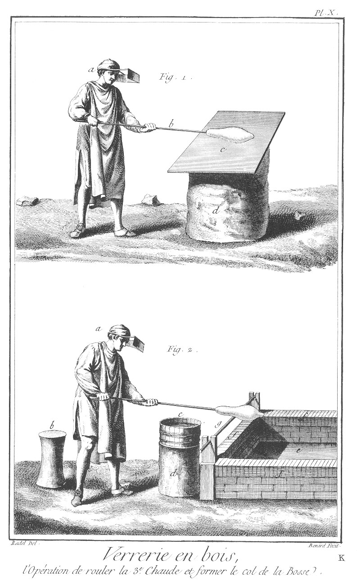
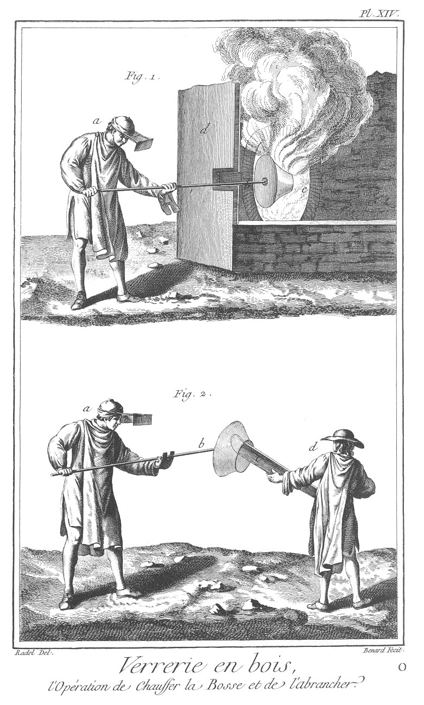

VERRERIE EN BOIS, OU GRANDE VERRERIE A VITRES OU EN PLATS, DITE A PIVETTE
=========================================================================

Contenant vingt-quatre Planches à cause de cinq doubles; SECONDE SECTION. 

PLANCHE Iere.
-------------

Figure
1. Extérieur d'une halle de grande Verrerie à plats pour les vitres.
	- a, halle de la grande Verrerie.
	- b, petite halle servant d'entrée à la grande Verrerie.
	- c, berceau composé de feuillages, sous lequel les gentilshommes verriers prennent le repos & le frais.
	- d, gentilshommes verriers prenant le frais.
	- e, bâtimens ou magasins servant à serrer les marchandises & à faire les pots.
	- f, petite mare d'eau servant à rafraîchir les fers, poches, pinces, & autres ustensiles pour le service du four.
	- g, fers & poches sur le bord de la mare.
	- h, verres emballés dans le panier prêt à partir.

2. Plat de verre prêt à être emballé.
	- a, oeil de boeuf, ou noix faisant le centre du plat.

3. Plat de verre emballé dans le panier.
	- a, plat de verre.
	- b, paille servant à soutenir le plat dans le panier pour l'empêcher de se casser.
	- c, bâtis du panier à emballer les plats de verre.

PLANCHE II.
-----------

Cette Planche représente l'intérieur d'une halle de grande Verrerie à plats pour les vitres, dite à pivette.
	- a a a, construction en charpente de la halle.
	- b b, four occupant le centre de la halle.
	- c c, calcaise à cuire les pots.
	- d, calcaise à cuire les frittes ou compositions du verre.
	- e, tonnelle ou passage pour arriver à la glaie.
	- f, cheminée pour jetter les pivettes ou bois secs du haut en bas de la halle.
	- g g g, poche, pince, & autres ustensiles nécessaires pour le service de la Verrerie ; elles sont les mêmes que celles marquées à la petite Verrerie, Planche IX. cependant d'une plus grande proportion du quart environ.
	- h h h, pivette ou bois coupé en petits morceaux d'environ dix-huit pouces, séchant sur le haut du four.
	- i, pivette ou bois sec prêt à être mis au four.
	- l, béquet pour retourner les bosses, & mettre le pontis pour former les plats.
	- m, chaudiere de fer, dans laquelle on met le sel qui surnage sur la surface des pots de verre dans le four.
	- n, tiseur portant de la pivette ou bois pour chauffer le four.
	- o, cueilleur occupé à tremper le bout de la felle ou canne dans le four.
	- p, gentilhomme qui alonge le cueillage à l'auge.
	- q, gentilhomme roulant la seconde chaude sur le marbre.
	- r, gentilhomme soufflant la bosse sur le crenio ou auge de mâçonnerie.
	- s, gentilhomme portant le plat à la pelote.
	- t, t, four à recuire les plats.
	- u, crenio ou auge en mâ- çonnerie.
	- x, marbre sur lequel on roule les chaudes ou bosses.
	- y, auge de bois pleine d'eau servant à alonger les cueillages. 

PLANCHE III.
------------

Cette Planche représente le plan général d'une halle de grande Verrerie à vitres ou à plats, avec le plan du four & toutes ses dépendances.
	- a, plan du four.
	- b, b, b, b, passage ou trou dessous chaque ouvrau pour donner de l'air dans le four.
	- c, c, tonnelle ou passage pour arriver à la glaie.
	- d, d, partie de la tonnelle où l'on construit la glaie ou passage pour le bois dans le four.
	- e, e, e, e, massifs de construction qui soutiennent les calcaises à cuire les pots.
	- f, plan du béquet.
	- g, g, chaudiere de fer pour mettre les sels superflus des pots.
	- h, h, h, h, lignes ponctuées qui marquent la construction de charpente de la halle de la Verrerie.
	- i, tambour ou cheminée pour précipiter le bois sec du haut de la halle en bas.
	- l, l fours particuliers pour recuire les bouteilles.
	- m, m, autres fours pour recuire les plats pour les vitres.
	- n, pelote ou tas rond fait avec de la braise fine mêlée avec de la cendre, applati par le haut pour poser les plats faits, & ensuite les mettre recuire dans le four.
	- o, grande auge de bois pleine d'eau dessus laquelle on alonge le cueillage.
	- p, marbre ou plaque de fer fondu sur lequel on roule les chauffages pour former la bosse ; cette plaque ou marbre est posé sur un tronc d'arbre & fait un plan incliné. Voyez sa disposition & son service aux Planches IX & X, figures 1 & 2.
	- q, q, petits siéges de bois faits d'un tronc d'arbre sur lesquels s'asseyent les gentilshommes pour faire la bosse.
	- r, r, crénios sur le bord desquels on souffle la bosse & qui reçoivent les brisures de verre cassé.
	- s, s, petits baquets soutenus sur troncs d'arbre, dans lesquels il y a de l'eau pour prendre avec le ferret & inciser la bosse.
	- t, t, t, t, portes d'entrée de la halle.

PLANCHE IV.
-----------

Cette Planche représente les deux plans des différens étages du four d'une grande Verrerie à plats ou à vitres.

Fig.
1. Plan d'un four d'une grande Verrerie à vitres au niveau des siéges, pots & ouvraux.
	- a, pot du grand ouvrau.
	- b, pot des sels de gras.
	- c, pot de derriere.
	- d, pot à bouteille.
	- e, pots des sels des petits ouvraux.
	- f, pot de devant.
	- g, tisard ou foyer.
	- h, h, h, h, siéges sur lesquels sont les pots.
	- i, i, glaie.
	- l, tonnelle.
	- m, m, ouvraux pour les bouteilles.
	- n, n, grands ouvraux pour les plats de verre.
	- o, massifs de construction pour soutenir les calcaises à cuire les pots.
	- p, bout d'en-haut.
	- q, bout d'en-bas.

2. Plan au niveau des calcaises.
	- a, tisard ou foyer.
	- b, b, siége sur lequel on met les pots.
	- c, c, calcaises à cuire les pots.
	- d, calcaise pour cuire les frittes.
	- e, e, e, passage ou oeil pour communiquer la chaleur aux calcaises.

PLANCHE V.
----------

Fig.
1. Coupe générale d'une grande Verrerie à vitres en plats.
	- a, four coupé sur la largeur.
	- b, tisard ou partie où l'on met le feu.
	- c, c, c, oeil de boeuf pour donner la chaleur dans les calcaises.
	- d, d, coupes des pots.
	- e, e, e, trous pour donner de l'air au feu dans le tisard.
	- f, f, ouvraux.

2. Maniere dont on couvre les halles de grande Verrerie avec de petites planches de dix-huit pouces environ de longueur sur quatre pouces de large.
	- a, a, a, a, petites planches servant à couvrir les halles.
	- b, b, b, b, chevilles de bois qui retiennent les petites planches sur les lattes.

3. Profil de la couverture posée sur un chevron.
	- a, a, profils des lattes.
	- b, b, b, profils des chevilles posant sur les lattes.
	- c, c, c, lattes clouées sur les chevrons.
	- d, profil d'un chevron.

4. Coupe des pots, du plus grand & du plus petit: il y en a qui tiennent la moyenne proportionnelle entre deux.
	- a, rebord du pot par lequel on l'accroche par les ouvraux pour les mettre sur le siége. Voyez Planche XVIII.
	- b, intérieur du pot.

PLANCHE VI.
-----------

Cette Planche représente les coupes sur la longueur & largeur du four, & plusieurs outils dont on ne se sert pas dans la petite Verrerie à pivette.

Fig.
1. Coupe sur la longueur du four prise sur la ligne p, q, Pl. IV.
	- a, intérieur de la voûte du four où sont les pots.
	- b, b, b, ouvraux pour prendre la matiere dans les pots.
	- c, c, c, pots sur la banquette.
	- d, d, d, trous par où le four reçoit de l'air.
	- e, e, glaies ou passages pour le bois dans le four.
	- f, f, petits trous en haut de la glaie pour donner de l'air au four.
	- g, g, tonnelles ou entrées pour la glaie.
	- h, h, coupes des deux calcaises pour les frittes.
	- i, i, passage ou oeil pour communiquer la chaleur du four dans les calcaises.
	- l, l, entrées extérieures des calcaises pour y mettre cuire les compositions.
	- m, siége sur lequel sont les pots.

2. Coupe sur la largeur du four.
	- a, intérieur de la voûte du four.
	- b, b, b, oeils ou trous pour communiquer la chaleur du four dans les calcaises.
	- c, c, coupe des pots.
	- d, glaie par laquelle on passe le bois pour le chauffage du four.
	- e, e, trous pour donner de l'air au four par dessous les pots.
	- f, f, ouvraux pour prendre la matiere dans les pots & la travailler.
	- g, intérieur du four où l'on met le bois pour le chauffer.
	- h, les deux massifs de mâ- çonnerie en brique qui enveloppent les calcaises.

3. Bion, outil avec lequel on incise, c'est-à-dire couper le col de la bouteille.
	- a, bout par lequel le gentilhomme la tient.
	- b, pointe du bion avec lequel on prend la goutte pour la poser sur le col de la bosse, & par ce moyen former l'incision.

4. Canne ou felle avec laquelle on prend le verre dans le pot, ce que l'on appelle cueillir pour former la bosse.
	- a, bout de la canne que l'on plonge dans le verre.
	- b, garniture du bout opposé pour tenir la canne & souffler la bosse.

5. Coupe d'une canne ou felle.
	- a, partie intérieure que l'on trempe dans le verre qui est évasée pour donner plus de vent dans la bosse.
	- b, garniture du bout de la canne.

6. Fer ou pontis qui sert à retourner la bosse & ouvrir les plats. a bout du pontis pour tenir le plat.
	- b, garniture en bois du bout du pontis.

7. Crochet qui sert à la ramasseuse de verre pour tirer à elle les essais de verre chaud que l'on jette par terre.
	- a, manche en bois du crochet.
	- b, bout du crochet.

8. Grand crochet de fer pour accrocher les pots par les ouvraux & les poser sur le siége.
	- a, bout du  crochet pour accrocher les pots.
	- b, bout par lequel les tiseurs le tiennent.

Fig.
9. Piece de planche de chêne qui sert à ouvrir les bosses pour en faire les plats; les ouvriets la nomment branche.
	- a, partie de labranche que l'on met dans la bosse pour en faire l'ouverture.
	- b, bout par où le tiseur ou garçon le tient pour l'ouvrir.

PLANCHE VII.
------------

Fig.
1. Vue en perspective intérieure de la tonnelle & de la glaie, avec le détail de leurs constructions.
	- a, passage de la tonnelle.
	- b, pelote de terre glaise servant de fermeture à la glaie.
	- c, partie de la glaie par où l'on passe le bois dans le four.

2. Vue perspective du béquet, ou place sur laquelle on coupe l'incision de la bosse pour la retourner & y mettre le pontis, afin de faire le chauffage & l'ouverture de la bosse, & en former les plats.
	- a, a, deux parties de pierre pour recevoir la bosse.
	- b, partie faite en coin pour séparer la bosse d'avec la canne.
	- c c, massif de mâçonnerie pour soutenir la forme du béquet.
	- d, autre massif de mâçonnerie pour soutenir le coin du béquet.

3. Garçon ou tiseur occupé à rouler sur le petit marbre du verre autour de la tête du pontis, pour le donner ensuite au gentilhomme verrier.
	- a, maniere dont le petit marbre est retenu dans la construction du four.
	- b b, petits corbeaux de fer qui soutiennent le marbre.

4. 
	- a, Marbre en proportion.

PLANCHE VIII.
-------------

Fig.
1. Cueilleur occupé à mettre la felle ou canne dans le pot pour faire le cueillage.
	- a, joue pour empêcher la chaleur du grand ouvrau d'incommoder les gentilshommes.
	- b, partie du grand ouvrau.

2. Gentilhomme qui alonge le cueillage à l'auge.
	- a, auge de bois pleine d'eau sur laquelle on alonge le cueillage.
	- b, casse appuyée sur deux échiquiers le long de l'auge pour soutenir la canne.
	- c, canne au bout de laquelle est le cueillage.
	- d, gentilhomme alongeant le cueillage à l'auge.

PLANCHE IX.
-----------

Fig.
1. Gentilhomme roulant sur le marbre la premiere chaude, ainsi appellée parce que c'est la premiere fois qu'on porte réchauffer le cueillage au four.
	- a, gentilhomme roulant la premiere chaude sur le marbre.
	- b, écran que les gentilshommes mettent sur leurs têtes pour les garantir de la grande chaleur des ouvraux.
	- c, tronc d'arbre sur lequel est posé la table de marbre ou de fonte.
	- d, marbre posé sur le tronc d'arbre.

2. 
	- a Gentilhomme roulant & soufflant la seconde chaude sur le marbre.
	- b, mitaine que le gentilhomme met pour tourner la canne dans la main & le préserver de la grande chaleur. Voyez la Planche XIX. fig. 2 & 3.
	- c, marbre sur lequel on roule la seconde chaude.
	- d, tronc d'arbre sur lequel est posé le marbre.

PLANCHE X.
----------

Fig.
1.
	- a, Gentilhomme roulant la troisieme chaude sur le marbre.
	- b, felle ou canne au bout de laquelle est le cueillage.
	- c, marbre servant à rouler le cueillage.
	- d, tronc d'arbre sur lequel est le marbre.

2.
	- a, Gentilhomme occupé à former le col de la bosse.
	- b, siége sur lequel le gentilhomme s'assied pour souffler la bosse.
	- c, petit baquet plein d'eau posé sur un tronc d'arbre, pour prendre avec le bion une goutte d'eau & inciser la bosse.
	- d, tronc d'arbre pour soutenir le petit baquet.
	- e, crénio pour recevoir les cassures de verre.
	- f, f, f, bords du crénio construit en brique.
	- g, barre de fer pour soutenir & former le col de la bosse.

PLANCHE XI.
-----------

Fig.
1.
	- a, Gentilhomme formant la noix à la bosse.
	- b, siége.
	- c, baquet pour inciser.
	- d, tronc d'arbre qui soutient le baquet à inciser.
	- e, barre de fer pour former la noix à la bosse.
	- f, bosse dessus la barre de fer à laquelle se forme la noix en tournant.
	- g, crénio pour recevoir les vers cassés.

2.
	- a, Gentilhomme soufflant la bosse sur le crénio.
	- b, petit baquet plein d'eau pour inciser la bosse.
	- c, tronc d'arbre pour soutenir le petit baquet.
	- d, barre de fer pour soutenir la canne.
	- e, bosse.
	- f, crénio.

PLANCHE XII.
------------

Fig.
1.
	- a, Gentilhomme occupé au grand ouvrau du four à foncer la bosse, c'est-à-dire faire chauffer le fond de la bosse afin de l'applatir.
	- b, joue ou petit mur pour empêcher la grande chaleur d'incommoder les gentilshommes.
	- c, ouverture du grand ouvrau.
	- d, échancrure faite à la joue pour soutenir la canne.
	- e, béquet sur lequel on retourne la bosse pour placer le pontis.

2.
	- a, Gentilhomme occupé à inciser le col de la bosse.
	- b, bion en action d'inciser le col de la bosse.
	- c, barre de fer sur laquelle pose la canne.
	- d, crénio pour recevoir les verres cassés.
	- e, siége sur lequel s'asseyent les gentilshommes.

PLANCHE XIII.
-------------

Fig.
1.
	- a, Gentilhomme occupé à inciser, c'est-à-dire séparer le col de la bosse d'avec la canne, ensuite le retourner sur le béquet pour y placer le pontis, c'est-à-dire rogner.
	- b, bion du manche duquel on se sert pour séparer la bosse de la canne.
	- c, trait noir qui marque l'endroit de l'incision sur le col de la bosse.
	- d, béquet sur lequel on retourne la bosse pour placer le pontis.
	- e, coin du béquet servant à séparer le col de la bosse.

2.
	- a, Gentilhomme occupé à placer le pontis ou ferret à la noix de la bosse, c'est-à-dire attacher.
	- b, pontis placé à la noix de la bosse.
	- c, coin du béquer.

PLANCHE XIV.
------------

Fig.
1.
	- a, Ferrotier ou garçon occupé à faire chauffer la bosse au grand ouvrau pour la brancher ou l'ouvrir.
	- b, pontis placé à la noix de la bosse.
	- c, grand ouvrau.
	- d, joue pour garantir de la chaleur.

2. Gentilhomme occupé à brancher, c'est-à-dire ouvrir la bosse en tournant dessus la branche ou planche qui lui sert à l'ouvrir.
	- b, pontis qu'il tient à la bosse par la noix.
	- c, branche ou planche tenue par le ferrotier ou garçon.
	- d, garçon ou ferrotier qui tient la planche pour aider au gentilhomme à l'ouvrir.

PLANCHE XV.
-----------

Fig.
1.
	- a, Gentilhomme occupé à ouvrir au grand ouvrau, la bosse pour en former le plat. Cette opération se fait très-vivement en tournant le pontis avec la bosse.
	- b, bosse s'ouvrant au four en tournant.
	- c, joue pour garantir les gentilshommes de la grande chaleur.
	- d, ouverture du grand ouvrau.

2.
	- a, Gentilhomme occupé à tourner vigoureusement la bosse déja ouverte pour finir de l'étendre & en faire un plat ou table de verre, ensuite le porter à la pelote, ce que l'on nomme porter à la pelote.
	- b, service de la mitaine dont se sert le gentilhomme pour tourner le plat.
	- c, plat de verre prêt à être mis sur la pelote.
	- d, pelote ou tas applati de la grandeur du diametre du plat pour recevoir le plat fini. Ce tas est composé de cendre & petite braise mêlées.

PLANCHE XVI.
------------

Fig.
1.
	- a, Gentilhomme occupé à poser le plat fait sur la pelote, ce que l'on nomme peloter.
	- b plat de  verre fini posé sur la pelote pour être mis ensuite dans le four pour recuire.
	- c, pelote ou tas composé de cendre & petite braise.

Fig.
2.
	- a, Gentilhomme occupé à mettre avec la fourchette dans le four à recuire les plats finis qu'il a pris sur la pelote.
	- b, plat de verre sur la fourchette pour être mis dans le four à recuire.
	- c, pelote sur laquelle on vient de prendre le plat.
	- d, entrée du four.
	- e, pile de plats de verre qui recuisent dans le four.
	- f, fourchette pour mettre les plats de verre dans le four.

PLANCHE XVII.
-------------

Fig.
1. Maniere dont les porteurs & tiseurs tirent le por hors de l'arche pour le transporter dans le four étant tout rouge.
	- a, a, les deux porteurs qui aident à le tirer hors du four.
	- b, b, deux tiseurs travaillant aussi à retirer le pot hors du four pendant que les porteurs le soutiennent sur leurs épaules.
	- c, pot rouge sortant de l'arche.
	- d, d, d, casse, perche, & pince servant à transporter les pots.
	- e, maître tiseur conduisant tout l'ouvrage du transport du pot.
	- f, ouverture de la calcaise à cuire les pots.

2. Maniere dont on porte le pot dans le four.
	- a, a, porteurs.
	- b, b, autres porteurs pour aider les premiers à soutenir le fardeau : ces quatre portent réellement le pot avec des barres de fer sur leurs épaules, dont les deux marqués a a ont la tête & partie du corps dedans, ils sont, pour empêcher l'action du feu, habillés d'un double sarrau de voiturier mouillé, entre deux desquels il y a force paille & terre glaise, la tête couverte d'un double chapeau garni aussi de terre-glaise ; ils ne voient pas clair, & sont conduits avec leur fardeau par les tiseurs jusque dans le four.
	- c, c, c, c, tiseurs faisant faire bascule au pot sur les épaules des porteurs & les conduisant au four.
	- d, maître tiseur conduisant tout l'ouvrage, les tiseurs & les porteurs pour transporter le pot au four.
	- e, e, casses & autres ustensiles propres à porter le pot.
	- f, pot suspendu par les casses pour être porté dans le four.

PLANCHE XVIII.
--------------

Fig.
1. Vue en perspective de l'intérieur du four pour faire voir l'opération de mettre le pot dessus le siége en l'élévant par la glaie & l'accrochant par l'ouvrau.
	- a, pot prêt à être posé sur le siége.
	- b ouvrau au-travers duquel on enleve avec le crochet le pot pour le mettre sur le siége.
	- c, glaie ouverte par laquelle on a passé le pot, & qui sert encore à le mettre sur le siége.
	- d, morceau de bois ou fourche qui sert de point d'appui, pour soutenir une autre traverse de bascule pour enlever le pot.
	- e, grande pince de fer ou bascule.
	- f, autre barre de fer en crochet passée par l'ouvrau pour accrocher le pot par son bord & l'enlever sur le siége.
	- g, g, g, tiseurs occupés à enlever le pot.
	- h, h, autres tiseurs occupés à faire bascule par la glaie.
	- i, intérieur de la voûte du four.
	- l, l, petits ouvraux pour puiser dans les pots.
	- m, glaie du fond du four.
	- n, n, n, pots à verres.
	- o, o, siéges sur lesquels sont placés les pots.
	- p, p, trous par lesquels l'air passe dans le four.
	- q, joue pour garantir les gentilshommes de la chaleur.

2. 
	- a, Femme ou ramasseuse de verre.
	- b, crochet de fer qui sert à traîner le verre.
	- c, gâteau de verre ou essai pris dans les pots avec la casse par le maître tiseur pour en voir la qualité.

PLANCHE XIX.
------------

Fig.
1. Mitaine.
	- a, bout de bras tenant le touret de la mitaine.
	- b, piece de tôle servant d'écran au bras pour garantir de la chaleur, appellée mitaine.
	- c, touret dans la main. d échancrure à la mitaine pour soutenir les cannes dans leurs opérations.

2.
	- a, Touret séparé de la mitaine.
	- b, partie de cuir qui sert à enclaver le touret dans la mitaine.

Fig.
3.
	- a, Mitaine sans le touret.
	- b, échancrure pour rouler la canne.
	- c, partie de cuir pour enclaver dans le touret.

4.
	- a, Chemise que les gentilshommes mettent pour travailler.

5. Ecran que les gentilshommes mettent sur leur tête  pour se garantir les yeux & le visage de la chaleur.
	- a, ceintre de bois qui fait le tour de la tête sur lequel est attachée la toile qui sert d'écran.
	- b, cordage qui sert à serrer le ceintre pour faire tenir l'écran sur la tête.
	- c, toile attachée sur le ceintre qui sert d'écran. 

[->](../03-Verrerie_en_Bouteilles/Légende.md)
