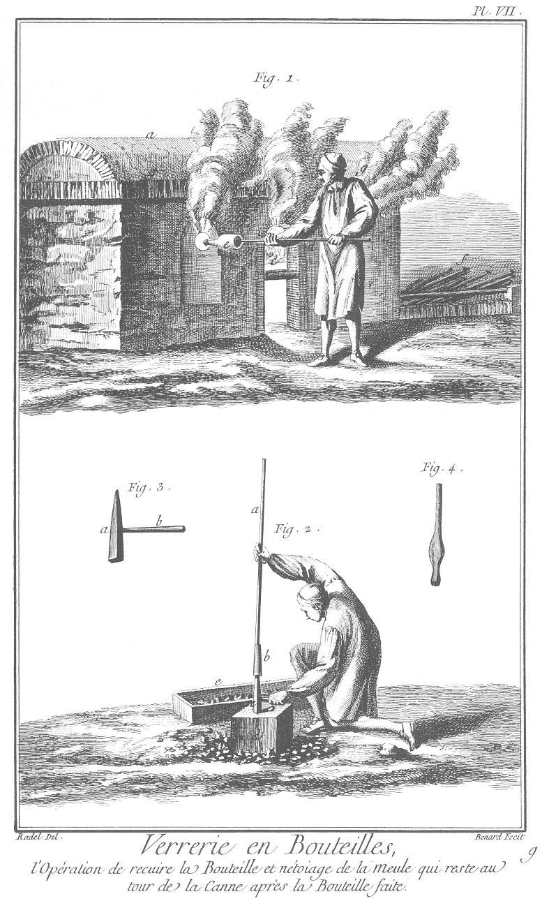

VERRERIE EN BOUTEILLES CHAUFFÉE EN CHARBON DE TERRE
===================================================

Contenant treize Planches à cause de trois doubles; TROISIEME SECTION. VERRERIE FRANÇOISE. EXPLICATION des Plans, Coupes & Elévations de la Verrerie de Seve près de Paris, construite pour être chauffée avec du charbon de terre, & les explications des opérations pour faire les bouteilles. 

PLANCHE Iere.
-------------

Figure
1. Intérieur d'une des quatre halles avec un four à bouteilles au centre de la Verrerie royale de Seve.
	- a, four construit entre les arcades qui supportent le comble.
	- b, glaie ou entrée du four pour y jetter le charbon.
	- c, c, arche à pot ou petit four pour les cuire.
	- d, calcaise pour les frittes ou pour cuire la matiere.
	- e, e, ouvraux par où on cueille la matiere dans les pots avec la canne.
	- f, ouvriers occupés à faire les bouteilles.
	- g, maître tiseur portant du charbon au four.
	- h, ouvrier portant une bouteille faite au four à recuire.
	- i, four à recuire.
	- l, caisse où l'on met les cannes refroidir.
	- m, m, arcades construites pour porter le comble. n comble.

2.
	- a, Jeune ouvrier occupé à cueillir le verre avec la canne par l'ouvroir dans le pot: il faut quatre cueillages avant de souffler la bosse.
	- b, canne dont le bout est dans l'ouvroir pour cueillir de verre.
	- c, ouvroir par où l'on prend le verre dans le pot.
	- d, petit mur pour garantir l'ouvrier de la chaleur des ouvroirs.
	- e, e, banquettes.
	- f, béquet, endroit où l'on attache le pontis au fond de la bouteille pour faire le col.
	- g, g, petits arcs par où l'on retourne les pots dans le four.

PLANCHE II.
-----------

Fig.
1. Ouvrier occupé à refroidir la canne en prenant de l'eau dans un baquet & la jettant dessus.
	- a, canne.
	- b, baquet.
	- c, barre de fer en travers servant à soutenir la canne.
	- d, marbre ou plaque de fonte, sur lequel on unit en tournant la canne la paroison ou le verre fondu qui est au bout.
	- e, pierre soutenant le marbre.

2. Maître occupé à rouler la paroison sur le marbre pour lui donner sa premiere forme.
	- a, canne.
	- b, paroison au bout de la canne.
	- c, marbre sur lequel roule la paroison.
	- d, construction ou pierre soutenant le marbre.
	- e, moule à souffler les bouteilles enfoncées dans la terre.

PLANCHE III.
------------

Fig.
1. Maître formant le col à la paroison en la roulant sur le coin du marbre.
	- a, canne.
	- b, paroison roulant sur le coin du marbre.
	- c, marbre.
	- d, barre de fer de support.
	- e, pierre pour soutenir le marbre.
	- f, baquet plein d'eau pour rafraîchir les cannes.

2. Maître occupé à souffler la paroison pour la faire gonfler en la roulant sur le marbre pour lui faire prendre la forme d'un oeuf.
	- a, canne.
	- b, paroison.
	- c, barre de fer pour supporter les cannes en travers.
	- d, marbre.
	- e, support du marbre.
	- f, moule à bouteilles enterré. 

PLANCHE IV.
-----------

Fig.
1. Maître occupé à souffler la paroison sur un marbre par terre pour commencer à former le cul avant de la mettre dans le moule.
	- a, canne.
	- b, paroison.
	- c, marbre.
	- d, support du marbre.
	- e, barre de support pour tourner la canne.
	- f, baquet pour rafraîchir les cannes.
	- g, moule enterré.

2. Maître occupé à souffler la bouteille dans le moule.
	- a, canne.
	- b, bouteille dans le moule.
	- c, moule.
	- d, marbre.
	- e, support du marbre. f barre de support pour tourner la canne.

PLANCHE V.
----------

Fig.
1. Maître occupé à enfoncer le cul de la bouteille avec la mollette.
	- a, canne.
	- b, mollette ou fer pointu pour enfoncer le cul des bouteilles.
	- c, cul de la bouteille.
	- d, marbre ou paupoir.
	- e, moule enfoncé dans terre.

2. Maître occupé à rouler sur le marbre le ventre de la bouteille pour lui donner la forme après lui avoir enfoncé le cul.
	- a, canne.
	- b, bouteille.
	- c, marbre.
	- d, support du marbre.

3. Maître occupé à mettre le pontis ou meule au fond de la bouteille pour lui former le col.
	- a, canne.
	- b, bouteille.
	- c, support du béquet.
	- d, petit mur pour garantir l'ouvrier de la chaleur du four.
	- e, barre de fer garnie de crochets pour soutenir les cannes au chauffage dans le four.
	- f, ouvroir.
	- g, petit arc pour tourner les pots dans le four.
	- h, porte pour fermer l'ouvroir après le travail.

PLANCHE VI.
-----------

Fig.
1. Maître occupé à former le col de la bouteille, ayant pris avec la cordeline un filet de verre pour le tourner autour du col.
	- a, broche.
	- b, bouteille.
	- c, cordeline ou petite tringle de fer pour prendre un filet de verre & en finir le col.
	- d, crochet de fer pour soutenir les cannes.
	- e, ouvroir.
	- f, petits arcs sous chacun des ouvroirs pour retourner les pots.
	- g, petit mur pour garantir les ouvriers de la chaleur.

2. Maître occupé à donner la forme à la cordeline ou col de la bouteille.
	- a, canne roulant sur les bras de la banquette.
	- b, bouteille.
	- c, pince pour former le col.
	- d, banquette.

3. Pince développée dont se sert le maître pour former le col de la bouteille.
	- a, manche de la pince.
	- b, partie de la pince où il y a une rainure.
	- c, partie de la pince qui s'enclave dans la rainure.

PLANCHE VII.
------------

Fig.
1. Jeune ouvrier mettant la bouteille faite dans le four à recuire.
	- a, four à recuire.
	- b, ouvroir pour passer la bouteille.
	- c, grille pour chauffer le four.
	- d, canne.
	- e, bouteille.
	- f, cannes au refroidissage.
	- g, petits jours au four pour passer la fumée.

Fig.
2. Ouvrier appellé gamin occupé à faire éclater la meule ou reste de verre qui est à la canne après la bouteille faite.
	- a, canne.
	- b, meule ou reste de verre attaché à la canne.
	- c, marteau de fer pointu que l'on met dans la meule en donnant un coup sec sur un pavé pour la faire éclater.
	- d, pavé ou pierre. e caisse pour mettre le groisil ou verre cassé.

3. Marteau pour faire éclater la meule.
	- a, marteau de fer.
	- b, manche.

4. Molette de fer pour enfoncer le cul de la bouteille.

PLANCHE VIII.
-------------

Plan d'une des quatre halles jointes de la Verrerie royale de Seve près Paris.
	- a, plan du four.
	- b, pot ovale dont le grand diametre porte en saillie sur la banquette.
	- c, grille de fer sur laquelle l'on met le charbon pour le chauffage du four. d glaie ou entrée de la tonnelle sur laquelle est construite l'arche à cendre pour recuire les frittes.
	- e, ouvroir.
	- f, banquette où les ouvriers travaillent.
	- g, tonnelle par où le tiseur chauffe le four.
	- h, passage par où la chaleur se communique dans les arches à pot. i arche à pot où l'on les fait cuire pour les mettre dans le four. l halle au centre de laquelle est construit le four.
	- m, partie de la halle où les ouvriers travaillent.
	- n, arcades de communication.
	- o, quatre fours de recuite.
	- p, grille des fours de recuite.
	- q, partie des fours de recuite où l'on met les bouteilles.
	- r, endroit où l'on met les cannes refroidir.
	- s, croisée pour éclairer les ouvriers.
	- t, porte pour communiquer des halles l'une dans l'autre.
	- v, porte de sortie.

PLANCHE IX.
-----------

Coupe sur la longueur d'une des quatre halles & de son four, de la Verrerie royale de Seve près Paris.
	- a, coupe sur la longueur du four.
	- b, banquette intérieure  sur laquelle sont posés les pots.
	- c, grille sur laquelle est posé le charbon de terre.
	- d, pot posé sur la banquette.
	- e, ouvroir par où les ouvriers prennent le verre.
	- f, calcaise à fritte pour recuire les matieres.
	- g, entrée de la calcaise.
	- h, sortie de la fumée de la calcaise.
	- i, entrée de la chaleur dans la calcaise.
	- l, petit mur au fond de la glaie que l'on démolit pour passer les pots dans le four; ce petit mur est appellé l'arche au tisonnier.
	- n, glaie.
	- m, pilier construit dans la cave pour soutenir la banquette & le poids des pots.
	- o, cave ou passage de l'air pour donner plus d'action au feu & faire tomber les cendres.
	- p, grand mur percé d'arcades servant de ferme au comble.
	- q, mur de séparation des halles.
	- r, ouverture à la faîtiere du comble pour passer la fumée.
	- s, comble en charpente.
	- t, communication des halles.
	- u, arcade.
	- v, croisées.
	- x, porte de sortie.
	- y, four pour recuire les bouteilles.

PLANCHE X.
----------

Fig.
1. Coupe sur la largeur d'une des quatre halles de la Verrerie royale de Seve.
	- a, coupe sur la largeur du four.
	- b, glaie.
	- c, grille sur laquelle on met le charbon pour chauffer le four.
	- d, coupe sur la longueur des pots.
	- e, passage de la chaleur dans la calcaise à fritte.
	- f, passage de la chaleur dans les arches à pots.
	- g, ouvroir.
	- h, petit mur pour garantir les ouvriers de la chaleur du four.
	- i, extérieur des arches à pots.
	- l, petits arcs par où l'on retourne les pots dans le four.
	- m, passage de la cave.
	- n, pilier portant la banquette & le poids des pots.
	- o, talut sur lequel travaillent les ouvriers.
	- p, four de recuite pour les bouteilles.
	- q, passage de la fumée dans la faîtiere du comble.

2. Plan de la cave.
	- a, pilier portant la banquette & le poids des pots.
	- b, passage de la grille.
	- c, passage de la cave.

3. Coupe du four à recuire les bouteilles.
	- a, grille.
	- b, endroit où l'on place les bouteilles pour les recuire.
	- c, partie où l'on met les cannes refroidir. 

[->](../04-Verrerie_Angloise/Légende.md)
