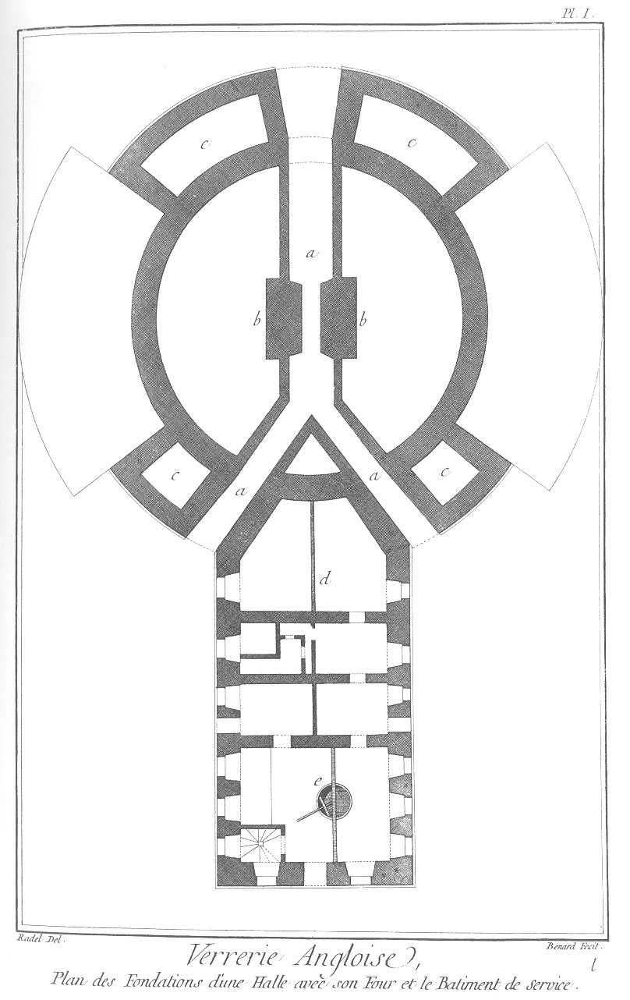
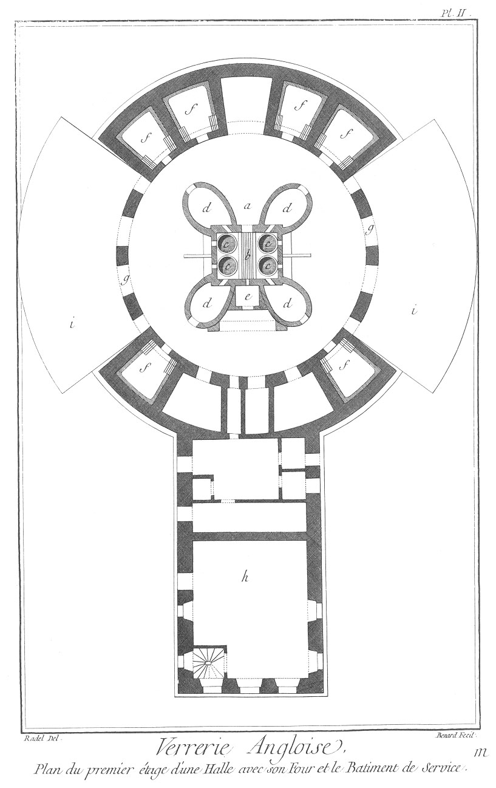
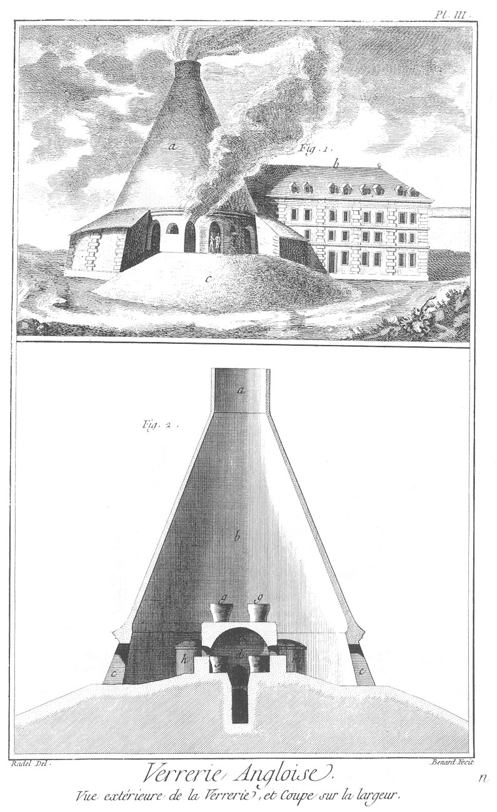

VERRERIE ANGLOISE
=================

Contenant trois Planches.

PLANCHE Iere.
-------------

Plan des fondations d'une halle avec son four & le bâtiment de service d'une Verrerie Angloise.
	- a, cave pour le passage de l'air & pour recevoir la cendre.
	- b, pilier qui supporte les banquettes & les pots.
	- c, fondation de la halle & du four à recuire.
	- d, bâtiment pour le service, & distribué pour son utilité.
	- e, endroit où l'on pile la matiere.

PLANCHE II.
-----------

Plan d'une halle à premier étage avec son four & son bâtiment de service d'une Verrerie Angloise.
	- a, Plan du four.
	- b, grille sur laquelle on met le charbon pour échauffer le four.
	- c, pot dans le four.
	- d, arche à pot pour les recuire avant de les remettre dans le four.
	- e, calcaise pour cuire les matieres avant de les mettre dans les pots.
	- f, petit four pour recuire les verreries après  qu'elles sont faites.
	- g, porte d'entrée de la halle.
	- h, bâtiment distribué pour le service de la Verrerie Angloise.
	- i, talut extérieur de la halle pour entrer dans la Verrerie.

PLANCHE III.
------------

Fig.
1. Vue extérieure d'une Verrerie Angloise.
	- a, forme extérieure & conique du comble d'une halle de Verrerie Angloise.
	- b, bâtiment de service pour la Verrerie.
	- c, talut ou glacis extérieur pour entrer dans la halle.
	- d, extérieur des fours à recuire les bouteilles.

2. Coupe d'une Verrerie Angloise sur la largeur.
	- a, cheminée par où s'en va la fumée.
	- b, forme intérieure & conique d'une halle.
	- c, entrée de la halle.
	- d, intérieur du four.
	- e, cave. f pot dans le four.
	- g, pot qui seche sur le four.
	- h, extérieur des arches à pots. 

[->](../05-Verrerie_en_Glaces/Légende.md)
