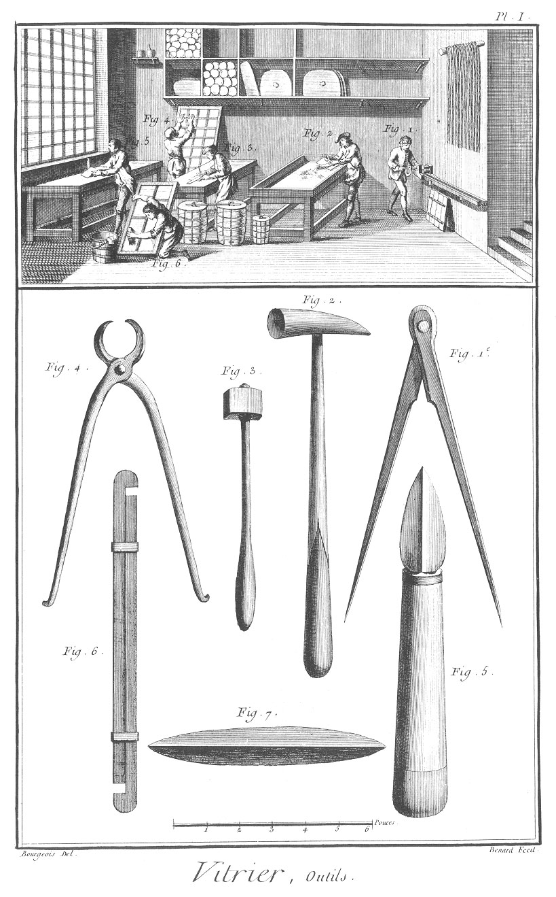
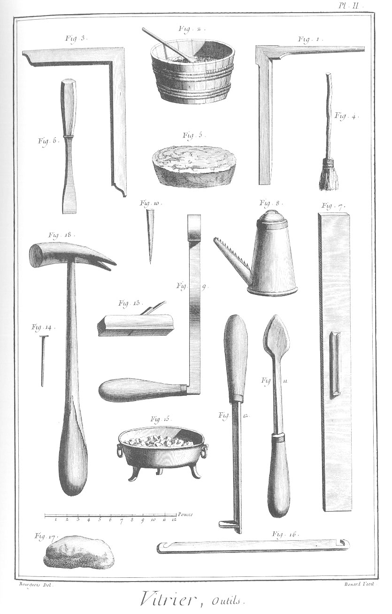
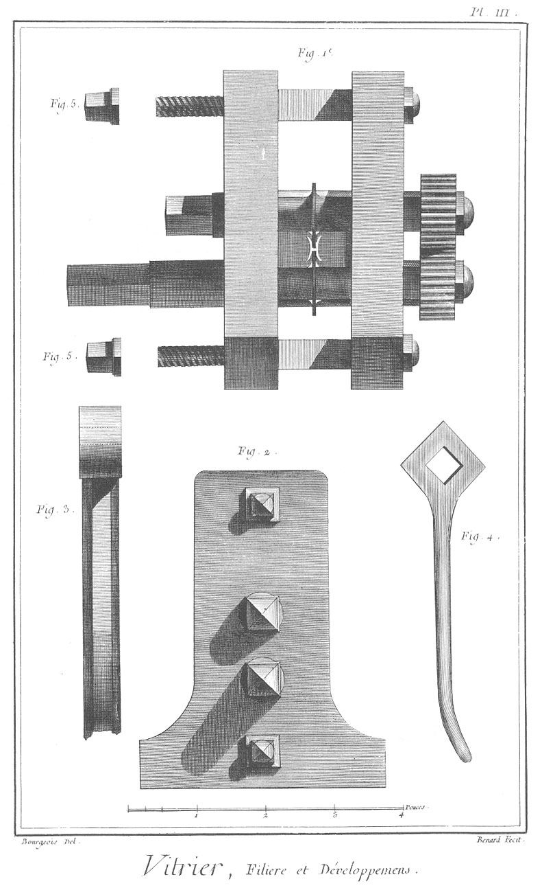
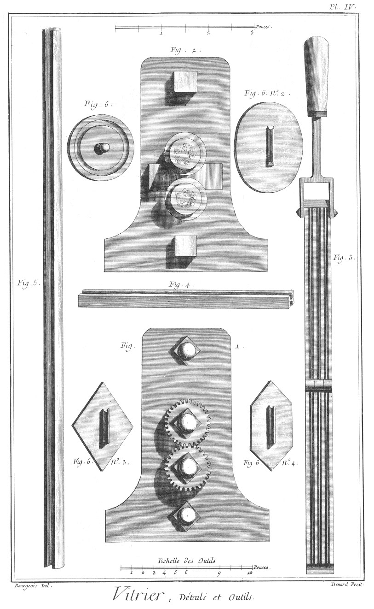

VITRIER
=======

Contenant quatre Planches. 

PLANCHE Iere.
-------------

Vignette.

Fig.
1. Ouvrier qui passe du plomb à la filiere.

2. Ouvrier qui nettoie les vitres avec du sable.

3. Ouvrier qui coupe le verre avec le diamant.

4. Ouvrier qui colle des bandes de papier sur les carreaux.

5. Ouvrier qui égrise du verre.

6. Ouvrier qui nettoie un chassis.

7. Plomb passé à la filiere.

Bas de la Planche.

Fig.
1. Compas de fer pour prendre les différentes mesures des carreaux.

2. Marteau de fer dont l'extrémité du manche est de bois.

3. Outil appellé diamant ; il sert à couper le verre.

4. Tenaille.

5. Couteau à unir le plomb lorsqu'on monte des vitres.

6. Grugeoir ; cet outil sert à égriser le verre & à le rendre droit.

7. Tringlette dont on se sert pour unir le plomb.

PLANCHE II.
-----------

Fig.
1. Pousse-fiche de fer, qui sert à faire ressortir les fiches des chassis.

2. Baquet pour mettre la colle.

3. Equerre pour couper le verre quarrément.

4. Grosse brosse pour coller les vitres.

5. Tasseau de plomb pour redresser les pointes.

6. Gouge ou fermoir. 

Fig.
7. Regle pour tracer les différentes especes de carreaux.

8. Bourasseau pour mettre le borax.

9. Main en petit de la filiere de la Planche III, figure 1.

10. Pointe pour arrêter les carreaux.

11. Fer à souder.

12. Autre fer à souder.

13. Rabot.

14. Pointes pour les plus petites fiches.

15. Poële pour mettre le feu pour chauffer le fer à souder.

16. Grugeoir différent de celui de la Planche I.

17. Morceau de mastic.

PLANCHE III.
------------

Fig.
1. Filiere vue de face ; on s'en sert pour filer le plomb dont se servent les Vitriers.

2. Filiere vue de côté.

3. Bout de la main de la filiere.

4. Clé qui sert à fermer la filiere.

5. &
6. Sont les têtes des figures 1 & 2 de la figure seconde ; elles ferment les extrémités des vis A & B de la figure premiere.

PLANCHE IV.
-----------

Fig.
1. Filiere vue du côté des roues.

2. Coupe de la filiere de la figure premiere.

3. Lingotiere ; elle sert à couler le plomb.

4. Lingot de plomb.

5. Gouttiere par où passe le plomb lorsqu'il passe à la filiere.

6. N°. 2, n°. 3 & n°. 4. Quatre différens modeles de vitres qui servent à couper les verres.
