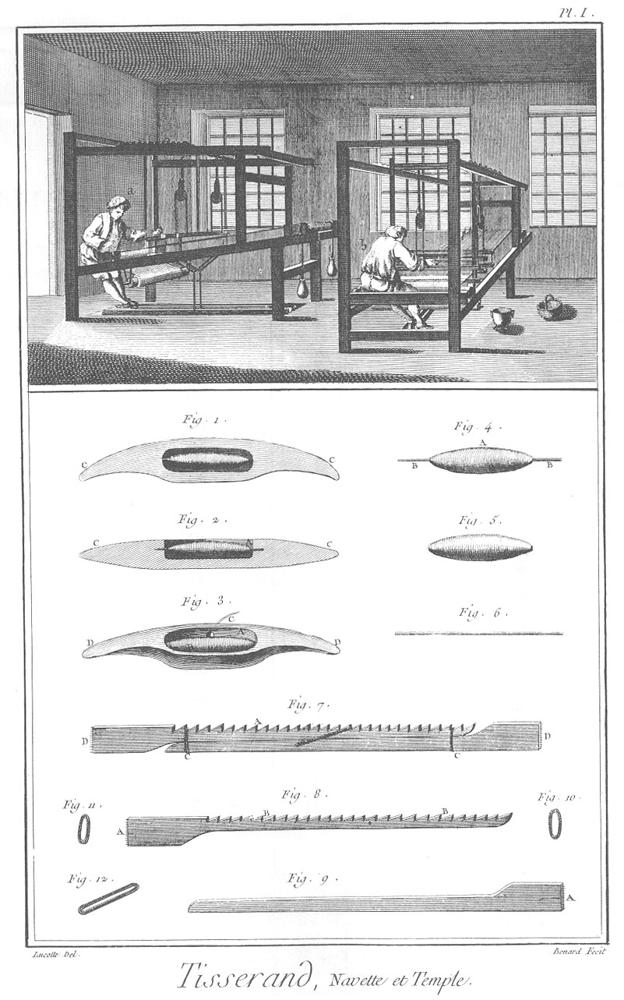
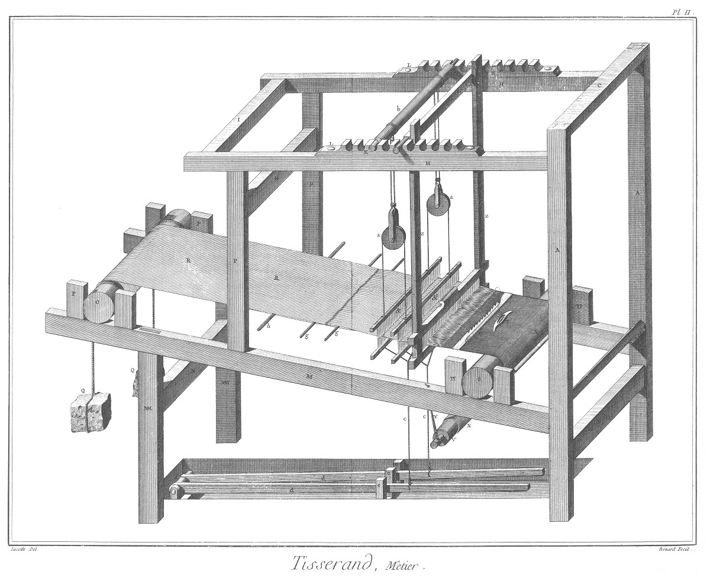
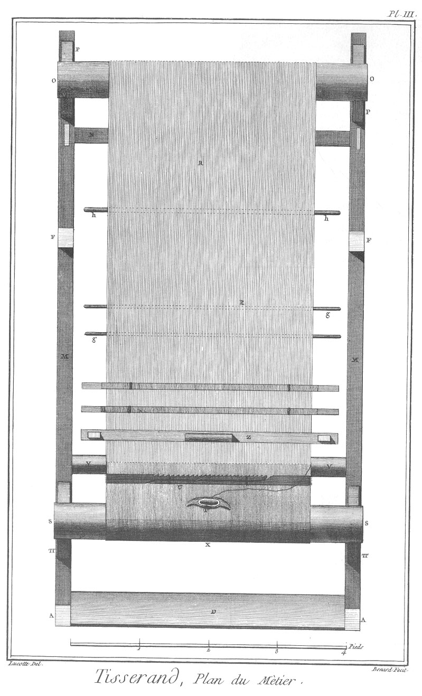
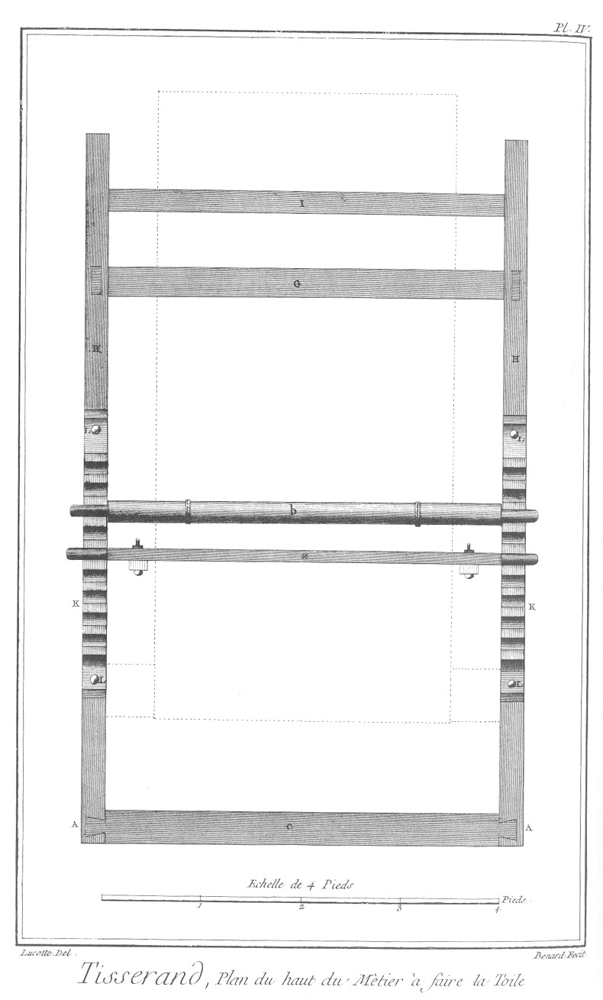
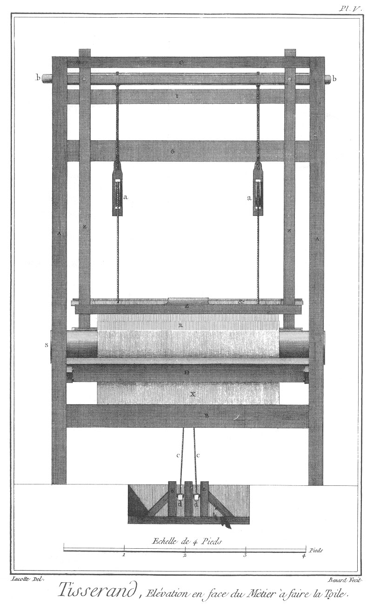
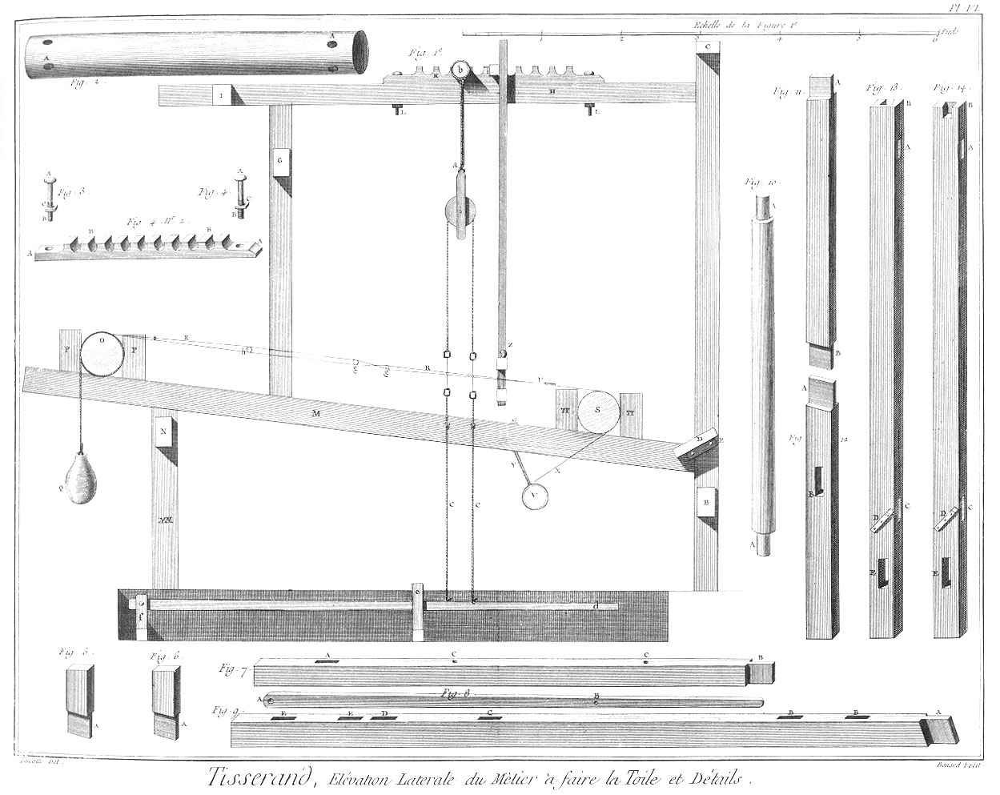
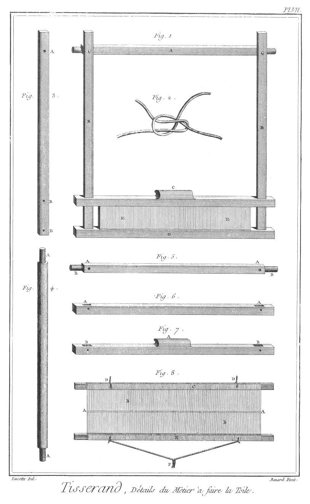
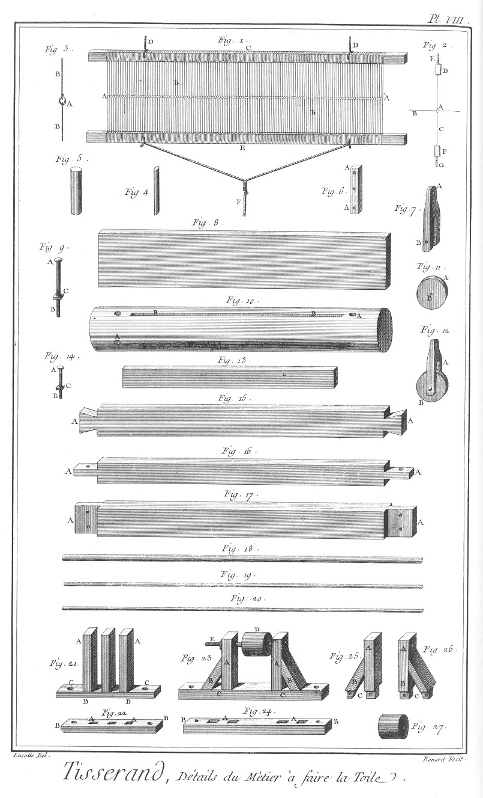

TISSERAND
=========

Contenant dix Planches à cause de deux doubles. 

PLANCHE Iere.
-------------

Le haut de cette Planche représente un attelier de Tisserand où sont plusieurs métiers à toile, manoeuvrés par plusieurs ouvriers en a & en b.

Fig.
1. &
2. Plan & coupe de la navette.
	- A, le creux.
	- B, la bobine garnie.
	- C C, les pointes.

3. Elévation perspective de la navette.
	- A, le creux.
	- B, la bobine.
	- C, le fil.
	- D D, les pointes.

4. Bobine garnie.
	- A, la bobine.
	- B B, l'aiguille.

5. Bobine garnie.

6. Aiguille de la bobine.

7. Temple.
	- A, la branche à crémaillere.
	- B, la branche simple.
	- C C, les liens.
	- D D, les pointes pour ficher & maintenir la toile.

8. La branche à crémaillere.
	- A A, les pointes.
	- B B, les dents.

9. Branche simple.
	- A, les pointes.

10. &
11. &
12. Les liens.

PLANCHE II.
-----------

Elévation perspective.

PLANCHE III.
------------

Premier plan.

PLANCHE IV.
-----------

Plan du dessus.

PLANCHE V.
----------

Elévation du devant du métier à faire de la toile.

PLANCHE VI.
-----------

Elévation latérale & détail du métier à f aire la toile.

Fig.
1. Elévation du métier vu de côté. Détail du métier.

2. Ensouple du derriere.
	- A A, les trous des leviers.

3. &
4. Deux des quatre boulons des supports à crémaillere.
	- A A, les têtes.
	- B B, les vis.
	- C C, les écroux.

	- n°. 2. L'un des deux supports à crémaillere.
		- A A, les pattes.
		- B B, les dents. 

5. &

6. Deux des quatre arrêts de l'ensouple de derriere.
	- A A, les tenons, &c.

7. L'un des deux sommiers du haut.
	- A, la mortaise de l'un des piliers du derriere.
	- B, le tenon de l'un des piliers du devant.
	- C C, les trous des boutons des supports à crémaillere.

8. L'une des deux marches du métier.
	- A, le point d'appui.
	- B, le trou pour les tirans des lisses.

9. L'un des deux sommiers du bas.
	- A, le tenon de l'un des deux piliers de devant.
	- B B, les mortaises des arrêts de l'ensouple de devant.
	- C, la mortaise de l'un des piliers de derriere.
	- D, la mortaise d'un support.
	- E E, deux des quatre mortaises des arrêts de l'ensouple de derriere.

10. Rouleau pour enrouler la toile.
	- A A, les tourillons.

11. L'un des deux piliers de derriere.
	- A, le tenon du haut.
	- B, le tenon du bas.

12. L'un des deux supports de derriere.
	- A, le tenon.
	- B, la mortaise de l'entretoise.

13. &
14. Piliers du devant du métier à toile.
	- A A, les mortaises des sommiers du haut.
	- B B, les mortaises à queue.
	- C C, les mortaises des sommiers du bas.
	- D D, les tasseaux de la sellette.
	- E E, les mortaises de l'entretoise du bas.

Détail des pieces des Planches II, III, IV, V & VI.

- A A, piliers de devant.
- B, entretoise des piliers de devant.
- C, entretoise à queues des piliers de devant.
- D, siége.
- E, tasseaux du siége.
- F F, piliers de derriere.
- G, entretoise des piliers de derriere.
- H H, sommiers du haut.
- I, entretoise des sommiers du haut.
- K K, supports à crémaillere.
- L L, boulons des supports.
- M M, sommiers du bas.
- M M M M, supports des sommiers du bas.
- N, entretoise des supports de sommiers du bas.
- O, ensouple de derriere.
- P P, arrêts de l'ensouple de derriere.
- Q Q, contrepoids.
- R R, trames.
- S, ensouple de devant.
- T T, arrêts de l'ensouple de devant.
- T, navette.
- U, temple.
- V, rouleau.
- X, toile faite.
- Y, lien du rouleau.
- Z Z, battant. & &, lisses.
- a a, poulies des lisses.
- b, support des poulies des lisses.
- c c, tirans des lisses.
- d d, marches.
- e e, conduits des marches.
- f, point d'appui des marches.
- g g, barres pour séparer les travers.
- h, bâton à écarter les trames.

PLANCHE VII.
------------

Détails du métier à faire la toile.

Fig.
1. Battant du métier.
	- A, la traverse à pivot.
	- B B, les montans.
	- C, la traverse à main.
	- D, la traverse du bas.
	- E E, le peigne.

2. Noeud du tisserand.

3. L'un des deux montans du battant.
	- A, le trou du boulon.
	- B B, les trous des chevilles pour arrêter les chevilles.

4. Rouleau servant de support aux poulies des lisses.
	- A A, les tourillons.

5. Traverse à pivot du battant.
	- A A, les trous des boulons.
	- B B, les tourillons.

6. Traverse du bas.
	- A A, les mortaises des montans.

7. Traverse à main.
	- A A, la main.
	- B B, les mortaises des montans.

8. Premiere lisse.
	- A A, les anneaux pour le passage des trames.
	- B B, les fils.
	- C, la barre du haut.
	- D D, les tirans du haut.
	- E, la barre du bas.
	- F, le tirant du bas.

PLANCHE VIII.
-------------

Suite des détails du métier à faire la toile.

Fig.
1. Deuxieme lisse.
	- A A, les anneaux pour le passage des trames.
	- B B, les fils.
	- C, la barre du haut.
	- D D, les tirans du haut.
	- E, la barre du bas.
	- F, le tirant du bas.

2. Coupe de la lisse.
	- A, l'anneau.
	- B, la trame.
	- C, le fil.
	- D, la barre du haut.
	- E, le tirant du haut.
	- F, la barre du bas.
	- G, le tirant du bas.

3. Vue de face d'un des anneaux par où passe la trame.
	- A, l'anneau.
	- B B, les fils.

4. Vue perspective de l'une des dents du peigne du battant. 

5. La même dent vue de face.

6. L'un des deux tasseaux de la sellette.
	- A A, les trous pour les vis.

7. L'une des deux échappes des poulies des lisses.
	- A, l'anneau pour la suspendre.
	- B, le trou du boulon.

8. Siége de l'ouvrier.

9. L'un des boulons du battant.
	- A, la tête.
	- B, la vis.
	- C, l'écrou.

10. Ensouple de devant.
	- A A, les trous pour la tourner.
	- B B, l'entaille pour passer & arreter le bout de la toile.

11. L'une des deux poulies des lisses garnies de leurs chappes.
	- A, la chappe.
	- B, la poulie.

12. Poulie.
	- A, la noix.
	- B, le trou du boulon.

13. Coin pour serrer le bout de la toile dans l'entaille de l ensouple.

14. Boulon de la poulie, fig. 12.
	- A, la tête.
	- B, la vis.
	- C, l'écrou.

15. Traverse à queues des piliers de devant.
	- A A, les queues d'arondes.

16. Traverse des sommiers du haut.
	- A A, les tenons.

17. L'une des trois traverses des piliers de derriere & de devant.
	- A A, les tenons.

18. Bâton à écarter les trames.

19. &
20. Barres pour séparer les trames.

21. Conduits des marches.
	- A A, les conduits.
	- B B, le sommier.
	- C C, les pattes.

22. Sommier des conduits.
	- A A, les mortaises des conduits.
	- B B, les pattes.

23. Support des marches.
	- A A, les montans.
	- B B, les liens.
	- C C, le sommier.
	- D, le rouleau.
	- E, le boulon à vis à écrou.

24. Sommier du support des marches.
	- A A, les mortaises des montans & liens.
	- B B, les pattes.

25. &
26. Montans & liens.
	- A A, les montans.
	- B B, les liens.
	- C C, les tenons.

27. Rouleau de séparation des marches.

[->](../07-Passementier/Légende.md)
