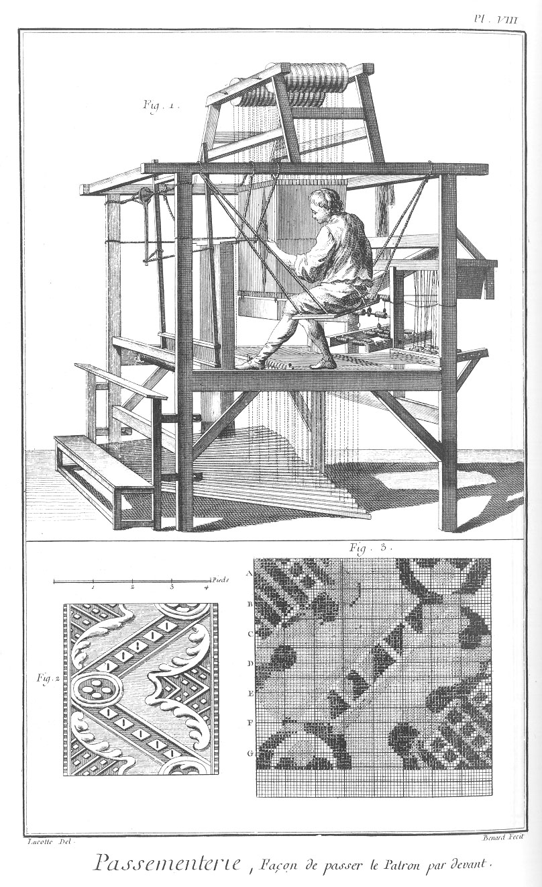
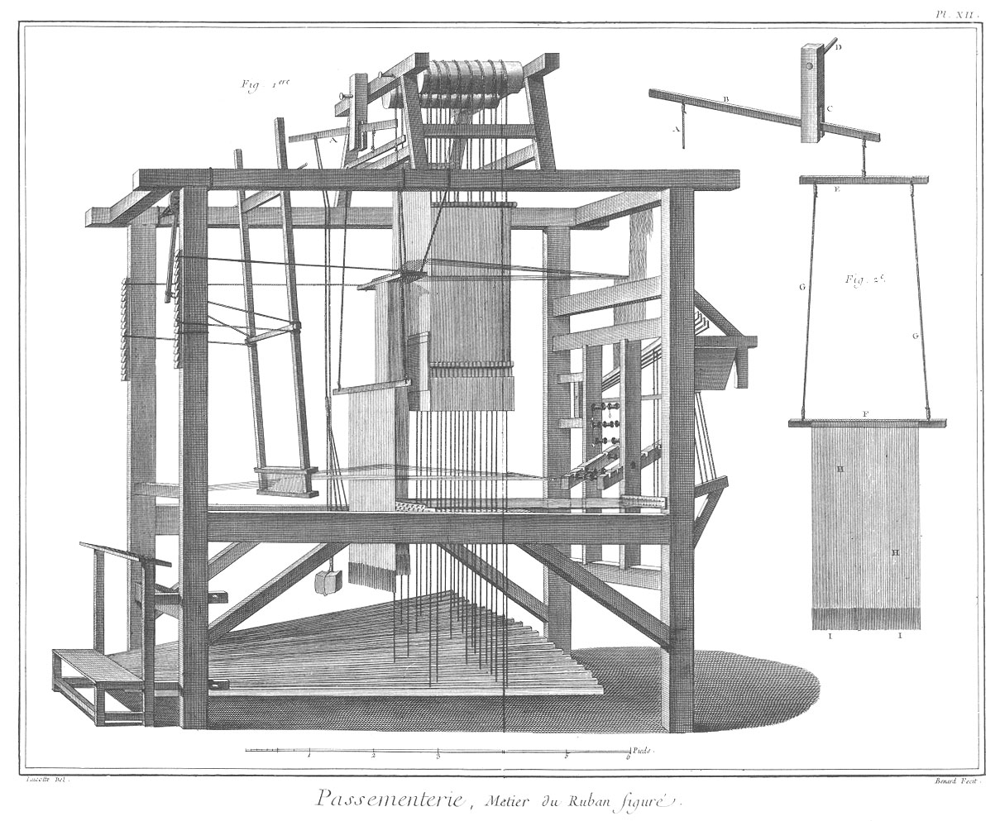
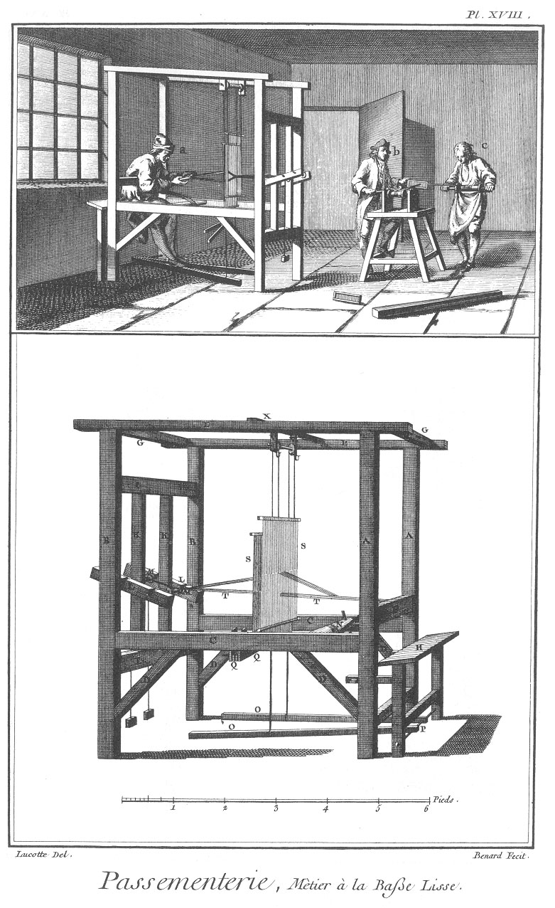
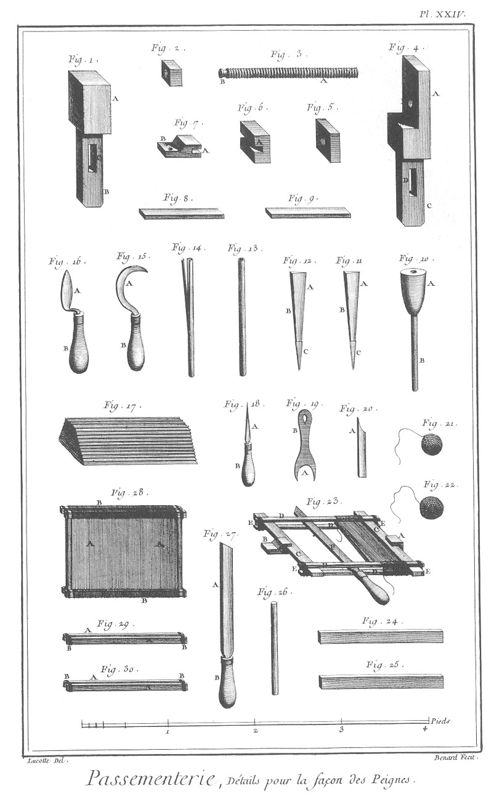
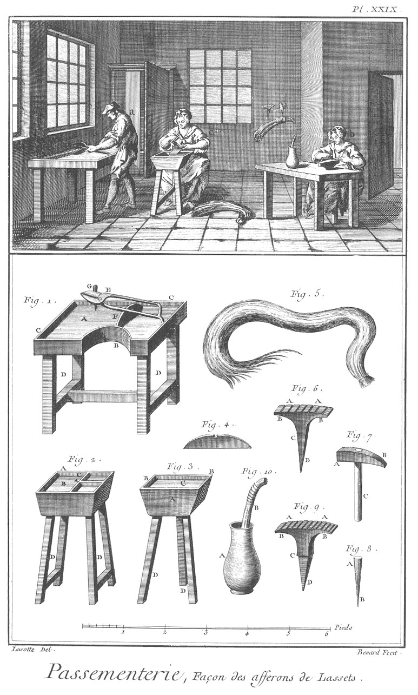

PASSEMENTIER
============

Contenant trente-deux Planches, à cause de trois doubles. 

PLANCHE Iere.
-------------

Le haut de cette Planche représente l'attelier où plusieurs ouvriers sont occupés, l'un en a à ourdir une chaîne faisant tourner de la main gauche l'ourdissoir b par le moyen de la manivelle c attenante à la poulie d qui conduit par une corde à l'ourdissoir, & de la droite à encroiser les fils venant de la banque e, un autre ouvrier en f à devider la chaîne sur le rouet g, un autre ouvrier en h à ourdir sur l'ourdissoir long. Ourdissoir.

Fig.
1. Ourdissoir.
	- 2, l'arbre.
	- 3, les traverses.
	- 4, les aîles.
	- 5, les fils de la chaîne.
	- 6, la broche de lanterne.
	- 7, le blin.
	- A A, les montans.
	- B B, &c. les broches pour arrêter la chaîne.
	- C, la poulie. D D D, les montans du chassis.
	- E E, les traverses du bas du chassis.
	- F F, les traverses du haut.
	- G, la corde du blin.

2. &
3. Montant à coulisse de l'ourdissoir.
	- A, la mortaise de la poulie.
	- B B, les rainures.

4. Le blin.
	- A, l'échancrure.
	- B, la platine.
	- C, la mouffle.
	- D D, les bobines.
	- E E, les rouleaux.
	- F F, &c. les chappes.

5. La poulie du montant à coulisse de l'ourdissoir.

6. &
7. Les bobines.
	- A A, les broches.

8. La platine.
	- A A, les trous des vis.

9. &
10. Vis de la platine.
	- A A, les têtes.
	- B B, les vis.

11. Un des rouleaux.
	- A, le rouleau.
	- B B, les tourillons.

12. &
13. Chappes à pattes.
	- A A, les trous des tourillons.
	- B B, les pattes.

14. Mouffle.
	- A, la mouffle.
	- B, la queue d'aronde.

15. Poulie de la mouffle.

16. Vis des chappes à pattes.
	- A, la tête.
	- B, la vis.

PLANCHE II.
-----------

Ourdissoir, banque & rouet.

Fig.
1. Arbre de l'ourdissoir.
	- A, la broche.
	- B, le pivot.
	- C C C, les mortaises des aîles.
	- D, le quarré de la poulie.

2. Poulie de l'ourdissoir.
	- A, la noix.

3. Banque.
	- A A, la selle.
	- B B, les pieds.
	- C C C, les montans de la premiere selle.
	- D D, la premiere traverse servant de deuxieme selle.
	- E E, les montans de la deuxieme selle.
	- F, la deuxieme traverse.
	- G G, &c. les broches.
	- H H, &c. les rochets.

4. L'une des broches.

5. Un rochet garni.

6. Un rochet non garni.

7. Selle à ourdir.
	- A, la table.
	- B B, les piés.
	- C, la traverse.
	- D, la manivelle.
	- E, l'arbre.
	- F, la poulie.
	- G, les coussinets.
	- H, la platine des coussinets.

8. Coussinets.
	- A, la partie échancrée.
	- B B, les languettes.

9. Platine des coussinets.

10. &
11. Vis pour serrer les coussinets.
	- A A, les têtes.
	- B B, les vis.
	- C C, les écroux.

12. Manivelle.
	- A, le quarré.
	- B, la tige.
	- C, le manche.

13. L'arbre joint à la poulie.
	- A, l'arbre.
	- B, le quarré.
	- C, la poulie.
	- D, la noix.

14. Rouet monté.
	- A A, la selle.
	- B B, les piés.
	- C C, &c. les montans.
	- D D, les traverses.
	- E E, les broches.
	- F F, les bobines.
	- G, la roue.
	- H, l'arbre.
	- I, la manivelle.

15. Roue du rouet.
	- A A, la roue.
	- B B, les rayons.
	- C, le moyeu.

16. Arbre de la roue.
	- A A, les embâses.
	- B, le quarré.
	- C, la manivelle.
	- D, le manche.

17. Broche. 

18. Bobine ou rochet garni.
	- A, la poulie.

19. Bobine ou rochet non garni.

PLANCHE III.
------------

Retors.

Le haut de cette Planche représente un attelier où plusieurs ouvriers font le retors, les uns en a & en b avec un grand rouet, & un autre en c avec le rouet à la main.

Fig.
1. &
2. Montans de l'ourdissoir long.
	- A A, &c. les rochets.

3. &
4. Traverses de l'ourdissoir long.
	- A A, &c. les trous des broches.

5. Rouet à retordre.
	- A, la selle.
	- B B B, les piés.
	- C C, les montans.
	- D D, les contrefiches.
	- E, la grande roue.
	- F, l'arbre.
	- G, la manivelle.
	- H, la petite roue.
	- I, l'arbre de la petite roue.
	- K K, les croissans.
	- L L, les potences.
	- M M, les potenceaux.
	- N N, les piés de biche.
	- O O, les entretoises des piés de biche.
	- P, le support du rouet.

6. &
7. Les croissans du rouet.
	- A A, &c. les tailles pour recevoir les mollettes.
	- B B, l'entaille de leur support.
	- C C, &c. les trous pour les arrêter ensemble.

8. Entretoise des croissans.
	- A, l'entaille du support des croissans.
	- B B, &c. les trous pour l'arrêter.

9. Petit bouton pour arrêter ensemble les croissans.
	- A, la tête.
	- B, la vis.
	- C, l'écrou.

10. Mollette.
	- A, la poulie.
	- B, l'arbre.

11. Arbre de la mollette.
	- A, le crochet.

12. Poulie de la mollette.

13. Artere de la grande roue.
	- A, le quarré.
	- B B, &c. les embâses.

14. Arbre de la petite roue.
	- A A, les embâses.

15. Manivelle.
	- A, le quarré.
	- B, la tige.
	- C, le manche.

16. Goulette.
	- A, le chassis.
	- B, les broches.
	- C C, les bobines.

17. Bobine garnie.

18. Bobine dégarnie.

PLANCHE IV.
-----------

Retors.

Fig.
1. Machine à retors.
	- A A, les fils retors.
	- B B, les fils non-retors.
	- C, le support des non-retors.
	- D D, les montans.
	- E, sa traverse.
	- F, sa manivelle.
	- G, le pié.
	- H H, le support des rochets.
	- I I, les rochets.
	- K, le support de retors.
	- L, sa traverse.
	- M, sa manivelle.
	- N, les contrefiches.
	- O, le sommier.
	- P P, les roues.
	- Q Q, le bâton à retordre.

2. Rochet garni.

3. Escabeau ou siége du retordeur.

4. Manivelle.
	- A, la manivelle.
	- B, l'embâse.
	- C, la tige.
	- D, le crochet.

5. Support de non-retors.
	- A A, le pié.
	- B B, les montans.
	- C, la traverse percée de trous.
	- D D, le chassis des rochets.

6. Bâton à retordre.
	- A A, les entailles.

7. Poids à charger le pié du support de retors.

8. Rochet dégarni.
	- A, la bobine.
	- B, la noix.
	- C C, la broche.

9. Traverse du support de non-retors.
	- A A, les tenons.
	- B B, les trous de petites manivelles.

10. Manivelle du support de retors.
	- A A, la manivelle.
	- B, la broche.
	- C C, &c. les petites manivelles.

11. Traverse du support de retors.
	- A A, les trous des petites manivelles.

12. Manivelle du support de retors.
	- A A, la manivelle.
	- B, la broche.
	- C C, &c. les petites manivelles.

13. Crochet.
	- A, le crochet.
	- B, le manche.

14. Fourche.
	- A, la fourche.
	- B, le manche.

15. Petite manivelle.
	- A, la manivelle.
	- B, l'embâse.
	- C, la tige.
	- D, le crochet.

16. Roue du support de retors.

17. Rouet à main.
	- A, le chassis.
	- B B, les roues.
	- C, la manivelle.
	- D, le manche.

18. Partie du chassis du rouet à main.
	- A A, &c. les tenons.

19. Autre partie du chassis du rouet à main.
	- A A, &c. les trous des tenons.
	- B, la pointe.

20. Petite roue du rouet à main.

21. Grande roue du rouet à main.

22. Manivelle du rouet à main.
	- A, le quarré.
	- B, la tige.
	- C, le manche.

23. Pignon du rouet à main.
	- A, le pignon.
	- B, l'arbre.
	- C, le crochet.

24. Arbre du pignon.
	- B, le crochet.

25. Pignon.
	- A A, les dents.

PLANCHE V.
----------

Métier à galon.

Elévation perspective du métier à faire le galon.

- A A, &c. les piliers.
- B B, les barres de long.
- C C, &c. les écharpes.
- D D, les barres de long du haut.
- E E, les traverses du haut de large.
- F F, les poulies du chevalet.
- G G, les supports des poulies.
- H H, les broches des poulies.
- I I, les montans du chevalet.
- K K, les traverses de long du chevalet.
- L L, les traverses de large du chevalet.
- M, le siége.
- N N, &c. les marches.
- O, les bretelles de la poitriniere.
- P, le battant garni.
- Q, le bandage du battant.
- R R, l'arrête du battant.
- R R, les cremailleres.
- S, le porte-rame de devant.
- T, le porte-rame de derriere.
- U U, les potenceaux.
- V V, &c. les ensouples.
- X X, les supports des potenceaux.
- Y Y, les traverses des supports des potenceaux.
- Z, les bâtons de retour. &c. le chassis des retours.
- a a, les potenceaux des retours.
- b, les rouleaux des potenceaux de retour.
- c, les tirans de retour.
- d, la planchette du retour.
- e, le porte-planchette.
- f, les conduits des tirans de retour.
- g g, les soies de la chaîne.
- h, la passette.
- i, le galon fait.
- k, l'ensouple de devant.
- l l, les lames.
- m m, les traverses des lames.
- n n, les lisses.
- o, les tirages des lames.
- p, les tirages des lisses.
- q, les contrepoids des lisses.
- r r, les traverses des lisses.
- s, les fuseaux.
- t, les rames.
- u, la traverse du porte-rame de derriere.
- v, les aiguilles.

PLANCHE VI.
-----------

Détail du métier à galon.

Fig.
1. &
2. Piliers de devant du métier à galon.
	- A A, &c. les mortaises.
	- B B, les tenons.

3. &
4. Piliers de derriere.
	- A A, &c. les mortaises.
	- B B, les tenons.

5. &
6. Traverses de longueur du haut.
	- A A, les mortaises.

7. &
8. Traverses de longueur du bas.
	- A A, &c. les tenons.

9. &
10. &
11. &
12. Les écharpes.
	- A A, &c. les tenons.

13. Chassis des bâtons de retour.
	- A A, les supports.
	- B B, les tenons.
	- C C, les montans.
	- D D, les traverses.

14. Conduits des tirans de retour.
	- A A, &c. les trous de conduits.
	- B B, les pattes.

15. &
16. Les potenceaux des chaînes.
	- A A, les entailles des supports.
	- B B, &c. les entailles des ensouples.

17. Boulon des bâtons de retour.
	- A, la tête.
	- B, la tige.

18. &
19. Les potenceaux des retours:
	- A A, les potenceaux.
	- B B, les écharpes.
	- C C, les trous des broches des rouleaux.
	- D D, les tenons.

20. &
21. Supports des potenceaux des chaînes.
	- A A, les tenons.

22. &
23. Traverses du chassis supérieur.
	- A A, &c. les tenons.

24. Traverse du porte-rame de derriere.
	- A A, les tenons.

25. Traverse des piliers de devant.
	- A A, &c. les tenons. 

26. &
27. Traverses des supports des potenceaux des chaînes.
	- A A, &c. les tenons.
	- B B, les mortaises.

28. Ensouple de devant.
	- A, le pignon.
	- B B, les trous des leviers.
	- C C, les tourillons.

29. Pignon de l'ensouple.
	- A A, les dents.

30. Bouton des tirans de retour.
	- A, le tirant.
	- B, le bouton.

31. &
32. Traverses des lames.
	- A A, &c. les pattes.

33. Conduit des boutons des retours.
	- A A, &c. les trous des conduits.
	- B B, les pattes.

34. Chien de l'ensouple.
	- A, le trou pour l'arrêter.

35. Porte-planchette.
	- A, la traverse.
	- B, le montant.
	- C, l'écharpe.
	- D D, les tenons.

36. Planchette.
	- A, la planchette.
	- B B, les tourillons.

37. Levier de l'ensouple.

38. Siége de l'ouvrier.
	- A, le banc.
	- B B, les montans.
	- C C, &c. les traverses pour l'arrêter.
	- D, le pont.

PLANCHE VII.
------------

Détail du métier à galon.

Fig.
1. Battant.
	- A A, les montans.
	- B, la traverse du haut.
	- C C, les tourillons.
	- D D, les porte-peignes.
	- E, le peigne.

2. Bandage.
	- A, le bois servant de garol.
	- B B, les cordages.

3. &
4. Crémailleres.

5. Les porte-rames.
	- A, le porte-rame de devant.
	- B, le porte-rame de derriere.
	- C C, &c. les rames.

6. Navette.
	- A, le bois.
	- B, la bobine.

7. Bobine de la navette.

8. Grande passette.
	- A, le fil de laiton spiral.
	- B, la baguette.

9. Lames.
	- A A, les pivots.
	- B B, les branches.

10. &
11. Broches des lames.
	- A A, les têtes.
	- B B, les tiges.

12. Haute lisse.
	- A A, les ficelles.
	- D, le contrepoids.
	- C C, les traverses.
	- D, le tirant.

13. &
14. Poulies du châtelet.

15. &
16. Supports du châtelet.
	- A A, les traverses du haut.
	- B B, &c. les montans.
	- C C, les traverses du bas.
	- D D, &c. les mortaises.
	- E E, &c. les tenons.

17. &
18. Traverses de long du châtelet.
	- A A, &c. les tenons.

19. &
20. Broche des poulies du châtelet.
	- A A, les têtes.
	- B B, les tiges.
	- C C, les trous de clavettes.

21. Boulon des marches.
	- A, la tête.
	- B, la tige.
	- C, le trou de la clavette.

22. Marche.
	- A, le trou du pivot.
	- B, la branche.

PLANCHE VIII.
-------------

Façon de passer le patron par-devant.

Fig.
1. Métier à galon.
	- A, le passage du patron par-devant.

2. Echantillon de galon sortant de dessus le métier.

3. Dessein de l'échantillon translaté.
	- A, est le premier retour.
	- B, le second.
	- C, le troisieme.
	- D, le quatrieme.
	- E, le cinquieme.
	- F, le sixieme.
	- G, le septieme.

PLANCHE IX.
-----------

Façon de passer le patron par derriere.

Fig.
1. Métier à galon.
	- A, le passage du patron par derriere.

2. Patron.
	- A, patron de douze livres sans retour.
	- B, patron de six retours à dix livres chacun.
	- C, patron de deux retours à dix livres chacun.

PLANCHE X.
----------

Métier à livrée.

Fig.
1. Derriere du métier à livrée, le devant étant semblable au précédent.
	- A A, &c. les alonges des potenceaux.
	- B B, les supports des alonges des potenceaux.
	- C C, &c. les roquetins.
	- D D, &c. les poids des roquetins.
	- E E, les potenceaux des ensouples.
	- F, les poids des ensouples.

2. Les bretelles.
	- A A, les bretelles.
	- B, la poitriniere.

3. Sangle qui se place derriere l'ouvrier.
	- A A, les attaches.

4. &
5. Porte-rouleaux du galon.
	- A A, les tenons.
	- B B, les trous des tourillons.

6. Rouleau du galon.
	- A, le rouleau.
	- B B, les tourillons.

7. Support du galon.
	- A A, la ficelle.
	- B, la bobine.

8. Roquetin dégarni.

9. Roquetin garni.
	- A, la broche.
	- B, le poids.

10. Broche de roquetin.
	- A, la tête.
	- B, la tige.

11. Patron des cinq premiers retours, à douze livres chacun, de la fig. 3. de la Planche VIII.

PLANCHE XI.
-----------

Dessein de galon.

Fig.
1. Dessein de galon avec ses cables sortant des arcades, ornemens de la livrée du Roi.
	- A, la chaîne.
	- B, le galon.
	- C C, &c. les cables.
	- D D, les arcades.
	- E E, les pavettes.

2. Autre dessein garni de ses couteaux.
	- A, la chaîne.
	- B, le galon.
	- C C, les couteaux.

3. Grand couteau.
	- A, le tranchant.
	- B, le manche coudé.

4. Petit couteau.
	- A, le tranchant.
	- B, le manche coudé.

5. Dessein de galon avec les couteaux à couper le velours.
	- A, la chaîne.
	- B, le galon.
	- C C, les couteaux.

6. Petit;
7. moyen; &
8. grand couteaux à couper le velours.
	- A A A, les taillans.
	- B B B, les manches coudés.

9. Arcade.
	- A A, l'arcade.
	- B, la broche des bobines.

10. Les bobines garnies & montées sur leur broche.
	- A A A, les bobines.
	- B B, la broche.

11. &
12. &
13. Bobines dégarnies.

PLANCHE XII.
------------

Métier de ruban figuré.

Fig.
1. Elévation perspective du métier du ruban figuré, il ne differe des autres que par le bricoteau.
	- A, arrêté au châtelet.

2. Bricoteau & ses dépendances.
	- A, le tirant.
	- B, le levier.
	- C, la mouffle.
	- D, la broche des poulies.
	- E, la traverse supérieure.
	- F, la traverse inférieure.
	- G G, les cordes.
	- H H, &c. les lissettes.
	- I I, les fuseaux.

PLANCHE XIII.
-------------

Monture ou passage du galon ou ruban.

Le haut de cette Planche représente un attelier où des ouvriers sont occupés les uns en a à passer un ruban au moulin, & un en b à éplucher un autre ruban.

Fig.
1. Métier à monter le ruban pour l'éplucher.
	- A, le ruban.
	- B B, les rouleaux.
	- C C, &c. les piliers.
	- D D D, les traverses de long.
	- E E, &c. les traverses de large.

2. Rouleau.
	- A, le rouleau.
	- B, le ruban.
	- C, le pignon.
	- D D, les tourillons.
	- E, la manivelle.

3. Manivelle.
	- A, le tourillon.
	- B, la tige.
	- C, le manche.

4. Pignon.

5. Le chien.

6. Outil à éplucher.
	- A, l'outil.
	- B, le manche.

7. Moulin à passer le ruban.
	- A, la selle.
	- B B, &c. les piés.
	- C C, &c. les montans du moulin.
	- D, le cylindre supérieur.
	- E E, les coussinets.
	- F F, les arrêts.
	- G, la manivelle.
	- H, le moulinet.
	- I I, les supports du moulinet.

8. &
9. Cylindres.
	- A A, les cylindres.
	- B B, les quarrés.
	- C C, les tourillons.

10. &
11. Broches d'arrêts.

12. &
13. Coussinets supérieurs.

14. &
15. Coussinets inférieurs. 

16. &
17. Supports du moulinet.

18. Arbre du moulinet.

19. Volant du moulinet.
	- A, le trou de l'arbre.

PLANCHE XIV.
------------

Fumage du galon.

Le haut de cette Planche représente un attelier à fumer le galon, où plusieurs ouvriers sont occupés l'un en a à tourner le cylindre, tandis qu'un autre en b pose le galon dessus, un autre en c tourne le cylindre d'une main & pose le galon de l'autre ; on voit en d le cylindre suspendu au-dessus d'un poële de feu.

Fig.
1. Cylindre monté.
	- A, le cylindre.
	- B B, le galon tourné autour.
	- C, l'arbre.
	- D, la manivelle.
	- E E, le support.

2. Ecroux à anneaux servant à accrocher le cylindre.
	- A, l'écrou.
	- B, l'anneau.

3. Manivelle.
	- A, le quarré.
	- B, la tige.
	- C, le manche.

4. Roue du cylindre.
	- A A, le cercle.
	- B B, les rayons.
	- C, le trou de l'arbre.

5. Arbre du cylindre.
	- A, l'arbre.
	- B B, les embâses.
	- C C, les tourillons.
	- D, le quarré.
	- E, la vis à écroux.

6. Chassis de rayon.
	- A A, &c. les rayons.
	- B B, &c. les tenons.
	- C, le trou de l'arbre.

7. Cercle du cylindre.

8. &
9. Supports du cylindre.
	- A A, &c. les supports croisés.
	- B B, les sommiers.
	- C C, &c. les mortaises.

10. &
11. Entretoises des supports.
	- A A, &c. les tenons.

12. Poële à fumer le galon.

PLANCHE XV.
-----------

Métier à franges.

Le haut de cette Planche représente un attelier à faire les franges où plusieurs ouvriers travaillent, l'un en a à faire les franges au métier, les autres en b & c à faire les guipures.

Fig.
1. est l'élévation perspective du métier à frange.
	- A A, les piliers de devant.
	- B B, les piliers de derriere.
	- C C, les traverses de long d'en-bas.
	- D D, les traverses de long du milieu.
	- E E, les traverses de long du haut.
	- F F, les écharpes.
	- G, le support des poulies.
	- H H, les traverses de derriere.
	- I I, les porte-ensouples.
	- K K, &c. les ensouples.
	- L L, les supports de l'ensouple de dérriere.
	- M, le contrepoids.
	- N, le bandage des lisses.
	- O, les lisses.
	- P, les rames.
	- Q, les lames.
	- R R, les porte-lames.
	- S, les tirans des lisses.
	- T, les marches.
	- U U, les traverses de derriere.
	- V V, les porte-siéges.
	- X, le siége.
	- Y, le rouleau.
	- Z Z, les porte-rouleaux. &c, l'ensouple de devant.
	- a, les franges faites.

2. Guipoir.
	- A, la broche.
	- B, le crochet.
	- C, le plomb.

3. Guipure.
	- A A, partie non-guipée.
	- B, partie guipée.

PLANCHE XVI.
------------

Détail du métier à frange.

Fig.
1. &
2. Piliers de derriere.
	- A A, les tenons.

3. &
4. Piliers de devant.
	- A A, &c. les mortaises.
	- B B, les mortaises de la traverse de devant.

5. &
6. Porte-siége.
	- A A, les piés.
	- B B, les tiges.
	- C C, les clavettes.
	- D D, les goujons.

7. &
8. &
9. &
10. Traverses de long d'en-bas & du milieu.
	- A A, &c. les tenons.

11. &
12. Traverses de long du haut.
	- A A, les parties arrondies de derriere.

13. &
14. Traverses des supports des ensouples.
	- A A, &c. les tenons.

15. Traverse des supports du siége.
	- A A, les tenons.

16. Traverse du haut de devant.
	- A A, les mortaises pour les porte rouleaux.

17. Ensouple de devant.
	- A, le rouleau.
	- B B, les tourillons.
	- C, le cric.
	- D D, les trous des leviers.

18. Le siége.

19. Support des porte-lisse.
	- A, le support.
	- B B, les pattes.
	- C C, les porte-poulies.
	- D, la broche.
	- E E, les poulies.

20. &
21. Porte-ensouple.
	- A A, &c. les tenons.

22. Rouleau de devant.
	- A, le rouleau.
	- B B, les tourillons.
	- C C, les porte-rouleaux.
	- D D, les tenons.
	- E E, les mortaises.

23. &
24. Echarpes des traverses de long du haut.
	- A A, &c. les tenons.

25. &
26. Support des ensouples de derriere.
	- A A, &c. les pattes.

27. Lissette.
	- A, bout de la traverse du haut.
	- B, bout de la traverse du bas.
	- C C, les ficelles.
	- D, la boucle.
	- E, la rame.

28. Lisse.
	- A, le tirant.
	- B, la traverse du haut.
	- C, la traverse du bas.
	- D D, les ficelles.
	- E E, les boucles.

29. Poulie.

PLANCHE XVII.
-------------

Détail du métier à franges.

Fig.
1. Ensouple de derriere.
	- A A, &c. les rouleaux.
	- B B, la broche.

2. &
3. Les porte-ensouples.
	- A A, les entailles.

4. Bobine dégarnie.

5. Bobine garnie.

6. Broche de marches.

7. &
8. &
9. Marches.
	- A A A, les trous du pivot.
	- B B B, les bronches.

10. Bandage des lisses.
	- A A, le cordage.
	- B, le garol.
	- C, la poulie.

11. Contrepoids de l'ensouple.
	- A, le contrepoids.
	- B, la corde.

12. Boulon des lames.
	- A, la tête.
	- B, la tige.

13. &
14. &
15. Lames.
	- A A A, les trous de pivot.
	- B B B, les branches.

16. &
17. porte-lames.
	- A A, les pattes.

18. La cheville sortant de dessus le métier.

19. La cheville finie.

20. Le poucier.

21. Le doigtier.

22. Les boucles de lisse.
	- A A, les tirages.
	- B, les boucles.

23. Moule de frange unie.

24. Modele de frange unie.

25. Moule de frange festonée.

26. Modele de frange festonée.

27. Moule de frange festonée & propre au travail.

28. Modele de frange festonée.

PLANCHE XVIII.
--------------

Le haut de cette Planche représente un attelier où plusieurs ouvriers sont occupés, l'un en a, à travailler au métier à la basse lisse ; un autre en b, à plier le galon sur l'ensouple du plioir, qu'il tourne d'une main tenant le peigne de l'autre, & un autre en c, à tenir l'ensouple.

Le bas de cette Planche représente le métier à la basse lisse.

- A A, les piliers de devant.
- B B, les piliers de derriere.
- C C, les piliers de long d'en-bas.
- D D, &c. les goussets.
- E E, les pieces de long d'en-haut.
- F F, les traverses d'en-bas.
- G G, les traverses d'en-haut.
- H, le siége.
- I I, les traverses des porte-potenceaux.
- K K, les porte-potenceaux.
- L L, les potenceaux.
- M M, les ensouples des potenceaux.
- N, l'ensouple de devant.
- O O, les marches.
- P, le bouton des marches.
- Q Q, les lames.
- R R, les rapports des lames.
- S S, les lisses.
- T T, les rames.
- U U, les poulies.
- V V, les rapports des poulies.
- X, les traverses des rapports des poulies.

PLANCHE XIX.
------------

Détail du métier à la basse lisse.

Fig.
1. &
2. Les pieces de long d'en-haut.
	- A A, les mortaises des traverses.

3. &
4. Piliers de derriere.
	- A A, les tenons.
	- B B, les mortaises des traverses des porte-potenceaux.
	- C C,  les mortaises des pieces de long d'en-bas.
	- D D, les mortaises des goussets.

5. &
6. Piliers de devant.
	- A A, &c. les tenons.
	- B B, les mortaises des traverses.

7. &
8. Les pieces de long d'en-bas.
	- A A, &c. les tenons.
	- B B, les trous de l'ensouple de devant.

9. &
10. Traverses des porte-potenceaux.
	- A A, &c. les tenons.

11. Traverse d'appui.
	- A A, les tenons.
	- B B, les mortaises des porte-rouleaux.

12. Traverse d'en-bas du devant.
	- A A, les tenons.

13. Ensouple de devant.
	- A A, les tourrillons.
	- B B, les trous des leviers.

14. Cric de l'ensouple.
	- A A, les dens.
	- B, le trou épiassé.

15. Cliquet du cric.
	- A, le pivot.

16. &
17. &
18. &
19. Goussets.
	- A A, &c. les tenons.

20. &
21. Potenceaux.
	- A A, les entailles des porte-potenceaux.
	- B B, &c. les tenons/les entailles des ensouples.

22. &
23. Porte-potenceaux.
	- A A, &c. les pattes.

24. &
25. Marches.
	- A A, les trous du boulon.
	- B B, &c. les trous des tirages.

PLANCHE XX.
-----------

Détail du métier à basse lisse & du plioir.

Fig.
1. &
2. Traverses des porte-potenceaux.
	- A A, les tenons.

3. Siége.
	- A, la planche.
	- B B, les pieds.
	- C, la traverse.
	- D D, les entretoises.

4. Traverse des porte-poulies.
	- A, la traverse.
	- B B, les porte-poulies.
	- C C, les poulies.
	- D, la broche.

5. &
6. Porte-poulies.
	- A, les tenons.
	- B B, les trous de la broche.

7. &
8. Poulies.
	- A A, les trous de la broche.

9. Ensouple de dessus.
	- A, l'ensouple.
	- B B, la broche.

10. Broches des poulies.
	- A, la tête.
	- B, la tige.

11. &
12. Lame.
	- A A, les trous du boulon.
	- B B, &c. les trous des tirages.

13. Rouleau de devant.
	- A, le rouleau.
	- B B, les porte-rouleaux.
	- C C, les tenons.

14. Les porte-lames.
	- A A, les trous du boulon.
	- B B, les nattes.

15. Plate-navette.
	- A, l'ouverture.
	- B, les trous pour le passage de la trame.

16. Bobine de la plate-navette.
	- A, la bobine.
	- B, la broche.

17. Echantillon de rame & de trame pour montrer le passage de la plate navette.
	- A A, &c. les rames.
	- B B, la trame.
	- C, la plate-navette.

18. Echantillon de passepoil ou galon de meuble.

19. Lisse.
	- A A, les lisses.
	- B B, &c. les lissoires.
	- C C, les tirages.

20. Plioir.
	- A, la selle.
	- B B, les piés.
	- C C, les supports de l'ensouple.
	- D, l'ensouple.
	- E, la manivelle.
	- F, le ruban.

21. Ensouple du plioir.
	- A, l'ensouple.
	- B B, les tourillons.
	- C, la manivelle.
	- D D, le ruban.
	- E, le peigne.
	- F, le vergeon.

22. Le vergeon.

23. Coupe respective du peigne.
	- A, le peigne.
	- B, les rames.

24. Peigne.
	- A A, les pieces de long.
	- B B, les traverses.
	- C C, les dents.
	- D D, les broches.

25. Piece de long de dessus.
	- A, la piece.
	- B B, les broches.

26. Peigne démonté.
	- A, la piece d'en bas.
	- B B, les traverses.
	- C C, les dents.

27. Ensouple.
	- A A, les rouleaux.
	- B, l'entaille du vergeon.
	- C C, les tourillons.

PLANCHE XXI.
------------

Façon de la nompareille.

Le haut de cette Planche représente un attelier où plusieurs ouvriers sont occupés à faire la nompareille; les uns en a, à séparer les branches de nompareille au sortir du moulin; une ouvriere en b, à tourner le devidoir pour recevoir la nompareille gommée; un ouvrier en c, à conduire la nompareille sur le devidoir; un autre en d, à gommer la nompareille; une ouvriere en e, à tirer la nompareille lorsqu'elle est gommée.

Fig.
1. Moulins à passer la nompareille.
	- A, le cylindre de buis.
	- B, le cylindre de cuivre.
	- C, la manivelle.
	- D D, les jumelles.
	- E, la selle.
	- F, le rateau.
	- G, la corbeille.
	- H H, la nompareille.
	- I, la banque.
	- K K K, les jumelles.
	- L L L, les roquetins.
	- M, la selle de la banque.

2. Cylindre de buis.
	- A, le cylindre.
	- B B, les tourillons de fer.

3. Cylindre de cuivre.
	- A, le cylindre.
	- B B, les tourillons de fer.
	- C, le quarré de la manivelle.

4. Manivelle.
	- A, le quarré.
	- B, la tige.
	- C, le manche.

5. &
6. &
7. Jumelles de la banque.
	- A A A, les tenons doubles.
	- B B B, les trous des broches des roquetins.

8. Selle de la banque.
	- A A A, les mortaises doubles.

9. Rateau.
	- A, le support.
	- B, la traverse.
	- C C, les branches.

10. &
11. Jumelles du moulin.
	- A A, les entailles des tourillons des cylindres.
	- B B, les tenons doubles.

PLANCHE XXII.
-------------

Détail des outils propres à faire la nompareille.

Fig.
1. Façon de gommer la nompareille.
	- A, le devidoir.
	- B, l'arbre.
	- C, la manivelle.
	- D D, le support.
	- E E, la nompareille.
	- F, le bâton à gomme.
	- G, la terrine à gomme.
	- H, la sellette à gomme.
	- I, la banque.
	- K K K, les jumelles.
	- L L L, les roquetins.
	- M, la selle de la banque.
	- N N, les piés.

2. Broche de roquetins.

3. Roquetins sur leur broche.
	- A A, les roquetins.
	- B B, la broche.

4. Bâton à gomme.

5. Manivelle.
	- A, le levier.
	- B, le manche.

6. Devidoir.
	- A A, les chassis des rayons.
	- B B, &c. les traverses.

7. Arbre du devidoir.
	- A A, les tourillons.
	- B, les trous de la manivelle.

8. &
9. Chassis de rayons du devidoir.
	- A A, &c. les raies.
	- B B, les trous de l'arbre.

10. &
11. Les deux supports du devidoir.
	- A A, les jumelles.
	- B B, les entailles des tourillons.
	- C C, les tonnieres.
	- D D, &c. les contrefiches.

12. Pelle à feu longue.

13. Support de la pelle à feu.
	- A A, les piés.
	- B, l'arbre à tourillon.
	- C C, les traverses.

14. Poulie à passer la nompareille.
	- A, la poulie.
	- B B, les tourillons de l'arbre.

15. Corbeille à contenir la nompareille.

16. L'arbre de la poulie.
	- B B, les tourillons.

17. Terrine à gommer.

18. Tablettes à gommer.

19. Banque.
	- A, la selle.
	- B B, les piés.
	- C C, les jumelles.
	- D, la traverse du haut.
	- E E, les roquetins.
	- F F, les broches.

PLANCHE XXIII.
--------------

Façon des peignes.

Le haut de cette Planche représente un attelier où plusieurs ouvriers sont occupés, l'un en a, à monter les peignes; les autres en b, c & d, à préparer les roseaux pour faire les dents des peignes.

Fig.
1. &
2. Poupées montées de leurs rasoirs.

3. Petite poupée d'établi.
	- A, la poupée.
	- B, la gache de de fer à patte.

4. Grande poupée d'établi.
	- A, la poupée.
	- B, la vis.
	- C, la gache de fer.
	- D, l'écrou.

5. &
6. Clés.
	- A A, les têtes.

7. Etabli.
	- A A, le dessus de l'établi.
	- B B, les piés.
	- C C, les mortaises des poupées d'établi.
	- D D, les trous des poupées à rasoirs. 

PLANCHE XXIV.
-------------

Détail pour la façon des peignes.

Fig.
1. Petite poupée d'établi.
	- A, la tête.
	- B, la queue.
	- C, la mortaise.

2. Ecrou de cuivre de la grande poupée.

3. Vis de la grande poupée d'établi.
	- A, la vis.
	- B, le touret.

4. Grande poupée d'établi.
	- A, la tête.
	- B, l'écrou de cuivre.
	- C, la queue.
	- D, la mortaise.

5. Ecrou de la vis.

6. Gâche de la vis.
	- A, la rainure.

7. Gâche à patte de la petite poupée d'établi.
	- A, la rainure.
	- B, la patte.

8. &
9. Pieces de fer pour égaliser les peignes.

10. Poupée à rasoir.
	- A, la tête.
	- B, la queue.

11. &
12. Rasoirs à roseaux.
	- A A, les taillans.
	- B B, les dos.
	- C C, les pointes.

13. Roseau ou canne.

14. Roseau coupé avec la serpette.

15. Serpette.
	- A, le fer.
	- B, le manche.

16. [?]

17. Paquet de roseaux préparés.

18. Poinçon à égaliser les dents des peignes.
	- A, le fer.
	- B, le manche.

19. Fourchette.
	- A, la fourchette.
	- B, le manche.

20. Piece pour ouvrir les dents.
	- A, la pointe.

21. &
22. Pelotes de fil poissées.

23. Chassis de peigne préparé.
	- A, la gâche de la vis.
	- B, la gâche à patte.
	- C C, les pieces de fer à égaliser.
	- D D, &c. les jumelles du peigne.
	- E E, &c. les liens-jumelles.
	- F, la balle de fer à serrer les dents.

24. &
25. Pieces de fer à égaliser les dents.

26. Roseau préparé pour une dent.

27. Batte de fer à serrer les dents.
	- A, la batte.
	- B, le manche.

28. Peigne fait.
	- A A, les dents.
	- B B, &c. les jumelles.

29. &
30. Jumelles d'un peigne.
	- A A, &c. les jumelles.
	- B B &c., les liens.

PLANCHES XXV.
-------------

Façon des peignes à la maniere angloise.

Le haut de cette Planche représente un attelier où plusieurs ouvriers sont occupés à monter les peignes à la maniere angloise, l'un en a à arranger les dents des peignes, & un en b à les garnir en étain.

Fig.
1. Plan.

2. Elévation perspective d'un établi à monter les peignes à la maniere angloise.
	- A A, l'établi.
	- B B, &c. les piés.
	- C C, les traverses servant de support.
	- D D, les fiches d'arrêts.
	- E E, les cales.
	- F F, la tablette inférieure.
	- G G, la tablette supérieure.
	- H H, les barres de côté.
	- I, la traverse du bout.
	- K, la traverse de la vis.
	- L, la vis.
	- M, l'écrou.
	- N, la manivelle.
	- O O, les dents du peigne.
	- P P, intervalles pour être coulés en plomb.

PLANCHE XXVI.
-------------

Détails de la machine à monter les peignes à la maniere angloise.

Fig.
1. Coupe longitudinale.

2. Coupe transversale de la machine à monter les peignes.
	- A A, la tablette inférieure.
	- B B, la tablette supérieure.
	- C C, les barres de côté.
	- D D, la traverse du bout.
	- E, la traverse de la vis.
	- F, la vis.
	- G, l'écrou.
	- H, la manivelle.

3. Traverse de la vis.
	- A A, les entailles.

4. &
5. Traverses servant de support.
	- A A, &c. les mortaises.

6. &
7. &
8. &
9. Fiches d'arrêts.
	- A A, &c. les tenons.
	- B B, &c. les volutes.

10. &
11. &
12. &
13. Cales.
	- A A, &c. les têtes.

14. Vis.
	- A, la vis.
	- B, la tête.

15. Traverse du bout.
	- A A, les entailles des barres de côté.
	- B B, les entailles des barres de dessus.

16. Ecroux.

17. Manivelle.
	- A A, les têtes.
	- B, la tige.

18. &
19. Barres de côté.

20. &
21. &
22. Dents longues & courtes du peigne.

23. Tablette supérieure.

24. Tablette inférieure.

PLANCHE XXVII.
--------------

Façon des lisses.

Le haut de cette Planche représente un attelier à faire les lisses, les uns en a à passer les lisses sur le métier à chassis, & un autre en b à les passer sur le métier à selle.

Fig.
1. Métier à faire les lisses ou lissoir.
	- A A, la selle.
	- B B, les piés.
	- C C, les montans ou jumelles.
	- D D, les pieces à rainure.
	- E E, &c. les traverses.
	- F F, &c. les fiches pour les arrêter.
	- G G, les lisses.
	- H, le fuseau.
	- I, la ficelle.
	- K, le contrepoids.

2. &
3. &
4. &
5. Traverse du lissoir.
	- A A, &c. les tenons.

6. &
7. Pieces à rainure.
	- A A, &c. les rainures.
	- B B, &c. les trous des fiches.

8. Bobine garnie de ficelle à lisse.

9. &
10. Montans ou jumelles.
	- A A, les tenons.
	- B B, les queues.
	- C C, les mortaises à clé.

11. &
12. Clés.
	- A A, les têtes.

13. Pinces plates.
	- A A, les mors.
	- B B, les branches.

14. Fiche.
	- A, la tige.
	- B, la tête.

PLANCHE XXVIII.
---------------

Detail pour la façon des lisses.

Fig.
1. Métier à faire les lisses ou lissoir.
	- A A, &c. les piés.
	- B B, les traverses de long.
	- C C, les traverses de côté.
	- D D, les pieces à rainures.
	- E E, les traverses de lisse.
	- F F, &c. les fiches pour les arrêter.
	- G G, les lisses.
	- H, la bobine garnie de ficelle à lisse.

2. La ficelle & son contrepoids.
	- A, le contrepoids.

3. Fuseaux.

4. Moitié de lisse.
	- A A, les lisses.
	- B, partie du tissoir.

5. &
6. &
7. &
8. Piés du métier à faire les lisses.
	- A A, &c. les tenons.
	- B B, &c. les mortaises des traverses d'en-bas.

9. &
10. Pieces à rainures.
	- A A, &c. les rainures.
	- B B, &c. les trous des fiches.

11. &
12. Traverses des lisses.
	- A A, &c. les tenons.

13. &
14. Traverse de long d'en-bas.
	- A A, &c. les tenons.

15. &
16. Traverses de côté d'en-bas.
	- A A, &c. les tenons.

17. Lisses préparées.

18. Les mêmes lisses vues de côté.

19. Les mêmes lisses montées.
	- A A, les lisses.
	- B B &, les lissoires.

PLANCHE XXIX.
-------------

Façon des afferons des lacets.

Le haut de cette Planche représente un attelier à faire les afferons de lacets, l'un en a à couper le laiton, un autre en b à préparer le laiton, un ouvrier en c à les monter sur les lacets.

Fig.
1. Etabli à couper les afferons.
	- A, la table.
	- B, l'échancrure.
	- C C, les bords.
	- D D, les piés.
	- E, les tissoirs.
	- F, le support des cisoires.
	- G, la jauge.

2. Scabelle à préparer les afferons.
	- A, la table.
	- B, les casses.
	- C, le trou du tasseau.
	- D, les piés.

3. Scabelle à monter les afferons sur les lacets.
	- A, la table.
	- B B, les bords.
	- C, le trou du tasseau.
	- D D, les piés.

4. Supports des lissoirs.

5. Paquet des lacets.

6. Tasseau à bigorne.
	- A A, les échancrures.
	- B B, les bigornes.
	- C, la tige.
	- D, la pointe. 

7. Marteau.
	- A, la tête.
	- B, la panne.
	- C, le manche.

8. Pointe de jauge.
	- A, la tête.
	- B, la pointe.

9. Tasseau à bigorne.
	- A A, les échancrures.
	- B B, les bigornes.
	- C, la tige.
	- D, la pointe.

10. Pot à l'eau.
	- A, le pot.
	- B, l'aspersoir. Renvoi des figures indiquées.

Figure

2. Rouet, voyez Planche III. fig. 5.

3. &
4. Galon fabriqué, Pl. VIII. fig. 2.

5. Dessein translaté, Pl. VIII. fig. 3.

6. Patron, Pl. VIII. fig. 3.

7. Passage des rames.

8. Passage du patron par devant, Pl. VIII. fig. 1. A.

9. Passage du patron par derriere, Pl. IX. fig. 1. A.

10. Nominateur des rames.

11. Porte-rames de devant, Pl. VII. fig. 5. A.

12. Passage de rames dans la maille.

13. Galon fabriqué, Pl. VIII. fig. 2.

14. Echantillon du papier réglé, Pl. VIII. fig. 3.

15. Pl. VIII. fig. 3.

16. Métier, Pl. X. fig. 1.

17. Alonges, Pl. X. fig. 1.
	- A A, &c.

18. Cables, Pl. XI. fig. 1.
	- C C, &c.

19. Autre galon, Pl. XI. fig. 2.

20. Autre galon, Pl. XI. fig. 5.

21. Métier battant, Pl. V.

22. Métier du ruban figuré, Pl. XII. fig. 1.

23. Quatre hautes lisses.

24. Levée.

25. Autre levée.

26. Le bricoteau, Pl. XII. fig. 2.

27. Bâton de retour en travaillant.

28. Bâton de retour en repos.

29. Ouvrier épluchant le ruban, Pl. XIII. dans la vignette.

30. Passage du ruban, Pl. XIII. dans la vignette en a.

31. Lanterne, Planche XIV. dans la vignette en d.

32. Galon roulé.

33. Pl. XIV. dans la vignette a, b, c.

34. Métier coupé.

35. Métier coupé.

36. Les lames enfilées, Pl. VII. fig. 9.

37. Métier à frange, Pl. XV. fig. 1.

38. Ourdissoir long, Pl. I. dans la vignette en h.

39. Femme qui guipe,

40. Femme qui peigne,  Pl. XV. fig. 3.

41. Frange pour être guipée, Pl. XV. fig. 3.

42. Métier.

43. Métier à frange coupée.

44. Métier monté.

45. Le porte-lisse, Pl. XVI. fig. 19.

46. La lissette, Pl. XVI. fig. 27.

47. Doigtier ou poucier, Pl. XVII. fig. 20 & 21.

48. La chenille, Pl. XVII. fig. 18 & 19.

49. Moule festonné, Pl. XVII. fig. 25.

50. Moule uni, Pl. XVII. fig. 23.

51. Moule festonné coupé, Pl. XVII. fig. 27.

52. Echantillon de frange faite au moule, Pl. XVII. fig. 24, 26, 28.

53. Peigne.

54. Six bandes.

55. Bandes coupées.

56. Echantillon de passepoil, Pl. XX. fig. 18. maniere de tenir l'ensouple,

57. Plates navettes, Pl. XX. fig. 15.

58.  le vergeon passant, Pl. XX. fig. 21. F.

59. Le vergeon, Pl. XX. fig. 22.

60. Banque, Pl. XXI. fig. 1. I.

61. Réparation de la nompareille, Pl. XXI. dans la vignette en a.

62. Devidoir tournant, Pl. XXI. id. en b.

63. Conduite de la nompareille, Pl. XXI. id. en c.

64. Gommage de la nompareille, Pl. XXI. id. en d.

65. Tirage de la nompareille, Pl. XXI. id. en e.

[->](../08-Métier_a_Faire_du_Marli/Légende.md)
