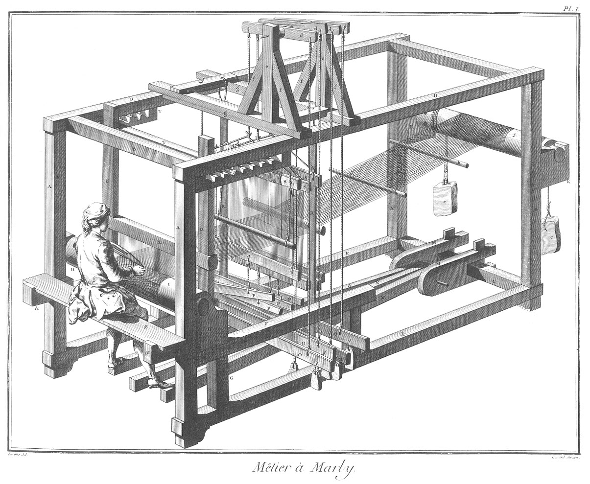
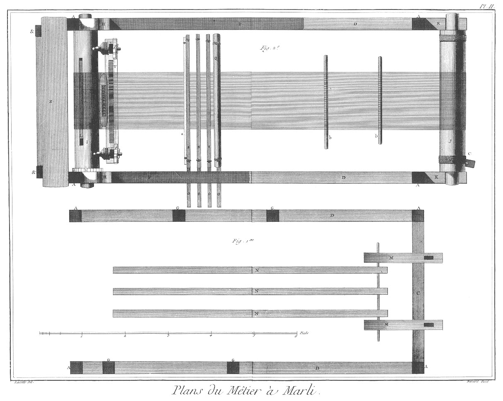
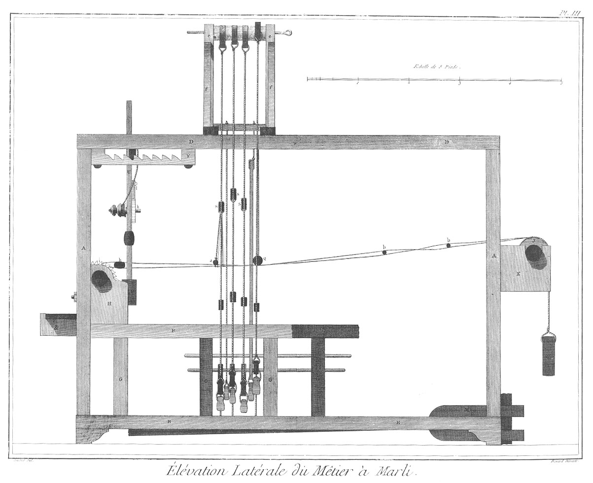
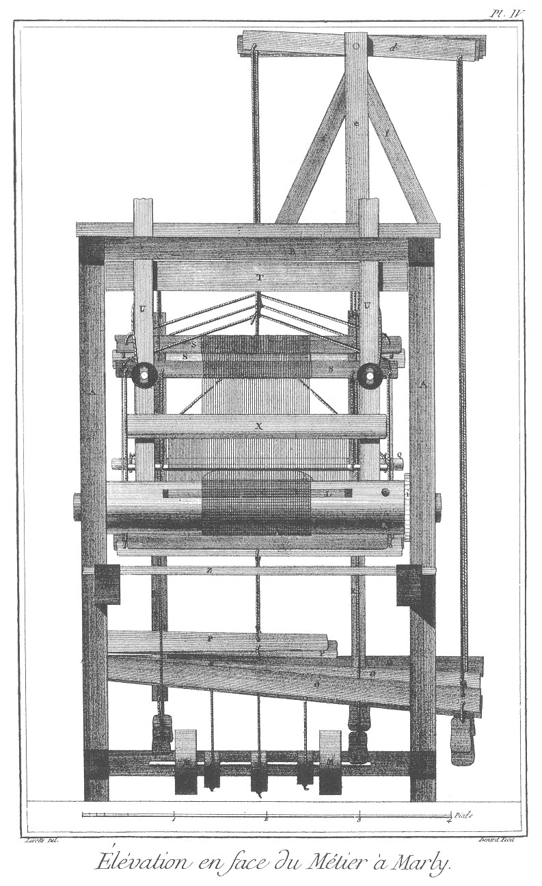
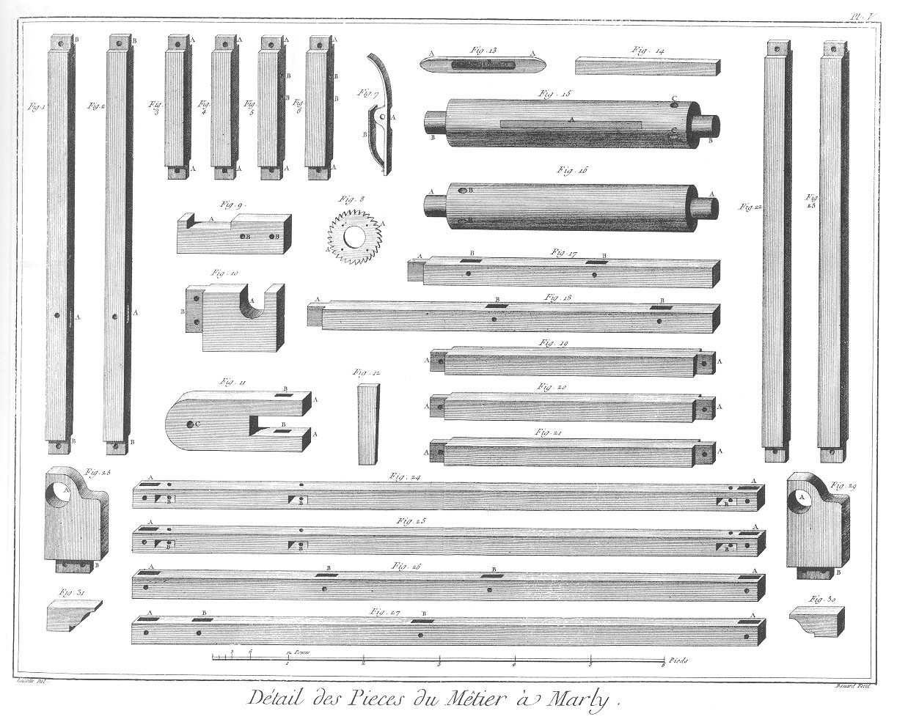
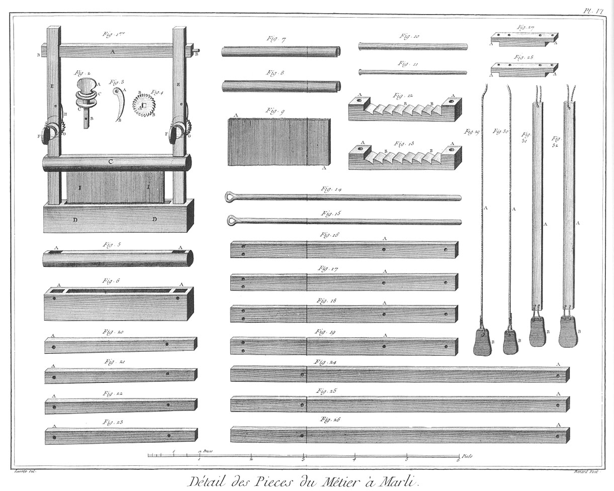
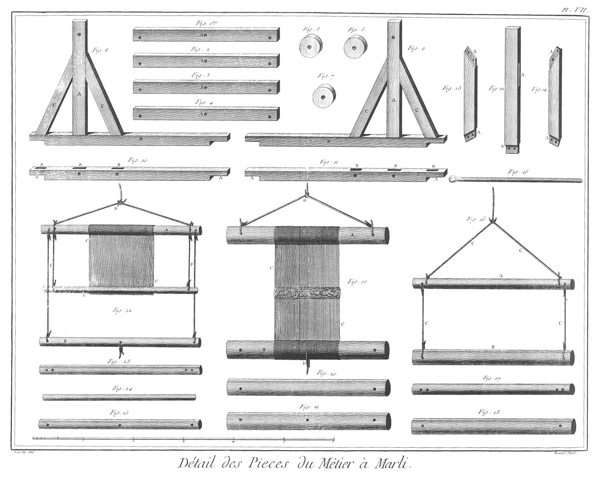
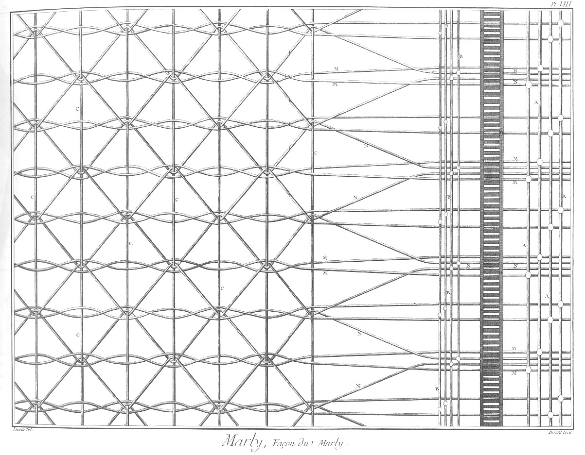

MÉTIER A FAIRE DU MARLI
=======================

Contenant quinze Planches, à cause de sept doubles. 

PLANCHE Iere.
-------------

Elevation perspective du métier à faire du marli.

PLANCHE II.
-----------

Fig.
1. Plan du métier à marli.

2. Second plan du métier à marli.

PLANCHE III.
------------

Elévation latérale du métier à marli.

PLANCHE IV.
-----------

Elévation en face du métier à marli. Noms des pieces qui composent le métier à marli.

	- A A, &c. les piliers.
	- B B, les traverses du haut.
	- C, la traverse d'en bas.
	- D D, les barres de longueur du haut.
	- E E, les barres de longueur du bas.
	- F F, les patins.
	- G G, &c. les supports des patins.
	- H H, les pages.
	- I, l'ensouple de devant.
	- J, l'ensouple de derriere.
	- K K, les alonges.
	- L, la partissoire.
	- M M, les clés.
	- N N, &c. les marches.
	- O O, &c. les lames.
	- P P, &c. les contremarches.
	- Q, le bâton de fond.
	- R R, les tringles des lisserons.
	- S S, &c. les barres des lisses. Pieces qui composent le battant.

T, le porte-battant.
	- U U, les épées.
	- V, le sommier.
	- X, la barre de dessus.
	- Y Y, les cremilleres.
	- Z, la sellette de l'ouvrier. &c. &c. les supports de la sellette.
	- a, la baguette des lisses de soie.
	- b b, verges d'encroisures.
	- c c, les contrepoids.
	- d d, &c. les bricots.
	- e e, les supports des bascules.
	- f f, &c. les contrefiches.
	- g g, les sommiers.
	- h, la navette.
	- i, le cric de l'ensouple de devant.
	- k, le cric du battant.
	- l, le cliquet.

PLANCHE V.
----------

Développement du métier.

Fig.
1. &
2. Piliers de devant.
	- A A, les mortaises.
	- B B, &c. les tenons.

3. &
4. &
5. &
6. Support des patins.
	- A A, &c. les tenons.
	- B B, &c. les trous des broches.

7. Bascules du cric.
	- A, la bascule.
	- B, le ressort.

8. Pignon de cric.
	- A A, les dents.

9. Support de la sellette.
	- A, échancrure.
	- B B, les tenons pour l'attacher.

10. Alonge.
	- A, le coussinet.
	- B, le tenon.

11. Clé.
	- A A, les jumelles.
	- B B, les tenons.
	- C, le trou de la broche.

12. Serre de la clé.

13. Navette.
	- A A, la navette.
	- B, la bobine.

14. Partissoire.

15. L'ensouple de devant.
	- A, l'entaille de la partissoire.
	- B B, les tourillons.
	- C C, les yeux.

16. Ensouple de derriere.
	- A A, les tourillons.
	- B B, les yeux.

17. &
18. Patin.
	- A A, &c. les tenons.
	- B B, les mortaises.

19. &
20. &
21. Traverses d'en-haut & d'en bas.
	- A A, &c. les tenons.

22. &
23. Piliers de derriere.
	- A A, &c. les tenons.

24. &
25. Barres de longueur du haut.
	- A A, les mortaises des piliers.
	- B B, mortaises des traverses.

26. &
27. Barres de longueur d'en bas.
	- A A, &c. les mortaises des piliers.
	- B B, les mortaises des supports des patins. 

Fig.
28. &
29. Pages.
	- A A, les trous des tourillons.
	- B B, les tenons.

30. &
31. Hausses.

PLANCHE VI.
-----------

Fig.
1. Battant.
	- A, le porte-battant.
	- B B, les tourillons.
	- C, la barre de dessus.
	- D D, le sommier.
	- E E, les épées.
	- F F, les clés.
	- G G, les crics.
	- H H, les cliquets.
	- I I, le peigne.

2. Clé du cric.
	- A, la tête.
	- B, la tige.
	- C C, les vases.

3. Cliquet.
	- A, le trou.
	- B, la pointe.

4. Cric.
	- A, le trou.
	- B B, les dents.

5. Barre de dessus.
	- A A, les mortaises.

6. Sommier.
	- A A, les mortaises.
	- B, l'entaille du peigne.

7. &
8. Clé du peigne.

9. Peigne.
	- A A, les dents.

10. &
11. Verges d'encroisures.

12. &
13. Crémaillere.
	- A A, &c. les trous pour les attacher.
	- B B, &c. les dents.

14. Broches des contremarches.

15. Broche des lames.

16. &
17. &
18. &
19. Lames.
	- A A, &c. les points d'appui.

20. &
21. &
22. &
23. Contremarches.
	- A A, &c. les points d'appui.

24. &
25. &
26. Marches.
	- A A, &c. les points d'appui.

27. &
28. Support des tringles des lisserons.
	- A A, &c. les pattes.

29. &
30. Conduit de lisseron.
	- A A, les cordons.
	- B B, les poids.

31. &
32. Tringles de lisseron.
	- A A, les tringles.
	- B B, les poids.

PLANCHE VII.
------------

Fig.
1. &
2. &
3. &
4. Bascule du châtelet.
	- A A, &c. les points d'appui.

5. &
6. &
7. Rouleaux de séparation.

8. &
9. Supports des bascules.
	- A A, les jumelles.
	- B B, les sommiers.
	- C C, &c. les contrefiches.

10. &
11. Sommiers des supports.
	- A A, &c. les pattes.
	- B B, &c. les mortaises.

12. Jumelle du support.
	- A, la mortaise.
	- B, le tenon.

13. &
14. Contrefiches.
	- A A, &c. les tenons.

15. Broches des marches.

16. Lisse de fond.
	- A, le bâton d'en-haut.
	- B, le bâton d'en-bas.
	- C C, &c. les cordons de support.

17. Bâton de fond d'en-haut.

18. Bâton de fond d'en-bas.

19. Autre lisse.
	- A, barre d'en-haut.
	- B, barre d'en-bas.
	- C C, fils de lisse.
	- D, cordon de support.
	- E, cordon de contremarche.

20. Barre d'en-haut.

21. Barre d'en-bas.

22. Autre lisse.
	- A, la barre d'en-haut.
	- B, barre d'en bas.
	- C C, fils de lisse.
	- D, cordon de support.
	- E, baguette des lisses de soie.
	- F F, cordons.

23. Barres d'en-haut.

24. Baguette des lisses de soie.

25. Barre d'en-bas.

PLANCHE VIII.
-------------

Façon du Marli.

- A, lisses de chaînes & à perles.
- B, lisses à perles.
- C, fil ou passage de la navette.
- D, peigne.
- M, trames de longueur.
- N, trames de traverse.

[->](../09-Gazier/Légende.md)
