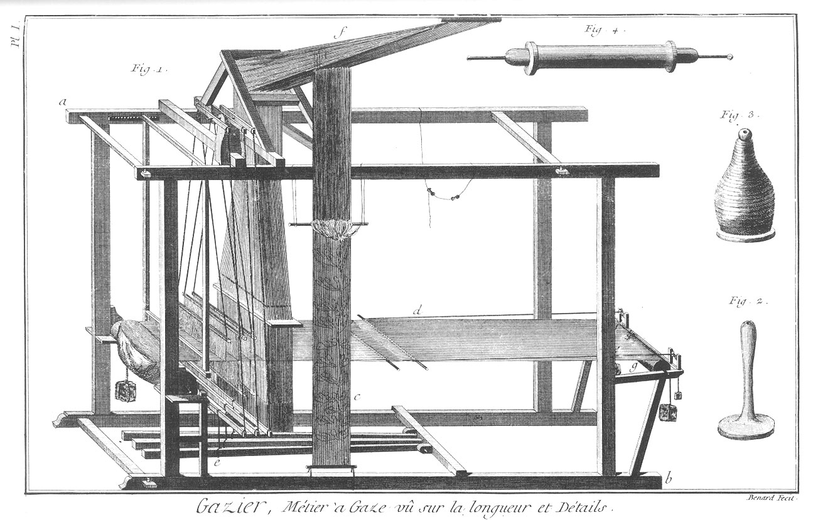
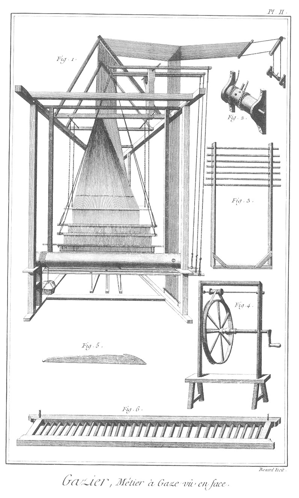
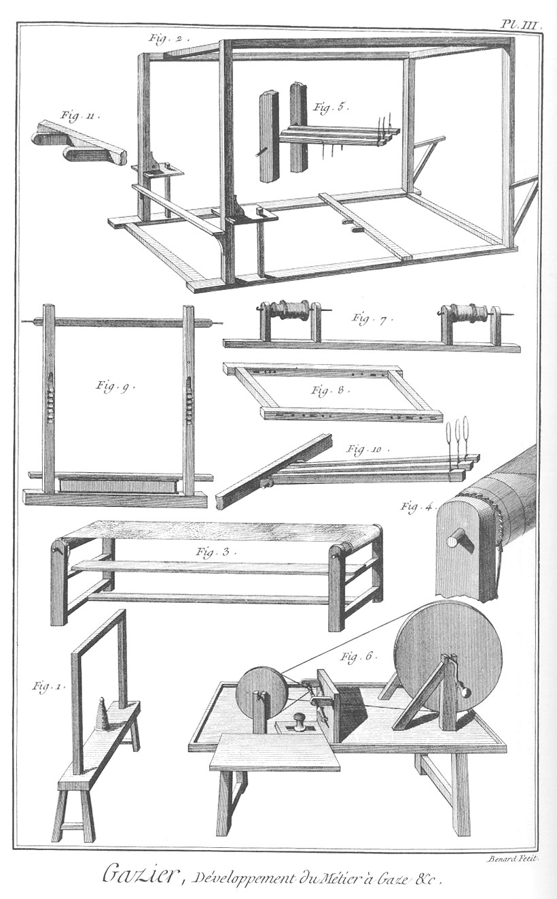
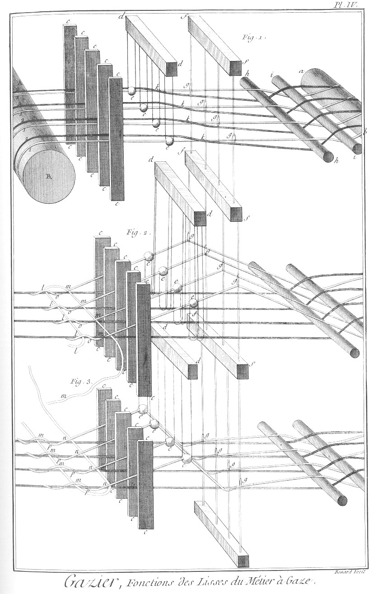

GAZIER
======

Contenant quatre Planches. 

PLANCHE Iere.
-------------

Figure

1. 
	- a b, Le métier à gaze vu sur la longueur.
	- c, le semple.
	- d, l'ouvrage.
	- e, les marches.
	- f, la rame.

Voyez pour le détail plus étendu de cette machine, les Planches & les figures des métiers en soie.

2. Le volant vuide.

3. Le volant rempli.

4. Le billot ou le chevillon.

PLANCHE II.
-----------

Fig.
1. Le métier vu de face. Ses parties sont les mêmes qu'aux métiers en soie.
	- a, l'ensouple de devant.
	- b, les lisses.

2. Le tourniquet.

3. L'égalisoir de semple.

4. Le rouet.

5. La passette. 

6. Le rateau.

PLANCHE III.
------------

Fig.
1. Le tracanoir ou trancanoir.

2. La cage du métier.

3. Le découpoir.

4. La tête du découpoir.

5. Le talon de la contre-marche.

6. Rames à canettes.

7. Porte-lisiere.

8. Chassis.

9. Le battant.

10. Talon de marche.

11. Talon de marche.

PLANCHE IV.
-----------

Fig.
1. &
2. &
3. Fonctions des lisses du métier à gaze, & façon de l'ouvrage. Voyez l'article Gaze.

[->](../10-Rubannier/Légende.md)
