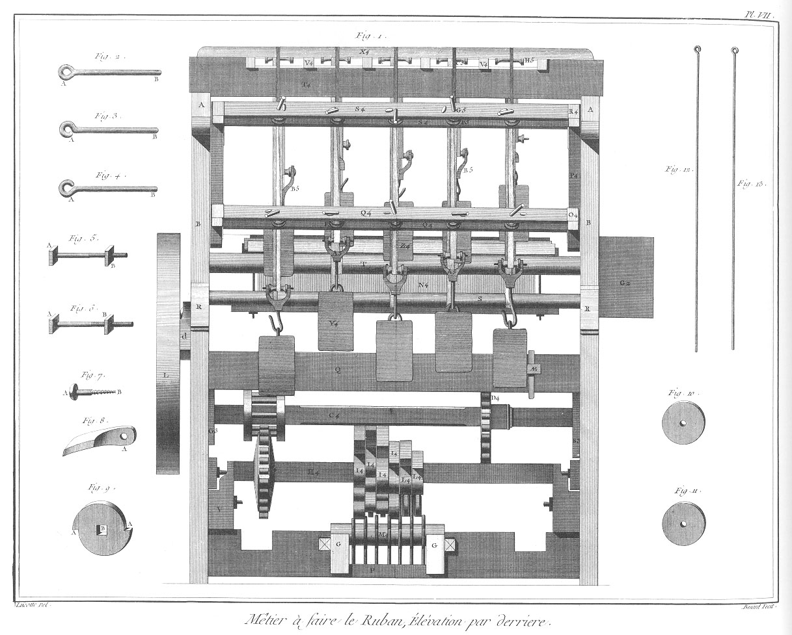

RUBANIER
========

Contenant dix Planches doubles équivalentes à vingt Planches simples.

MÉTIER A FAIRE PLUSIEURS PIECES DE RUBAN A LA FOIS.

Détail des pieces qui composent les Figures dans les Planches suivantes.

PLANCHE I. 
----------

Pl. II, fig. 1. Pl. III, fig. 1. Pl. IV, fig. 1. Pl. V, fig. 1. Pl. VI, fig. 1. & Pl. VII, fig. 1.

- A, traverses du haut des côtés servant à porter les arbres & chassis des mouvemens du metier.
- B, montans de derriere.
- C, colonnes soutenant les traverses.
- D, traverses du milieu des côtés.
- E, traverses des bas des côtés.
- F, montans de devant.
- G, supports des croix du figuré.
- H, petits montans de l'arbre L3.
- I, petits montans de l'arbre G4.
- L, volant.
- M, traverse de devant du haut.
- N, traverse de devant du bas.
- O, traverse de derriere du haut.
- P, traverse de derriere du bas.
- Q, traverse de derriere du milieu.
- R, support de l'arbre S.
- S, arbre rond des rubans.
- T, arbre rond des chaînes.
- V, support de l'arbre H 4.
- X, supports à fourche.
- Y, porte-pieces.
- Z, gousset.
- &, arbre du chassis du battant.
- AE, support de l'arbre de fer.
- A 2, battant.
- B 2, chassepiece.
- C 2, arbre du chassepiece.
- D 2, poulie de renvoi.
- E 2, crampon à coulisse du chassepiece.
- F 2, support de la manivelle de renvoi.
- G 2, boëte de renvoi.
- H 2, navettes.
- I 2, crampons des battans.
- K 2, manivelle de renvoi.
- L 2, chappe garnie de ses poulies de renvoi.
- M 2, support des marches des fourches.
- N 2, marches à fourches.
- O 2, pitons à fourches.
- P 2, bras du battant.
- Q 2, guide de renvoi du chassepiece.
- R 2, dents de renvoi.
- S 2, goupilles des peignes.
- V 2, passages des rubans.
- X 2, bobines des navettes.
- Y 2, centre du bras.
- A 3, arbre de renvoi.
- B 3, crampon à fourche.
- C 3, crochets de renvoi.
- D 3, fourches à vis.
- E 3, chappes des conduites des lisses.
- F 3, cuir des chappes des conduites des lisses.
- G 3, croix des lisses simples.
- H 3, marches des lisses simples.
- I 3, arbre rond des bras.
- L 3, arbre rond des rubans.
- M 3, arbre rond d'encroisure.
- N 3, autre arbre rond d'encroisure.
- O 3, bras de l'arbre de fer.
- P 3, écrevisses des lisses simples.
- Q 3, écrevisses des lisses à figures.
- R 3, écrevisses des lisses à former les dents.
- S 3, croix de renvoi. 
- T 3, marches de renvoi.
- V 3, lisse simple.
- X 3, support des lisses à figurer.
- Y 3, poulie des lisses à figurer.
- Z 3, corde de renvoi.
- A 4, arbre de fer.
- B 4, lanterne de l'arbre.
- C 4, arbre des croix des lisses & de renvoi.
- D 4, roue de l'arbre.
- E 4, lanterne de l'arbre.
- F 4,  roues des croix à figurer. G 4,
- H 4, arbre des croix à figurer.
- I 4, croix à figurer.
- L 4, croix à former les dents.
- M 4, marche des croix.
- N 4, grand peigne.
- O 4, support des chassis des bobines.
- P 4, traverses du côté d'en-bas du chassis à bobines.
- Q 4, grandes traverses du bas du chassis à bobines.
- R 4, traverse du côté du haut du chassis à bobines.
- S 4, grande traverse du haut du chassis à bobines.
- T 4, chassis des tringles des rouleaux.
- V 4, support des tringles des rouleaux.
- X 4, arbre pour le passage des soies.
- Y 4, contrepoids des écrevisses à rubans:
- Z 4, contrepoids des écrevisses de la chaîne des rubans.
- A 5, écrevisses des contrepoids à rubans.
- B 5, écrevisses des contrepoids des chaînes des rubans.
- C 5, rouleaux des contrepoids à rubans. ct 5,
- D 5, rouleaux des contrepoids des chaînes des rubans. OE 5
- E 5, bobines à manivelle des chaînes des rubans.
- F 5, bobines à manivelle des rubans.
- G 5, manivelle des rouleaux des contrepoids des chaînes & des rubans.
- H 5, tringle de fer des rouleaux.
- I 5, contrepoids des lisses simples.
- L 5, contrepoids des lisses à figurer.
- M 5, contrepoids des lisses à dents.
- N 5, liens.
- a, vis de chappes.
- b, pitons tournans.
- c, conduite de fer.
- d, cliquet.
- e, rocher.
- f, tourniquet.
- g, vis de fourche.
- h, piton tournant.
- i, lisse du figuré.
- k, bras de la manivelle de renvoi.
- l, lisse de crin pour les dents.
- m, tirans des lisses simples.
- n, cordages des tirans des lisses simples.
- o, conduits des marches.
- p, conduite de renvoi des marches.
- q, cordages des écrevisses des contrepoids.
- r, chaîne du ruban.
- s, ruban.
- t, lisseron.
- u, ressort à fouillot.
- y, fouillot.

PLANCHE II.
-----------

Fig.

2. &
3. &
4. &
5. Grandes traverses du chassis à bobines.
	- A A, &c. les tenons.
	- B B, &c. les trous des bobines.

6. &
7. Supports des chassis à bobines:
	- A A, &c. les entailles.

8. &
9. Traverses de côté du haut du chassis à bobines.
	- A A, les entailles.
	- B B, &c. les mortaises.

10. &
11. Traverses de côté du bas du chassis à bobines.
	- A A, les entailles.
	- B B, &c. les mortaises.

12. Bobine.
	- A, la bobine.
	- B, la manivelle.

13. Broche de bobine.
	- A, la tête.
	- B, la tige.

14. Ecrevisses des contrepoids des rubans.
	- A, le rouleau.
	- B, la broche.
	- C, la chappe.
	- D, le crochet.

15. Contrepoids d'écrevisse.
	- A, l'anneau.

PLANCHE III.
------------

Fig.

2. &
3. Support des lisses à figurer.
	- A A, &c. les trous des broches des poulies.

4. Arbre de renvoi.
	- A A, les tourillons.
	- B B, &c. les mortaises des crampons à fourches.

5. Arbre de passage des soies.

6. &
7. Chassis des tringles des rouleaux.
	- A A, &c. les entailles.

8. &
9. Porte-pieces.
	- A A, les mortaises de support des lisses.
	- B B, les entailles des tourillons de l'arbre de renvoi.
	- C C, les tenons.

10. &
11. Goussets de support des lisses.
	- A A, les entailles.
	- B B, les tenons.

12. Broche de poulie de renvoi.
	- A, la tête.
	- B, la tige.

13. &
14. &
15. Poulies de renvoi.
	- A A A, les centres.

16. &
17. Crampons à fourche.
	- A A, les fourches.

18. Coin ou serre des crampons.

19. Entremarche.

20. &
21. Crochets de renvoi.

22. &
23. Marches à fourche.
	- A A, les fourches.

24. &
25. Pitons à fourche.
	- A A, les vis.
	- B B, les têtes.

26. &
27. Boulons de marches à fourches.
	- A A, les têtes.
	- B B, les vis à écroux.

28. &
29. Fourches à vis.
	- A, les fourches.
	- B B, les vis.
	- C C, les tourets.
	- D D, les crochets des tirans.

30. &
31. Boulons des fourches à vis.
	- A A, les têtes.
	- B B, les vis à écroux.

PLANCHE IV.
-----------

Fig.
2. Support des marches des fourches.
	- A A, les entailles.

3. Chappe de poulie de renvoi.
	- A, la chappe.
	- B, la vis.
	- C, les poulies.

4. &
5. Poulies de renvoi.

6. Ecrevisse de lisses simples.
	- A, la chappe.
	- B, la poulie.
	- C, le crochet.
	- D, le contrepoids.
	- E, l'anneau.

7. Ecrevisse de lisses à figurer.
	- A, la chappe.
	- B, la poulie.
	- C, le crochet.

8. &
9. Broches.
	- A A, les têtes.
	- B B, les tiges.

10. Renvoi.
	- A, le cuir.
	- B B, les chappes de conduite des lisses.
	- C C, les vis.
	- D D, les tourets.
	- E, la conduite.

11. Ecrevisse de chaîne.
	- A, le rouleau.
	- B, la broche.
	- C, la chappe à crochet.
	- D, le contrepoids.
	- E, l'anneau.

12. &
13. Rouleaux des contrepoids & chaînes de ruban.

14. &
15. Supports des tringles de rouleaux.
	- A A, &c. les crampons.

PLANCHE V.
----------

Fig.

2. Volant.
	- A A, la croisée.
	- B B, le cercle.

3. &
4. Traverses de croisées.
	- A A, les entailles.

5. &
6. &
7. &
8. Cerces.
	- A A, &c. les mortaises des traverses.
	- B B, &c. les mortaises de jonction.

9. &
10. &
11. &
12. Tenons de mortaises.

PLANCHE VI.
-----------

Fig.

2. &
3. Bras de l'arbre de fer.
- A A, les coussinets.
- B B, &c. les vis à écroux.
- C C, les trous du rouleau.

4. Arbre rond des bras de l'arbre de fer.
	- A A, les tourillons. 

5. Arbre rond pour le passage des rubans.
	- A A, les tourillons.

6. &
7. Arbre rond d'encroisures.
	- A A, &c. les tourillons.

8. &
9. Supports de l'arbre de fer.
	- A A, les coussinets.
	- B B, &c. les vis à écroux.
	- C C, les tenons.
	- D D, les mortaises.

10. &
11. Clavettes ou serres.

PLANCHE VII.
------------

Fig.

2. &
3. &
4. Broches.
	- A A, les têtes.
	- B B, &c. les tiges.

5. &
6. Boulons.
	- A A, les têtes quarrées.
	- B B, les vis à écroux.

7. Vis du cliquet à tête ronde.
	- A, la tête.
	- B, la vis.

8. Cliquet.
	- A, le centre.

9. Rochet.
	- A A, les dents.
	- B, le trou de l'arbre.

10. &
11. Conduits des marches des croix.

12. &
13. Tringles de fer des rouleaux.

PLANCHE VIII.
-------------

Fig.

1. &
2. Petits montans de derriere.
	- A A, les trous de l'arbre.

3. &
4. Petits montans de devant.
	- A A, les trous de l'arbre.
	- B B, &c. les entailles.
	- C C, les tourniquets.

5. &
6. [?]

7. Arbre rond des chaînes.
	- A A, les tourillons.

8. Traverse de derriere du bas.
	- A A, les tenons doubles.
	- B B, les entailles.
	- C C, les conduits.

9. &
10. Traverses du haut des côtés.
	- A A, &c. les mortaises.
	- B B, les entailles.

11. &
12. Traverses du milieu des côtés.
	- A A, &c. les tenons.
	- B B, les mortaises.
	- C C, &c. les entailles.
	- D, le tourniquet.

13. &
14. Traverses du bas des côtés.
	- A A, &c. les tenons.
	- B B, &c. les entailles.
	- C C, &c. les tourniquets.
	- D, goujon de conduite.

15. Traverse de devant.
	- A A, les tenons doubles.
	- B B, &c. passages des rubans.

16. Traverse d'en-bas de devant.
	- A A, les tenons.

17. Broche servant de point d'appui des marches.
	- A, la tête.
	- B, la tige.

18. Clou à vis.
	- A, la tête.
	- B, la vis à écroux.

19. Colonne.
	- A A, les tenons.

20. Cale de conduite.

21. &
22. Support des croix du figuré.
	- A A, les points d'appui.
	- B B, les tenons.
	- C C, les trous pour clavettes.

23. &
24. Marches.
	- A A, les poulies.
	- B B, les points d'appui.
	- C C, les fourches.

25. &
26. Les supports de l'arbre rond des rubans.
	- A A, les queues d'aronde.

27. &
28. Montans de derriere.
	- A A, les tenons.
	- B B, les entailles à queues d'aronde.
	- C C, &c. les mortaises.

PLANCHE IX.
-----------

Fig.
1. Elévation perspective du battant.
	- A, l'arbre du chassis du battant.
	- B B, les bras.
	- C C, les battans.
	- D D, les supports du battant inférieur.
	- E E, &c. les crampons.
	- F F, &c. les peignes.
	- G G, &c. les chevilles.
	- H, le crampon de conduite.
	- I, le support de la poulie.
	- K, la poulie de renvoi.
	- L, la manivelle.
	- M, la boëte du renvoi.

2. &
3. Crampons du battant.
	- A A, &c. les pointes.

4. Poulie de renvoi.

5. Manivelle de renvoi.
	- A, le bras.
	- K 2, la tige.

6. Support de la manivelle de renvoi.
	- A, l'oeil.

7. Boëte de renvoi.
	- A A, le chassis.
	- B, le fond.

8. &
9. Support du battant inférieur.
	- A A, les tenons.

10. Peigne.
	- A, les dents.

11. &
12. Liens du peigne.

13. Peigne monté.
	- A, les dents.
	- B B, les liens.

14. Crampon de conduite.
	- A A, les pattes.

15. Cheville de peigne.
	- A, la tête.
	- B, la tige.

16. Battant inférieur.
	- A, la barre.
	- B, le chasse-piece.
	- C C, les contrepoids.
	- D D, les crampons.
	- E E, &c. les dents de renvoi.

17. Arbre du chassis du battant.
	- A, l'arbre.
	- B B, les tourillons.

18. Battant supérieur.
	- A A, &c. les entailles pour les peignes.

19. Battant inférieur.
	- A, les mortaises du support de renvoi.
	- B B, &c. les entailles pour les peignes.
	- C C, &c. les trous des crampons.

20. &
21. Tirans des lisses.

22. &
23. Bras du battant.
	- A A, les tenons.
	- B B, les mortaises.

24. &
25. Clous à vis à tête fresée.
	- A A, les têtes.
	- B B, les vis à écroux.

26. &
27. Clous à vis à tête quarrée.
	- A A, les têtes.
	- B B, les vis à écroux.

28. Chasse-piece.
	- A, la fourche.
	- B, la lumiere.
	- C, le tenon.

29. Dent de renvoi.

30. &
31. Contrepoids.

32. Navette.
	- A, la navette.
	- B, la coulisse.
	- C, la bobine.

33. Bobine.
	- A, la bobine.
	- B, la broche.

34. Fouillot.

35. Ressort à fouillot.

PLANCHE X.
----------

Fig.
1. Grand peigne.
	- A A, le chassis.
	- B B, les boulons.
	- C C, &c. les dents.

2. Lisse simple.
	- A A, les lisses.
	- B B, les lisserons.

3. Lisse du figuré.
	- A A A, les lisses.
	- B B, les lisserons.

4. Arbre de fer.
	- A, la tige.
	- B B, les coudes.
	- C C, les  tourillons.
	- D, le quarré à vis à écroux.
	- F, la lanterne.

5. Clavette.

6. Ecroux.

7. Boulon de coude.
	- A, la tête.
	- B, la vis.

8. Clé.
	- A, la clé.
	- B, l'écrou.

9. &
10. Tourtes de la lanterne.
	- A A, les quarrés.
	- B B, &c. les trous des fuseaux.

11. &
12. &
13. Fuseaux de la lanterne.

14. Arbre des croix de renvoi.
	- A, l'arbre.
	- B B, les croix des lisses simples.
	- C C, les croix de renvoi.
	- D, écrou.
	- E, la lanterne.
	- F F, les tourillons.

15. &
16. &
17. &
18. &
19. Fuseaux de la lanterne.

20. Clavette ou serre.

21. &
22. Croix des lisses simples.

23. Roue de l'arbre des croix des lisses.
	- A A, les dents.
	- B, le trou quarré.

24. &
25. Tourtes de la lanterne.
	- A A, les quarrés.
	- B B, les trous des fuseaux.

26. Arbre des croix à figurer.
	- A, l'arbre.
	- B, la roue.
	- C C, &c. croix à figurer.
	- D D, les tourillons.

27. Serre.

28. &
29. Support de l'arbre des croix à figurer.
	- A A, les fourches.
	- B B, l'épaulement.

30. Croix à figurer à deux dents.
	- A, le quarré.
	- B B, les dents.

31. Croix à figurer à trois dents.
	- A, le quarré. B B B, les dents.

32. Les dents.

33. &
34. Croix de renvoi.

35. Roue de l'arbre des croix à figurer.
	- A A, les dents.
	- B, le trou quarré.

[->](../11-Soierie/Légende.md)
