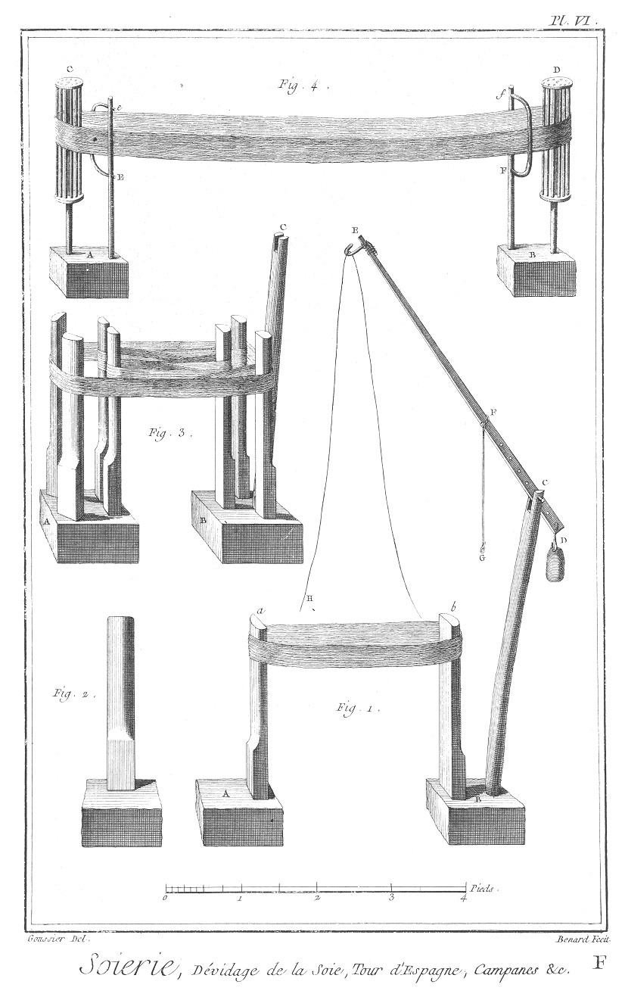

SOIERIE - PREMIERE SECTION.
===========================

PLANCHE Iere.
-------------

Signée A.

La vignette représente l'action de tirer la soie des cocons, & deux filles occupées, l'une à la manivelle du tour, & l'autre à la chaudiere.

Cette opération se fait ordinairement dans le courant du mois de Juin ou Juillet, tems où il fait assez chaud pour qu'il ne soit pas besoin d'un lieu clos pour attelier.

Fig.
1. ou A. Ouvriere qui tire la soie, & fournit de nouveaux brins de cocons à mesure que par le devidage il y en a d'épuisées, auprès d'elle en a est un vase rempli d'eau froide, dans lequel elle plonge les doigts pour les rafraîchir.
	- A, le tabouret sur lequel elle est assise.

2. La tourneuse.
	- C C, deux des quatre piés du tour qui portent les jumelles.
	- E E, les montans; les deux plus longs montans portent les tourillons de l'axe de l'asple ou devidoir G H F, & les deux plus courts soutiennent le va-&-vient, sur lequel sont plantés en a les deux guides de fil de fer qui conduisent la soie sur l'asple, toutes les pieces de ce tour sont assemblées les unes aux autres par des traverses & des clés. Bas de la Planche.

2. Plan géométral du tour de Piémont, de la bassine qui est au devant posée sur un fourneau.
	- G, la manivelle.
	- H, l'axe de l'asple.
	- F F, les lames sur lesquelles se forment les écheveaux.
	- I, pignon ou étoile.
	- K, roue dentée.
	- L, tige ou axe, commun aux deux roues dentées K M.
	- M, seconde roue dentée qui engraine avec l'étoile N. Cette étoile porte une cheville excentrique O qui entre dans un trou du va-&-vient O P: le va-&-vient passe du côté de P dans une mortaise pratiquée vers le haut d'un des montans E, ensorte que les guides (a dans la vignette) qui sont indiqués par des points ronds au milieu de la tringle O P changent de place à chaque révolution de la roue N d'une quantité égale au diametre du cercle, que la cheville O décrit: au-dessous du va-&-vient, on voit la chaudiere pleine d'eau chaude dans laquelle sont les cocons.

PLANCHE II, 
-----------

signée B.

Fig.

2. bis. Profil du tour de Piémont, vu du côté de la tourneuse ou du côté de la manivelle.
	- Z Z Z Z, profil d'un des écheveaux qui entourent l'asple.
	- I, étoile sur l'axe de l'asple.
	- K, roue qui est conduite par l'étoile.
	- L, tige de communication à la roue M qui conduit l'étoile N de l'excentrique. Plus bas, on voit le profil de la chaudiere & celui du fourneau sur lequel elle est montée.

3. Elévation du côté de l'asple ou devidoir.
	- E E, les montans qui soutiennent les tourillons de l'axe.
	- G, la manivelle.
	- I, roue ou étoile qui communique le mouvement au va-&-vient.
	- F F, F F, les lames de l'asple.
	- Z Z, Z Z, les deux écheveaux.

4. Elévation du même tour par le devant ou du côté du va-&-vient.
	- T, le fourneau.
	- S, la chaudiere.
	- R R, tringle de fer percée de plusieurs trous nommée filiere.
	- Y Y, encroix des fils.
	- Q, les deux guides fixés sur le va-&-vient O P.
	- N, la roue ou étoile qui porte la cheville excentrique O.

5. Roue de trente-cinq dents avec l'excentrique qui conduit le va-&-vient.

6. Cotée 5, manne ou corbeille remplie de cocons. 

PLANCHE III,
------------

signée C.

Fig.

1. Représentation perspective du tour de M. de Vaucanson pour tirer la soie, vue du côté auquel doit être placée la chaudiere. Ce tour est comme le précédent, composé de quatre piés qui portent les jumelles, les piés & les jumelles sont entretenus ensemble par plusieurs traverses assujetties avec des clés.
	- G, manivelle de l'asple.
	- h H, axe de l'asple.
	- f, f, F F, les lames sur lesquelles se forment les écheveaux.
	- I, étoile ou roue dentée fixée sur l'axe ou arbre du devidoir. Cette roue engraine dans la roue K, derriere laquelle du côté de M est un pignon ou lanterne qui conduit la roue N. Cette derniere roue a une cheville excentrique, qui, par le moyen d'une tringle, communique son mouvement à l'extrémité d du bras d D du va-&-vient C.
	- D E, axe vertical du va-&-vient.
	- D C, bras qui porte le va-&-vient C sur les extrémités duquel sont plantées les deux guides de fil de fer.

Sur le devant on voit la lunette B B placée au milieu d'un chassis quarré dans lequel elle peut tourner circulairement entre trois roulettes c c c. Ce mouvement lui est communiqué par la poulie b qu'une manivelle a fait tourner, & cela au moyen d'une corde sans fin qui embrasse la poulie & la lunette.
	- A A, les deux filieres.

2. Plan géométral du même tour.
	- G, la manivelle.
	- h H, axe de l'asple.
	- f f, les lames.
	- O L, tringle qui transmet le mouvement au va-&-vient.
	- d D, bras inférieur.
	- D C, bras supérieur qui porte le va-&-vient aux extrémités duquel sont fixés les deux guides.
	- B B, montans du chassis ou porte-lunette.
	- A A, les filieres.
	- b, poulie.
	- a, manivelle.

PLANCHE IV,
-----------

signée D.

Fig.

3. Coupe longitudinale ou profil du tour de M. de Vaucanson.
	- G, manivelle.
	- H, axe du devidoir. On voit les quatre roues qui font mouvoir le va- &-vient, la plus élevée est la roue I de la fig. 1. de la Planche précédente. Cette roue engraine avec celle de dessous qui est la plus grande, elle est désignée par la lettre K dans la fig. 1. Celle qui lui est concentrique & qu'il faut supposer derriere conduit la roue inférieure: c'est sur cette derniere qu'est fixée la cheville excentrique qui, au moyen d'une tringle, communique le mouvement au va- &-vient.
	- F, f, F, f, les lames de l'asple sur lesquelles se forment les écheveaux.
	- D E, arbre vertical du va-&-vient.
	- D C, bras qui porte le va-&-vient. On voit par cette figure comment les brins de soie sont passés dans le guide après être sortis des filieres A, & avoir traversé la lunette B.
	- T, fourneau sous la chaudiere.

4. Elévation du même tour du côté de l'asple ou devidoir.
	- G, manivelle.
	- h H, axe de l'asple.
	- I, K, roues.
	- M, autre roue qui conduit la roue de l'excentrique.
	- D E, poupée qui fixe le pivot supérieur de l'arbre vertical du va-&-vient.

5. Elévation du devant du même tour.
	- 1, 2, 3, les trois roulettes entre lesquelles tourne la lunette B B, garnie en B, B, d'un fil de fer, dont une des extrémités est tournée en anneau comme celle des guides.
	- A A, la filiere.

6. Maniere dont les fils sont croisés pour former deux écheveaux sur l'asple.
	- A A, les trous des filieres par lesquelles passent les deux brins de soie.
	- B B, les deux anneaux en-dedans de la lunette; entre ces quatre lettres on voit la premiere croisure.
	- C C, les guides du va-&-vient; entre ces quatre dernieres lettres on voit la seconde croisure faite en sens contraire de la premiere.
	- Z, Z, les deux écheveaux supposés sur l'asple.

PLANCHE V,
----------

signée E. Devidage de la soie sur le tour d'Espagne & doublage avec l'escaladou.

La vignette représente l'intérieur d'une chambre dans laquelle sont deux ouvrieres occupées à ces opérations.

Fig.

1. Ouvriere qui devide un écheveau de soie, l'écheveau est étendu au moyen de deux pieces de bois verticales fixées dans des billots de bois; on nomme ces pieces de bois qui doivent être arrondies & polies extérieurement, des pelles; c'est sur ces deux pieces que l'on étale l'écheveau. Près d'une des pêles & sur le même billot est un montant, au haut duquel est assemblée à charniere une regle de bois; cette regle chargée par une de ses extrémités d'un poids suffisant pour la tenir élevée, est terminée par l'autre extrémité par un crochet de verre sur lequel passe le fil de soie qui de-là redescend au rochet du rouet sur lequel il s'enroule, & sur lequel la main gauche de l'ouvriere le conduit contre un va-&-vient, tandis que de la main droite elle imprime au rouet le mouvement de rotation.

La regle à laquelle le crocher de verre est attaché est garnie d'une ficelle, par laquelle l'ouvriere l'abaisse pour pouvoir placer le bout de la soie sur le crochet. On a donné à cette piece le nom de cicogne.

2. Ouvriere qui double plusieurs brins de soie ensemble en se servant de l'escaladou qu'elle tient sur ses genoux; elle a devant elle le tracanoir ou une banque, par lequel les rochets qui contiennent la soie simple sont portés, ou sont enfilés par des broches qui traversent les montans de cet instrument; de la main droite l'ouvriere imprime le mouvement de rotation à l'escaladou, & de la gauche elle guide les fils sur le rochet dont il est garni. Elles ont l'une & l'autre auprès d'elles un panier ou corbeille qui contient les rochets & les marchandises qu'elles doivent employer.

On se sert aussi de l'escaladou pour devider la soie de dessus le tour d'Espagne; dans ce cas l'ouvriere, fig. 1. au-lieu d'avoir le tour d'Espagne à sa gauche comme la figure la représente, elle est tournée en face de l'écheveau & a l'escaladou sur ses genoux; de même aussi le doublage de la fig. 2. se fait avec le rouet de la fig. 1. dans ce cas la longueur du rouet est dirigée au tracanoir qui se trouve placé à la gauche de l'ouvriere, fig. 2.

Bas de la Planche.

Fig.

1. Plan de l'escaladou.

2. Elévation perspective de l'escaladou garni d'un rochet.

3. Un des deux montans ou poupées de l'escaladou dessiné sur une échelle double; le trou qui reçoit la pointe est garni de cuivre, & au-dessous on voit l'écrou qui sert à fixer ce montant sur la Planche.

4. Second montant ou seconde poupée de l'escaladou; elle differe de la précédente en ce que le trou qui reçoit la pointe de l'arbre tournant est ouvert à sa partie supérieure, pour laisser passer cette pointe lorsqu'on met l'arbre en place; au-dessous est son écrou.

5. Elévation géométrale de l'arbre A B de l'escaladou, la partie A C est arrondie; c'est celle sur laquelle l'ouvriere applique la main droite.
	- C, est le volant fixé sur l'arbre par une clavette.
	- C B, partie quarrée de l'arbre sur laquelle on enfile les rochets pour les garnir de soie.

6. Le volant de l'escaladou vu en plan.

7. Rochet représenté géométralement. Toutes ces pieces sont de fer, excepté la Planche fig. 1. & le rochet fig. 7. qui sont de bois. 

PLANCHE VI,
-----------

signée F. Devidage de la soie.

Fig.
1. Tour d'Espagne & sa cicogne.
	- A & B, blocs de bois sur lesquels les pelles A a, B b, sont assemblées; on approche ou on éloigne ces deux blocs l'un de l'autre autant qu'il convient, pour que l'écheveau soit suffisamment tendu; si l'écheveau contient trop de soie, on le fend en plusieurs écheveaux minces que l'on devide les uns après les autres.
	- B C, pié de la cicogne.
	- D E, la cicogne.
	- D, poids qui la fait relever.
	- E, crochet de verre sur lequel la soie passe.
	- F G, corde par le moyen de laquelle l'ouvriere abaisse la cicogne pour accrocher le fil de soie.
	- H, extrémité du fil de soie qui va se rendre au rochet du rouet ou à celui de l'escaladou, selon que l'on se sert de l'une ou de l'autre de ces machines pour le devidage.

2. Elévation de l'une des pelles du tour d'Espagne, vue en face & du côté qui est arrondi. Comme il faut que ces pieces soient bien polies, il convient d'y employer du bois dur.

3. Autre tour d'Espagne pour devider les soies de grand guindrage; on nomme ainsi des soies du levant dont les écheveaux ont environ douze aunes de tour; il est de même composé de deux blocs de bois: sur le bloc A sont plantées perpendiculairement quatre pelles semblables à celles de la fig. 2. sur le bloc B, il y en a trois semblables, & le pié C de la cicogne; on place l'écheveau ou portion d'écheveau que l'on veut devider sur le tour de la maniere que la figure représente; le fil que l'on devide étant suspendu par le crochet de verre de la cicogne parcourt successivement tous les retours de l'écheveau qui est plat, & qu'on a eu soin de retourner en passant d'une pelle intérieure à une autre pelle intérieure pour que le fil qui vient par le devidage suive toujours le dehors de l'écheveau.

4. Campanes & arbalêtres pour le devidage des mêmes écheveaux.
	- A & B, blocs sur lesquels sont établis les campanes.
	- C, D, les campanes.
	- E e, F f, les arbalêtres qui servent à guider l'écheveau sur les campanes, & à l'empêcher de sortir haut ou bas; la devideuse est placée au milieu de la longueur de l'écheveau.

PLANCHE VII,
------------

signée G. Doublage des soies. Construction du rouet.

Fig.
1. Le haut de la Planche représente l'appareil du doublage dont il a été parlé dans l'explication de la Planche V.
	- A, le tracanoir.
	- B, le rouet, au lieu du doublage comme la figure le représente; on peut placer les rochets ou les volans chargés de la soie que l'on veut doubler, comme on le voit en c d, appuyés par leurs bases; le fil de soie levé de chacun d'eux est conduit par-dessus la tringle de verre e f, & de-là sur le rochet qui est au-dessus de la boîte du rouet où la main gauche de l'ouvriere le guide comme un va-&-vient.

Bas de la Planche. Développement du rouet.

Fig.

2. Plan du rouet.
	- a, la manivelle du rouet.
	- b c, axe de la roue implanté dans le montant qui est unique.
	- e f, axe du rochet; l'extrémité e passe à travers un trou, & l'extrémité f terminée en pointe, porte contre la face intérieure de la jumelle f. On voit par cette figure que l'axe b c de la roue n'est pas parallele à celui du rochet; ensorte que la corde g h d fait avec l'axe e f un angle aigu h d f. C'est cette disposition qui assure la pointe du fuseau dans un des trous de la Planche f.

3. Elévation géométrale du rouet.
	- a, la manivelle. On voit aussi par cette figure que la roue est oblique à la longueur du rouet.

4. Elévation antérieure de la tête du rouet.
	- a, la manivelle.
	- e f, l'axe du rochet. On voit comment la corde passe obliquement sur la petite poulie de buis de l'axe e f.

5. Coupe de la roue g h, & représentation de son axe.
	- b, tenon qui traverse le montant du rouet.
	- i, portée ou embâse.
	- i c, axe de la roue qui en traverse le moyeu c d.

PLANCHE VIII,
-------------

signée H.

Moulin de Piémont en perspective, & plan de la méchanique qui est au-dessous du rès-de-chaussée.

La vignette représente l'intérieur d'une salle au rés-de-chaussée, dans laquelle on voit deux moulins; il y en a quelquefois un bien plus grand nombre rangés sur une seule ligne droite, auxquels la roue à eau, qu'un courant fait tourner, communique le mouvement au moyen d'un arbre horisontal caché au dessous du sol de l'attelier, comme on le voit par le plan au bas de la Planche & en A dans la vignette. La lettre A indique la roue dont on ne voit qu'une portion, & l'empellement au moyen duquel on lui donne ou supprime l'eau.

Fig.

1. Moulin à trois vargues ou trois étages, dans chacun desquels on a supprimé les fuseaux & les asples ou devidoirs pour laisser voir la cage ou partie tournante intérieure qui porte les strafins. Le corps du moulin est composé de seize montans, a b, g h, & assemblés haut & bas dans des cerces circulaires concentriques; à l'axe de la cage intérieure, la hauteur de chaque montant est divisée en trois parties par d'autres cerces c d, e f, qui, avec les inférieures a b & la supérieure g h, forment les trois étages ou vargues du moulin.

La lanterne intérieure est de même divisée en trois étages par les serpes placées obliquement; l'axe i k de cette lanterne traverse en k le plancher pour communiquer le mouvement au devidage placé dans l'étage supérieur. Près de ce moulin, on voit l'escalier R S par lequel on monte au devidage représenté par la Planche suivante.

2. Second moulin garni de tous ses fuseaux, asples, ponsonelles, & les mêmes lettres qu'à la figure précédente indiquent les trois étages ou vargues du moulin. On a supprimé dans l'intérieur les différentes pieces de bois qui composent la lanterne ou cage qui porte les serpes & les strafins, pour éviter la confusion; on a seulement conservé l'axe i k de cette lanterne.

Bas de la Planche.

Plan de la Méchanique au-dessous du rès-de-chaussée.
	- A A, B B, empellement & coursier de décharge pour évacuer l'eau superflue.
	- A, empellement de la roue.
	- A B, la roue à aubes.
	- C D, arbre de la roue.
	- E F, rouet qui engrene dans la lanterne K fixée à la partie inférieure de l'arbre du moulin, fig. 2. de la vignette.
	- I, plan de l'arbre vertical de la cage des strafins, son pivot inférieur repose sur une crapaudine soutenue par la traverse G, H, sous laquelle passe le tourillon de l'arbre de la grande roue à aubes. Ce tourillon prolongé sous la forme d'une H le raccorde avec le second arbre L N, qui, au moyen d'un autre rouet O P, communique le mouvement à l'arbre central du second moulin par le moyen de la lanterne Q fixée sur ce même arbre, la fosse qui renferme ces deux arbres est recouverte par des Planches, comme on le voit dans la vignette.

PLANCHE IX,
-----------

signée I.

La vignette représente en perspective l'intérieur de la salle placée au-dessus du moulin de la Planche précédente, & le grand devidage qui y est contenu.

Les axes des lanternes ou cages intérieures des moulins, après avoir traversé le plancher, sont prolongés ou raccordés; savoir, celui du moulin, fig. 1. Planche précédente, avec l'arbre Q R, & celui du second moulin avec l'arbre I K. Ces arbres portent chacun à leur partie supérieure un rouet, chaque rouet engrene dans deux lanternes, fixées chacune a un arbre horisontal, & parallelement au plafond; chacun des quatre arbres  horisontaux porte aussi un rouet qui engrene dans les lanternes G, L: O, S, fixées au haut des quatre arbres G H, L M: O P, S T dont les pivots inférieurs reposent sur le milieu des banques, C D, E F: V X, Y Z devant & derriere lesquelles sont les bobines, roues & tavelles, au nombre de cent vingt de chaque sorte. Chaque rang de trente tavelles est divisé en deux parties égales, comme on le voit en A & en B, & reçoit le mouvement par les roues H, M: P, T, comme il sera dit ci-après.

Bas de la Planche.

Plan d'un quart du devidage représenté dans la vignette; c'est le quart où est la lettre B, il est semblable en tout aux trois autres quarts, & est dessiné sur une échelle double.

- T, roue ou rouet fixée à la partie inférieure d'un des quatre arbres verticaux.
- y Y, z Z, banques garnies de rebords, sur lesquelles on pose les bobines & autres pieces de rechange.
- C D, c d: E F, e f, les quatre rangs de quinze tavelles chacun, sur lesquelles sont les écheveaux de soie qui doivent être devidés sur les bobines.
- G X, g V: u H, x h, les quatre rangs de quinze bobines: chaque bobine tire la soie de l'écheveau placé sur la tavelle correspondante; au-dessous de ces bobines, sont les roues non-dentées qui leur communiquent le mouvement; ces roues ou roulettes le reçoivent par les roues X & x fixées sur leur axe commun g h, & G H; les roues X & x engrenent avec les roues V & u que la roue T fait mouvoir.

Les roues X & x engrenent encore avec les roues AE & oe. Ces dernieres portent un excentrique qui conduit les va-&-vient A B, a b, sur lesquels sont fixés les guides qui conduisent la soie sur les bobines, & la distribuent également sur toute leur longueur.

PLANCHE X,
----------

signée K.

Cette Planche & les suivantes, jusques & compris la XVIIIe, contiennent les développemens nécessaires du moulin & du devidage représenté dans les deux Planches précédentes.

Plan du moulin de Piémont à strafins propre à organsiner les soies. Le plan de ce moulin est seulement composé de douze travées, tandis que ceux représentés dans la vignette de la Planche VIII. en ont seize; le nombre des travées étant variable & dependant de la grandeur du moulin. De ces douze travées, il y en a seulement dix représentées dans la figure; les deux autres, qu'il est facile de suppléer (le moulin étant rond) n'ont pu être renfermées dans la Planche.

Les douze piliers A, A, A1, A2, A3, A4, A5, A6, A7, A. qui séparent les travées les unes des autres, sont assemblés sur la semelle représentée par la bande extérieure, & ils sont supposés coupés à différentes hauteurs pour faire voir le plan de chaque travée à différens niveaux.

Le pilier A près du cadre est garni des deux jumelles A L, entre lesquelles doit être placée une ponsonelle; entre ce pilier & le suivant, on voit en B B une partie du porte-bouton ou porte-crapaudines des fuseaux; le porte-bouton est suspendu aux goussets attachés à la face intérieure de chacun des piliers, & forme aussi, comme la semelle, une circonférence entiere. Le second pilier A est garni de la tablette A a b, soutenue par une console ou gousset; sur cette tablette sont deux tasseaux a & b, dont les entailles reçoivent les tourillons des asples dans le vargue inférieur, & les tourillons des broches des bobines dans les deux vargues supérieurs, car les pieces dont nous faisons la description, sont répétées trois fois dans la hauteur du moulin. Entre ce pilier & le suivant A1, on apperçoit une partie t, u, x, du porte-coquette, qui forme aussi une circonférence entiere. Entre les deux jumelles de ce pilier, on voit une ponsonelle D, dont l'axe c d terminé quarrément par chaque bout reçoit une roue dentée qui communique le mouvement aux pieces dont on parlera dans la suite; entre ce pilier & le suivant, on voit le porte-coquette garni de six coquettes, qui sont recouvertes par une bande circulaire y z qui assujettit les coquettes dans les entailles du porte-coquette de la travée précédente; le pilier suivant A2 est garni de sa tablette A2 e f, qui l'est elle-même des deux tasseaux e, f. La travée suivante contient de plus six fuseaux garnis chacun de leur coronaire.

Le pilier A3 est dans le cas du pilier A1; le vuide entre ses deux jumelles est occupé par la ponsonelle D, l'axe g h de cette ponsonelle est garni d'une roue h, & du côté de g on voit le quarré destiné à recevoir une semblable roue.

Les piliers A4 & A6 sont garnis de leurs tablettes k & l: o & p, les tasseaux; la travée de A4 à A5 appartient à un des vargues supérieurs, & les trois autres A5 à A6: A6 à A7: A7 à A, appartiennent au vargue inférieur; la ponsonelle D du pilier A5 fait mouvoir au moyen d'une des roues dont son axe est garni, la roue M fixée sur une broche de fer M l; sur cette broche sont enfilées autant de bobines G G G qu'il y a de fuseaux dans chaque travée; la ponsonelle inférieure conduit de l'autre côté l'asple n N, dont l'axe repose d'un bout sur le tasseau o de la tablette du pilier A6; la ponsonelle D du pilier A7 conduit de même les deux asples n N, n N au moyen des roues q & r qui engrenent avec celles qui sont fixées sur l'axe de la ponsonelle: ces deux roues q & r sont fixées sur les axes des asples; leurs pivots p & s reposent sur les tasseaux des tablettes des piliers voisins de celui qui porte la ponsonelle; ces mêmes roues q & r, au moyen de quatre autres roues, conduisent le va-&-vient qui distribue la soie sur les bobines ou sur les asples.

L'intérieur du moulin est occupé par le plan de la lanterne ou cage qui porte les serpes & les strafins;

- 1, 2, 3, 4, 5, 6, 7, 8, les huits montans ou chandelles de la cage tournante.
- B, l'arbre central & son tourillon supérieur.
- C 2: 2, 3: C 4: 4 C: 5, 6: 6 C: C 8: 8 C, les huit serpes ou cerces posées obliquement. Ces serpes, en passant sous les rodes des ponsonelles, font tourner ces dernieres, & par conséquent toutes les pieces auxquelles elles communiquent; les quatre rayons B 1, B 3, B 5, B 7 prolongés autant qu'il est nécessaire, portent à leurs extrémités les strafins qui frottent sur le ventre de la tige des fuseaux du côté extérieur du moulin dans le vargue inférieur, & du côté du dedans du moulin dans les vargues supérieurs.

PLANCHE XI,
-----------

signée L.

Elévation géométrale du moulin pour organsiner les soies.

Les six piliers que l'on voit dans cette figure sont cotés au-dessous de la semelle des mêmes lettres A1, A2, A3, A4, A5, A6, que dans le plan de la Planche précédente A1, a, a A6. Le vargue inférieur pour le premier apprêt que l'on donne à la soie a, R, R, a, un des deux vargues supérieurs; le troisieme est entierement semblable, la hauteur de la Planche n'a pas permis de le représenter: dans le vargue inférieur; les strafins passent en-devant, c'est à-dire en-dehors des fuseaux; & dans les deux vargues ou étages supérieurs, ils passent derriere ou en-dedans des fuseaux.

- B B porte boutons ou porte-crapaudine des fuseaux.
- C C porte-coquettes. Ces deux courbes sont suspendues dans l'intérieur du moulin par des goussets; au-dessus du porte-coquettes, on voit les bobines montées sur les fuseaux, & garnies en b b de leurs coronaires & fil de fer; plus haut en E E est le va-&-vient, au-dessus duquel sont les asples N n, N n, &c. auxquels les ponsonelles D, D, D, impriment le mouvement de rotation au moyen des roues M, dont leurs pivots sont garnis.

Dans le vargue supérieur, on voit en a, a, le porte-boutons en d, d, le porte-coquettes, en f f les fuseaux.

- e e e, le va-&-vient, au-dessus duquel sont les bobines G G G mises en mouvement par les roues m des ponsonelles.

Plus haut, en R R, est le porte-bouton du troisieme vargue: cette partie R R, semblable à la partie a a, est assemblée dans les faces latérales des piliers 1, 2, 3, 4, 5, 6, de même que les porte-coquettes. 

PLANCHE XII,
------------

signée M.

Coupe diamétrale du moulin de Piémont, & élévation de la lanterne ou cage qui est dans l'intérieur.

Il faut concevoir que cette lanterne est placée dans l'intérieur du moulin, Planche précédente, dont on l'a séparée pour éviter la confusion, & qu'il y a au-dessus une répétition qui répond au troisieme vargue.

- A, A6, coupe de la semelle sur laquelle les piliers sont assemblés.
- V, pivot inférieur lorsqu'un homme placé dans l'intérieur de la cage la fait tourner; au-lieu de ce pivot, il faut imaginer l'arbre vertical & central prolongé en en-bas pour recevoir une des deux lanternes Q ou K au plan général, Pl. VIII. si c'est un courant d'eau qui met le moulin en mouvement.
- B B, porte-boutons dans lesquels entrent les pivots des fuseaux.
- C C, porte-coquettes, tous deux attachés à des goussets dans le vargue inférieur.
- e e, coupe du va-&-vient au-dessus duquel du côté du pilier A6 est la tablette, & du côté A les jumelles qui portent les ponsonelles D.
- M, roue dentée ou étoile fixée quarrément sur l'axe de la ponsonelle: cette roue conduit la roue n, celle-ci la roue o dentée de deux façons sur le champ & sur le plat; cette derniere denture engrene dans la roue p, qui porte l'excentrique qui conduit le va &-vient.

Dans le vargue supérieur ou second vargue, les lettres a a indiquent le porte-bouton, les lettres d, d le porte-coquette; il en est de même du troisieme vargue, où les lettres R, R, indiquent le porte-bouton.
	- D D, une des ponsonelles du second vargue.

La lanterne intérieure composée de huit montans ou chandelles, dont on voit seulement cinq, 3, 3: 4, 4: 5, 5: 6, 6: 7, 7, porte les serpes C C c c, C C c c, &c. dans le vargue inférieur; les serpes c d, c d, &c. dans le vargue supérieur. Ces différentes serpes se succedent & prennent les rodes ou dents des ponsonelles par-dessous, ce qui les fait tourner; la lanterne porte aussi dans chaque vargue par quatre de ses bras prolongés quatre strafins.

- E e, dans le premier vargue.
- e2 E 2, dans le second.
- e3 E 3, dans le troisieme, qui en appuyant sur le ventre des fuseaux extérieurement dans le vargue inférieur, & intérieurement dans les deux vargues supérieurs font tourner les fuseaux d'un sens différent dans ces deux derniers vargues.

PLANCHE XIII,
-------------

signée N.

Construction & développement des ponsonelles, dessinée sur une échelle double de celle des Planches X. XI. XII.

Fig.
1. Ponsonelle vue en plan.
	- D D, corps de la ponsonelle.
	- c c, portée ou épaisseur réservée ou ajoutée de chaque côté de la ponsonelle pour que ses faces ne touchent point à celles des jumelles.
	- b b, tourillon un peu plus long que la jumelle n'est épaisse.
	- a, quarré de fer au centre du tourillon pour recevoir une étoile ou roue dentée.
	- f, g, h, i, k, rodes ou rouleaux cylindriques.
	- l, m, n, o, p, rodes ou roleaux que nous proposons pour que l'engrenage avec les serpes soit plus parfait; leur profil est une épicicloïde, comme dans les dentures des machines d'Horlogerie; ensorte que chaque rode formé par la révolution de l'épicicloïde sur son axe est un solide auquel on peut donner le nom d'épicicloëdre.

2. Rode cylindrique.
	- M, noyure pour recevoir la tête du clou qui fixe le rode sur la ponsonnelle.
	- m o, le clou.
	- m, la tête.
	- m n, partie cylindrique qui sert d'axe, & sur laquelle le rode doit tourner.
	- n o, partie taraudée en vis.

3. Rode épicicloïdal.
	- M, cavité pour recevoir la tête du clou.
	- m n o, le clou semblable à celui de la fig. 2.

4. Ponsonelle.
	- O, le gousset attaché à la face interne du pilier.
	- N, tasseau à bois de fil sur lequel appuie la partie inférieure de la jumelle.
	- M, partie supérieure de la jumelle attachée par quatre vis sur la face latérale du montant.
	- L, mâchoire inférieure de la jumelle.
	- d, boulon ou centre de mouvement de la mâchoire supérieure:
	- K a & a a, cavités, semi-circulaires pour recevoir un des tourillons de la ponsonelle.
	- b, trou circulaire de la seconde jumelle pour recevoir l'autre tourillon de la ponsonelle. Cette jumelle est fermée, sa mâchoire supérieure est assujettie auprès de l'inférieure par un crochet & un piton semblables au crochet l & au piton L de la jumelle antérieure.

5. Ponsonelle, vue de champ.
	- D D, la ponsonelle.
	- c, c, embâses.
	- b, b, tourillons.
	- a, a, quarrés de fer qui reçoivent les étoiles dont on a déja parlé.

PLANCHE XIV,
------------

signée O. Construction & développement des bobines pour le second apprêt, & des asples du premier apprêt.

Fig.
1. Broche quarrée sur laquelle on enfile les bobines qui reçoivent la soie du second apprêt.
	- a, tourillon de la broche du côté de son étoile b; ce tourillon est reçu dans une entaille pratiquée à la partie supérieure de la mâchoire mobile des jumelles, fig. 4. de la Planche précédente. (Ces entailles sont pratiquées à plomb du centre de l'ouverture circulaire a a vis-à-vis la lettre K.)
	- b e, partie quarrée de la broche.
	- d, tourillon qui est reçu par un des tasseaux des tablettes.

2. La broche en géométral & garnie de ses six bobines.
	- A, D, les tourillons.
	- B B, l'étoile ou roue dentée qui reçoit son mouvement de l'étoile de la ponsonelle.
	- 1, 2, 3, 4, 5, 6, les six bobines.

3. La même broche garnie de ses bobines, vue en perspective.

4. Un des asples servant au premier apprêt, vu en géométral.
	- A, B, pivots de l'axe de l'asple.
	- C D, roue qui reçoit le mouvement par l'étoile de la ponsonelle.
	- B, pivot qui porte sur le tasseau des tablettes.
	- E F, G H, lames mobiles.
	- l o, lame ou verouil qui éloigne la lame E F de l'axe.
	- L O, autre verouil dans la position où il doit être pour permettre à la lame mobile G H de s'approcher de l'axe; c'est à quoi servent les plans inclinés l m, n o: L M, N O.
	- I K, une des deux lames fixes, sa semblable & opposée étant cachée par l'axe. x u: y z, deux des quatre bras qui portent les lames.

Au-dessus de cette figure, on voit séparément une des deux lames mobiles e f, & les mortaises transversales x, y, qui laissent aux chevilles de même nom le jeu nécessaire; au-dessous est un verouil.
	- l m, n o, les plans inclinés du verouil.

5. L'asple vu par l'extrémité & du côté du tourillon B.
	- K k: H, F, les deux bras qui sont assemblés l'un à l'autre à entaille.
	- K & k, extrémités des lames fixes.
	- H & F, extrémités des lames mobiles.

6. L'asple vu en perspective.
	- A & B, les tourillons de l'arbre.
	- E F, G H, les lames mobiles écartées de l'axe par leurs verouils.
	- I K, i k, les deux lames fixes.

PLANCHE XV,
-----------

signée P. Construction & développement des fuseaux.

Fig.
1. Fuseau de fer.
	- a, écrou.
	- e, vis.
	- e i, partie cylindrique qui entre dans la bobine, & se termine inférieurement par une partie quarrée pyramidale.
	- o, le collet.
	- u, le ventre du fuseau.
	- S, sa pointe acérée qui entre dans le bouton ou crapaudine de verre.

2. Le même fuseau garni de sa bobine f.

3. Le même fuseau sur la bobine duquel on a ajouté le coronaire ou coronelle garnie du fil de fer qui sert de guide à la soie.
	- o p q r, le fil de fer.
	- r, anneau dans lequel passe la soie qui vient de dessus la bobine.
	- o, autre anneau dans lequel passe ensuite la soie pour de-là se rendre sur les asples du premier apprêt, ou sur les bobines du second.

4. Développement d'une coronelle.
	- O R, le fil de fer.
	- Q, la coronelle.
	- a a, les deux pointes de fer qui assujettissent le fil de fer dans la rainure circulaire de la coronelle.
	- P, plan du dessous de la coronelle.
	- p p, anneau de plomb qui est enchâssée dans la rainure du dessous de la coronelle; plus bas le même anneau est représenté en perspective, & au-dessous de la lettre P est la coupe verticale de la coronelle.
	- 1 & 2. rainure circulaire qui reçoit le fil de fer ou guide de la soie.
	- 3, 4, cavité annullaire, dans laquelle on coule le plomb fondu qui forme l'anneau p p.

Bas de la Planche.

- B B, B B, portion du porte bouton qui, dans chaque vargue, occupe la partie inférieure, & fait le tour du moulin.
- T, T, V, X, boutons de verre incrustés dans le bois.
- C C, C C, portion du porte-coquette qui entoure également le moulin.
- t u x, portion du chaperon des coquettes.

5. Fuseau garni de toutes ses dépendances.
	- o r, le guide attaché à la coronelle.
	- O, la bobine.
	- A B, la coquette recouverte par le chaperon.

6. Semblable fuseau, mais dont la coronelle est tournée de maniere à laisser voir près de P l'anneau inférieur du guide; on voit que la coquette a b, qui n'est point recouverte par le chaperon, affleure le porte-coquette.
	- y z, entaille pour recevoir une coquette, qui est réprésentée en plan au-dessus en a a, b b: 1, 2, broche de fil de fer que l'on met pour renfermer le collet du fuseau.

7. Bouton de verre ou crapaudine des fuseaux.
	- T, le bouton en perspective.
	- t, coupe verticale du même bouton.

PLANCHE XVI,
------------

signée Q. Developpement du va-&-vient & des strafins:

Fig.

1. 
	- E, E e, Portion du va-&-vient du moulin.
	- I, I, I, I, les guides dans lesquels passe la soie après etre sortie de l'anneau supérieur des coronelles représentées dans la Planche précédente.
	- P, roue qui est mise en mouvement par les ponsonelles au moyen de plusieurs roues intermédiaires, comme on voit dans les Planches X. & XI.
	- N, excentrique.
	- k m l, arc de fil de fer qui embrasse l'excentrique qui est représenté dans sa plus grande excursion à droite.

2. Les mêmes objets, mais l'excentrique est dans sa plus grande excursion à gauche.

3. L'excentrique en profil & attaché un à des piliers du moulin.
	- p p, la roue qui conduit l'excentrique N.
	- E, le va-&-vient.
	- E M, le fil de fer qui embrasse l'excentrique.
	- O, tête de la vis ou clou sur lequel la roue & l'excentrique tournent.

4. Les mêmes objets représentés en perspective.
	- E t, portion du va-&-vient.
	- P, la roue appliquée à une portion d'un des piliers du moulin.
	- N, l'excentrique dans sa plus grande excursion à gauche.
	- K M L, le fil de fer.
	- O, cheville qui sert d'axe à la roue & à l'excentrique.

5. La cheville de l'excentrique.
	- a, la tête fendue pour recevoir un tourne-vis c.

6. Un des strafins du premier apprêt.
	- C D, portion d'un des bras.
	- E e, le strafin doublé intérieurement de peau.

7. Le ressort qui fait appliquer le strafin sur le ventre des fuseaux.
	- c, pié du ressort.
	- d, les différens tours qui environnent le pivot.
	- e, sommet du ressort qui s'applique au strafin.

8. Strafin du second apprêt ou des deux vargues supérieurs du moulin. Ceux-ci marchent en-dedans, & c'est leur convexité qui s'applique au ventre des fuseaux.
	- C D, portion d'un des bras de la lanterne intérieure.
	- E e, le strafin garni de peau sur le côté convexe.
	- B, poulie attachée au bras sur laquelle passe la corde e B, chargée d'un poids A, pour faire appliquer la partie E du strafin aux fuseaux.

PLANCHE XVII,
-------------

signée R.

Profils du devidage qui est au-dessus des moulins à organsiner les soies, représenté en perspective dans la Planche IX.

Fig.

1. 
	- X Y, Arbre vertical ou prolongation de l'axe de la lanterne qui occupe l'intérieur du moulin.
	- a, aa, rouet qui engrene dans les deux lanternes.
	- b, bb, la lanterne b est portée par l'arbre horisontal z c qui porte le rouet c. Ce rouet engrene dans la lanterne d de l'arbre vertical d e. Ce dernier arbre porte à sa partie inférieure un rouet ou roue dentée 1, qui, au moyen des roues 2 & 3, met en mouvement la roue 4 qui porte l'excentrique conducteur du va-&-vient représenté au-dessous de la poulie 4 par un petit quarré. L'excentrique 5 est conduit par de semblables roues, comme on le voit au-bas de la Planche IX. où ces roues sont indiquées par les lettres u x ou V X, & la roue 1 de la figure dont nous faisons l'explication l'est par la lettre T.
	- g & g, sont les tavelles sur lesquelles sont les écheveaux qui doivent être devidés.

2. Profil du devidage coupé par le milieu d'une des banques.
	- A B, la table du devidage supportée par les piés A C, B D.
	- A E, B F, supports des tavelles.
	- g, tavelle.
	- e, e e, les vas-&-vients dans les guides desquels passe la soie qui vient des tavelles.
	- f d a, le brin de soie qui ayant passé dans le guide d, va s'enrouler sur la bobine a, mise en mouvement par la roue b.
	- K, banque entourée de rebords.

3. Poupée qui porte l'excentrique.
	- A, tête de la poupée.
	- B, trou qui reçoit la vis sur laquelle tourne l'excentrique.
	- C, partie élégie pour laisser passer la denture de la roue de l'excentrique.
	- E, queue de la poupée.
	- D, mortaise qui reçoit la clavette, au moyen de laquelle la poupée est affermie sur la table, comme on le voit fig. 1.

PLANCHE XVIII,
--------------

signée S.

Fig.
1. Développement du va-&-vient du devidage représenté en perspective.
	- A E, portion inférieure d'un des quatre arbres G H, L M, O P, R S de la Planche IX.
	- B, le rouet fixé à la partie inférieure de l'arbre dont le pivot inférieur repose sur le tasseau F. Ce rouet engrene dans la roue C, la roue C dans la roue D, celle-ci conduit la roue D qui porte l'excentrique N.
	- O, cheville ou clou qui fixe l'excentrique sur sa poupée.
	- X, queue de la poupée.
	- K M L, fil de fer qui embrasse l'excentrique N, & fait mouvoir le va-&-vient K L b a.
	- b, a, guides plantés dans le va-&-vient.
	- S, T, V, séparations des cellules qui renferment les roues H & h, dont les canons sont tous enfilés par la tringle G de la roue D. Ces cellules contiennent aussi les bobines R portées par l'axe des noix I. Derriere le rouet B on apperçoit une partie p de la roue de l'excentrique qui est de l'autre côté, & une portion x de sa poupée.
	- l & k k, parties de la banque qui occupe toute la longueur du devidage.

Bas de la Planche.

La figure du milieu représente une tavelle en perspective.

- G G, pivots de la tavelle sur le milieu de l'arbre de laquelle est enfilé un anneau E F auquel un poids H est suspendu pour procurer un frottement suffisant & une tension convenable à la soie.
- A a, B b, C c, D d, les quatre coulans de la tavelle sur lesquels l'écheveau de soie est placé.

2. Noix dont l'axe reçoit la bobine.
	- b & c, pivots qui sont arrondis.
	- a, noix à laquelle la roue, fig. 4. communique le mouvement de rotation par le seul frottement. La partie a c de la broche de la noix est quarrée pour mieux fixer les bobines que cette partie doit recevoir.

3. La même noix a garnie de sa bobine R.
	- e f, les pivots  qui entrent dans les fentes des cloisons S & T, fig. 1.

4. Roue & son canon.
	- A B C, la roue qui tourne dans l'ordre des lettres pour faire tourner la noix en sens contraire, & faire que la soie s'enroule sur la bobine par le dessus.
	- D E, canon de la roue; il est percé intérieurement d'un trou quarré traversé par la tringle quarrée de la roue D de la fig. 1. Cette tringle conduit & fait tourner avec elle trente roues, & par conséquent trente bobines qui tirent la soie de trente tavelles, ce qui fait soixante écheveaux qui sont devidés à-la-fois dans chaque quart du devidage que la vignette de la Planche IX. représente, c'est-à-dire deux cens quarante en tout.

PLANCHE XIX,
------------

signée T.

Cette Planche représente l'ovale en plan & en élévation.

Fig.
1. Plan de l'ovale dont on a supprimé le chapeau & le guindre.
	- A A, le bâtis ou établi de l'ovale.
	- B B B B, grande assiette.
	- G G G G, petite assiette, au milieu de laquelle on a réservé un vuide.
	- F F F, les trois poulies qui soutiennent la courroie.
	- g h i k, les quatre montans.
	- D, grande roue ou poulie sur laquelle passe la courroie.
	- C, la manivelle de cette roue.

2. Elévation géométrale de l'ovale.
	- A A, le bâtis ou établi.
	- c d, les piés.
	- a b, le chapeau assemblé sur les montans g h i k qui divisent la totalité en trois parties, la premiere entre les deux montans k i renferme le rouage qui sert à compter les tours de l'asple ou devidoir P.
	- 2, pignon qui mene la roue 3.
	- e, pignon qui mene la roue 4.
	- f, pignon qui mene la roue 5.

La seconde partie comprise entre les poteaux ou montans i & h contient la roue motrice D, la manivelle C, le pignon Q & la roue R, qu'il conduit; l'excentrique placé sur cette roue, conduit le va-&-vient; les deux roues V & X servent à communiquer le mouvement aux pieces que les deux parties k i & g h renferment.

La troisieme partie contient l'ovale B G G B; le va-&-vient N O O N & l'asple ou devidoir P suffisamment décrits à l'article Soie.

PLANCHE XX,
-----------

signée V. Coupes transversales & développemens de plusieurs parties de l'ovale.

Fig.

3. Plan du va-&-vient qui est de forme ovale.
	- S S, regle par laquelle le va-&-vient est porté.
	- N O N O, le va-&-vient garni d'autant d'anneaux de fil de fer qu'il y a de bobines tournantes sur l'ovale.

4. Elévation latérale de la troisieme partie qui contient l'ovale. On a supprimé, pour le laisser voir, le montant g de la fig. 2.
	- A A, établi.
	- d d, les piés.
	- B B, grande assiette.
	- C C, petite assiette.
	- E E, courroie.
	- O O, va-&-vient.
	- Y, pignon qui conduit la roue Z de l'asple ou devidoir P.
	- a a, chapeau.

5. Elévation latérale de la premiere partie. On a supprimé le montant k de la fig. 2. pour laisser voir toutes les roues & pignons qui servent à compter les révolutions de l'asple.
	- 2, pignon qui conduit la roue 3.
	- e, pignon fixé sur la roue 3; il conduit la roue 4, sur la tige de laquelle est fixé un autre pignon f qui conduit la roue de compte 5, sur laquelle est une cheville 6 qui leve la queue du marteau attaché au montant que l'on a supprimé.

6. Situation respective de la sonnette 8 du marteau 9, dont la queue 7 est élevée par la cheville dont on a parlé dans l'explication de la figure précédente.
	- 10, ressort qui abaisse la queue du marteau & le fait frapper sur le timbre ou sonnette 8.

7. Une des broches ou fuseaux dessinée sur une proportion double.
	- t, pointe du fuseau qui entre dans la crapaudine de verre.
	- t u, fuseau sur le ventre duquel s'applique la courroie.
	- u y, partie quarrée de la tige; cette partie reçoit la bobine chargée de la soie que l'on veut ovaler.

8. Fuseau garni de sa bobine K & de son coronaire L.
	- x & z, anneaux du coronaire.

9. Le coronaire L séparé de la bobine, & seulement garni de son fil de fer.

PLANCHE XXI,
------------

signée X.

Cette Planche représente le rouet de Lyon, vu en perspective & des deux côtés.

Fig.
1. Le rouet en perspective, vu du côté opposé à l'ouvriere qui en fait usage.

2. Le même rouet en perspective, vu du côté où se place l'ouvriere. 

3. Machine nommée chambriere, qui sert à l'ouvriere pour démêler les écheveaux qu'elle veut devider avant de les mettre sur les guindres.

PLANCHE XXII,
-------------

signée Y. Développemens du rouet de Lyon.

Fig.

4. Elévation géométrale du rouet du côté opposé à l'ouvriere.

5. Plan géométral du rouet.

6. Coupe transversale du rouet.

7. Développemens du va-&-vient.
	- n°. 2. Coupe transversale du va-&-vient sur une échelle quadruple.

8. Développemens d'une des boîtes à ressorts. 

[->](../3-Seconde_Section/Légende.md)
