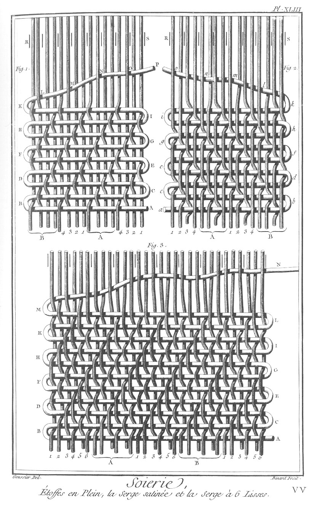

SOIERIE. - SECONDE SECTION
--------------------------

Contenant la fabrication des Etoffes en plein ou Etoffes unies. 

PLANCHE XXIII,
--------------

signée Z.

La vignette représente l'opération d'ourdir la chaîne des étoffes.

Fig.
1. Ourdisseuse qui de la main gauche fait tourner la manivelle de la poulie du banc sur lequel elle est assise. Cette poulie, au moyen d'une corde sans fin, communique à celle qui est au-dessous de l'ourdissoir & lui imprime le mouvement de rotation.

2. L'ourdissoir de trois aunes & demie de tour, sur le plot duquel passent les fils qui viennent des rochets de la cantre.

3. La cantre garnie de rochets. Bas de la Planche.

Plan du dessus de l'ourdissoir, du dessus du banc de l'ouvriere & de la cantre.
	- A, manivelle de la poulie du banc G H que l'on éloigne ou qu'on approche de l'ourdissoir pour tendre la corde sans fin qui passe aussi sur la poulie O de l'ourdissoir.
	- I K, le dessus de la banque ou sellette de la cantre.
	- C D E F, les deux croisées du dessus du bâtis de l'ourdissoir.
	- B, pivot supérieur de l'ourdissoir formé par huit montans a, b, c, d, e, f, g; c'est autour du tourillon ou pivot supérieur B que s'enroule la corde B 2, à laquelle le plot P p est suspendu.
	- i k, chevilles fixées à une traverse sur lesquelles les fils de la portée sont encroisés un à un.
	- m, cheville sur laquelle les portées sont renvoyées.

PLANCHE XXIV,
-------------

signée A A. Développemens & élévation de l'ourdissoir.

Fig.
1. Traverse sur la cheville de laquelle les portées sont renvoyées.
	- M, la cheville.

2. Autre traverse sur laquelle les fils de chaque portée sont encroisés un à un. Ces deux figures sont dessinées sur une échelle double.

3. Elévation géométrale de l'ourdissoir.
	- A, manivelle au-dessus du banc de l'ouvriere.
	- AE, poulie sur laquelle passe la corde sans fin.
	- AE O, qui passe aussi sur la poulie O de l'ourdissoir.
	- E, E E, Un des quatre montans du bâtis qui renferme la lanterne, il y a trois piliers semblables visibles dans la vignette de la Planche précédente.
	- F, F F, quatrieme pilier ou pilier du plot; il differe des autres en ce qu'il est fendu du haut en bas, chaque partie entre dans une des mortaises du plot.
	- a a, b b, d d, e e, f f, h h, six des huits montans ou chandelles de la cage tournante de l'ourdissoir; elles sont supportées par trois étages de traverses qui passent de part en part à travers l'arbre central B, B B autour du pivot supérieur duquel s'enroule la corde à laquelle le plot P p est suspendu. Entre quelques-uns des montans sont placées les trois traverses mobiles i k, l, vers le  haut, & la traverse i i, k k vers le bas. Ces traverses peuvent s'élever & s'abaisser à volonté n'étant assujetties que par le frottement des fourchons de leurs extrémités sur les arêtes internes des chandelles entre lesquelles elles sont placées; leur distance détermine la longueur de l'ourdissage ou de la chaîne de l'étoffe.

Fig. 4. Le plot dégarni des pieces qui en dépendent.
	- P p, le plot.
	- P, la partie qui embrasse le pilier fendu.
	- 6, est le trou où entre le piton de la crémaillere.
	- p, partie sur laquelle passe la soie.
	- 1 & 2, chevilles sur lesquelles sont enfilées les bobines h & k qui sont au-dessus.
	- e f g, tringle inférieure dont le crochet g entre dans un trou auprès de la lettre p. L'autre extrémité e terminée en piton, reçoit la partie inférieure b c de la seconde tringle a b c.
	- d, est l'écrou qui sert à fixer cette piece après qu'elle a traversé l'épaisseur du plot, comme on le voit dans la figure suivante, mais de maniere cependant que la partie b a puisse tourner horisontalement.

5. Le plot garni de toutes les pieces qui en dépendent, & entre les deux tringles duquel passe une portée A B.
	- A, partie de la portée qui vient de la cantre.
	- B, partie qui va sur l'ourdissoir.
	- f, tringle inférieure.
	- a, tringle supérieure.
	- 1 & 2, les deux chevilles entre lesquelles passe la portée.
	- 1, 2, 3, 4, 5, 6, la crémaillere, au moyen de laquelle on peut élever ou abaisser le plot pour ranger de nouvelles portées sur l'ourdissoir entre celles qui y sont déja placées.

PLANCHE XXV,
------------

signée B B. Développemens de la cantre ou banque, & des encroix par fils & par portées.

Fig.
1. Les trois traverses mobiles de l'ourdissoir.
	- A B, premiere traverse supérieure sur la cheville l L, de laquelle les fils de la portée sont arrêtés.
	- C D, seconde traverse supérieure sur les deux chevilles i I, k K de laquelle les fils sont encroisés un à un.
	- b c d e f, la portée d'environ trente aunes de long qui, après avoir fait plusieurs fois le tour de l'ourdissoir en forme de pas de vis, arrive à la traverse inférieure E F, garnie de deux chevilles i i, k k, sur lesquelles les portées sont encroisées.

2. Cantre à trois rangs de rochets.
	- A B C D, les piés de la cantre.
	- a b c d, la tablette ou sellette sur laquelle sont élevés les montans, entre lesquels sont placés les rochets garnis de la soie qui doit former la chaîne de l'étoffe.
	- F G, chapeau ou traverse supérieure de la cantre.

3. Autre cantre pour ourdir avec un plus grand nombre de rochets; la tablette a b c d de celle-ci est garnie d'un rebord; le dessous de l'une & de l'autre est en partie fermé par des planches, ce qui forme une caisse dans laquelle on met les rochets ou autres ustensiles dépendant de l'opération, à laquelle les trois dernieres planches & les deux suivantes sont relatives.

PLANCHE XXVI,
-------------

signée C C. Cantre à la Lyonnoise ou cantre horisontale, vue en perspective.

Fig.
1. La cantre vue en perspective par une de ses extrémités.
	- A a, B b, C c, trois des quatre montans de la cantre; ils sont joints haut & bas par des traverses entre les deux longues traverses supérieures b c & a d. Il y en a une troisieme e f, qui sert aussi de point d'appui aux broches dont les rochets sont traversés; plus haut sont deux autres longues traverses g h, k l, auxquelles des anneaux de verre sont suspendus; les fils des rochets, après avoir traversé ces anneaux de verre, se réunissent en deux faisceaux, & vont passer entre les trois tringles du plot P, & de-là vont s'enrouler sur l'ourdissoir placé vis-à-vis de la cantre.
	- O O, partie du pilier fendu de la cage ou bâtis qui renferme l'ourdissoir.

2. La cantre vue en perspective par le devant ou du côté de l'ourdissoir.
	- A a, B b, C c, D d, les quatre piliers ou montans.
	- A B, B C, C D, D A, les quatre traverses inférieures.
	- a b, b c, c d, d a & e f, les cinq traverses supérieures.
	- G H, K L, les deux traverses auxquelles les anneaux sont suspendus au nombre de trente à chacune.
	- 1, 2, planchette qui retombe à charniere sur le devant des traverses a d, b c, pour fermer les trous par lesquels les trente broches sont entrées.

PLANCHE XXVII,
--------------

signée D D.

Développemens du plot à trois tringles & de quelques parties de la cantre contenue dans la Planche précédente.

Fig.
3. Le plot à trois tringles en perspective vu du côté P des bobines.
	- O O, partie du pilier de l'ourdissoir le long duquel le plot monte & descend.
	- a b, les deux bobines.
	- 1 & 2, les fils qui viennent du rang supérieur des anneaux de la cantre.
	- 3 & 4, les fils qui viennent du rang inférieur des anneaux, les premiers passent entre la seconde & la troisieme tringle du plot, & les derniers entre la premiere & la seconde tringle, ensorte que la portée est divisée en deux demi-portées.

4. Le plot vu du côté du dedans de l'ourdissoir.
	- a & b, les deux bobines entre lesquelles passe la portée.
	- c d, les deux mortaises traversées par les jumelles du montant.
	- e f, autre mortaise dans laquelle est une poulie sous laquelle passe la corde du pivot supérieur de l'ourdissoir.
	- 1, 2, premiere tringle.
	- 3, 4, seconde tringle.
	- 5, 6, troisieme tringle.

5. Le plot à trois tringles vu du côté opposé ou du côté qui fait face à la cantre, les mêmes lettres désignent les mêmes objets.

6. Partie de l'une des deux traverses auxquelles les anneaux du verre sont suspendus.
	- G, tenon en queue d'aronde qui est reçu dans la mortaise pratiquée au haut des piliers supérieurs.
	- b, d, f, anneaux ronds de verre.
	- h, l, anneaux en forme de porte.
	- a b c d e f g h k l m n m o p, les différens plis de la corde qui retient les anneaux suspendus à la partie inférieure de la traverse.

7. Partie du plan du dessus de la cantre.
	- A & B, le haut de deux des quatre montans inférieurs.
	- A D, B C, partie des longues traverses supérieures.
	- E e, partie de la traverse du milieu.
	- G g, K k, des barres auxquelles les anneaux sont attachés.
	- a, a, a, &, différens rochets enfilés par leurs broches.
	- b, b, b, autres rochets dans la seconde division de la cantre.
	- d c, broche tirée pour replacer un des rochets de la premiere division e f.
	- e f, broches poussées pour placer des rochets dans la seconde division de la cantre. 

Fig.
8. Partie antérieure de la traverse de devant avec une partie de la regle qui ferme les trous par lesquels les broches sont entrées.
	- 1, 2, 3, 4, 5, 6, 7, 8, quel-ques-uns des trous à découvert.

PLANCHE XXVIII,
---------------

signée E E. Opération de relever les pieces ourdies de dessus l'ourdissoir.

La vignette représente le même attelier que celle de la Planche XXIII. le même ourdissoir; mais au-lieu de la cantre, on substitue la lanterne sur laquelle on devide la chaîne après avoir passé une corde dans les boucles de toutes les portées formées sur la cheville de la premiere traverse supérieure de l'ourdissoir.

Fig.
1. Ouvrier qui, avec la main droite, fait tourner la manivelle de la lanterne; de la main gauche il conduit la chaîne dans la lanterne, de maniere que ses différens tours se croisent, de même que le va- &-vient conduit les fils de soie sur les bobines dans les moulins.

2. Ourdisseuse qui oppose la main aux montans de l'ourdissoir pour retarder son mouvement, & procurer à la chaîne une tension convenable. Bas de la Planche.

3, 4 & 5. Maniere de lier les portées entre les deux chevilles de la seconde traverse supérieure de l'ourdissoir avant de relever la chaîne. On introduit par b un cordon de soie entre une des deux chevilles & la croisure; on ramene le cordon par a entre la même croisure & l'autre cheville, & on fait un noeud c. On ramene ensuite en devant & par-dessus la boucle a fig. 3, dans laquelle on passe en-dessous le noeud c, comme on voit en e d, fig. 4. On fait ensuite plusieurs tours en-dessous avec le reste du cordon double, & on passe le noeud c dans le dernier tour, comme on voit fig. 5.

6. La lanterne & son support vus en élévation géométrale du côté de l'ourdissoir. A & B, les patins.
	- A C, B D, les montans.
	- E F, entretoise affermie avec des clés.
	- a a, b b, les deux tourtes de la lanterne assemblés l'un à l'autre par l'axe c d & par plusieurs fuseaux.
	- e, manivelle.

7. La même lanterne en perspective, vue du côté de la manivelle.
	- A A, B B, les patins.
	- D, un des montans affermi avec le montant opposé par l'entretoise F E; chacun des deux montans est encore affermi par une jambe ou lien assemblé inférieurement sur le patin.
	- D, la lanterne, dans les tourtes de laquelle on a pratiqué une gorge ou poulie pour loger une corde chargée d'un poids: il y a de plus deux crochets de fer e n, E m, dont on verra l'usage dans l'explication de la Planche XXX.

PLANCHE XXIX,
-------------

signée F F.

Appareil pour l'opération de plier, & développement du rateau qui sert à cette opération, représentée dans la Planche suivante.

Fig.
1. Le rateau ouvert.
	- A B, premiere piece du rateau, celle dans laquelle les dents de cuivre sont plantées & à laquelle sont assemblées les deux traverses E & F qui entrent dans les mortaises de la seconde piece C D. Cette seconde piece a à sa face inférieure une rainure qui reçoit les pointes des dents du rateau.

2. Le rateau fermé.
	- a b, premiere piece.
	- c d, seconde piece.
	- e, f, traverses. La seconde piece est arrêtée sur les traverses par deux chevilles n & n, qui traversent d'outre en outre.

3. Coupe transversale du rateau représenté fermé.
	- A, piece inférieure à laquelle tiennent les chevilles.
	- C, piece supérieure dans laquelle est la rainure qui reçoit les pointes des dents.

4. Coupe du rateau représenté ouvert.
	- A, piece inférieure.
	- C, piece supérieure.
	- a, rainure.

Fig.
5. Bobine de bois A B fendue en-dessous pour être placée sur les dents du rateau & recevoir la chaîne, que l'on distribue ensuite par portées ou demi-portées entre les dents du rateau.
	- C D, ficelle ou arbalêtre.
	- E F, baguette que l'on passe dans les portées pour conserver les encroix des portées. Cette baguette sert aussi à retenir la chaîne dans la rainure de l'ensouple.
	- a, 1: b, 2: c, 3: d, 4: quatre portées encroisées par l'arbalêtre & la baguette.

6. Le rateau posé sur les supports de l'ensouple.
	- A B, C D, patins des supports.
	- E F, G H, les montans.
	- I K, L M, les deux cabres.
	- a b, le rochet fendu de la figure 5.
	- e f, baguette & corde qui encroisent les portées.
	- c, la chaîne en un seul paquet sur le rochet.
	- d, plusieurs portées distribuées entre les dents du rateau.

PLANCHE XXX,
------------

signée G G.

La vignette représente l'opération de plier la chaîne des étoffes sur l'ensouple.

Plier une chaîne, c'est la rouler réguliérement sur l'ensouple de derriere du métier.
	- A, lanterne sur laquelle la chaîne a été relevée.
	- B, support de la lanterne.
	- e n, crochet de fer qui arrête le support à la muraille. Il y en a un semblable de l'autre côté.
	- a b, c d, patins des supports.
	- h m, f k, les cabres appuyées en m & en k contre des chevilles fixées dans le plancher.
	- h f, l'ensouple dont les tourillons appuyent contre les tenons des supports.

Après que la chaîne est distribuée dans les dents du rateau, ainsi que la figure 6 de la Planche précédente le représente, & que la baguette e f & sa ficelle sont placées dans la rainure de l'ensouple, on place alors une seconde baguette par-dessus celle-là & en-dessous de la chaîne; on fait ensuite tourner l'ensouple, la seconde baguette étant alors serrée par la chaîne, empêche la premiere qui passe dans les croisures de ressortir.

Fig.
1. Ouvrier qui, tenant le rateau à deux mains, conduit la chaîne sur l'ensouple, de maniere que les premiers tours de la chaîne occupent une plus grande longueur sur l'ensouple que les derniers; il rétrécit insensiblement la largeur de la chaîne en faisant quitter au rateau le parallélisme de l'ensouple.

2. Ouvrier qui avec un bâton & une corde, dont il entoure un des bouts de l'ensouple, la fait tourner sur elle-même; pendant cette opération la chaîne est fortement tendue par la résistance de la lanterne, occasionnée par les cordes chargées d'un poids convenable qui passent dans les poulies de ses deux tourtes. Bas de la Planche.

3. Un des deux cabres vu en plan.
	- H, mortaise par laquelle passe le tenon du support.
	- H L, partie sur laquelle repose un des tourillons de l'ensouple.
	- M, entaille pour recevoir une des chevilles qui entrent dans le plancher.

4. La même piece vue de profil.
	- M m, la cheville de fer.

5. Elévation des supports & l'ensouple placée sur les cabres.
	- A B, C D, les patins.
	- a b, c d, liens ou jambes qui affermissent les montans sur les patins.
	- I & L, extrémité des cabres.
	- F & H, tenons qui traversent les cabres, & contre lesquels les tourillons Q & N de l'ensouple O P vont s'appuyer.

6. Coupe de l'ensouple dessinée sur une échelle double.
	- a, rainure qui reçoit la baguette e f de la figure 6 de la Planche précédente.

PLANCHE XXXI,
-------------

signée H H.

Vue perspective du métier pour fabriquer les étoffes unies, comme taffetas, serge & satin.
	- A B, a b, les piliers de devant du métier, entre lesquels est le banc de l'ouvrier.
	- E F, e f, les piliers de derriere.
	- C D, c d, les  estazes.
	- G H, g h, les clés.
	- K L, l'ensouple de devant sur laquelle l'étoffe s'enroule à mesure qu'elle est fabriquée.
	- S s, l'ensouple de derriere, près de laquelle on voit l'envergure m n, elle est portée par des goussets.
	- R r, poids qui tendent les cordes R S, r s, s s. Ces cordes font plusieurs tours. L'ensouple de devant est portée par les banques X Y, x y.
	- T V, t u, les oreillons.
	- Z z, le chien qui engrene dans le rochet dont l'ensouple est armée.
	- x y, le battant.
	- a a, b b, c c, d d, la carette qui contient autant d'aîlerons qu'il y a de lisses 1 1 1 1, 2 2, 3 3 3, 4 4 suspendues chacune par deux cordes aux aîlerons, comme on voit la premiere au point 5. De l'autre extrémitée 6 de chaque aîleron, descend une corde 6, 7, qui s'attache à la contremarche 7, 10, les contremarches & quarquerons sont soutenus par un chassis t i l, & mobiles sur une cheville de fer.
	- N, boëte des marches.
	- M, pierre dont elle est chargée.
	- P Q, P q, les marches auxquelles les contre-marches & les quarquerons sont liés par des ficelles 8, 9.
	- O P, chevilles qui sert de centre de mouvement aux marches.

PLANCHE XXXII,
--------------

signée II.

Elévation géométrale de la partie latérale du métier pour fabriquer les étoffes unies, comme taffetas, satin & serge.

	- A B, un des piliers de devant.
	- E F, pilier de derriere.
	- C D, estaze.
	- K, ensouple de devant.
	- Z z, le chien.
	- S, ensouple de derriere.
	- R2 S R, corde & poids pour tendre la chaîne.
	- n, envergure.
	- N, caisse des marches.
	- M, pierre dont elle est chargée.
	- O, charniere des marches.
	- P Q, P q, les marches.
	- a a, b b, patins de la carette.
	- c c, d d, cheville sur laquelle se meuvent les aîlerons 1, 1: 2, 2: 3, 3: 4, 4: les lisses.
	- k l, patin du chassis des contremarches & quarquerons. 
	- 0, 10, cheville sur laquelle ils sont mobiles.
	- x y, le battant.
	- x x, sommet des lames du battant.

PLANCHE XXXIII,
---------------

signée K K.

Elévation géométrale de la partie antérieure du métier pour fabriquer les étoffes unies, comme taffetas, serge, satin.
	- A B, a b, les piliers de devant.
	- o o, cheville ou broche des marches.
	- Q, q, les marches.
	- X, x, les banques.
	- B B, b b, le banc de l'ouvrier.
	- K L, ensouple de devant.
	- Z, le chien.
	- G H, clé de devant.
	- x y, x x, y y, le battant.
	- 12, 13, garot servant à bander les lames du battant.
	- A A, a a, patin de la carette.
	- d d, sommet de la carette.
	- 5, 6, aîleron.
	- 6, 7, corde qui descend aux contremarches 7, 10.
	- 10, 8, quarquerons auxquels les marches sont suspendues par les cordes.
	- 9, les quarquerons le sont aux lisserons d'en-bas des lisses par les cordes 8.
	- 3, 3: 3, 3. 4, 4: 4, 4, les lisses suspendues à l'extrémité 5 des aîlerons par des cordes.

PLANCHE XXXIV,
--------------

signée L L. Développement du battant du métier pour fabriquer les étoffes.

Fig.
1. Bâton auquel le battant est suspendu.
	- p, q, tourillons qui reçoivent les roulettes P & Q qui reposent entre les dents des acocats des estazes pour pouvoir avancer ou reculer le battant.

2. Portion d'un des acocats, & la roulette P placée entre deux dents.

3. Portion du second acocat avec l'autre roulette Q, & une portion S du bâton représentés en perspective. Ces trois figures sont dessinées en une échelle double.

4. Le battant garni de son peigne & de toutes les pieces & cordages qui en dépendent.
	- y y, la masse du battant qui est toujours au-dessous de la chaîne pendant la fabrication.
	- x x, la poignée qui est toujours au-dessus.
	- r s, le peigne.
	- a, x x: b, y y, les lames.
	- p, q, le bâton & les roulettes.
	- t, u, les acocats des lames par lesquels le battant est suspendu au bâton.
	- 12, 13, bâton ou garot servant à tordre la corde qui serre les deux lames.

Fig.
5. Portion supérieure d'une des lames vue en profil.
	- X X, le haut de la lame.
	- S T, acocat.

6. Portion inférieure de la lame, & coupe de la masse & de la poignée du battant; ces deux figures étant jointes par les parties rompues V représentent le profil d'une lame entiere dessinée sur une échelle double, ainsi que les figures suivantes.
	- X, la poignée dans laquelle est une rainure.
	- Y, la masse dans laquelle est aussi une semblable rainure, qui servent l'une & l'autre à recevoir le peigne.

7. La poignée X X du battant vue par-dessous & en perspective.
	- a, b, mortaises que les lames doivent traverser.
	- c d, rainure pour recevoir le peigne.
	- R S, le peigne.
	- Y Y, la masse du battant. A & B, portion des lames.
	- C D, rainure.

SOIERIE. | SECONDE SECTION | PLANCHE XXXV, signée M M.
illustrative imagePLANCHE XXXV, signée M M. Développement de la carette & du porte-lisse.
Fig. 1. Chassis de la carette.
	- A a, B b, les patins.
	- G H, les traverses.
	- C D, les entailles qui reçoivent les ailerons.
	- D E, cheville ou broche qui sert de pivot aux aîlerons. 5, 6, aileron séparé.
	- F, trou qui est traversé par la broche.

2. Elévation du montant de la carette. A & B, emplacement des patins.
	- D C, entailles pour recevoir les ailerons; il y a des carettes plus larges pour recevoir un plus grand nombre d'ailerons, qui sont toujours en même nombre que les marches.

3. Autre sorte de carette.
	- A a, B b, les patins.
	- G H, les traverses.
	- D C, chapeau des montans qui sont traversés par une broche qui enfile les ailerons.

4. Elévation de la même carette.
	- A & B, extrémité des patins.
	- C D, chapeau sur les montans; au-dessous on voit la broche de fer qui enfile tous les ailerons.

5. Porte-lisses & chapes.
	- A A a a, le porte-lisses.
	- B & C, les chapes qui renferment des poulies.
	- b d, c e, cordes qui suspendent les chapes.
	- 1, 2, 3, 4, lisse.
	- 1, 2, lisseron d'en-haut.
	- 3, 4, lisseron d'en-bas.
	- 3, 5, 4, corde nommée arbalêtre, par laquelle les quarquerons tirent les lisses.

6. Profil du porte-lisse & de la chape.
	- a & b, les deux poulies de la chape; sur la premiere passe la corde qui suspend la premiere & seconde lisses 1, 1: 2, 2, sur la seconde passe la corde qui suspend la troisieme & la quatrieme lisses 3, 3: 4, 4.

7. Coupe de la chape.
	- a & b, les deux poulies.
	- 1, 1: 2, 2: 3, 3: 4, 4, les lisses.

PLANCHE XXXVI,
--------------

signée N N. Développement des ensouples du métier pour fabriquer les étoffes, & construction du banc de l'ouvrier.

Fig.
	1. Ensouple du derriere du métier dessinée, ainsi que toutes les figures de cette Planche, sur une échelle double de celle du métier; on a rompu les ensouples dans le milieu, leur longueur n'ayant pas pu tenir dans la largeur de la Planche.
	- S s, les tourillons.
	- P Q, p q, gorges ou poulies sur lesquelles appuient les valets, ou sur lesquelles passent les cordes chargées d'un poids qui servent à tendre la chaîne des étoffes.
	- R r, rainure de huit lignes de profondeur sur six de large, & deux piés neuf pouces de longueur, qui reçoit la baguette e f, Pl. XXIX. fig. 6. par laquelle les portées de la chaîne sont enfilées.

2. L'ensouple du devant du métier.
	- K L, les extrémités de l'ensouple.
	- M N, rochet.
	- P Q, p q, collets qui s'appliquent aux oreillons du métier.
	- O, trous pour recevoir l'extrémité de la pince ou pié-de-biche, avec laquelle on fait tourner l'ensouple.
	- R r, rainure de même longueur que celle de l'autre ensouple, dans laquelle entre la baguette qui retient les fils.

3. Une des extrémités de l'ensouple de derriere.
	- S, le tourillon. 

Fig.
4. Coupe des deux ensouples par le milieu de leur longueur.
	- R, rainure où la chaîne est arrêtée.

5. Rochet ou cric fixé à une des extrémités de l'ensouple de devant.
	- M N, le rochet denté.
	- K, quarré de l'ensouple qui traverse le canon quarré du rochet.

6. Banc de l'ouvrier.
	- A a, côté du métier.
	- B B, b b, côté opposé.

7. Crémaillere & tasseau qui s'attache aux faces de dedans des piliers de devant du métier.
	- C D, la crémaillere en queue d'aronde.
	- a b, entaille qui re- çoit une des extrémités du banc.

8. Elévation géométrale de la seconde crémaillere & du second tasseau.
	- C D, la crémaillere.
	- A B, entaille du tasseau qui reçoit l'autre extrémité du banc de l'ouvrier qui fixe la hauteur du banc à une hauteur convenable, en plaçant la cheville qui soutient le tasseau dans un des trous de la crémaillere.

9. Le tasseau vu par le dessus & en perspective.
	- c d, entaille en queue d'aronde dans laquelle coule la crémaillere.
	- a b, entaille pour recevoir l'extrémité du banc.

10. L'autre tasseau vu du côté qui s'applique au pilier du métier.
	- a b, entaille qui reçoit l'extrémité du banc.
	- c d, entaille en queue d'aronde coupée obliquement; cette entaille reçoit la crémaillere.

PLANCHE XXXVII,
---------------

signée O O. Remettage ou passage des fils de la chaîne dans les lisses.

Dans cette figure, dont l'intelligence est nécessaire pour entendre celles qui suivent, on n'a seulement représenté que deux mailles sur chacune des huit lisses, la premiere lisse est celle qui est derriere les autres par rapport à l'ouvrier, & la derniere est celle qui est de son côté ou du côté de l'ensouple de devant, l'ordre alphabétique des lettres répond à l'ordre numérique des lisses, ainsi: A est la premiere lisse, la plus éloignée de l'ouvrier; B, la seconde; C, la troisieme, ainsi de suite, quel que soit le nombre des lisses: il faut aussi jetter les yeux sur le remettage du satin à huit lisses dans la Planche XLVI. ce remettage contient le plan d'une des deux courses que la Planche actuelle représente.

	- A, B, C, D, E, F, G, H, les huit lisserons d'en haut.
	- A A, B B, C C, D D, E E, F F, G G, H H, les huit lisserons d'en-bas. Le premier fil 1 de la chaîne passe dans la premiere maille de la premiere lisse comme on en voit en a. Le second fil, 2, de la chaîne passe dans la premiere maille de la seconde lisse, comme on voit en b. Le troisieme fil 3 de la chaîne passe dans la premiere maille de la troisieme lisse, comme on voit en c. Le quatrieme fil 4 de la chaîne passe dans la premiere maille de la quatrieme lisse, comme on voit en d. Le cinquieme fil 5 de la chaîne passe dans la premiere maille de la cinquieme lisse, comme on voit en e. Le sixieme fil 6 de la chaîne passe dans la premiere maille de la sixieme lisse, comme on voit en f. Le septieme fil 7 de la chaîne passe dans la premiere maille de la septieme lisse, comme on voit en g. Enfin le huitieme fil, 8, de la chaîne passe dans la premiere maille de la huitieme lisse, par laquelle se termine la premiere course du remettage.

Le neuvieme fil 9 de la chaîne passe dans la seconde maille de la premiere lisse, comme on voit en i. Le dixieme fil 10 de la chaîne passe dans la seconde maille de la seconde lisse, comme on voit en k. Le onzieme fil 11 de la chaîne passe dans la seconde maille de la troisieme lisse, comme on voit en l. Le douzieme fil 12 de la chaîne passe dans la seconde maille de la quatrieme lisse, comme on voit en m. Le treizieme fil 13 de la chaîne passe dans la seconde maille de la cinquieme lisse, comme on voit en n. Le quatorzieme fil 14 de la chaîne passe dans la seconde maille de la sixieme lisse, comme on voit en o. Le quinzieme fil 15 de la chaîne passe dans la seconde maille de la septieme lisse, comme on voit en p. Enfin le seizieme fil 16 de la chaîne passe dans la secon de maille de la huitieme lisse, comme on voit en q; ce qui termine la seconde course: ainsi de suite dans toute la largeur de la chaîne, prenant pour la course suivante toutes les troisiemes mailles de chaque lisse; pour la quatrieme course toutes les quatriemes mailles; pour la cinquieme course toutes les cinquiemes mailles, & ainsi de suite jusqu'à la fin de la piece, composée d'autant de fois quarante fils qu'il y a de portées.

PLANCHE XXXVIII,
----------------

signée P P.

Fig.
1. Remettage & armure du taffetas à deux lisses, dit armosin.

Pour bien entendre cette Planche & les suivantes, il faut connoître les caracteres qui suivent. Un quarré  sur l'intersection des lignes verticales, qui représentent les fils de la chaîne avec les lignes horisontales qui indiquent les lisses, fait connoître que les fils de la chaîne sont passés entre les deux maillons des mailles des lisses, comme sont passés les fils de la chaîne dans la Planche précédente. Le caractere , fait connoître que le fil est seulement passé dans le maillon supérieur; & ce même caractere renversé de cette maniere Π, fait connoître que le fil est passé dans le maillon inférieur ou dessous la maille. On trouvera dans les Planches LXVIII & LXIX, signées y & z, un exemple de chacun de ces passages. Cette remarque s'étend à tous les remettages contenus dans les Planches suivantes.

Dans les armures, un O placé sur l'intersection de la ligne verticale qui représente une marche, avec la ligne horisontale qui représente une lisse, fait connoître que cette lisse doit lever lorsque le pié de l'ouvrier enfonce cette marche. Une croix Χ, ou seulement ce caractere \ placé sur une semblable intersection, fait connoître que la lisse à laquelle il répond doit baisser lorsque l'ouvrier enfonce la marche.

Le taffetas dit armosin, a de largeur cinq huitiemes d'aune; on en fait aussi en largeur de sept douziemes. La chaîne est composée de quarante portées d'organsin à deux bouts; le remisse ou les lisses sont de vingt portées chacune, la portée est de quatre-vingts fils; le peigne de quarante portées ou mille six cens dents, ce qui donne quarante dents pour chaque portée; il y a deux fils entre chaque dent du peigne.

2. Armure générale pour toutes sortes de taffetas & gros de Tours.

On nomme taffetas quand la chaîne est simple, & gros de Tours quand la chaîne est double. Les moindres taffetas doivent être de demi-aune de large, la chaîne de soixante portées simples pesant douze deniers l'aune, tramé de trame premiere sorte, montée à deux bouts; la plus fine est la meilleure pour qu'il n'en entre que dix-neuf à vingt deniers par aune, environ, c'est-à-dire que la chaîne de soixante portées simples pese douze deniers l'aune, & la trame vingt deniers l'aune, en tout une once & huit deniers l'aune. Le remisse est de quatre lisses de quinze portées chacune; le peigne de trente portées ou douze cens dents à quatre fils par dent.

Taffetas. Largeur, cinq huitiemes; la moindre qualité est celui que l'on nomme Angleterre. Il doit être de quatre-vingts portées simples pour la chaîne, laquelle doit peser quinze à seize deniers l'aune, tramé de trame premiere sorte, des plus nettes & brillantes; il doit en entrer vingt-six deniers dans l'aune, la chaîne pese seize deniers l'aune, la trame vingt-six deniers l'aune, en tout une once dix-huit deniers l'aune; le remisse est de quatre lisses de vingt portées chacune; le peigne de quarante portées ou mille six cents dents à quatre fils par dent.

Taffetas Florence, largeur sept douziemes d'aune, n'est autre chose qu'un Angleterre renforcé, dont la chaîne doit être d'organsin monté  à trois bouts, & de soixante-dix portées au-moins. Les remisses sont toujours de quatre lisses égales en nombre de maille, & l'on met ordinairement quatre fils pour chaque dent de peigne qui fait le course entier; l'on proportionne la trame à la chaîne, c'est-à-dire environ autant de l'un que de l'autre à un quart près environ.

3. Peau de Poule, propre pour habits d'homme. Elle se font du poids depuis trois onces jusqu'à cinq; l'étoffe est bonne dans les deux qualités, pourvu que l'on proportionne la chaîne à la trame.

Largeur, onze vingt-quatriemes d'aune entre les deux lisieres.

La chaîne, quarante-cinq portées triples pesant trois onces l'aune.

Trame, deux onces trois quarts, en tout l'aune pese cinq onces trois quarts.

Remisses de quatre lisses de onze portées un quart chacune.

Peigne de vingt-deux portées ou neuf cens dents, à quatre fils par dent.

4. Chagrin ou siamoise. Les chagrins ou siamoises piqués se font en largeur de demi-aune, & aussi en largeur de onze vingt-quatriemes d'aune. La chaîne depuis cinquante portées simples jusqu'à soixante portées simples; & aussi depuis quarante portées doubles, jusqu'à soixante portées doubles. La trame, suivant la chaîne, plus ou moins de bouts. Le poids peut varier depuis une once l'aune jusqu'à cinq onces & plus. Les moindres peuvent servir pour doublure, & les forts pour habits d'hommes. Remisses de quatre lisses. Le peigne à raison de quatre fils par dent pour les minces, & six fils par dent pour les forts.

PLANCHE XXXIX,
--------------

signée Q Q. Etoffes en plein. Le taffetas & le raz-de-saint-Cyr.

Fig. 1. Le taffetas vu au microscope.
	- M N, m n, envergures pour conserver l'encroix des fils de la chaîne.
	- R S, plusieurs dents du peigne.
	- 1, 2, 3, 4: 1, 2, 3, 4: 1, 2, 3, 4: 1, 2, 3, 4: les quatre courses à chacune desquelles la figure 2 de la Planche précédente est relative.
	- a b, trame passée par le premier coup de navette.
	- b c, trame passée par le second coup de navette.
	- c d, &c. autres coups de navettes. Cette étoffe n'a point d'envers; car on voit que les fils de la chaîne, après avoir levé pour un coup de navette, s'abbaissent au coup suivant, ainsi alternativement.

2. Le raz-de-Saint-Cyr vu au microscope.
	- M N, m n, les envergures.
	- R S, les dents du peigne.
	- A, B, C, D, quatre courses du remettage.
	- a b c d e f g h i k l m n o p q r s t u x y, la trame lancée par la navette alternativement de droite à gauche & de gauche à droite. On voit qu'au premier coup a b, deux fils de la chaîne qui sont contigus, 1 & 2, sont levés sur la trame, & que les deux autres, 3 & 4, sont abaissés au-dessous; au second coup de navette b c, que c'est le deux & troisieme fils qui sont levés; au troisieme coup de navette c d, que c'est le trois & quatrieme fils qui sont levés; au quatrieme coup de navette d e, que c'est le quatrieme fil de la premiere course A du remettage & le premier fil de la seconde course B qui levent ensemble, ce qui termine la premiere course des marches. Le coup suivant e f, est en tout semblable au premier coup a b; le dessein contient trois courses de marches, & finit en n o p q r s t u x y, par le premier coup de la cinquieme course des marches, qui sont au nombre de quatre de même que les lisses. Cette étoffe, de même que toutes celles qui s'y rapportent, n'a point d'envers; car la chaîne leve toujours moitié par moitié, & elle paroît rayée diagonalement.

PLANCHE XL,
-----------

signée R R. Raz-de-Saint-Maur.

Fig.
1. Même largeur, même chaîne, même trame que les serges, & on peut varier les qualités de même, c'est-à-dire du poids depuis une once & demie jusqu'à cinq à six onces. La plupart sont tramés de galette. Remisse de quatre lisses. Peigne à raison de quatre fils ou six fils par dent, suivant que la chaîne est garnie; on met le peigne plus grossier aux grosses chaînes. Etoffe. Gros de Naples d'un côté & Raz-de-Saint-Maur de l'autre.

2. Le gros de Naples d'un côté & raz-de-Saint-Maur de l'autre, se peut faire en taffetas d'un côté & petit croisé de l'autre; c'est-à-dire qu'il s'en peut faire de tout prix, de tout poids, suivant l'intention de celui qui commet. Largeur de onze vingt-quatriemes d'aune entre les deux lisieres. La chaîne cinquante portées doubles, organsin à trois bouts pesant trois onces l'aune, trame trois onces, en tout six onces l'aune. Remisse de cinq lisses de dix portées chacune. Peigne de vingt cinq portées ou mille dents; on met quatre fils par dent. Canelé à poil.

3. Canelé à poil & de même que la maubois. Pour le faire beau il faut que le poil soit un peu plus garni que celui de la maubois; c'est-à-dire que la soie soit un peu plus fermette pour former un canelé plus relevé. Même remisse pour la chaîne principale; il ne faut que deux lisses de dix portées chacune pour le canelé comme au carelé.

PLANCHE XLI,
------------

signée S S. Taffetas façonnés, simpletés à ligatures.

Les taffetas façonnés, simpletés à ligatures, se sont ordinairement pour des desseins à bande ou pour des desseins très-petits; l'on peut mettre jusqu'à quatre-vingts ligatures, & si au lieu de quatre-vingts ligatures l'on n'en veut mettre que quarante, il faut prendre à ce remettage deux fois de suite sur la même ligature. Largeur onze vingt-quatriemes d'aune. Les chaînes, remisses & peignes, comme aux taffetas façonnés, simpletés ordinaires.

PLANCHE XLII,
-------------

signée T T.

Fig.
1. Serge à trois lisses. Même largeur, même chaîne, même trame & même remisse que la serge à six lisses.

2. Serge à quatre lisses, de même que ci-dessus.

3. Serge à six lisses, double croisé à deux faces. L'on en peut faire de tout poids & de tout prix. Les plus ordinaires ont de demi-aune de large. La chaîne d'organsin à deux bouts, contient soixante portées simples de douze à quinze deniers l'aune; trame à deux ou trois bouts une once l'aune; en tout une once & demie environ. Remisse de six lisses de dix portées chacune. Peigne de vingt portées ou huit cents dents à six fils par dent; on les peut faire depuis quarante portées doubles jusqu'à soixante: à proportion la chaîne & la trame.

PLANCHE XLIII, 
--------------

signée V V.

Fig.
1. Serge satinée vue par l'envers 1, 2, 3, 4: A, 1, 2, 3, 4: B, quatre courses du remettage.
	- A B C D E F G H I K, neuf coups de trame formant deux courses des marches.
	- K L M N O P, trame qui n'est prise à l'envers que par un fil sur quatre, en sorte qu'il reste toujours trois fils contigus de la chaîne du côté de l'endroit.
	- R S, le peigne; il a deux fils en dent.

2. La même serge satinée vue par l'endroit 1, 2, 3, 4:  A: 1, 2, 3, 4: B: quatre courses du remettage.
	- a b c d e f g h i k, neuf coups de navette formant deux courses des marches.
	- k l m n o, trame qui est prise en dessus par trois fils sur les quatre; en comparant ces deux figures, on voit que dans la premiere c'est le même fil de chaîne qui est recouvert par les trois coups de trame qui se suivent, & que dans la seconde au contraire le fil de chaîne recouvre trois trames.

Fig.
3. Serge à six lisses, 1, 2, 3, 4, 5, 6: A: 1, 2, 3, 4, 5, 6: B: 1, 2, 3, 4, 5, 6, cinq courses du remettage pour deux courses des marches, ou douze coups de navette.
	- A B C D E F G H I K L M N, les douze coups de navette. Cette étoffe n'a point d'envers.

PLANCHE XLIV,
-------------

signée X X. Satin à cinq lisses.

Fig.
1. Les satins à cinq lisses sont ordinairement tramés galette, parce que la galette est naturellement plus grosse que la soie. Mais elle feroit trop alonger le satin à huit & à dix lisses, & la huitieme ou dixieme partie de la chaîne que l'on prend pour lier la galette seroit trop dure & rude; on trame aussi le satin à cinq lisses en soie.

Largeur, cinq huitiemes ou onze vingt-quatriemes d'aune.

La chaîne de largeur de cinq huitiemes est au moins de quatre-vingt-seize portées simples, on peut monter jusqu'à cent cinquante portées simples ou doubles. Lorsque cette étoffe porte en largeur onze vingt-quatriemes d'aune, la chaîne est au moins de soixante-quinze portées simples, on peut monter jusqu'à cent vingt portées simples ou doubles.

On n'observe pas pour ceux qui sont tramés galette de choisir les plus beaux organsins, mais bien pour ceux qui sont tramés de soie; on peut employer l'organsin depuis le plus fin jusqu'au plus gros, monté à deux ou à trois ou à quatre bouts, suivant la qualité dont on les demande, on doit proportionner la trame à la chaîne, c'est-à-dire qu'il faut environ autant de chaîne que de trames.

Remises de cinq lisses égales; si c'est pour un, soixante-quinze portées, chaque lisse doit avoir quinze portées.

Peigne: le compte du peigne doit être proportionné à la quantité de la chaîne; il faut observer que chaque dent doit être remplie d'un nombre de fils égaux, & que plus la chaîne est garnie, plus le peigne doit être grossier.

2. Remettage & armure du satin à six lisses.

PLANCHE XLV,
------------

signée Y Y.

Fig.
1. Satin à cinq lisses vu par l'envers & au microscope.
	- 1, 2, 3, 4, 5: 1, 2, 3, 4, 5: 1, 2, 3, 4, 5, trois courses du remettage pour deux courses des marches.
	- A B C D E F G H, les cinq coups de navette qui composent la premiere course des marches.
	- H I, coup semblable au premier coup.
	- A B, il est aussi le premier de la seconde course des marches.
	- H I K L M N O P, les cinq coups de la seconde course des marches; on voit que la trame passe sous le cinquieme fil.

2. Le même satin à cinq lisses vu du côté de l'endroit; on voit par cette figure que chaque fil de la chaîne recouvre quatre trames qui se suivent immédiatement, & qu'il passe sous la cinquieme, a b c d e f g h i k l m n o p, comme dans la figure précédente.

3. Satin à six lisses vu au microscope,
	- 1, 2, 3, 4, 5, 6: 1, 2, 3, 4, 5, 6: 1, 2, 3, 4, 5, 6, trois courses du remettage pour deux courses des marches.
	- A B C D E F G H I K L M N O P Q R S, les douze coups de navette qui composent les deux courses des marches. On voit que le même fil de chaîne est couvert cinq fois par cinq trames consécutives.

Fig.
4. Le même satin vu par l'endroit.
	- A b C D e F G h I K l M N o P Q r S, les douze coups de navette qui composent les deux courses des marches, le même fil de chaîne recouvre cinq trames consécutives, & passe sous la sixieme.

PLANCHE XLVI,
-------------

signée Z Z.

Fig.
1. Remettage & armure du satin à sept lisses. Satin à huit lisses.

2. Remettage & armure du satin à huit lisses; même composition pour la chaîne & la trame que pour le satin à cinq lisses.

PLANCHE XLVII,
--------------

signée a.

Fig.
1. Satin à sept lisses vu par l'envers & au microscope.
	- 1, 2, 3, 4, 5, 6, 7: 1, 2, 3, 4, 5, 6, 7: deux courses du remettage pour deux courses des marches.
	- A B C D E F G H I K L M N O P Q R, les quatorze coups de navette qui composent les deux courses des marches. On voit par cette figure que le même fil de chaîne est recouvert par six trames consécutives, & passe en-dessus à la septieme.

2. Le même satin vu par l'endroit.
	- A b c d e f g h i k l m n o p q R, les différens coups de trame. On voit que chaque fil de chaîne couvre six trames consécutives, & qu'il passe ensuite de l'autre côté de l'étoffe.

3. Satin à huit lisses vu par l'envers.
	- 1, 2, 3, 4, 5, 6, 7, 8: 1, 2, 3, 4, 5, 6, 7, 8, deux courses du remettage pour deux courses des marches.
	- A B C D E F G H I K L M N O P Q R S T, les seize coups de navette qui composent les deux courses des marches. On voit par cette figure que le même fil de chaîne est recouvert par sept trames consécutives.

4. Le même satin à huit lisses vu du côté de l'endroit.
	- A b C d E f G h I k L m N o P q r s T, les seize coups de navette qui forment les deux courses des marches. On voit par cette figure que chaque fil de chaîne recouvre sept trames consécutives.

PLANCHE XLVIII,
---------------

signée b.

Remettage & armure du satin à neuf lisses. Cette Planche est relative à la Planche suivante.

PLANCHE XLIX,
-------------

signée c.

Fig.
1. Satin à neuf lisses vu au microscope & du côté de l'envers & du côté de l'endroit.
	- 1, 2, 3, 4, 5, 6, 7, 8, 9: 1, 2, 3, 4, 5, 6, 7, 8, 9, deux courses du remettage pour dix-huit coups de navette ou deux courses des marches.
	- A B C D E F G H I K L M N O P Q R S T V X, les différens coups de navette qui composent les deux courses des marches. On voit par cette figure que le même fil de chaîne est recouvert huit fois par huit trames consécutives.

2. Le même satin vu du côté de l'endroit.
	- A b C d E f G h I k L m N o P q R s t u X, les dix-huit coups de trame qui composent les deux courses des marches. On voit par cette figure que chaque fil de chaîne recouvre huit trames consécutives, & qu'à la neuvieme il passe de l'autre côté de l'étoffe.

PLANCHE L,
----------

signée d.

Remettage & armure d'un satin à dix lisses. Cette Planche est relative aux deux Planches suivantes.

PLANCHE LI,
-----------

signée e.

Satin à dix lisses vu du côté de l'envers & au microscope.
	- 1, 2, 3, 4, 5, 6, 7, 8, 9, 10: 1, 2, 3, 4, 5, 6, 7, 8, 9, 10, deux courses du remettage pour vingt coups de navette composant deux courses des marches.
	- A B C D E F G H I K L M N O P Q R S T V X Y Z  AE, les vingt coups de navette. On voit par cette figure que chaque fil de la chaîne recouvre neuf trames consécutives, à côté est la lisiere travaillée en taffetas.

PLANCHE LII,
------------

signée f.

Le même satin à dix lisses vu du côté de l'endroit.
	- 1, 2, 3, 4, 5, 6, 7, 8, 9, 10: 1, 2, 3, 4, 5, 6, 7, 8, 9, 10, deux courses du remettage pour deux courses des marches ou vingt coups de navettes.
	- a b c d e f g h i k l m n o p q r s t u x y z oe, les vingt coups de navette. On voit par cette figure que le même fil de chaîne recouvre neuf trames consécutives.

Satins à dix lisses très-peu usités. Ils se peuvent faire de toutes sortes de qualités, mais on ne sauroit les tramer trop fins, ni les trop serrer pour accourcir le point. Largeur onze vingt-quatriemes d'aune entre les deux lisieres. Chaîne organsin monté à deux, trois ou quatre bouts, suivant la qualité que l'on veut donner à l'étoffe, depuis soixante-quinze portées jusqu'à cent vingt portées; il faut les organsins les plus parfaits, les plus nets & les plus brillans, ainsi que les trames qui doivent être de la premiere qualité; il faut, pour bien faire ces sortes de satins, que le poids de la chaîne excede le poids de la trame.

PLANCHE LIII,
-------------

signée g. Satin à deux faces, c'est-à-dire blanc d'un côté & noit de l'autre.

Fig.
1. Satin à deux faces ou satin des deux côtés de l'étoffe, c'est-à-dire blanc d'un côté & noir de l'autre. La chaîne s'ourdit un fil blanc & un fil noir, les lignes tracées représentent les fils noirs, & les lignes ponctuées les fils blancs. Largeur, onze vingt-quatriemes d'aune entre les deux lisieres. Poids depuis deux onces jusqu'à sept en proportionnant le poids de la trame à celui de la chaîne, c'est-à-dire chaîne depuis cent vingt portées simples ou doubles jusqu'à deux cens portées, aussi simples ou doubles, du poids depuis deux onces jusqu'à cinq des plus beaux organsins, & des meilleurs tirages montés à deux, trois ou quatre bouts tramés des trame, premiere sorte, de pays, Piémont ou Florence; il faut les deux tiers d'organsin contre un tiers de trame.

2. Autre maniere de monter le même satin avec les chapes dont il est parlé, & qui sont représentées dans la Planche XXXV.

PLANCHE LIV,
------------

signée h. Chainette sans poil qui conduit à plusieurs petites façons dans les fonds d'etoffe.

Chaînette sans poil pour habit d'homme; largeur, onze vingt-quatriemes d'aune entre les deux lisieres; poids, trois onces un quart l'aune, savoir en chaîne une once & demie; en trame, une once trois quarts, en tout pesant l'aune trois onces un quart. Chaîne, quarante portées doubles. Trame de pays, deuxieme sorte, ou trame étrangere, nette & égale, avec suffisante quantité de bouts pour en faire entrer une once trois quarts par aune. Remisses de huit lisses de cinq portées chacune. Cette étoffe se peut faire en plus de portées de chaîne, depuis quarante portées doubles jusqu'à soixante portées doubles, en y employant des organsins plus fins ou plus gros, suivant le poids que l'on veut donner à l'étoffe.

PLANCHE LV,
-----------

signée i. Etoffes à petites chaînettes où l'on peut faire plusieurs sortes de façons de la grosseur d'un pois.

Chaînette remise à pointe, largeur de même que la maubois, même chaîne, même trame, même remisse pour la piece; remisses de huit lisses pour les ligatures, dont la premiere & la derniere qui sont les pointes, sont de moitié moins garnies que les autres. L'on peut aussi augmenter ou diminuer les ligatures, suivant la largeur du dessein que l'on veut faire sur l'étoffe. Peigne de même de vingt portées ou huit cens dents, quatre fils de chaînes & deux fils de poil dans chaque dent.

PLANCHE LVI,
------------

signée k. Etoffe appellée maubois, où il y a quelque différence dans le remettage.

L'étoffe appellée maubois, propre pour habit d'homme, se peut faire depuis deux onces jusqu'à quatre & plus, en proportionnant la chaîne & la trame, environ autant de l'un que de l'autre, à un quart près environ. La largeur est de onze vingt-quatriemes d'aune entre les deux lisieres; chaîne principale, quarante portées, simple organsin; le poil vingt portées triples, même organsin, ou vingt portées doubles, d'un organsin plus gros qui revienne au même poids; trame de pays deuxieme sorte, ou trame étrangere nette & égale, & suffisante quantité de bouts pour faire entrer autant de trame dans l'aune & un peu plus que d'organsin; poids d'une aune d'étoffe, savoir en chaîne une once trois quarts; en trame deux onces: en tout trois onces trois quarts l'aune; remisse de quatre lisses de dix portées chaque lisse pour la chaîne principale. Remisse de huit lisses pour le poil de trois portées un quart chaque lisse; peigne de vingt portées ou huit cens dents, quatre fils de piece & deux fils de poil chaque dent.

PLANCHE LVII,
-------------

signée l. Carrelé en deux couleurs.

Carrelé en deux couleurs, trame de galette; largeur onze vingt-quatriemes d'aune; chaîne vingt-cinq portées simples, organsin à deux bouts; ourdie un fil d'une couleur un fil de l'autre, l'on peut ourdir double la couleur claire pour la mieux faire sortir; trame, un coup de galette & un coup d'organsin, la galette est teinte de la couleur brune, & l'organsin de la couleur claire; remisse de quatre lisses de onze portées un quart chacune; peigne de vingt-deux portées & demie, ou neuf cens dents, à quatre fils par dent.

PLANCHE LVIII,
--------------

signée m. Carrelé à poil ou paillette.

Carrelé à poil; cette étoffe ne differe de la maubois que par le remettage, même chaîne, même trame, même poil, même remisse, même peigne; les ligatures sont différentes, il n'en faut que deux pour le poil de dix portées chacune; on en peut faire de plus légers ou des plus forts, en y employant de la soie plus fine ou plus forte.

PLANCHE LIX,
------------

signée n. Autre chagrin ou siamoise pour faire la paillette plus large.

Chagrin ou siamoise, même chaîne, même remisse, même peigne, que celle dont la paillette est plus petite. 

[->](../4-Troiseme_Section/Légende.md)
