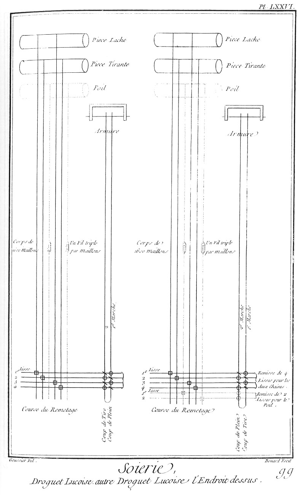

SOIERIE - TROISIEME SECTION,
============================

Concernant les Etoffes brochées & celles où le fond fait la figure.

PLANCHE LX,
-----------

signée o.

Figure
1. Elévation perspective du métier pour fabriquer les étoffes brochées & celles où le fond fait la figure, le métier étant garni de tous les cordages & agrêts qui en dépendent.
	- A B, un des deux piliers de devant que l'on a fracturé pour laisser voir le battant du métier.
	- a b, second pilier de devant; entre les deux piliers on voit le siége de l'ouvrier.
	- C D, c, les estazes qui sont traversées par les tenons supérieurs des montans; elles sont aussi réunies l'une à l'autre par les clés qui les traversent l'une au-devant & l'autre au-derriere du métier.
	- E F, un des deux piliers de derriere. Toute cette cage est affermie par des ponteaux ou êtresillons, tels qu'on en voit près de la lettre D, au nombre de deux à chaque angle du métier; les uns buttent contre les murailles & les autres contre le plancher.
	- L K, l'ensouple de devant sur laquelle s'enroule l'ouvrage à mesure qu'il est fait.
	- K, rochet qui fixe l'ensouple de devant.
	- s s, l'ensouple de derriere sur laquelle la chaîne est tendue.
	- x y, le battant.
	- x x, y y, le haut des lames du battant; au-dessous de ces lettres on voit les acocats par lesquels le battant est suspendu à son bâton.
	- m m, le brancard du carette double.
	- f f, les fourches dans les entailles desquelles les ailerons e g, e g sont placés.
	- h h, les chevalets du dedans sur lesquels posent les bouts des ailerons qui suspendent les lisses de fond.
	- h h, autres chevalets sur lesquels reposent les ailerons qui suspendent les lisses de liage.
	- 3 3, 4 4, lisserons supérieurs de deux des lisses.
	- 8, une des arbalêtres attachée au lisseron inférieur de chaque lisse de liage; l'arbalêtre est tirée par une des marches au moyen de la corde 8 9, nommée étriviere.
	- N Q, N q, les marches.
	- M, pierre qui charge la caisse des marches.

Derriere le carette on voit le cassin H, sur les poulies duquel passent les cordes H S T, qui toutes ensemble composent ce qu'on appelle le rame.
	- T, bâton du rame. T V X, les crémailleres du  rame.
	- X, treuil, par le moyen duquel on tend les cordes du rame, & par ce moyen on releve les maillons qui sont suspendus aux arcades qui terminent chaque corde du rame, les branches des arcades traversent la planche percée n n, descendent ensuite perpendiculairement pour s'attacher en o o aux mailles supérieures des maillons dans lesquels la chaîne ou le poil de l'étoffe est passée.
	- 5 6, aiguilles de plomb suspendues à la maille inférieure de chaque maillon.

Parallelement au rame est tendue horisontalement une corde Y Z AE, que l'on nomme arbalêtre de la gavassiniere du sample. Cette corde attachée fixément à un crochet Y, après avoir passé sur la poulie AE, descend verticalement le long de la muraille, & va s'attacher à un clou, ou bien elle est chargée d'un poids convenable pour la tenir suffisamment tendue, du point Z de l'arbalêtre, descend verticalement une autre corde en double Z R, que l'on nomme gavassine. Cette corde est attachée à une des extrémités du bâton R du sample R S, composé d'autant de cordes paralleles entre elles qu'il y en a au rame; quelques-unes de ces cordes étant séparées des autres par le lac qui les entoure, & ensuite tirée en-bas, abaissent les cordes du rame qui leur correspondent, & font élever au-dessus de la chaîne quelques-uns des fils qui la composent; on voit quelques-uns de ces fils levés près de l'ensouple, & c'est par-dessous ces fils levés que l'on passe les espolins chargés de la soie qui doit former la fleur de l'autre côté de l'étoffe.

2. Escabeau ou échelle pour monter au haut du métier.

PLANCHE LXI,
------------

signée p.

Elévation latérale du métier pour fabriquer les étoffes brochées, ou celles où le fond fait la figure, si l'étoffe n'est point brochée.
	- A B, un des deux piliers de devant.
	- E F, un des deux piliers de derriere.
	- C D, une des deux estazes. C & D, extrémités des clés qui assemblent les deux estazes.
	- X Y, une des deux banques qui soutiennent l'ensouple de devant.
	- T V, un des deux oreillons qui retiennent l'ensouple.
	- K, extrémité de l'ensouple garnie du rochet denté.
	- Z, chien ou valet pour fixer le cric.
	- T, 9, 10, S, la chaîne ployée sur l'ensouple de derriere S.
	- 9, 10, les envergures ou baguettes par lesquelles les fils de la chaîne sont encroisés.
	- N, caisse des marches.
	- M, pierre dont elle est chargée pour le rendre stable.
	- N Q, les marches au-devant desquelles on voit une portion du sample.
	- r r, deux pitons arrêtés au plancher.
	- R R, bâton du sample.
	- p p, portion des cordes montantes du sample que l'on a rompues pour laisser voir le corps de maillon o, o: 5, 5, qui auroit été caché par le sample.

Près l'ensouple de devant on voit le battant.
	- y, la masse du battant.
	- x, sa poignée; c'est entre ces deux pieces que le peigne est placé.
	- x x, le haut d'une des deux lames du battant.

Au-dessus des estazes du métier & près le battant est placé le carette.
	- m m, extrémité des brancards du carette.
	- h h, montans d'un des chevalets.
	- f f, cheville de fer qui traverse les fourches & les ailerons auxquels les lisses sont suspendues.
	- 3, 3: 4, 4, lisses de liage au nombre de quatre.
	- 1, 1: 2, 2, lisses de fond ou de piece au nombre de huit.
	- 7, 7, traverses ou arbalêtres, dont les extrémités répondent aux extrémités extérieures des ailerons, comme on verra dans une des Planches suivantes:
	- 8, 8, contrepoids pour remettre les lisses en situation après que l'action des marches les a élévées pour celles du fond, ou abaissées pour celles du liage, lorsqu'on leve le pié de dessus la marche.

Près le carette est le cassin L H H L.
	- L, L, extrémités des brancards du cassin L H.
	- L H, les montans inclinés du cassin.
	- I I, le rang inférieur des poulies du cassin; les autres rangs sont cachés par la queue du rame projettée en raccourci sur le cassin.
	- T T, bâton du rame auquel les cordes qui le composent sont attachées par un noeud qu'on trouvera dans une des Planches suivantes.

Au-dessous du cassin est suspendue la planche percée n n, que les branches des arcades traversent; à l'extrémité inférieure o o des branches des arcades, sont attachées les mailles supérieures des maillons, dans lesquels la chaîne T S est passée; à la partie inférieure de chaque maillon est attachée une des aiguilles de plomb 5 6, 5 6, qui servent à abaisser les fils de la chaîne lorsqu'on lâche le lac qui les avoit tenu élevés.

PLANCHE LXII,
-------------

signée q.

Elévation géométrale du devant du métier pour fabriquer les étoffes brochées, ou celles dont le fond fait la figure.

Fig. 1. Elévation du devant du métier.
	- A B, a b, les piliers de devant.
	- L K, l'ensouple de devant.
	- l k, l'étoffe fabriquée enroulée sur l'ensouple.
	- x y, poignée du battant, au-dessous de laquelle on voit une partie du peigne.
	- x, x x: y, y y, les lames du battant. Derriere le battant est le carette, m m, brancard du carette.
	- f f, les fourches qui reçoivent les ailerons e f g, e f g.
	- h, h, chevalets extérieurs du carette double.
	- k k, chevalets intérieurs.
	- g 3, g 3, cordes qui suspendent les lisses.
	- 3, 3, lisseron d'en-haut.
	- 4, 4, lisseron d'en-bas.
	- 4, 8, 4, arbalêtres qui sont tirées par les marches au moyen des étrivieres par lesquelles elles sont suspendues.
	- 8 8, contrepoids qui abaissent les lisses auxquels ils sont attachés.
	- Q q, extrémités antérieures des marches sur lesquelles l'ouvrier pose le pié.

Derriere le carette est le cassin, & derriere les lisses le corps des maillons.
	- H, le haut du cassin garni de huit rangs de poulies; on voit l'extrémité des broches qui les traversent.
	- I S T, le rang inférieur des cordes du rame.
	- T, le bâton du rame.
	- V, second bâton sur lequel passent les cordes nommées crémailleres du rame, qui vont s'enrouler sur le treuil X.

Au-dessous des poulies du cassin sont les arcades, dont les branches en s'écartant les unes des autres  vont traverser la planche percée n n; les branches descendent ensuite perpendiculairement jusqu'en o o, où elles sont liées aux mailles supérieures des maillons dans lesquels la chaîne est passée.
	- 5, 6: 5, 6, aiguilles de plomb attachées à la maille inférieure des maillons.

Au-devant du pilier A B du métier, on voit la pince ou pié-de-biche 10, 11, 12 qui sert à l'ouvrier à tourner l'ensouple de devant à mesure que l'ouvrage avance.
	- 12, extrémité du pié-de-biche qui entre dans un des trous k de l'ensouple.
	- 11, boule qui empêche le pié-de-biche d'entrer trop avant.
	- 10, partie formée en pié-de-biche.

2. Dessein de cinq couleurs différentes sur du papier de 8 en 12, dont la lecture est expliquée à l'article Velours dans l'Encyclopédie; chaque ligne verticale ou plutôt un des espaces qui les séparent, représente un des fils de la chaîne; de même chaque espace horisontal représente un coup de navette.
	- A B C D, premiere division du dessein.
	- C D E F, seconde division, ainsi de suite jusqu'à la quatorzieme division d e f g, dont le dernier coup de navette f g doit se raccorder & faire suite au premier coup A B, dont la largeur répond à cent fils contigus de la chaîne & la hauteur à cent soixante huit coups de navette, pour chacun desquels on tire les lacs qui se rencontrent sur la ligne horisontale qui les représente.

Au-dessous de cette figure, on a marqué dans des carreaux les différentes hachures qui représentent les différentes couleurs des soies, dont les espolins doivent être garnis.

PLANCHE LXIII,
--------------

signée r.

Elévation & développement du cassin.

Fig. 1. Le chassis du cassin dégarni de toutes les pieces qui en dépendent & vu en perspective.
	- A B, a b, les longs côtés du cassin.
	- C c, D d, les deux traverses; chacune de ces traverses a une feuillure pour recevoir les lames qui servent à espacer les poulies du cassin.
	- B b, les tenons coupés obliquement qui assemblent le chassis sur le brancard.

2. Les deux regles qui recouvrent les lames du cassin.
	- I i, regle qui s'applique sur la traverse C c.
	- H h, regle qui s'applique sur la traverse inférieure D d.

3. Le chassis du cassin vu en plan & garni de quatre cens poulies en huit rangs, de cinquante chaque.
	- 1, 1, premier rang de poulies ou rang inférieur.
	- 2, 2, second rang.
	- 3, 3, troisieme rang; entre le second & le troisieme rang est un rang de patenôtres, dont l'usage est de maintenir le parallelisme des lames; il y a un semblable rang de patenôtres entre le quatrieme & le cinquieme rang de poulies, & entre le sixieme & le septieme; deux autres rangs semblables sont aussi placés vers les extrémités des lames près les regles I i, H h, qui les assujettissent dans les feuillures des traverses C c, D d du chassis, dont les longs côtés sont marqués des mêmes lettres que dans la figure précédente.

4. Extrémité du brancard sur lequel le chassis du cassin est assemblé.
	- A A, B B, extrémités des longrines du brancard qui sont posées sur les estazes du métier; elles sont assemblées l'une à l'autre par des traverses, dont on voit les tenons.

5. Coupe du chassis du cassin par le milieu de sa largeur.
	- A B, un des longs côtés du chassis.
	- C, traverse supérieure:
	- D, traverse inférieure, dans les feuillures desquelles sont placées les lames.
	- h i, regles qui recouvrent les lames.
	- H i, lame séparée sur laquelle on a représenté les huit poulies d'un même rang vertical.
	- 1, 2, 3, 4, 5, 6, 7, 8, les huit poulies.

6. Fragment d'un cassin représenté en plan dans la grandeur effective qu'il a. Ce fragment contient la moitié de la longueur des lames.
	- a a, rang de patenôtres près l'extrémité supérieure des lames.
	- b b, c c, rang de poulies.
	- d d, autre rang de patenôtres.
	- e e, f f, deux autres rangs de poulies.
	- g g, autre rang de patenôtres, placé entre les deux rangs suivans de poulies, ainsi de suite jusqu'au bas du cassin. Il faut observer que les patenôtres sont un peu plus épaisses que les poulies, pour que ces dernieres roulent facilement entre les lames 1, 2, 3, 4, 5, 6, 7, 8, & que toutes les patenôtres du même rang sont enfilées d'un fil de fer, & les poulies par une baguette de bois; il y a des cassins de mille six cens poulies & même de deux mille quatre cens.

Fig. 7. Fragment d'une des lames vue en plan & dans sa grandeur effective aussi-bien que les poulies.
	- A, patenôtre.
	- B, C, poulies.
	- D, patenôtres.
	- E, F, poulies.
	- G, patenôtres; toutes les poulies sont de buis, aussi-bien que les patenôtres.

8. Trois patenôtres en perspective.
	- A A A, les patenôtres enfilées par la broche ou fil de fer a a.

9. Une des poulies en perspective & en profil.
	- B b, la poulie en perspective.
	- C c, la poulie en profil, la gorge de la poulie a environ deux lignes de profondeur.

PLANCHE LXIV,
-------------

signée s.

Développement des cordes de rame & de sample, & leur action sur les fils de la chaîne des étoffes brochées.

Fig.
1. Effet du sample & du rame sur la chaîne des étoffes.
	- T, bâton du rame, comme dans la Planche LX.
	- T S H G, corde du rame qui est abaissée par la corde S V M R du sample.
	- S s, yeux de perdrix ou petits anneaux de laiton dans lesquels les cordes du rame sont passées.
	- S V, s u, boucle de la corde du sample; les noeuds V & u doivent descendre plus bas d'un demi-pié environ, que le point de plus grand abaissement des cordes du rame, pour éviter que le noeud n'accroche & fasse baisser une autre corde du rame que celle à laquelle la corde du sample répond.
	- R R, bâton du sample auquel les cordes sont attachées par un noeud qu'on trouvera dans une des Planches suivantes.

Après que les cordes T S H G ou T s H g du rame ont passé sur les poulies H du cassin, on y suspend les arcades p 1 G, p 2 G, p 3 G, p 4 G qui traversent la Planche percée E e F f, cotée n n dans la Planche LX; aux extrémités inférieures p p p p des arcades, on suspend les mailles supérieures p n, p n, p n, p n des maillons n, n, n, n que les fils a, c, e, g de la chaîne traversent; & à la partie inférieure des maillons de verre n, n, n, n, on suspend par une seconde maille n 7, n 7 les aiguilles de plomb 7, 8: 7, 8: qui servent à abaisser les maillons; lorsque l'action de la main M sur les cordes du sample vient à cesser, c'est l'état où sont représentés les quatre autres maillons m, m, m, m qui sont abaissés par les aiguilles 5, 6: 5, 6, qui tirent en même tems les mailles supérieures m o, m o, m o, m o, qui tirent aussi en en-bas les quatre branches d'arcades o g, o g, o g, o g, ce qui fait relever la seconde corde de rame, & l'extrémité supérieure s de la seconde corde de sample s R.
	- A A, partie de l'ensouple de devant sur laquelle l'ouvrage fait s'enveloppe.
	- B, partie de l'ensouple de derriere sur laquelle la chaîne est ployée.
	- C D, les envergures qui tiennent les fils de la chaîne encroisés. On a seulement représenté huit fils de la chaîne pour éviter la confusion, & de ces huit fils les quatre qui sont levés & qui levent à-la-fois, sont les fils semblables des quatre répétitions du dessein dans la largeur de l'étoffe; & c'est à faire répéter le même dessein plusieurs fois dans la largeur de l'étoffe que les arcades sont particulierement destinées.

2. Partie de l'étoffe brochée vue du côté de l'envers & au miscroscope. Dans cette figure on n'a point détaillé le fond de l'étoffe pour éviter la confusion; on a seulement représenté les soies des espolins qui paroissent à l'envers de l'étoffe, & qui  semblent de ce côté n'avoir aucune adhérence avec elle; les fils levés le sont par l'action de la main sur les cordes de sample qui leur correspondent, comme on voit en M, fig. 1; les fils sont numérotés de suite, comme on voit dans la figure.

- A, Espolin garni de soie, qui doit passer sous les fils 38, 39, 40, 41, 42, 43. Cette soie doit paroître du côté de l'endroit.

- B, Espolin garni aussi de soie d'une couleur différente, qui doit passer sous les fils levés 23, 24, 25, 27, 28, 29, 31, 32, 33, pour former du côté de l'endroit trois apparences de la même couleur.

- C, Espolins passés en partie sous les fils 13, 14: 16, 17, 18, & former du côté de l'endroit deux apparences de la couleur dont il est garni.

- D, autre espolin qui a entierement passé sous les fils levés 3, 4, 5: 7, 8, pour paroître en deux endroits de l'autre côté de l'étoffe.

Après que tous les espolins sont passés, on lâche les cordes du sample, tous les fils de la chaîne se remettent de niveau; alors faisant agir une des lisses de fond, on passe un ou deux coups de grandes navettes qui traversent l'étoffe d'une lisiere à l'autre, ensuite on tire le lac suivant, qui fait lever de nouveaux fils, sous lesquels on passe de même les différens espolins qui se trouvent dans la largeur de l'étoffe.

PLANCHE LXV,
------------

signée t.

Lacs; lac à l'angloise, lacs du sample & formation d'un lac.

Fig.
1. &
2. Les cordes verticales sont supposées être une portion de celles du sample séparées du reste du même sample, ainsi que le dessein l'indique, pour pouvoir dans le courant de la fabrication de l'étoffe, retrouver facilement les mêmes cordes; on les entoure d'un fil dont les différentes boucles forment ce que l'on appelle un lac.

Pour former le lac à l'angloise, tenant un des bouts a du fil destiné à le former, on conduit ce fil par b derriere la corde du sample, & on l'amene en devant pour former une boucle c sur un doigt de la main gauche; on conduit ensuite le rochet ou bobine derriere la seconde corde d, & on le ramene sur le doigt pour former une autre boucle e, & ainsi de suite, jusqu'à ce qu'on ait formé autant de boucles qu'il y a de cordes du sample à renfermer dans le même lac en suivant l'ordre des lettres alphabétiques, & que la derniere corde u y soit renfermée; alors on coupe le fil à lacs, on noue ensemble les deux extrémités a & y, on égalise ensuite toutes les boucles.

2. Noeud de la gavassine, qui renferme en a y toutes les boucles du lac.
	- A, extrémité de la gavassine.
	- B, partie rompue de la gavassine qu'il faut supposer prolongée. Dans cette figure on n'a pas tordu sur elles-mêmes les différentes boucles du lac, ainsi qu'elles doivent l'être, & que la fig. 5. le représente, afin d'éviter que leur tortillement ne fît confusion avec le noeud de la gavassine.

3. Partie inférieure du sample.
	- R R, bâton du sample sur lequel les différentes cordes qui le composent sont arrêtées par un noeud qu'on trouvera dans la suite.
	- A & B, les deux extrémités de la même corde A E F B, nommée gavassiniere; cette corde passe au-dessus de l'arbalêtre en Z, Pl. LX. & sert de guides aux gavassines.
	- a b c d e f g h i k, différentes couples des cordes du sample.
	- G H I K L, cordes, nommées chapelets, qui tiennent les différentes gavassines séparées les unes des autres.
	- G M N, G M O, une gavassine; une des deux cordes de la gavassiniere passe dans la boucle de la gavassine, & ses deux branches au-delà du noeud M passent l'une devant & l'autre derriere la seconde corde de la gavassiniere.

P Q, P R, Gavassine, à chacune des extrémités de laquelle répond un lac; le premier lac q Q q renferme les cordes 4, 7, 10, 15, 16, 17, en les coulant dans le même ordre que celui des lettres a b c d e f g h i k; le second lac r R r comprend les cordes 2, 2, 9, 11, 13 & 15, en comptant aussi du même côté.

La gavassine I S T, I S V correspond aussi à deux lacs. Le premier t T t renferme les cordes 1, 6, 11, 15, 16, 18; & le second les cordes 4, 6, 7, 9, 14, 15, 18, 19 & 20. La gavassine suivante K X Y, K X Z renferme dans le premier lac y Y y, la 2, 4, 8, 10, 11, 15, 17 & 19e corde du sample, & dans le second z Z z, la 1, 3, 9, 11, 13, 17 & 20e corde, ainsi de suite prenant pour chaque lac les cordes indiquées par le dessein qui se répete autant de fois dans la largeur de l'étoffe, qu'il y a de branches aux arcades.

Fig.
4. & suivantes. Formation du dernier lac de la figure précédente.
	- Z z z Z, le lac à l'angloise, dont les boucles renferment la 1, 3, 9, 11, 13, 17 & 20e corde du sample; les boucles Z Z étant égalisées de longueur.

5. Les différentes boucles du lac tordues sur elles-mêmes.

6. Le même lac dont les boucles, après avoir été tordues sur elles-mêmes, sont reployées pour former une nouvelle boucle double, dans laquelle passe une des branches A de la gavassine.
	- K X D C B A, B, noeud dans lequel on repasse le bout A de la gavassine, qui est ensuite arrêtée par un noeud dont on trouvera la formation dans une des dernieres Planches.
	- X, noeud de la gavassine.
	- K, boucle dans laquelle passe un des deux cordons de la gavassiniere, l'autre corde passant entre les deux branches de la gavassine, comme on le voit dans la fig. 3.
	- Y, seconde branche de la gavassine qui va s'attacher à un autre lac, le nombre des lacs dépend de l'étendue du dessein & du nombre des couleurs dont il est composé.

PLANCHE LXVI,
-------------

signée u. Construction de la machine pour la tire.

Lorsque le dessein qu'il faut exécuter sur l'étoffe comprend une grande largeur, ou qu'il est répété un grand nombre de fois dans le large de l'étoffe, les lacs comprennent alors un grand nombre des cordes du sample qui répondent, comme on l'a vu dans l'explication de la Planche LXIV. à un grand nombre d'aiguilles de plomb qu'il faut lever toutes à-la-fois; dans ce cas la main M du tireur ne suffit pas pour lever toutes les aiguilles, c'est pour soulager cet ouvrier que la machine que nous décrivons a été inventée.

Fig.
1. La machine en perspective.
	- A B, C D, les patins qui supportent les deux montans.
	- E F, traverse ou entretoise inférieure.
	- G H & I K, jumelles ou traverses supérieures paralleles entre elles, formant comme un établi de tour.
	- L M N O, coulant supporté par quatre roulettes.
	- L & N, deux semblables roulettes M placées au dessous des jumelles empêchent que le coulant ne puisse sortir d'entre elles, & les roulettes font qu'il peut facilement couler à droite ou à gauche.
	- L N R, P S, les fourches faites de quelque bois dur & poli.
	- N T, levier.
	- Q, entretoise qui assemble le levier N T avec la piece P. Toutes ces pieces peuvent tourner autour de la ligne R L, ensorte que le levier N T, qui est vertical, puisse devenir-antérieurement horisontal après que les cordes du sample, comprises dans le lac qu'il faut tirer, sont engagées entre les deux fourches de cette machine, comme on le verra dans la Planche XCI. qui est la premiere de la section du velours. Dans la Planche XCII. on verra la même machine dans l'instant du passage de la fourche supérieure derriere les cordes du sample, comprises dans le lac qu'il s'agit de tirer.

2. Le coulant vu en géométral, & dégarni de ses poulies. 
	- L M, N O, les deux poupées ou jumelles du coulant assemblées l'une à l'autre par une forte entretoise.
	- n, l, trous pour recevoir l'axe des quatre roulettes supérieures.
	- m, trou pour recevoir l'axe des deux roulettes inférieures.

Fig.
3. Le levier & le coulant vus du côté de la pointe des fourches.
	- R, fourche inférieure qui passe antérieurement à toutes les cordes du sample.
	- S, fourche supérieure qui passe postérieurement aux cordes du sample que le lac a séparé de la totalité de celles qui le composent; c'est pour faciliter l'introduction de la fourche supérieure S, derriere les cordes comprises dans le lac, que cette fourche est placée plus près du bord de la palette du levier; ensorte qu'une corde verticale peut passer entre ces deux fourches sans toucher à l'une ni à l'autre: c'est dans cet état que la machine est représentée dans la Planche XCII.

4. Les deux fourches représentées séparément.
	- P S, fourche supérieure.
	- 1, assiette ou portée faite au tour (ainsi que toutes les autres parties) qui appuie contre une des faces de la palette du levier;
	- 2, partie taraudée en vis, qui est reçue dans la piece P de la fig. 1.

La fourche inférieure L R a une semblable portée 4, une semblable vis 3, & un tourillon qui est reçu dans la poupée L de la fig. 1. la partie arrondie 3, 4: passe dans un trou pratiqué à l'autre poupée N.

PLANCHE LXVII,
--------------

signée x.

Fig.
1. Nouvelle machine pour la tire. Cette machine differe de la précédente en ce qu'il n'y a point de coulant à faire marcher à droite & à gauche pour passer la fourche supérieure derriere les cordes du sample tirées par le lac, ce qui fatigue moins la tireuse.
	- A a, B b, les patins.
	- A C, B D, les montans.
	- E F & G H, deux entretoises ou traverses qui affermissent les montans parallelement entre eux.
	- r r, pitons attachés au plancher.
	- R R, bâton du sample.
	- R S, R S, les cordes du sample. On a supprimé dans cette figure la gavassiniere, le chapelet, les gavassines & les lacs, comme inutiles pour faire entendre l'effet de la machine, & pour ne point embrouiller la figure; il faut au reste les supposer dans l'état où la fig. 3. de la Planche LXV. les représente.
	- I K, bâton qui sert de point d'appui aux cordes du sample; il entre du côté I dans un trou circulaire, & du côté K dans l'entaille L K après qu'on a placé la machine derriere le sample.
	- M N, cheville ou bâton supérieur; ce bâton qui peut rentrer dans le tuyau ou canon O P, supporté par le lien P Q en coulant dans le pit on N, est la piece qui tient lieu de la fourche supérieure de la fig. 1. de la Planche précédente, & l'autre bâton I K tient lieu de la fourche inférieure.

Le bâton N M, après avoir passé derriere les cordes du sample que le lac a tirées, est reçu du côté de M dans le crochet du levier M R, mobile au point 1 & 2; ensorte que faisant décrire au levier 1 R un quart de cercle en-devant, les cordes du sample antérieures au bâton M N sont tirées & ployées sur le bâton inférieur I K, ce qui les accourcit d'autant, & leur fait tirer les cordes du rame qui leur correspondent; les cordes du rame tirent les arcades & les maillons qui y sont attachés. Par le moyen de l'une ou de l'autre de ces machines, la tireuse a un avantage considérable pour vaincre le poids des aiguilles de plomb suspendues aux maillons, les leviers N T & 1 R dans les deux machines; leviers qui sont du second genre, donnant cette analogie. L'effort que fait la tireuse est au poids des aiguilles qu'il faut lever, comme la distance entre les deux bâtons est à la longueur totale du levier; d'où l'on voit que l'effort de la tireuse sera d'autant moindre, que les deux fourches seront plus près l'une de l'autre, ou que le levier sera plus long.

2. Ferrure ou bascule du levier.
	- 1 & 2, les tourillons qui sont reçus dans des trous pratiqués aux faces intérieures des montans.
	- 3, 4, piece coudée pour laisser passer le sample; cette partie coudée fait par son poids équilibre avec le levier & tend à le relever.
	- N, piton dans lequel passe & coule le bâton supérieur.
	- M, crochet qui reçoit l'autre extrémité du bâton.
	- M R, soie qui est reçue dans le manche de bois du levier de la fig. 1. toute cette piece est de fer, & forgée d'une seule piece.

PLANCHE LXVIII,
---------------

signée y. Développement des lisses de fond.

Fig.
1. Une lisse de fond suspendue au carette double, & garnie de tous les cordages qui en dépendent.
	- 1, 1, lisseron d'en-haut.
	- 2, 2, lisseron d'en-bas.
	- s s, ligne où se trouve la jonction des mailles.
	- m m, brancards du carette.
	- f f, les fourches dans les entailles desquelles sont placés les ailerons g e, g e.
	- k k, chevalets sur lesquels reposent les bouts des ailerons pour empêcher la lisse de descendre plus bas que le point convenable.
	- h h, autres chevalets pour limiter la descente des queues e e des ailerons.
	- 7, 7, traverse ou arbalêtre.
	- 9, 10, étriviere par laquelle la marche P Q est suspendue à l'arbalêtre.
	- 8, 8, poids de plomb ou carreaux de terre cuite, ou billots de bois suspendus au lisseron inférieur 2, 2, pour faire baisser la lisse lorsque l'ouvrier lâche le pié de dessus la marche; car il est visible que l'action du pié de l'ouvrier sur la marche P Q fait baisser la marche, la marche fait baisser l'arbalêtre qui, par ses extrémités 7, 7 & les cordes 7 e, 7 e, tire en-bas les extrémités e & e des ailerons, ce qui fait lever la lisse.

2. Maille de lisse vue au microscope.
	- l l, fils de la maille d'en-haut.
	- L L, fils de la maille d'en-bas; l'une & l'autre faite de fil retordu en plusieurs brins.
	- A C, fil de la chaîne passé dessous la maille B. C'est ainsi que les fils sont passés dans les lisses de rabat ou les lisses de liage. Cette maniere de passer les fils est représentée dans les différens remettages par ce caractere Π.

3. Autre maniere de passer les fils de la chaîne dans les lisses.
	- l l, maille d'en-haut.
	- L L, maille d'en bas.
	- A C, fil de la chaîne passé dessus la maille B. C'est ainsi que les fils de la chaîne sont passés dans les lisses de satin, & plusieurs autres. Cette maniere de passer en lisse est représentée dans les différens remettages par ce caractere . Dans ces deux figures, on a cordé le fil de la maille inférieure de la lisse pour le distinguer plus facilement du fil de la maille supérieure, les unes & les autres étant faites du même fil.

PLANCHE LXIX,
-------------

signée z. Développement des lisses de liage.

Fig.
1. Lisse de liage suspendue au carette double.
	- 3, 3, lisseron d'en-haut.
	- 4, 4, lisseron d'en-bas.
	- s s, jonction des mailles. 4, 8, 4, arbalêtre.
	- 8, 9, étriviere par laquelle la marche p q est suspendue aux extrémités g des ailerons g e, g e.
	- m m, brancard du double carette.
	- f, f, les fourches dans les entailles desquelles les ailerons sont placés.
	- k k, chevalets sur lesquels les extrémités des ailerons viennent reposer lorsque le pié enfonce la marche.
	- h, h, chevalets sur lesquels les queues des ailerons reposent étant tirées en-bas par les poids 10, 10 suspendus par des cordes e 10, e 10 aux queues des ailerons.

Les fils qui font le liage sont passés dans ces sortes de lisses, comme la fig. 2. de la Planche précédente le fait voir.

2. Maille de lisse vue au microscope.
	- l l, fils de la maille supérieure.
	- L L, fils de la maille inférieure.
	- A C, fil de la chaîne passé dans la maille B, c'est- à-dire dessus la maille supérieure & dessous la  maille inférieure. Cette maniere de passer les fils est représentée dans les différens remettages par ce caractere .

3. Maillon de verre vu aussi au microscope.
	- M m, le maillon.
	- o o, partie de la maille supérieure.
	- s s, partie de la maille inférieure, par lesquelles le maillon est attaché aux cordes des arcades par le haut & aux aiguilles de plomb par le bas.
	- A C, le fil de chaîne ou le fil de poil passé dans l'ouverture B du maillon; il y a des maillons d'une autre forme, & qui ont plusieurs trous.

PLANCHE LXX,
------------

signée a a. Taffetas façonné-simpleté, & Taffetas façonné-doublete.

Fig.
1. Taffetas façonné-simpleté, largeur onze vingt-quatriemes d'aune; chaîne cinquante portées simples pesant l'aune dix-huit deniers; poil vingt-cinq portées doubles même organsin dix-huit deniers; trame deuxieme sorte nette & égale une once, en tout l'aune pese deux onces douze deniers. Remisse de quatre lisses pour la piece de douze portées & demie chacune; remisse de deux lisses pour le liage du poil de douze portées & demie chacune. Les fils, tant de la chaîne que du poil, sont passés dans leurs lisses, comme le fil A C dans la maille B, fig. 2. Planche LXIX. Peigne de vingt-cinq portées ou mille dents, quatre fils de piece & deux fils de poil dans chaque dent.
	- A, marches de piece; il faut passer les deux coups de navette sur le même lac.
	- B, marches du liage.

Nota. Quand on a passé une vingtaine de coups de navette pour lé taffetas, on marche la premiere marche du liage, & on passe un coup de navette d'organsin, vingt autres coups après, on passe la même navette sur la seconde marche.

Fig. 2. Taffetas façonnés-doubletés: on entend par taffetas façonné-doubleté ceux où il y a deux couleurs dans la fleur; elles se font sur le même lac par le moyen de deux corps de maillons. Le poil est ourdi en fils doubles, un fil d'une couleur dessus & un fil de l'autre couleur dessous, ce qui fait cinquante portées doubles de poil. Pour ce qui concerne les chaînes, remisses & peignes, voyez à l'article des taffetas façonnés-simpletés qui précede. Le dessein est fait sur du papier de huit en dix, le huit en largeur & le dix en hauteur, l'endroit se fait de ssus, & on lit ce qui est peint sur le dessein.

PLANCHE LXXI,
-------------

signée b b. Taffetas broché & liséré avec un liage de 3 le 4.

Dans le remisse composé de quatre lisses pour le taffetas, la chaîne est passée sur la maille, comme dans la fig. 3. de la Planche LXVIII.

Dans le remisse de quatre lisses pour le rabat, la chaîne est passée sous la maille, comme dans la fig. 2. de la même Planche LXVIII.

Dans le remisse de quatre lisses pour le liage, les fils de la chaîne qui y sont passés le sont aussi, comme dans la fig. 2.

- a Marche sur laquelle on passe le premier coup de navette à deux bouts.

- b Marche sur laquelle on passe le second coup, ou coup de liseré à quatre bouts.

- c Marche sur laquelle on passe le troisieme coup en plein aussi à quatre bouts de trame dans la navette.

Pour la composition de cette étoffe, voyez l'article des gros de Tours.

PLANCHE LXXII,
--------------

signée c c. Gros de Tours liseré & broché avec un liage de 4 le 5.

Dans le remisse de quatre lisses pour le gros de Tours les fils de la chaîne sont passés sur la maille, comme dans la fig. 3. de la Planche LXVIII.

Dans le remisse de quatre lisses pour le rabat les fils sont passés, comme dans la fig. 2. de la même Planche LXVIII.

Dans le remisse des quatre lisses pour le liage, les fils qui y sont passés le sont comme dans la fig. 2. de la même Planche.

- a Premiere marche, premier coup de plein.

- b Deuxieme marche, premier coup de liseré.

- c Troisieme marche, second coup de plein.

- d Quatrieme marche, second coup de liseré.

- e Cinquieme marche, troisieme coup de plein.

- f Sixieme marche, troisieme coup de liseré.

- g Septieme marche, quatrieme coup de plein.

- h Huitieme marche, quatrieme coup de liseré. Les marchettes ou marches du pié gauche.

- i Premiere marchette, après le premier coup de liseré b.

- k Seconde marchette, après le second coup de liseré d.

- l Troisieme marchette, après le troisieme coup de liseré f.

- m Quatrieme marchette, après le quatrieme coup de liseré h.

Les gros de Tours liserés & brochés avec un liage de 4 le 5 peuvent se faire du poids de deux onces & demie jusqu'à six onces & plus. Sans être brochés; on en fait de 40, 45, 50, 60, 80, 90, 100, 120 portées, suivant le corps que l'on veut donner à l'étoffe, & ils sont tous très-bons dans leurs especes, mais de différens prix. Largeur, onze vingt-quatriemes d'aune; chaîne quarante-cinq portées doubles, organsin parfait tirage pesant deux onces l'aune; trame pour le coup de fond, deuxieme sorte, pesant une once six deniers; trame pour le coup de liseré, premiere sorte, dix-huit deniers; sans les brochés qui sont arbitraires, quatre onces en tout. Remisses de quatre lisses de onze portées un quart chacune pour lever la chaîne; remisse de quatre lisses de onze portées un quart chacune pour rabatre la chaîne; remisse de quatre lisses de deux portées un quart chacune pour le liage; peigne de vingt-deux portées & demie ou neuf cens dents, à quatre fils par dent; fil & broché en dorure, mettez un peigne de dix-huit portées ou sept cens vingt dents & cinq fils par dent.

Pour un gros-de-Tours composé de 40 portées de chaîne, un peigne de 20 portées à quatre fils par dent.

Pour 45 portées de chaîne, un peigne de 22 portées & demie à quatre fils par dent ou un de 18 portées à cinq fils.

Pour 50 portées de chaîne, un peigne de 25 portées à quatre fils par dent.

Pour 60 portées de chaîne, un peigne de 20 portées à six fils par dent.

Pour 80 portées de chaîne, c'est-à-dire 40 portées doubles, un peigne de 20 portées à six fils par dent.

Pour 90 portées de chaîne, c'est-à-dire 45 portées doubles, même peigne qu'à 45 portées simples.

Pour 100 portées de chaîne, c'est-à-dire 50 portées doubles, un peigne de 20 portées à cinq fils par dent.

Pour 120 portées de chaîne, c'est-à-dire 60 portées doubles, un peigne de 20 portées à six fils par dent.

PLANCHE LXXIII,
---------------

signée d d. Gros de Tours broché avec un liage de 4 le 5.

Dans le remisse de quatre lisses pour le gros de Tours, les fils de la chaîne sont passés comme dans la fig. 3. de la Planche LXVIII.

Dans le remisse de quatre lisses pour le rabat, les fils de la chaîne sont passés comme dans la fig. 2. de la même Planche LXVIII.

Dans le remisse de quatre lisses pour le liage, les fils qui y sont passés le sont comme dans la fig. 2. de la même Planche.

Après le premier coup de plein, il faut abaisser la premiere marchette du pié gauche; après le second coup de  plein, il faut abaisser la seconde marchette, ainsi de suite: de maniere que la course des quatre marchettes répond alternativement à deux courses des marches du fond.

Pour la composition de cette étoffe, voyez l'explication de la Planche précédente.

PLANCHE LXXIV,
--------------

signée e e. Droguet satiné.

Le droguet satiné a de largeur onze vingt-quatriemes d'aune. La premiere chaîne est composée de vingt portées simples. La seconde chaîne, de vingt portées simples; cette chaîne s'emboit de deux aunes pour une; les deux chaînes pesent environ dix-huit deniers l'aune. Le poil contient quatre-vingts portées simples, pesant environ une once. La trame de Naples ou autre étrangere, pese deux onces six deniers; en tout quatre onces.

Remisses de quatre lisses de dix portées chacune pour le taffetas.

Remisses de huit lisses de dix portées chacune pour le satin.

Peigne de vingt portées ou huit cens dents; quatre fils de piece & huit fils de poil par dent.

Le corps de cette étoffe est monté sur trois ensouples, les deux premieres pour les deux chaînes, & la troisieme pour le poil.

Dans le remisse de quatre lisses pour les deux chaînes, les fils qui les composent sont passés dans la maille des lisses, comme le fil A C dans la maille B de la fig. 2. Planche LXIX.

Dans le remisse de huit lisses pour le poil qui fait le satin, les fils sont passés sur la maille, comme le fil A C sur la maille B fig. 3. Planche LXVIII.

- a, coup de tire.

- b, coup de plein.

- c, coup de tire.

- d, coup de plein.

- e, coup de tire.

- f, coup de plein.

- g, coup de tire.

- h, coup de plein.

- i, coup de tire.

- k, coup de plein.

- l, coup de tire.

- m, coup de plein.

- n, coup de tire.

- o, coup de plein.

- p, coup de tire.

- q, coup de plein, & ainsi de suite alternativement.

PLANCHE LXXV,
-------------

signée ff. Droguet lustriné double corps.

Le droguet lustriné à deux corps est celui où par le moyen d'un second corps on fait dans un seul lacs ce qui se doit faire en deux.

Le taffetas fin se fait par le remisse de quatre lisses, la chaîne n'est point passée dans le corps.

La lustrine se fait par le double corps, en tirant les mailles du premier corps au premier lac, & les mailles du deuxieme corps au deuxieme lac alternativement. Dans les endroits où le taffetas fin est découvert, on tire les mailles des deux corps qui enlevent toutes les chaînes qui couvrent le taffetas. Largeur, onze vingt-quatriemes d'aune.

Chaîne pour le satin & la lustrine passée dans les corps: sçavoir, deux fils passés dans le premier corps, deux fils dans le deuxieme alternativement, quatre-vingts portées simples organsin, pesant l'aune une once neuf deniers. La deuxieme chaîne pour le taffetas, laquelle est lardée à travers le corps, quarante portées simples même organsin, pesant l'aune dix-sept deniers. Trame de Naples lustrée ou autre même nature; il en entre par aune environ deux onces six deniers. L'aune d'étoffe pese environ quatre onces huit deniers. Remisse de quatre lisses pour le taffetas de dix portées chacune. Remisse de huit lisses pour le satin de dix portées chacune.

Dans le remisse de quatre lisses pour le taffetas, les fils de la chaine indiqués dans la figure par des traits, sont passés dans la maille comme dans la figure 2 de la Planche LXVIII.

Dans le remisse de huit lisses pour le satin & la lustrine, les fils du poil ou seconde chaîne indiqués par des lignes ponctuées, sont passés sur la maille comme dans la fig. 3. de la Planche LXVIII.

- a, premier lac.

- b, second lac.

- c, troisieme lac.

- d, quatrieme lac.

Peigne de vingt portées ou huit cens dents, huit fils de satin & quatre fils de taffetas dans chaque dent.

PLANCHE LXXVI,
--------------

signée g g. Droguet Lucoise.

Fig.
1. Le droguet Lucoise a trois ensouples, sçavoir deux ensouples pour la chaîne principale & une ensouple pour le poil. Largeur, onze vingt-quatriemes d'aune. La premiere chaîne est de vingt portées simples. La seconde chaîne est de vingt portées simples qui s'emboivent de la moitié, c'est- à-dire qu'il faut our dir deux aunes de chaîne pour faire une aune d'étoffe. Le poil, vingt portées triples même soie, qui doivent peser, sçavoir, les deux premieres chaînes environ dix-huit deniers, le poil même organsin environ l'aune dix-huit deniers; ensemble, une once douze deniers; trame de Naples pesant l'aune deux onces six deniers, en tout, trois onces dix-huit deniers l'aune.

Remisse de quatre lisses pour les deux premieres chaînes de dix portées chacune.

Dans le remisse de quatre lisses pour les deux chaînes, les fils sont passés dans les mailles comme le fil A C dans la maille B fig. 2. Planche LXVIII.

Peigne de vingt portées ou huit cens dents, quatre fils de pieces & deux fils de poil par dent.

Il s'en fait de plus forts & de plus légers, en diminuant ou augmentant le poids de la chaine & de la trame à proportion. Le dessein se fait sur du papier, de huit en onze, le onze en largeur & le huit en hauteur, & on lit le fond pour faire l'endroit dessous.

2. Droguet Lucoise qui se fabrique l'endroit dessus, à la différence du précédent, qui se fabrique comme presque toutes les étoffes l'endroit en-dessous.

Les deux chaînes de poil & la trame sont les mêmes que pour le droguet, fig. 1. & les fils des deux chaînes sont passés de la même maniere dans le remisse de quatre lisses; mais il y a de plus deux lisses pour lever le poil dans les mailles desquelles il est passé, comme le fil A C dans la maille B de la fig. 2. Planche LXVIII.

Pour ce genre d'étoffe, il faut lire ce qui est peint sur le dessein.

PLANCHE LXXVII,
---------------

signée h h. Espece de Persienne liserée.

Cette étoffe porte en largeur onze vingt-quatriemes d'aune.

La chaîne pour la piece qui est faite d'organsin à deux bouts, contient quarante portées & pese l'aune douze deniers.

Le poil du même organsin contient cinquante portées, qui pesent l'aune quinze deniers.

Trame de Pays deuxieme sorte, deux onces six deniers. En tout l'aune pese environ trois onces neuf deniers.

La chaîne est passée dans deux remisses chacun de quatre lisses. Dans le premier remisse, les fils de la chaîne sont passés sur la maille comme le fil A C sur la maille B, fig. 3. Planche LXVIII; & les mêmes fils sont passés dans le second remisse de quatre lisses sous la maille, comme le fil A C sous la maille B fig. 2. de la même Planche. 

Chacun des deux remisses de quatre lisses pour la piece ou chaîne, contient dix portées pour chaque lisses.

Le remisse pour le poil est composé de cinq lisses de dix portées chacune.

Le peigne contient vingt portées ou huit cens dents, à quatre fils de chaîne & cinq fils de poil entre chaque dent.

PLANCHE LXXVIII,
----------------

signée i i.

Lustrine courante. Si on veut du liseré, mettez un liage de 5 le 6 ou de 9 le 10.

La chaîne de cette étoffe est composée de quatre-vingt dix portées simples d'organsin, à deux ou trois bouts, & pese l'aune environ deux onces.

Trame pour la premiere navette, seconde sorte, deux onces.

Trame pour le liseré, si on en admet, seconde sorte, lustrée, une once. En tout, cinq onces l'aune.

Remisse de huit lisses pour le satin, contenant onze portées un quart chacune.

Remisse de quatre lisses pour la lustrine, de onze portées un quart chacune.

Dans le remisse de huit lisses, les fils de la chaîne sont passés sur la maille comme le fil A C sur la maille B, fig. 3. Pl. LXVIII.

Dans le remisse de quatre lisses pour la lustrine, les fils sont passés dessous la maille comme le fil A C dessous la maille B de la fig. 2. Pl. LXVIII. observant de passer deux fils contigus dans deux mailles de suite de la même lisse.

a, premier lac, deux coups de navette.

b, second lac, deux coups de navette.

c, troisieme lac, deux coups de navette.

d, quatrieme lac, deux coups de navette.

PLANCHE LXXIX,
--------------

signée k k. Lustrine gros grain & Persienne petit grain.

La lustrine & la persienne propre pour habits d'hommes, porte en largeur onze vingt-quatriemes d'aune.

La chaîne contient dix-huit portées simples d'organcin à trois bouts, pesant l'aune deux onces.

Poil pour la persienne, même organsin, vingt portées simples, pesant l'aune douze deniers.

Trame d'Espagne ou d'Alais ou Sainte-Lucie, qui soit d'un brin ferme & rondelet, il en doit entrer dans l'aune trois onces. En tout, cinq onces douze deniers.

Remisses de huit lisses de dix portées chacune, pour la persienne.

Remisse de deux lisses de dix portées chacune, pour le rabat de la persienne.

Remisses de quatre lisses de dix portées chacune, pour la lustrine.

Peigne de vingt portées ou huit cens dents, huit fils de chaîne & deux fils de poil dans chaque dent.

Dans le remisse de huit lisses pour le satin, les fils de la chaîne sont passés sur la maille comme le fil A C sur la maille B, fig. 3. Pl. LXVIII.

Dans le remisse de deux lisses pour la persienne, les fils du poil indiqués par des lignes ponctuées sont aussi passés sur la maille.

Dans le remisse de deux lisses suivant, les fils du poil sont passés sous la maille comme le fil A C sous la maille B, fig. 2. Pl. LXVIII.

Dans le remisse de quatre lisses qui suit, les fils de la chaîne sont aussi passés sous la maille, observant de passer deux fils contigus de la chaîne dans deux mailles de suite de la même lisse.

a, marche du coup de lustrine.

b, marche du coup de persienne, & ainsi de suite alternativement jusqu'à la fin du course des huit paires de marches, en commençant du pié droit allant vers le gauche.

PLANCHE LXXX,
-------------

signée l l. Tissu argent. L'endroit se fait dessus.

Ce tissu argent porte en largeur entre les lisieres onze vingt-quatriemes d'aune.

La chaîne contient quarante-cinq portées doubles, organsin pesant environ une once dix-huit deniers l'aune.

Le poil, onze portées un quart simple, pour le liage, même organsin, douze deniers.

Trame coup de fond égale & nette, vingt-un deniers.

Trame pour l'accompagnage, premiere sorte, douze deniers.

Argent lisse 6 S à un bout, environ deux onces douze deniers.

En tout l'aune pese six onces trois deniers.

Remisse de quatre lisses de onze portées un quart chacune pour lever la chaîne.

Remisse de quatre lisses de onze portées un quart, chaque, pour rabattre la chaîne.

Remisses de quatre lisses à grand colisses de deux portées quarante-cinq mailles doubles chacune pour le poil du liage & accompagnage qui leve & baisse.

Peigne de vingt-deux portées & demie sans les cordons ou neuf cens dents, quatre fils doubles de chaîne & un fil de poil dans chaque dent.

Dans le premier remisse de quatre lisses, les fils de la chaîne sont passés sur la maille comme le fil A C sur la maille B, fig. 3. Pl. LXVIII.

Dans le second remisse de quatre lisses, les mêmes fils sont passés sous la maille comme le fil A C sous la maille B, fig. 2. même Planche.

Les fils du poil sont passés dessus & dessous les mailles de la lisse à grand colisse, représentée dans la Planche CXXXV.

PLANCHE LXXXI,
--------------

signée m m. Lustrine & persienne liserée & brochée.

Sa largeur entre les deux lisieres est de onze vingt-quatriemes d'aune.

La chaîne principale est de quatre-vingt-dix portées simples, organsin à deux ou à trois bouts, pesant l'aune environ deux onces.

Le poil contient vingt-deux portées & demie, même organsin, douze deniers.

La trame pour la premiere navette, seconde sorte, deux onces.

La trame pour le liseré, seconde sorte lustrée, une once. En tout cinq onces douze deniers l'aune. Et en broché, jusqu'à huit onces l'aune.

Remisses de huit lisses pour le satin, de onze portées un quart chacune.

Remisses de quatre lisses pour la persienne, de onze portées un quart chacune.

Remisse de quatre lisses pour la lustrine, de onze portées un quart chacune.

Remisse de quatre lisses pour le liage, de deux portées chacune.

Peigne de vingt-deux portées & demie ou neuf cens dents à huit fils de chaîne & deux fils de poil par dent.

Dans le remisse de huit lisses pour le satin, les fils de la chaîne sont passés sous la maille comme le fil A C sous la maille B fig. 2. Pl. LXVIII.

Dans le premier remisse de deux lisses pour le poil, les fils du poil indiqués par des lignes ponctuées sont passés de la même maniere.

Dans le second remisse pour le poil, les fils sont passés sous la maille comme le fil A C sous la maille B fig. 3. Pl. LXVIII.

Dans le remisse suivant, composé de quatre lisses, les fils de la chaîne sont passés sous la maille, comme le fil A C sous la maille B de la fig. 2. Pl. LXVIII. observant de passer deux fils contigus dans les mailles de la même lisse.

Le remisse suivant est destiné pour le liage. Quand on aura remis neuf fils de la piece, on passera le dixieme  sur la premiere lisse du liage, le vingtieme sur la seconde lisse, le trentieme sur la troisieme lisse, le quarantieme sur la quatrieme lisse, le cinquantieme sur la premiere lisse, ainsi de suite jusqu'à la fin de la piece.

- a, premier lac de lustrine.

- b, second lac de persienne.

- c, troisieme lac de liseré.

- d, premiere marchette.

- e, comme a.

- f, comme b.

- g, comme c.

- h, seconde marchette.

- i, comme a.

- k, comme b.

- l, comme c.

- m, troisieme marchette.

- n, comme a.

- o, comme b.

- p, comme c.

- q, quatrieme marchette.

Fin du course des marches.

PLANCHE LXXXII,
---------------

signée n n. Raz-de-Sicile courant.

Le raz-de-Sicile courant a de largeur onze vingt-quatriemes d'aune.

La chaîne contient quarante portées doubles d'organsin, pesant environ une once douze deniers l'aune.

Le poil est composé de vingt portées simples, même organsin, neuf deniers.

La trame, seconde sorte, pour le coup de fond, une once.

Trame pour les fleurs, nette, brillante & égale une once. En tout, trois onces vingt-un deniers.

Remisses de quatre lisses de dix portées chacune pour lever la chaîne.

Remisses de quatre lisses de dix portées chacune pour rabattre la chaîne.

Remisse de deux lisses de dix portées chacune pour lever le poil.

Remisses de deux lisses de dix portées chacune pour rabattre le poil.

Peigne de vingt portées ou huit cens dents, quatre fils de chaîne & deux fils de poil dans chaque dent.

Dans le remisse de quatre lisses pour le gros-de- Tours, les fils de la chaîne sont passés sur la maille comme le fil A C sur la maille B, fig. 3. Pl. LXVIII.

Dans le remisse de deux lisses pour le poil, indiqué par des lignes ponctuées, les fils du poil sont passés sur la maille de la même maniere que ceux de la chaîne dans le remisse précédent.

Dans le remisse de quatre lisses pour le rabat du gros-de-Tours, les fils de la chaîne sont passés sous la maille, comme le fil A C sous la maille B, fig. 2. Pl. LXVIII.

Dans le remisse suivant pour le poil, les fils du poil sont passés sous la maille comme le sont les fils de la chaîne dans le remisse précédent.

PLANCHE LXXXIII,
----------------

signée o o. Raz-de-Sicile liseré de quarante portées doubles.

La chaîne pour la piece contient vingt portées simples pour le poil, le liage est pris sur le poil.

La chaîne, le poil & la trame de cette étoffe sont les mêmes que pour le raz-de-Sicile courant de la Planche précédente. Le nombre & l'espece des lisses sont aussi les mêmes, ainsi que la maniere de remettre la chaîne & le poil, mais le course des marches qui sont au nombre de douze est différent.

- a, premiere navette, coup de fond.

- b, seconde navette, le lac du raz-de-Sicile étant tiré.

- c, troisieme navette, le lac du liseré étant tiré.

- d, comme en a.

- e, comme en b.

- f, comme en c.

- g, comme en a.

- h, comme en b.

- i, comme en c.

- k, comme en a.

- l, comme en b.

- m, comme en c.

PLANCHE LXXXIV,
---------------

signée p p. Damas courant, dont toute la chaîne est passee dans le corps des maillons: & damas gros grain de Lustrine.

Fig.
1. Ce damas courant a de largeur onze vingt-quatriemes d'aune. La chaîne contient quatre-vingt-dix portées simples d'organsin, à trois ou à deux bouts, pesant l'aune deux onces. La trame, seconde sorte, nette & brillante, deux onces. L'aune d'étoffe pese en tout quatre onces. On en fait en cent portées & même en cent vingt portées. On en fait aussi en soixante-quinze portées damassé très-léger.

Remisse de cinq lisses de dix-huit portées chacune pour lever la chaîne.

Remisse de cinq lisses de vingt portées ou huit cens dents, à neuf fils par dent.

2. Damas gros grain de lustrine. La largeur de cette étoffe est la même que celle de la fig. 1. c'est aussi la même chaîne, & ce sont les mêmes remisses.

Dans le premier remisse, dans les deux figures, qui est composé de cinq lisses, les fils de la chaîne sont passés sur la maille comme le fil A C sur la maille B, fig. 3. Pl. LXVIII. & les mêmes fils, dans le second remisse des deux figures, sont passés sous la maille de la même maniere que le fil A C sous la maille B, fig. 2. de la même Planche.

Le nombre des marches est ici de dix. Sur la premiere marche on tire le premier lac de damas, sur la seconde le premier lac de lustrine, ainsi alternativement.

On passe dans la premiere étoffe deux coups de navette sur chaque lac de tire, ou ce qui revient au même, on change de lac tous les deux coups de navette.

PLANCHE LXXXV,
--------------

signée q q. Damas liseré pour meubles.

Largeur, cinq huitiemes d'aune.

Ce damas liséré & broché a pour chaîne principale cent vingt portées d'organsin à trois bouts, pesant l'aune deux onces six deniers.

Le poil est du même organsin, pesant l'aune quinze deniers.

La trame de pays, deuxieme sorte, quatre onces trois deniers.

En tout environ sept onces.

Remisse de huit lisses pour la piece de quinze portées chacune.

Remisse de quatre lisses pour le poil de quinze portées chacune.

Dans le remisse de huit lisses pour le satin, les fils de la chaîne sont passés sur la maille, comme le fil A C sur la maille B, fig. 3. Pl. LXVIII.

Dans le premier des deux remisses suivans de deux lisses pour le poil, les fils sont passés de la même maniere.

Dans le second remisse de deux lisses pour le poil, les fils sont passés sous la maille comme le fil A C sous la maille B de la fig. 2. de la même Planche.

- a, marche sur laquelle on tire le premier lac, suivi de deux coups de navette.

- b, marche sur laquelle on tire le deuxieme lac, suivi d'un seul coup de navette.

- c, comme a.

- d, comme b.

- e, comme a.

- f, comme b.

- g, comme a.

- h, comme b, ce qui termine la course des marches.

Peigne de trente portées ou douze cens dents à huit fils de piece & deux fils de poils par dent. 

Le dessein se fait sur du papier de huit en dix, le huit en largeur & le dix en hauteur.

PLANCHE LXXXVI,
---------------

signée r r. Damas gros grain liseré, avec un liage de 5 le 6.

Ce damas broché & liseré a de largeur onze vingt-quatriemes d'aune entre les deux lisieres.

La chaîne est de quatre-vingt-dix portées simples, organsin à trois bouts, pesant l'aune deux onces.

Pour le damas, trame de Sainte-Lucie, premier filage ou autre de même nature, nette & égale, une once six den.

Trame de même pour le liseré lustré, dix-huit deniers.

En tout, quatre onces, sans les brochés qui sont arbitraires.

Remisse de cinq lisses pour lever la chaîne, de dix-huit portées chacune.

Remisse de cinq lisses pour rabattre la chaîne, de dix-huit portées chacune.

Remisse de cinq lisses pour le liage, de trois portées chacune.

Peigne de vingt portées ou huit cens dents, à neuf fils par dent.

Dans le remisse de cinq lisses pour le satin, les fils de la chaîne sont passés sur la maille comme le fil A C sur la maille B, fig. 3. Pl. LXVIII.

Dans le second remisse de cinq lisses pour le rabat, les mêmes fils sont passés sous la maille, comme dans la fig. 2. de la même Planche.

Dans le remisse suivant, aussi de cinq lisses, destinées pour le liage, les sixiemes fils sont passés sous la maille.

- a, premier lac de damas.

- b, deuxieme lac de liseré.

- c, premiere marchette pour le broché.

- d, comme en a.

- e, comme en b.

- f, comme en c.

- g, comme en a.

- h, comme en b.

- i, comme en c.

- k, comme en a.

- l, comme en b.

- m, comme en c.

- n, comme en a.

- o, comme en b.

- p, comme en c.

Ce qui termine la course des marches à la fin de chacune des divisions, de laquelle on abaisse du pié gauche une des marches du liage dans l'ordre où elles sont chiffrées.

PLANCHE LXXXVII,
----------------

signée s s Florentine damassée avec un liage.

Largeur, onze vingt-quatriemes d'aune.

La chaîne est de soixante-quinze portées simples d'organsin, & pese l'aune dix-huit deniers.

Trame, seconde sorte & lustrée, une once.

En tout, une once dix-huit deniers.

Remisse de cinq lisses de quinze portées chacune.

Remisse de six lisses, de cinq portées chacune, pour le liage qui est pris sur la piece.

Dans le remisse de cinq lisses, les fils de la chaîne sont passés dessus la maille comme le fil A C sur la maille B de la fig. 3. Pl. LXVIII.

Dans le remisse de cinq lisses pour le liage, les quatriemes fils de la chaîne sont passés sous la maille, comme le fil A C sous la maille B de la fig. 2. de la même Planche.

Le peigne est de vingt-cinq portées ou mille dents.

PLANCHE LXXXVIII,
-----------------

signée t t. Florentine damassée avec un liseré & un liage.

La largeur de cette étoffe entre les deux lisieres est de onze vingt-quatriemes d'aune.

La chaine est de soixante-quinze portées simples d'organsin, pesant l'aune dix-huit deniers.

La trame, seconde sorte lustrée une once.

En tout une once dix-huit deniers.

On en fait de plus & de moins forte, toujours en soixante-quinze portées; on en fait aussi en quatre-vingts portées simples.

Remisse de huit lisses de neuf portées de trente mailles chacune.

Remisse de quatre lisses de trois portées & demi chacune pour le liage.

Peigne de vingt-cinq portées ou mille dents, à six fils par dent.

Dans le remisse de huit lisses pour le satin, les fils de la chaîne sont passés dessus la maille comme le fil A C l'est sur la maille B, fig. 3. Pl. LXVIII.

Dans le remisse de quatre lisses pour le liage, les fils sont passés sous la maille comme le fil A C sous la maille B, fig. 2. de la même Planche.

On observera de passer deux fils contigus de la chaîne dans la même lisse.

Les maillons dans lesquels toute la chaîne est passée, ont les uns sept fils, & les autres huit fils alternativement.

PLANCHE LXXXIX,
---------------

signée u u. Satin à 1, 2, 3, 4 lacs courans ou brochés, avec un liage de 5 le 6.

Les satins à un, deux, trois, quatre lacs, brochés ou courans, se font en largeur de onze vingt-quatriemes d'aune. On en fait de toutes qualités, depuis soixante quinze portées simples jusqu'à deux cens portées avec des organsins de tous poids. Les plus ordinaires sont composés pour la chaîne de quatre-vingt-dix portées simples d'organsins à trois bouts, & pese une once & demie l'aune, trame brillante, nette & lustrée, pas trop fine pour les liserés; chaque navette de liseré peut en fournir environ douze deniers par aune.

Poids de la chaîne, une once douze deniers.

Trame pour le premier lac, douze deniers.

Trame pour le second lac, douze deniers.

Trame pour le troisieme lac, douze deniers.

Trame pour le quatrieme lac, douze deniers.

Une aune de cette étoffe à un lac pese deux onces.

A deux lacs, elle pese deux onces douze deniers.

A trois lacs, l'aune pese trois onces.

A quatre lacs, l'aune pese trois onces douze deniers, plus ou moins, suivant la force & qualité que l'on veut donner à l'étoffe.

Remisse de huit lisses de onze portées un quart chaque lisse.

Remisse de liage de quinze portées sur quatre lisses, c'est-à-dire trois portées trois quarts chaque lisse.

Dans le remisse de huit lisses pour le satin, les fils  de la chaîne sont passés dessus la maille, comme le fil A C sur la maille B, fig. 3. Pl. LXVIII.

Dans le remisse de quatre lisses pour le liage, tous les sixiemes fils y sont passés sous la maille comme le fil A C sous la maille B de la fig. 2. de la même Planche.

Peigne, vingt-deux portées & demi ou neuf cens dents, à huit fils par dent.

Satin à un lac; passez un coup de plein, un coup de tire sur les deux premieres marches.

Satin à deux lacs; passez un lac sur chaque marche différente.

Satin à trois lacs; passez un lac sur la premiere marche, & les deux autres sur la seconde.

Satin à quatre lacs; passez deux lacs sur la premiere marche, & les deux autres sur la seconde; c'est-à-dire que tous les lacs qui sont sur la même ligne du dessein se doivent passer sur deux marches par nombre pair.

S'il y a des lacs brochés, il faut, après avoir passé les lacs courans & la navette, baisser les marchettes; savoir la premiere marchette, après la premiere & la seconde marches; la deuxieme marchette, après la troisieme & la quatrieme marches; la troisieme marchette, après la cinquieme & la sixieme marches; la quatrieme marchette, après la septieme & la huitieme marches.

PLANCHE XC,
-----------

signée x x. Satin à fleurs à deux faces.

Le satin à fleurs à deux faces ou de deux couleurs différentes, a d'un côté fond blanc satin, les fleurs bleues satinées; de l'autre côté fond bleu satin, les fleurs blanches satinées, double corps.

Largeur, onze vingt-quatriemes d'aune.

La chaîne est de cent vingt portées doubles, pesant l'aune trois onces douze deniers, organsin bien monté, net & d'un parfait tirage, ourdi, un fil d'une couleur & un fil de l'autre alternativement, trame égale & nette, pesant l'aune une once douze deniers.

Remisse de soixante portées en cinq lisses, de douze portées chacune pour lever la chaîne.

Remisse de même pour rabattre la chaîne.

Dans le premier remisse de huit lisses, les deux fils de deux couleurs différentes passent dessus la même maille, comme le fil A C sur la maille B, fig. 3. Planche LXVIII.

Dans le second remisse, aussi de huit lisses, les deux mêmes fils de deux couleurs différentes passent dessous la maille comme le fil A C, fig. 2. de la même Planche l'indique.

Le peigne contient vingt portées ou huit cens dents, à douze fils par dent.

- a, premier coup de navette sur un lac.

- b, second coup de navette sur le même lac, ainsi de suite, changeant de marche à chaque coup de navette. 

[->](../5-Quatrieme_Section/Légende.md)
