SOIERIE - QUATRIEME SECTION
---------------------------

Contenant la fabrique des Velours, & autres objets appartenans à la fabrique en général. 

PLANCHE XCI
-----------

signée y y.

Elévation perspective du métier pour fabriquer le velours ciselé, vu dans l'instant de la tire & du passage des sers.

A B, pilier de devant à droite de l'ouvrier.
	- E F, pilier de derriere; ces deux piliers portent l'estaze A E parallele à une semblable piece, supportée par le second pilier de devant & par le second pilier de derriere.
	- e f K L, l'ensuple de devant.
	- s s, l'ensuple de derriere, sur laquelle est ployée la chaîne ou toile du velours.
	- 9, 9: 10, 10, envergeure pour l'encroix des fils de la chaîne qui traverse le corps entre les mailles en 5 5 & les remisses de plusieurs lisses 3, 4. Elle passe ensuite dans le peigne contenu dans le battant.

y, la masse du battant.
	- x, sa poignée.
	- x x, le haut d'une de ses deux lames.
	- e f, traverse qui assemble les deux lames.

Près le battant est le carette double, dont on ne voit  qu'une partie.
	- m m, chassis du carette.
	- h, un des chevalets pour recevoir les queues e e des ailerons. Les ailerons communiquent par les cordes verticales e 7, e 7, aux contre-marches ou quarquerons 7, 7, au lieu desquels on employe des arbalêtres pour les lisses auxquelles elles conviennent, les uns ou les autres sont attachés par des cordes nommées étrivieres aux marches N Q, n q, qui font mouvoir les lisses dont on a supprimé les contre-poids pour éviter la confusion.
	- N n, axe ou cheville qui traverse la caisse & les marches.
	- M, pierre pour charger la caisse des marches & la rendre stable.

A côté du carette est le cassin.
	- L L, chassis du cassin.
	- H, le haut du cassin.
	- T T, bâton de la queue du rame, dont les cordes T S, après avoir passé sur les poulies du cassin, descendent s'attacher aux arcades.
	- n n, planche percée que les branches des arcades traversent pour s'attacher ensuite aux mailles supérieures du corps en o o. Ces mailles passent entre les fils 5, 9, 10 s: 5, 9, 10 s, de la toile, & supportent les maillons de verre 6, dans lesquels le poil ou fil des roquetins de la cantre sont passés. Au-dessous des maillons sont les mailles inférieures auxquelles les aiguilles de plomb qui font descendre les maillons sont attachées.

Au-devant du corps, dont on ne voit qu'une partie, est le sample S R, & la gavassiniere Z R2.
	- r r, pitons fixés au plancher pour attacher le bâton R R2 du sample & la gavassiniere. Au-devant du sample, au-dessous des extrémités L L du chassis du cassin est le bâton des lacs; ce bâton est suspendu par deux cordes attachées au plancher. On a supprimé ici ces deux cordes pour ne point cacher d'autres objets, elles se retrouveront dans la Planche suivante.

Près du sample est la machine pour la tire.
	- a b, c d, les patins de la machine.
	- a h, c g, les deux montans.
	- n t, levier qui est abaissé.
	- g p, entre-toise qui affermit les fourches entre lesquelles les cordes que le lac a tirées sont passées.

Entre la caisse des marches & les piliers de derriere du métier est placée la cantre qui contient les roquetins qui fournissent le poil du velours.
	- a a, b b, c c, d d, le chassis incliné de la cantre supporté par quatre piés. On trouvera le développement de la cantre dans une des Planches suivantes.

PLANCHE XCII,
-------------

signée z z.

Elévation latérale du métier pour fabriquer le velours ciselé, vu dans l'instant qui précede celui de la tire.
	- A B, pilier de devant.
	- E F, pilier de derriere sur lesquels l'estaze A E est assemblée.
	- K, cric à l'extrémité de l'ensouple de devant.
	- S, ensouple de derriere.
	- 9 10, envergeures des fils de la chaîne.

Près l'ensouple de devant est le battant.
	- y, la masse du battant.
	- x, sa poignée.
	- x x, le haut d'une des lames.

A côté du battant sont les lisses ou remisses pour le poil & pour la toile, les unes & les autres suspendues au carette.
	- m m, extrémité des brancards ou longs côtés du carette.
	- h, chevalet.
	- e, e, extrémités des ailerons.
	- 3 à 1, extrémités des lisserons d'en-haut.
	- 4 à 2, extrémités des lisserons d'en-bas.
	- 7 à 7, extrémités des quarquerons ou des arbalêtres qui sont attachées aux marches N Q par les étrivieres.
	- N, caisse des marches.
	- M, pierre dont elle est chargée.
	- 8 à 8, contrepoids pour remettre les lisses en situation lorsque l'ouvrier abandonne les marches.

Près du carette est placé le cassin.
	- L L, extrémités du brancard du cassin.
	- L H, L H, les côtés inclinés du cassin.
	- T T, le bâton de la queue du rame vue en racourci.
	- S S, le rang inférieur des yeux de perdrix auxquels les cordes du sample sont attachées.
	- S R, S R, les cordes du sample.
	- R R, bâton du sample.
	- r r, pitons auxquels ce bâton est attaché.
	- Z R, la gavassiniere qui sert de guide aux gavassines des lacs que la tireuse fait descendre les uns après les autres de dessus le bâton placé au-dessous de L L.

La machine pour la tire qui est auprès à une de ses fourches p s, passée derriere les cordes du sample que le lac à tirées, l'autre fourche l r passe devant les mêmes cordes pour leur servir de point d'appui lorsqu'on baissera le levier n t en-devant.
	- l, m, n, les trois roulettes de devant du coulant de la machine.
	- g h, jumelle de devant.
	- a h, c g, les deux montans. a & c les patins.

Entre la caisse des marches & les piliers de derriere est la cantre qui contient les roquetins.
	- a a, b b, un des longs côtés du chassis incliné de la cantre, au-dessous duquel on voit les poids de plomb qui servent à bander la soie des roquetins.

PLANCHE XCIII,
--------------

signée a a a.

Plan de la cantre & développement des roquetins.

Fig.
1. Cette cantre est disposée pour mille roquetins, cinq cens dans chaque moitié.
	- A B, C D, les longs côtés du chassis de la cantre.
	- a c, b d, les deux petits côtés ou les traverses assemblées à tenons & mortoises.
	- E F, troisieme traverse parallele aux longs côtés. Cette traverse est assemblée à enfourchement dans  les deux précédentes, & est percée de cinquante trous qui répondent à ceux des longs côtés du chassis.
	- G, partie de la cantre garnie des broches de fer sur lesquelles doivent être enfilés les roquetins.
	- H, partie de la cantre dont on à retiré les broches.

Fig.
2. Coupe longitudinale de la cantre antérieurement à la traverse E F de la figure précédente.
	- C & D, extrémités de l'un des longs côtés du chassis.
	- E, F, coupe des deux petites traverses & assemblage de la traverse du milieu.
	- 1, 10, 20, 30, 40, 50, les cinquante roquetins d'un rang avec les petits poids qui les retiennent.

3. Roquetin en géométral dans sa grandeur véritable.
	- R, scocie ou poulie où est attachée la corde du poids V.
	- S, scocie ou poulie destinée pour recevoir la soie qui doit former le poil du velours.
	- a b, broche de fer qui traverse les roquetins, sur laquelle ils peuvent tourner librement.

4. Le même roquetin en perspective & garni de soie.
	- R, place pour la corde du contrepoids V; cette corde fait plusieurs tours dans sa poulie.
	- S, bobine chargée de soie.
	- S T, bout de la soie qui va passer dans les maillons, & de-là va passer entre les mailles du remisse pour former la figure sur l'étoffe.

PLANCHE XCIV,
-------------

signée b b b. Développement du battant brisé du métier pour fabriquer le velours.

On se sert de ce battant pour faire dresser le fer de coupe avec facilité.

Fig.
1. Le battant brisé assemblé avec toutes les pieces qui en dépendent.
	- y, y, la masse du battant.
	- x, x, la poignée; le peigne est placé entre ces deux pieces.
	- a, x x: b, y y, les lames sur lesquelles sont cloués les acocats t & u, qui servent à suspendre le battant.
	- c d, e f, les deux traverses assemblées à tenons & mortaises avec les lames.

2. Les lames & traverses du battant séparées de la masse & de la poignée, pour faire voir la maniere dont ces pieces sont assemblées.
	- A X, B Y, les lames.
	- C D, traverse supérieure.
	- E F, traverse inférieure que l'on a fracturée pour faire place à la fig. 1.
	- T V, les acocats.
	- A a, B b, gaines de fer qui reçoivent l'extremité des lames, la partie inférieure forme un chainon dans lequel passe une cheville de fer, comme on voit en B, pour assembler les lames avec la masse du battant.

3. La masse du battant.
	- X X, la masse dont le dessous est plombé pour être plus pesant, où au-lieu de plomb, on y attache avec des vis une barre de fer d'un poids convenable.
	- 1, 2, rainure pour recevoir la partie inférieure du peigne.
	- A & B, les fourches de même écarissage que les lames, elles sont assemblées & collées à la masse; les entailles 3 & 4 doivent recevoir les gaines B & A de la fig. 2. & sont traversées par les mêmes chevilles, comme on le voit en 4.

4. La poignée du battant.
	- Y Y, les extrémités de la poignée.
	- 3 3, 4 4, mortaises pour recevoir les fourches de la fig. 2. le dessous de la poignée a une rainure pour recevoir la partie supérieure du peigne.

5. Le peigne p p, dont les longs côtés sont reçus dans la rainure de la masse & dans celle de la poignée.

PLANCHE XCV,
------------

signée c c c.

Construction de l'entacage servant à tendre le velours coupé & à le fixer à l'ensouple de devant pendant la fabrication, sans froisser le poil du velours, comme il arriveroit, si au-lieu de se servir de l'entacage, le velours s'enrouloit sur lui-même, sur l'ensuple de devant, comme on enroule les taffetas Les velours frisés ne sont point entaqués; au-lieu de l'entacage on se sert d'une ensouple hérissée de plusieurs rangs de petites pointes qui retiennent l'étoffe par l'envers.

Fig.
1. Barre de fer, dont deux faces sont planes & les deux autres un peu arrondies.
	- A & B, les deux extrémités qui sont quarrées pour être reçues dans les entailles de même forme de la figure suivante. La longueur entre les deux parties quarrées doit être de demi-aune. Cette longueur rapportée à l'échelle du bas de la Planche n'ayant pas pu tenir dans la largeur du format, on a fracturé cette barre en C, ainsi que les autres figures où cela a été nécessaire.

Fig.
2. Le bois de l'entacage.
	- D, E, dés de bois assemblés l'un à l'autre par une regle F, à laquelle on a pratiqué une feuillure en équerre vue du côté du dehors.
	- a & b, entailles pour recevoir les parties quarrées de la figure précédente.

3. Le bois de l'entacage vu du côté opposé ou du côté concave de la regle F, la piece entiere ayant tourné horisontalement bout pour bout, comme les lettres D & E le font connoître.
	- a & b, entailles pour recevoir la regle de fer, fig. 1.
	- g & h, entailles pour recevoir la rape de fer que la figure suivante représente.

4. Rape de fer ou regle de fer taillée en lime, dont les inégalités s'appliquent à l'envers de l'étoffe.
	- G & H, parties quarrées qui sont reçues dans les entailles g & h de la figure précédente.

5. &
6. Deux boîtes de tôle qui se vêtissent sur les dés E & D de la fig. 3. après que les regles de fer, fig. 1. & fig. 4. sont placées dans leurs entailles. Ces boîtes servent à assujettir toutes ces pieces ensemble.
	- K, boîte vue par le dos.
	- L, boîte vue par le dedans.

7. Coupe transversale de la boîte, figure suivante, qui renferme l'entacage.

8. Boîte de l'entacage; elle est de bois, & est reçue dans la rainure pratiquée à l'ensouple de devant du métier à velours coupé. La longueur du vuide intérieur de la boîte est égale à la longueur de la piece, fig. 2. ou 3. Plus l'épaisseur du fond des boîtes de tôle, fig. 5. & 6. avec le jeu nécessaire. La largeur & la profondeur du vuide est de deux à trois lignes plus grande que l'écarrissage des mêmes boîtes, fig. 5. & 6. M & N, parties quarrées de la boîte qui sont reçues dans des places préparées dans le vuide de l'ensouple pour les recevoir, de maniere que la longueur de la boîte comprise entre les deux quarrés reste isolée dans la rainure de l'ensouple, ainsi que les pieces qui composent l'entacage dans le vuide de la boîte. Toutes les figures de cette Planche sont dessinées sur la premiere échelle cotée huit pouces. La seconde échelle est relative aux figures des deux Planches suivantes, qui sont de la grandeur effective de l'objet.

PLANCHE XCVI,
-------------

signée d d d. Maniere d'entaquer le Velours.

Toutes les figures de cette Planche & de la suivante sont des coupes transversales de l'entacage de la grandeur effective de cette machine. Dans toutes les figures la piece de velours est indiquée par les lettres C V. V est le côté du velours fabriqué, & C le côté qui prolongé communique à la chaîne qui vient de l'ensouple de derriere du métier.

Fig.
9. Premiere opération. La regle de bois de l'entacage posée sur le poil du velours. 1 2 3 4, un des deux dés de bois dans lesquels la regle E F est assemblée. Ces dés embrassent les lisieres.

10. Seconde opération. Il faut faire tourner un demi-tour la regle E F dans l'ordre des chiffres 1 2 3 4, & placer ensuite par-dessous le velours la rape H h dans les entailles des deux dés destinés à la recevoir.

11. Troisieme opération. Faire tourner un quart de tour, & placer la regle de fer A par-dessous le velours la rape & la regle; en cet état on place les boîtes de tôle, fig. 5. & 6. sur les dés, ce qui assujettit les regles, on place ensuite le tout dans la boîte, fig. 8. 

Fig.
12. Coupe de la boîte de bois qui reçoit l'entacage, on voit au fond les feuillures où se placent les parties quarrées de l'une des boîtes, fig. 5. & 6.

13. La boîte dans laquelle les regles sont placées & où elles sont indiquées par les mêmes lettres.

14. Après que les regles sont placées dans la boîte, on la fait tourner sur elle-même dans le sens des chiffres 1 2 3 4, pour envelopper le velours sur elle. La figure représente le premier quart de conversion, où on voit que l'envers du velours s'applique sur le côté 2, 3 de la boîte.

15. Second quart de conversion. L'envers du velours est appliqué extérieurement au fond 1, 2 de la boîte.

16. Troisieme quart de conversion. L'envers de l'étoffe est appliqué au côté 1, 4 de la boîte.

PLANCHE XCVII,
--------------

signée e e e.

Fig.
17. Quatrieme quart de conversion de la boîte, qui se retrouve alors dans la situation de la fig. 13. C'est dans cet état que l'on introduit la boîte & le velours dont elle est entourée dans l'entaille de l'ensouple représentée en profil par le cercle de la figure.
	- Q R S T, rainure de l'ensouple.
	- 1, 2, 3, 4, la boîte.
	- A, la regle de fer, fig. 1.
	- H h, la rape ou lime fig. 4.
	- F f, la regle de bois.
	- O P, couvercle de l'entaille de l'ensouple.

On voit par cette figure toutes les révolutions que fait le velours qui vient de C, côté du peigne, passer sur le couvercle O, de-là en descendant; son envers est appliqué au côté 4, 1 de la boîte, & successivement aux côtés 1, 2 & 2, 3: de-là le velours va passer sur la regle lisse A, ensuite sur la rape h H qu'il entoure de deux côtés, de-là l'endroit du velours fait le tour de la regle de bois F f revêtue d'une bande de velours; de-là l'endroit s'appliquant toujours sur l'endroit, le velours revient faire les trois quarts du tour de la boîte, en suivant l'ordre des lettres H h A 3 2 1, pour sortir en T, descendre ensuite en V, & de-là dans la caisse destinée à le recevoir, où on le ploye en zig zag, jusqu'à ce que la piece soit achevée.

18. Profil de l'ensouple, pour faire voir la rainure qui reçoit l'entacage & la feuillure qui soutient les parties quarrées M & N de la boîte, fig. 8.
	- Q R S T, la rainure de l'ensouple.
	- q r s t, feuillure pour recevoir le quarré de la boîte.
	- O P, couvercle de la rainure de l'ensouple.

On désantaque lorsque l'on a fabriqué une longueur de velours égale à la circonférence de l'ensouple moins la largeur O P du couvercle; l'étoffe fabriquée descend alors par T V dans la boîte destinée à la recevoir.

PLANCHE XCVIII,
---------------

signée f f f.

Cette Planche & la suivante font voir les différens mouvemens des lisses pour la toile & pour le poil qui forment le velours frisé.

Fig.
1. Toutes les lisses en repos.
	- C V, la toile.
	- C, le côté de la chaîne qui va à l'ensouple de derriere du métier.
	- A V, le velours fait.
	- A P, le poil ployé ou roulé sur une ensouple placée au-dessous de l'ensouple de derriere.
	- x y, le battant dans lequel le peigne est placé. 11, 22, 33, 44, remisse de quatre lisses pour la toile.
	- a a, b b, remisse de deux lisses pour le poil, qui est passé dans la maille comme le fil A C dans la maille B, fig. 3. Planche LXIX. On voit par cette figure que le poil p est en-dessous de la chaîne A C.

2. Dans laquelle les mêmes lettres indiquent les mêmes objets. Le remisse a a, b b du poil p est levé, ce qui fait paroître le poil p au-dessus de la chaîne, dont tous les fils sont au-dessous. C'est dans cet instant que le fer rond, garni de sa pedonne, est passé entre la chaîne & le poil; il est indiqué par un zéro. Après qu'il est passé on donne un coup de battant pour le serrer près le point B, dans le fond de l'angle que forme la toile & le poil.

Fig.
3. Premier coup de navette pour assurer le fer près de l'étoffe F V précédemment fabriquée; pour cette opération on fait baisser le remisse a a, b b du poil & lever la moitié de la chaîne ou toile, & baisser l'autre moitié.
	- 22, 44, lisses de la toile qui sont levées.
	- 11, 33, lisses de la toile qui sont baissées; c'est dans l'espace triangulaire en-devant du peigne que l'on fait passer la navette dont le fil est indiqué par un point noir.

PLANCHE XCIX,
-------------

signée g g g.

Fig.
4. Second coup de navette après le passage du fer de frisé. Avant de passer la navette on fait lever le remisse a a, b b du poil & la moitié de la chaîne qui étoit baissée au coup précédent. On abaisse aussi, au moyen des marches convenables, la moitié de chaîne qui avoit levé.
	- 11, 33, lisses de la toile qui sont baissées.
	- 22, 44, lisses de la toile qui sont levées avec le poil, au-dessous desquels & en devant du peigne on passe alors la navette dont le fil est aussi indiqué par un point.

5. Troisieme coup de navette après le passage du fer de frisé; avant de passer la navette on baisse le remisse a a, b b du poil & les lisses de la moitié de la toile qui étoient levées au coup précédent, & on abaisse l'autre moitié.
	- 11, 33, les lisses de la toile qui sont levées.
	- 22, 44, les lisses de la même toile qui sont baissées avec celles du poil; on passe alors la navette dans l'ouverture au-devant du peigne; son fil est indiqué par un point placé dans cette ouverture.

6. Fer de frisé garni de sa pedonne d'ivoire dessiné de la grandeur dont elles sont.
	- a b c, la pedonne.
	- b c d e, le fer qui est rond & a en longueur deux ou trois pouces de plus que la largeur du velours, ce fil est de laiton.
	- a b, la poire de la pedonne.
	- b c, le corps qui est percé d'un trou, & le long duquel il y a deux cannelures pour recevoir le fil, qui est ensuite tortillé sur lui-même pour assurer le fil avec la pedonne. La pedonne empêche les fers de frisé de passer à-travers la toile ou chaîne de l'étoffe.

7. Fourche qui sert à l'ouvrier pour retirer les fers de dedans les boucles que le poil forme en-dessus de l'étoffe, boucles qui font ce qu'on nomme le frisé.
	- F, les fourchons de la fourche, entre lesquels la partie b c de la pedonne est reçue.
	- G H, sa tige.
	- H, partie de son manche.

8. Usage de la fourche pour retirer les fers.
	- A B C D, partie de la piece de velours qui est fabriquée du côté A B inférieur qui est le devant, & seulement en chaîne du côté C D.
	- a, la poire de la pedonne.
	- f, les fourchons.
	- g h, la tige de la fourche.
	- h I, son manche, que l'ouvrier tient avec la main droite, & poussant fortement vers la gauche, il fait sortir le fer, qui est ensuite replacé dans l'étoffe pour former un nouveau rang des boucles, qui ont fait donner à ce velours le nom de velours frisé.

PLANCHE C,
----------

[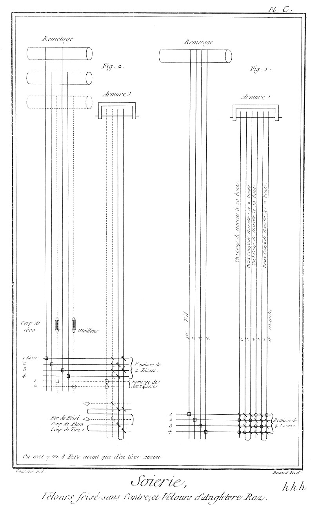](Planche_100.jpeg)

signée h h h. Velours raz d'Angleterre.

Fig.
1. Cette étoffe porte en largeur onze vingt-quatriemes d'aune entre les deux lisieres.

La chaîne est de cinquante portées doubles d'organsin à trois bouts, pesant deux onces trois quarts l'aune.

Trame de la premiere navette à deux bouts fin, dont on passe deux coups.

Trame de la seconde navette à vingt ou à trente bouts, qui fait le gros grain, pesant trois onces l'aune; pese en tout cinq onces trois quarts, à six onces en couleur & sept onces en noir. Il faut que la chaîne & la trame soient des plus parfaites qualités.

Remisse de quatre lisses de douze portées & demie chacune, 

Peigne de vingt-cinq portées ou mille dents, à quatre fils par dent.

Dans le remisse de quatre lisses les fils de la chaîne sont passés dans la maille comme l'est le fil A C dans la maille B fig. 2. Planche LXIX. Velours frisé sans cantre.

Fig.
2. Cette étoffe porte aussi en largeur onze vingt-quatriemes d'aune entre les deux lisieres.

Le velours frisé sans cantre a trois ensouples; sçavoir deux ensouples pour la chaîne principale qui fait le corps de l'étoffe, & une ensouple pour le poil qui fait le façonné.

La premiere chaîne est de vingt portées doubles qui s'emboit d'un quart par aune.

La deuxieme chaîne que l'on tient un peu plus lâche que la premiere, est aussi de vingt portées doubles d'organsin, pesant les deux chaînes environ une once six deniers.

Le poil est de vingt portées doubles, qui s'emboit de deux aunes pour une, même organsin que les deux chaînes principales, pesant une once six deniers; en tout de chaîne deux onces douze deniers.

Trame seconde sorte, nette, pesant une once dix-huit deniers.

Remisse de quatre lisses pour les deux chaînes principales de dix portées chacune.

Remisse de deux lisses pour le poil de dix portées chacune.

Peigne d'acier de vingt portées ou huit cens dents, quatre fils de pieces & deux fils de poil dans chaque dent.

Dans le remisse de quatre lisses, les fils des deux chaînes sont passés dans la maille comme le fil A C dans la maille B, fig. 2. Planche LXIX.

Dans le remisse de deux lisses pour le poil, les fils du poil sont passés sur la maille comme le fil A C sur la maille B, fig. 3. Planche LXVIII.

Les fers sont ronds, & on les tire du corps de l'etoffe avec la fourche, comme il est dit dans l'explication de la Planche précédente.

PLANCHE CI,
-----------

[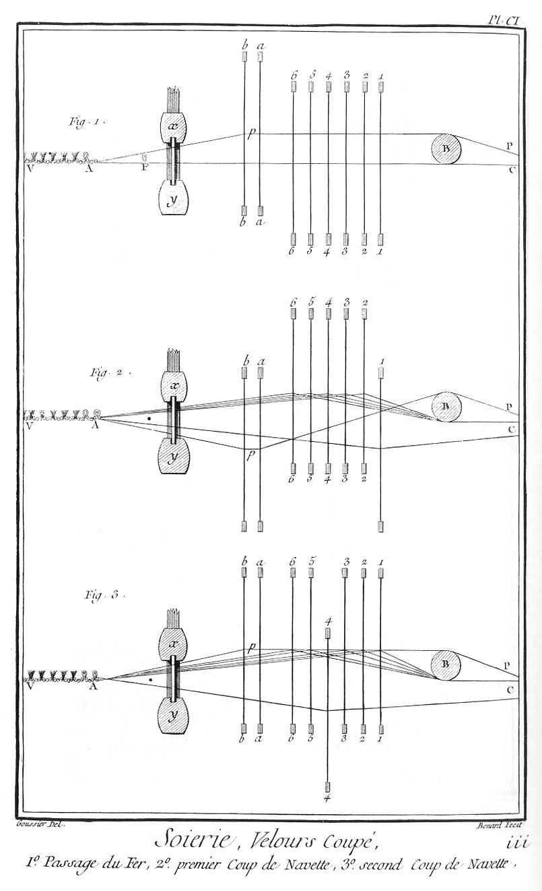](Planche_101.jpeg)

signée i i i.

Cette Planche & les deux suivantes sont voir les mouvemens successifs des lisses pour la toile & de celle pour le poil, au moyen desquels on fabrique le velours coupé, en plein.

Fig.
1. Passage du fer.
	- V A, le velours fait; du côté de V il va à l'entacage contenu dans la rainure de l'ensouple de devant.
	- B, bâton placé derriere le remisse, il est suspendu par deux cordes aux estazes du métier, & sert à soutenir le poil.
	- a a, b b, remisse de deux lisses pour le poil qui y est passé dans la maille, comme le poil A C dans la maille B, fig. 2. Pl. LXIX. Le poil est ployé sur une feconde ensouple placée parallelement à l'ensouple de la chaîne ou toile entre les piliers de derriere du métier.
	- A C, la chaîne ou toile passée dans les mailles du remisse de six lisses 11, 22, 33, 44, 55, 66, entre les mailles desquelles le poil peut monter & descendre. Les six lisses de toile sont en repos, & les deux lisses a a, b b du poil sont levées pour laisser passer le fer représenté en profil en F, dans l'espace triangulaire entre le peigne & le point A; l'introduction du fer est suivie d'un coup du battant x y pour le faire approcher du velours déjà fait, & en même tems le faire se dresser, c'est à quoi sert spécialement le battant brisé dont on a donné la description. Dans les sept figures suivantes; les mêmes lettres indiquent les mêmes objets.

2. Premier coup de navette après le passage du fer; le poil A p P est baissé, & la premiere lisse de toile 1 1 levée, on passe ensuite la navette dans l'ouverture au-devant du peigne, son fil est indiqué par un point; cette opération est suivie d'un coup de battant.

3. Second coup de navette après le passage du fer, le poil A p P est levé avec toutes les lisses de toile, excepté la quatrieme 44 qui est baissée. C'est dans cet état que l'on passe la navette dont le fil est indiqué par un point dans l'ouverture au-devant du peigne.

PLANCHE CII,
------------

[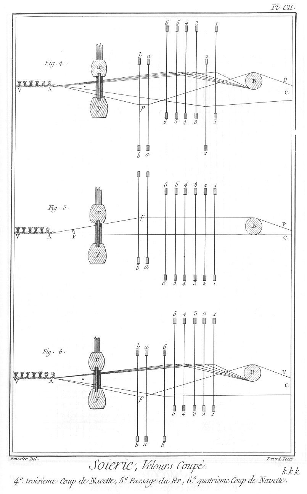](Planche_102.jpeg)

signée k k k.

Fig.
4. Troisieme coup de navette après le passage du fer, le poil A p P est baissé, & la seconde lisse de toile 22, toutes les autres sont levées. C'est dans cet état que la navette est lancée dans l'ouverture qui est au-devant du peigne, son fil ou trame est indiqué par un point.

5. Passage du second fer; toutes les lisses de toile 11, 22, 33, 44, 55, 66, sont remises de niveau, le poil seulement est levé.
	- F, profil du fer passé au-devant du battant entre le poil A p P en-dessus, & la toile A C en-dessous. Cette opération qui est suivie d'un coup de battant termine la demie course des lisses de la toile.

6. Quatrieme coup de navette; le poil A p P est baissé, & la sixieme lisse 66 de la toile, toutes les autres étant levées on passe la navette, dont le fil ou la trame est indiquée dans l'ouverture au-devant du battant par un point.

PLANCHE CIII,
-------------

[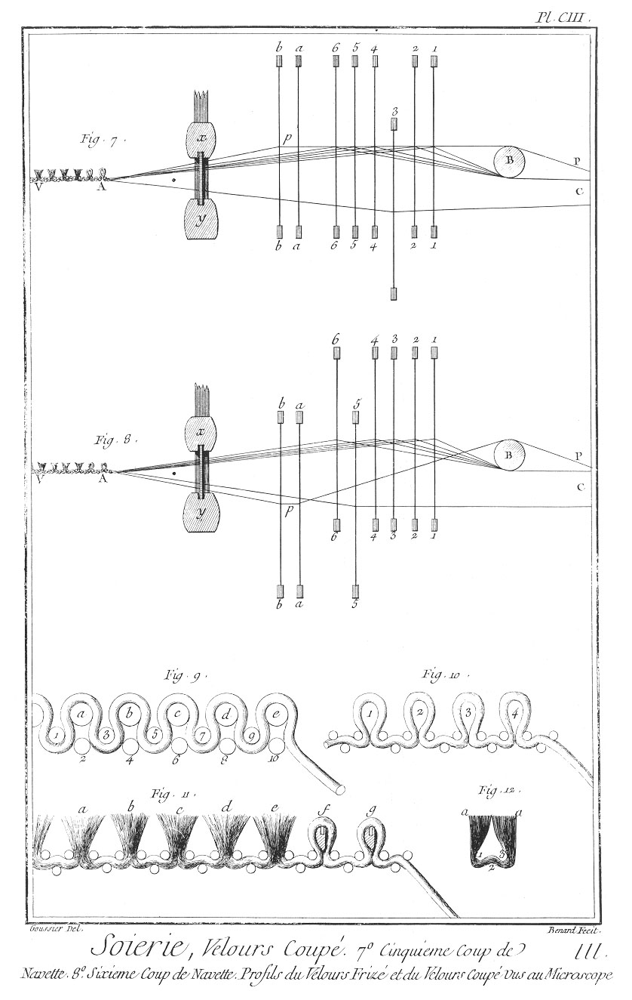](Planche_103.jpeg)

signée l l l.

Fig.
7. Cinquieme coup de navette; le poil A p P est levé, ainsi que toutes les lisses de la toile, excepté la troisieme 33. On passe alors la navette dans l'ouverture entre le poil les cinq lisses qui sont levées & celle qui est abaissée; le fil de la navette est indiqué par un point au-devant du peigne, ce fil est ensuite serré auprès de l'étoffe par un coup de battant.

8. Sixieme coup de navette; le poil A p P est abaissé, & la cinquieme lisse 55, toutes les autres lisses de la toile sont levées, c'est dans cet état que l'on passe la navette dans l'ouverture au-devant du peigne, son fil indiqué par un point se trouve au-dessus du poil & du sixieme des fils de la toile qui sont abaissés par la cinquieme lisse. Ce coup termine la course de la toile. On recommence ensuite comme à la fig. 1. Pl. CI. en plaçant le premier fer que l'on dégage de l'étoffe en coupant les boucles du poil qui le renferment avec le rabot, comme il sera dit ci-après.

9. Profil du velours frisé vu au microscope pour faire connoître ses différentes inflexions autour des trames.
	- a, b, c, d, e, cinq fers pour former cinq rangs de boucles en-dessus de l'étoffe.
	- 1, 2, 3, 4, 5, 6, 7, 8, 9, 10, dix coups de navette qui sont enlacés entre eux par la chaîne ou toile qui fait le fond, comme on le voit dans les figures du satin; les trames impaires 1, 3, 5, 7, 9, assurent le poil dans le corps de l'étoffe, on voit par cette figure combien le poil s'emboit dans le velours plus que la chaîne.

10. Profil du velours raz; il est en tout semblable au velours frisé fig. 9. à cela près qu'au-lieu des fers a b c d &c. qui forment les boucles & ne restent point dans l'étoffe, on passe en leur place une trame un peu grosse, qui reste & fait corps avec l'étoffe.
	- 1, 2, 3, 4, ces différentes trames.

11. Profil du velours coupé vu aussi au microscope.
	- a, b, c, d, e, boucles qui ont été coupées & forment autant de houpes ou pinceaux au-dessus de l'étoffe.
	- f & g, boucles qui ne sont point coupées & contiennent encore les fers à rainures qui les ont formées.

12. Une des houpes du velours coupé séparée du corps de l'étoffe & vue au microscope.
	- a, parties où le poil a été coupé.
	- 1 & 3, emplacement des deux trames en-dessus du poil.
	- 2, emplacement d'une trame en-dessous du poil; c'est par le moyen de ces trois trames qu'il demeure fixé à la toile de l'étoffe. 

PLANCHE CIV,
------------

signée m m m.

Fig.
1. Fer de coupé. Sa longueur b c doit être de quel-ques pouces de plus que la largeur de l'étoffe, qui a ordinairement onze vingt-quatriemes d'aune entre les deux lisieres.
	- a b, coude ou crochet tenant lieu de la pedonne des fers de frisé; il empêche, étant tourné de maniere que le bout a ne touche ni à la toile qui est en-dessous, ni au poil qui est en-dessus, que le fer passe à-travers l'un ou l'autre, lors de son introduction. D'autres ouvriers préferent d'armer le fer d'une pedonne creuse, dans le canon de laquelle son extrémité est placée.

1. bis. Le fer de coupé vu au microscope.
	- A B C D E, le fer que l'on a fracturé dans le milieu pour y placer sa coupe ou profil dessiné plus en grand; dans cette figure le côté plan du côté de C est celui auquel le peigne s'applique, & l'autre côté qui est un peu arrondi du côté de D, est tourné du côté de l'ouvrier.
	- 1 & 2, la rainure dans laquelle coule la lame tranchante du rabot; ces fers sont de laiton & tirés à la filiere.

2. Le rabot qui sert à couper les boucles. Ces boucles étant coupées forment le poil du velours: le rabot, vu du côté de l'ouvrier qui en fait usage, est dessiné de la grandeur effective dont il est.
	- A B C D, platine de fer ou fust du rabot.
	- E F, traverse de fer qui, au moyen de deux vis placées de l'autre côté, sert à fixer la lame tranchante avec le fust. 
	- 1, 2, 3, la lame tenue en presse entre ces deux pieces avec plusieurs morceaux de cartes à jouer.
	- 1 & 2, partie de la lame qui coule dans la rainure des fers de coupé.

3. Le même rabot vu du côté opposé.
	- a b c d, le fust; sa partie inférieure a b est amincie en biseau.
	- f, vis qui entre dans un trou taraudé de la traverse.
	- e, écrou qui serre la vis fixée à l'autre extrémité de la traverse.

4. Profil du rabot.
	- F, extrémité de la traverse.
	- e, écrou qui serre la vis de l'autre extrémité pour fixer le fer entre la traverse & le fust dont on voit le biseau.

5. La traverse vue du côté opposé à celui où elle est représentée fig. 2.
	- E, vis dont le quarré, après avoir traversé le fust, est reçu dans l'écrou e de la fig. 3.
	- F, trou taraudé qui reçoit la vis f de la même figure.

6. La lame du rabot.
	- 3, 4, le corps de la lame.
	- 4, 1, le tranchant.
	- 2, le talon.
	- 1, 2, partie qui coule dans la rainure des fers. Cette lame, qui est d'acier, doit être bien affilée; c'est un ouvrage du coutelier.

7. Velours coupé vu au microscope & en perspective pour faire entendre l'usage du rabot.
	- I K, partie de la piece de velours dont le prolongement en avant va à l'ensouple de devant.
	- I K D E, partie du velours coupé entierement achevé, & dont on a retiré les fers.
	- A B S S, partie de la chaîne ou toile qui va à l'ensouple de derriere.
	- A C, second fer de coupé engagé dans les boucles du dernier rang que le poil forme autour de lui.
	- E F, premier fer de coupé en partie dégagé & en partie engagé dans les boucles du rang antérieur.
	- E 1, boucles coupées par la lame 1 2 3 du rabot, ce qui laisse le fer à découvert dans cette partie. 1, boucle sous laquelle la pointe de la lame est prête à entrer pour la couper de dessous en-dessus, ainsi que les suivantes jusqu'au point D; alors le premier fer est entierement dégagé, on l'enleve pour le repasser dans l'étoffe au-delà du second fer, qui devient alors le premier, ainsi de suite alternativement.

Ce sont les boucles qui entourent le second fer qui servent de point d'appui & de guide à la partie inférieure du fust du rabot, ensorte que l'ouvrier en tirant le rabot de gauche à droite, le presse aussi en-devant contre le premier fer.

8. Taillerolle tenant lieu du rabot pour couper le poil du velours; c'est une plaque d'acier a b c d, fendue dans une direction 1, 2, telle que la figure le fait voir; la pointe 1 est un peu relevée en-devant, pour entrer dans la rainure du premier fer, tandis que l'autre partie 1 b s'applique comme le fust du rabot contre le second. Il faut beaucoup plus de dextérité & d'habitude pour se servir de la taillerolle que pour se servir du rabot, avec lequel on court moins de risque de couper l'étoffe.

PLANCHE CV,
-----------

[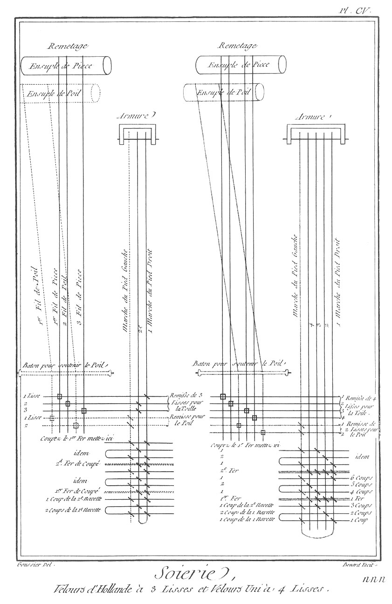](Planche_105.jpeg)

signée n n n. Velours d'Hollande à trois lisses.

Ce velours, qui est de l'espece des velours coupés, porte en largeur onze vingt-quatriemes d'aune entre les deux lisieres.

La chaîne ou toile contient trente-sept portées & demie simples d'organsin, bien monté & de parfait tirage, teinte en crue, pesant crue neuf deniers.

Le poil, vingt-cinq portées simples même organsin teint en crue, sept aunes pour une, pesant les sept aunes pour une d'étoffe une once dix-huit deniers.

Trame à un bout d'organsin crue pesant l'aune une once douze deniers; en tout plus ou moins, trois onces quinze deniers.

Remisse de trois lisses pour la toile de douze portées chacune.

Remisse de deux lisses pour le poil de douze portées chacune.

Peigne de vingt-cinq portées ou mille dents; trois fils de toile & deux fils de poil dans chaque dent.

Dans le remisse de trois lisses pour la toile, les fils de la chaîne sont passés dans les mailles comme le fil A C dans la maille B, fig. 2. Planche LXIX.

Dans le remisse de deux lisses pour le poil, les fils sont aussi passés de la même maniere dans la maille. Velours uni à quatre lisses.

Ce velours, qui est aussi de l'espece des velours coupés, porte en largeur onze vingt-quatriemes d'aune entre les deux lisieres.

La chaîne ou toile contient quarante portées doubles d'organsin pesant environ une once l'aune.

Le poil & la trame de ce velours sont des mêmes qualités que le poil & la trame du velours à six lisses que l'on trouvera dans une des Planches suivantes.

Remisse de quatre lisses pour la toile de dix portées chacune.

Remisse de deux lisses à colisse pour le poil, de dix portées chacune.

Dans le remisse de quatre lisses pour la chaîne ou toile, les fils sont passés dans la maille comme le fil A C dans la maille B, fig. 2. Planche LXIX.

Dans le remisse de deux lisses pour le poil, les fils sont passés dans les colisses.

Peigne de même, quatre fils de toile & deux fils de poil dans chaque dent.

PLANCHE CVI,
------------

[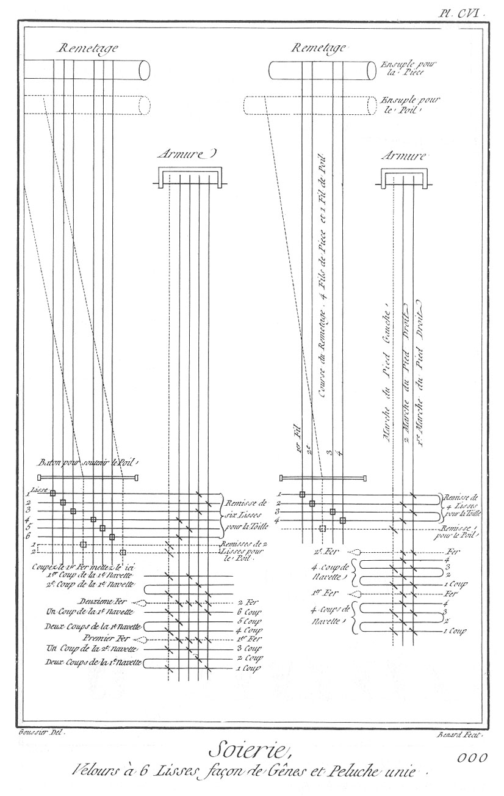](Planche_106.jpeg)

signée o o o. Velours à six lisses façon de Genes.

Fig.
1. Cette étoffe porte en largeur onze vingt-quatriemes d'aune entre les deux lisieres.

La chaîne appellée toile, contient soixante portées simples d'organsin, pesant l'aune environ une once. Les deux poils sont de vingt portées doubles. Les trois poils sont de vingt portées triples. Les quatre poils sont de vingt portées quadruples. Les deux poils & demi sont de vingt portées, moitié doubles moitié triples. Les trois poils & demi sont de vingt portées, moitié triples moitié quadruples. Les quatre poils & demi sont de vingt portées, moitié quatre fils par boucle & moitié cinq. Il faut six aunes de poil pour une aune de velours. Les poils doivent être d'un organsin d'un parfait tirage & bien apprêtés, d'environ vingt-cinq deniers l'essai: les trois poils doivent peser demi-once l'aune, & pour une aune de velours, il faut trois onces d'organsin, & les autres à proportion.  Pour faire un beau velours qui ne peluche & n'éfiloque point, il faut un organsin d'une bonne nature.

On peut employer des organsins de Piémont montés à trois bouts, en ne mettant que deux fils dans la boucle pour les trois poils, lesquels doivent toujours peser demi-once l'aune.

La trame belle & nette, la trame Sainte Lucie premiere sorte ou celle d'Espagne est la meilleure; il doit en entrer demi-once par aune.

Remisse de six lisses pour la toile, de dix portées chacune.

Remisse de deux lisses à colisse pour le poil, de dix portées chacune.

Dans le remisse de six lisses pour la toile, les fils de la chaîne sont passés dans la maille comme le fil A C dans la maille B de la fig. 2. Planche LXIX.

Peigne de vingt portées ou huit cens dents, six files de toile & deux fils de poil dans chaque dent. Maniere dont on fabrique les velours à Genes.

La toile est composée de soixante-trois portées de quatre-vingts fils chacune; le poil est composé de quarante deux portées d'organsin à trois bouts, à deux fils par boucle pour les trois poils, & à quatre bouts pour les quatre poils à deux fils par boucle; la premiere navette est en soie grèze à un bout, suivant la grosseur du brin; la deuxieme navette est d'une trame double & tordue au moulin; le peigne a huit cents quarante dents, six fils de piece & deux de poil par dent. Peluches unies.

2. Les peluches different des velours en ce qu'au lieu de fers de coupé, on emploie de petites tringles de bois, qui ont une rainure comme les fers & servent au même usage.

Les peluches ordinaires ont en largeur onze vingt-quatriemes d'aune entre les deux lisieres.

La chaîne principale appellée toile, est composée de quarante portées simples d'organsin à deux bouts, pesant environ quinze à dix-huit deniers l'aune.

Le poil dix portées simples, même organsin que la toile, ou un peu plus fin, si l'on ne la veut pas si fournie en poil. Il faut ourdir depuis quatre aunes jusqu'à six aunes de poil pour faire une aune de peluche: c'est suivant la hauteur des fers.

Remisse de quatre lisses pour la toile de dix portées chacune.

Dans le remisse de quatre lisses pour la toile, les fils de la chaîne sont passés dans la maille comme le fil A C dans la maille B, fig. 2. Planche LXIX.

Remisse d'une lisse pour le poil de dix portées.

Peigne de vingt portées ou huit cens dents, quatre fils de toile & un fil de poil chaque dent.

PLANCHE CVII,
-------------

[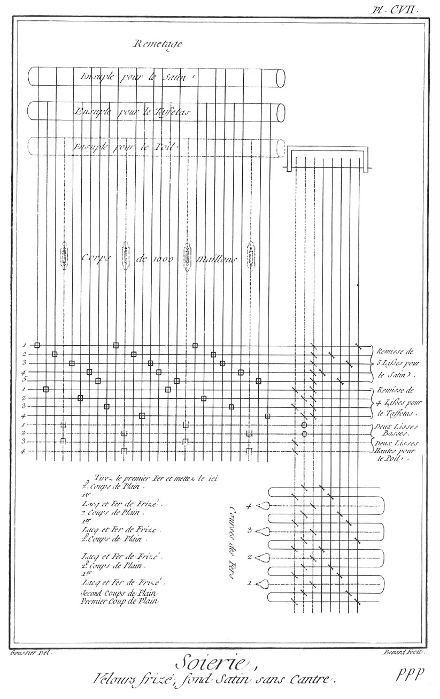](Planche_107.jpeg)

signée p p p. Velours frisé, fond satin sans cantre, monté sur trois ensouples.

La largeur de cette étoffe est de onze vingt-quatriemes d'aune entre les deux lisieres.

La chaîne principale est de quatre-vingt portées simples pour les satin pesant une once.

La seconde chaîne est de quarante portées simples pour le taffetas pesant douze deniers.

La troisieme chaîne ou le poil pour faire le frisé qui s'emboit de trois aunes pour une, vingt portées doubles pesant les trois aunes, une once douze deniers.

Trame nette & égale, deux onces; en tout dans l'aune cinq onces.

Remisse de cinq lisses pour le satin de seize portées chacune.

Remisse de quatre lisses pour le taffetas de dix portées chacune.

Dans le remisse de cinq lisses pour le satin, les fils de la premiere chaîne sont passés dans la maille comme le fil A C dans la maille B, fig. 2. Planche LXIX.

Dans le remisse de quatre lisses pour le taffetas, les fils de la seconde chaîne sont de même passés dans la maille.

Remisse de deux lisses pour lever le poil, de dix portées chacune.

Remisse de deux lisses pour rabattre le poil, de dix portées chacune.

Dans le premier des deux remisses de deux lisses pour le poil, les fils sont passés sur la maille comme le fil A C sur la maille B, fig. 3. Planche LXVIII.

Dans le second remisse pour le poil, les fils sont passés sous la maille comme le fil A C sous la maille B, fig. 2. même Planche.

Peigne d'acier de vingt portées ou huit cens dents.

De la premiere chaîne, huit fils.

De la seconde, quatre fils.

Du poil, deux fils.

Quatorze fils dans chaque dent.

PLANCHE CVIII,
--------------

[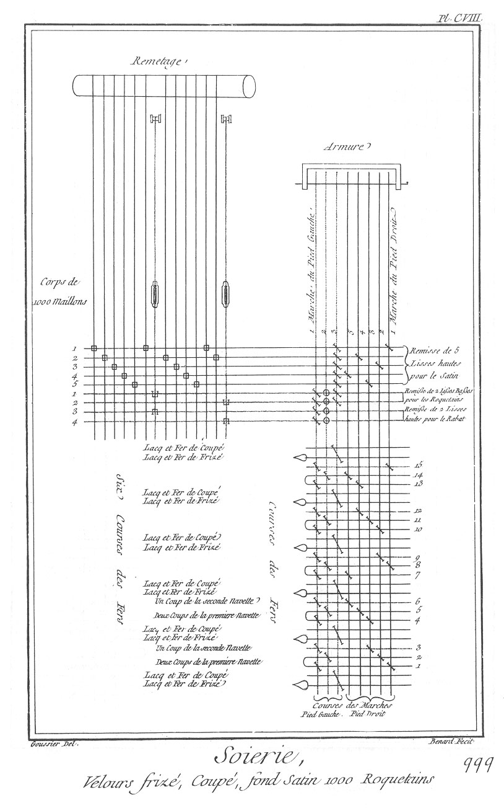](Planche_108.jpeg)

signée q q q. Velours frisé, coupé, fond satin 1000 roquetins.

Cette étoffe porte en largeur onze vingt-quatriemes d'aune entre les deux lisieres.

La chaîne contient soixante-quinze portées simples d'organsin à trois bouts pesant l'aune deux onces.

Le poil est à trois ou quatre bouts d'organsin sur chaque roquetin pour faire le velours.

Il en faut trois aunes & demie pour en faire une. Les trois aunes & demie pour les mille roquetins doivent peser quatre onces six deniers.

Trame fermette & égale, deux onces dix-huit deniers; en tout l'aune doit peser neuf onces.

La chaîne est lardée à travers le corps, & n'est point passée dans les maillons, il n'y a que les roquetins.

Remisse de cinq lisses de quinze portées chacune pour le satin.

Dans le remisse de cinq lisses pour le satin, les fils de la chaîne ou toile sont passés dans la maille comme le fil A C dans la maille B, fig. 2. Planche LXIX.

Remisse de deux lisses de six portées un quart chacune pour lever les roquetins.

Remisse de deux lisses de six portées un quart chacune pour rabattre les roquetins.

Dans le remisse de deux lisses pour le poil des roquetins, les fils sont passés sur la maille comme le fil A C sur la maille B, fig. 3. Planche LXVIII.

Dans le remisse de deux lisses pour le rabat, les mêmes fils de roquetins sont passés dessous la maille comme le fil A C sous la maille B, fig. 2. de la même Planche.

Peigne d'acier de douze portées & demie ou cinq cens dents.

Douze fils de piece ou chaîne & deux fils de poil des roquetins, font par dent quatorze fils.

PLANCHE CIX,
------------

[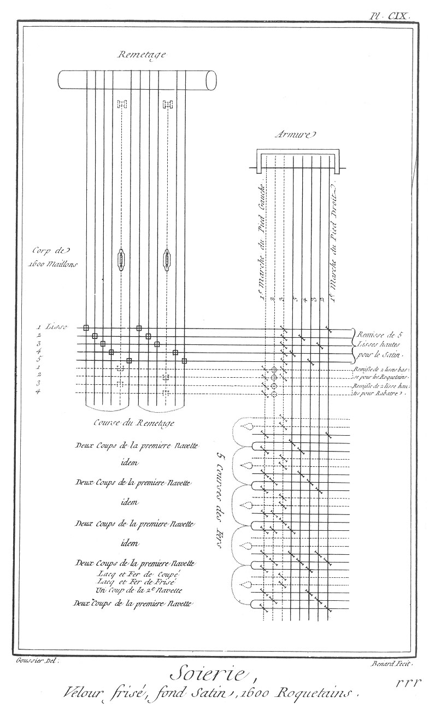](Planche_109.jpeg)

signée r r r. Velours frisé, coupé, fond satin, 1600 roquetins.

Cette étoffe porte aussi en largeur onze-vingt-quatriemes d'aune entre les deux lisieres.

La chaîne est de quatre-vingts portées simples d'organsin à trois bouts, pesant l'aune deux onces. Il y a trois bouts organsin sur chaque roquetin; il faut quatre aunes de poil pour faire une aune de velours: les quatre aunes doivent peser quatre onces douze deniers.

Trame de Pays, seconde sorte égale, une once dix-huit deniers; en tout l'aune pese huit onces six deniers.

Remisse de cinq lisses de seize portées chacune pour le satin qui n'est point passé dans le corps.

Dans le remisse de cinq lisses pour le satin, les fils de la chaîne y sont passés comme le fil A C l'est dans la maille B, fig. 2. Planche LXIX.

Remisse de deux lisses de dix portées chacune pour lever les fils des roquetins.

Remisse de deux lisses de dix portées chacune pour rabattre les roquetins. 

Dans le premier remisse de deux lisses pour les roquetins, leurs fils sont passés sur la maille comme le fil A C sur la maille B, fig. 3. Planche LXVIII.

Dans le second remisse pour rabattre les fils des roquetins, les fils sont passés sous la maille comme le fil A C sous la maille B, fig. 2. de la même Planche.

Peigne d'acier de vingt portées ou huit cens dents; huit fils de piece & deux fils de poil dans chaque dent font dix fils.

PLANCHE CX,
-----------

[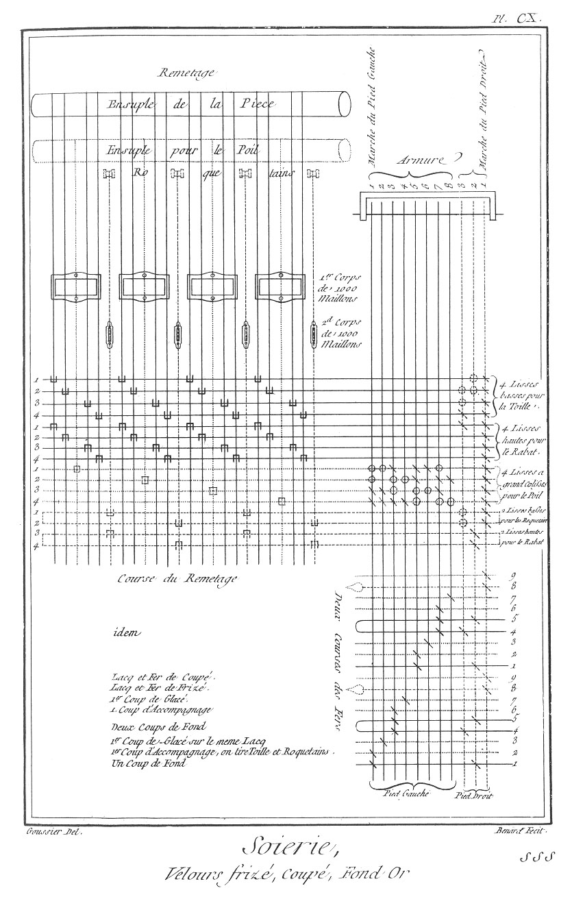](Planche_110.jpeg)

signée s s s. Velours frisé, coupé, fond or.

Cette étoffe, la plus riche de toutes, porte en largeur onze vingt-quatriemes d'aune.

La chaîne principale est de cinquante portées simples grosse soie, ou cinquante portées doubles soie moyenne, pesant l'aune une once dix-huit deniers.

La seconde chaîne nommée poil, contient dix portées simples aussi de grosse soie; elle sert pour le liage: l'aune pese neuf deniers.

1000 roquetins d'organsin, quatre aunes pour une, les quatre aunes pesent quatre onces.

Trame pour le corps de l'étoffe, deuxieme sorte, pesant l'aune environ deux onces.

Trame pour l'accompagnage de la dorure premiere sorte, une once.

Dorure, or lisse, 7 S, pour l'aune, quatre onces douze deniers; en tout l'aune pese treize onces quinze deniers.

Remisse de quatre lisses pour la chaîne principale de douze portées & demie chacune.

Dans ce remisse les fils de la chaîne sont passés sur la maille, comme le fil A C sur la maille B, fig. 3. Planche LXVIII.

Remisse de quatre lisses pour le rabat de la chaîne de douze portées & demie chacune.

Dans ce remisse les mêmes fils de la chaîne sont passés sous la maille, comme le fil A C sous la maille B, fig. 2. de la même Planche.

Remisse de quatre lisses à grand colisse pour le poil d'accompagnage de douze portées & demie chacune.

Dans ce remisse, les fils de la seconde ensouple y sont passés dessus & dessous la maille.

Remisse de deux lisses basses pour les fils des roquetins, de douze portées & demie chacune.

Dans ce remisse les fils qui viennent des roquetins sont passés sur la maille, comme le fil A C sur la maille B, fig. 3. Planche LXVIII.

Remisse de deux lisses hautes pour le rabat des fils des roquetins, de douze portées & demie chacune.

Dans ce remisse les fils sont passés sous la maille, comme le fil A C sous la maille B, fig. 2. de la même Planche.

Peigne d'acier de douze portées & demie ou cinq cens dents; dans chaque dent huit fils de chaîne, deux fils de poil, deux de roquetins; en tout douze fils.

Les roquetins doivent être montés à trois ou à quatre bouts d'organsin, pourvu qu'ils n'excedent pas le poids de quatre onces; les quatre aunes en mille roquetins: ces quatre aunes ne font qu'une aune d'étoffe.

PLANCHE CXI,
------------

[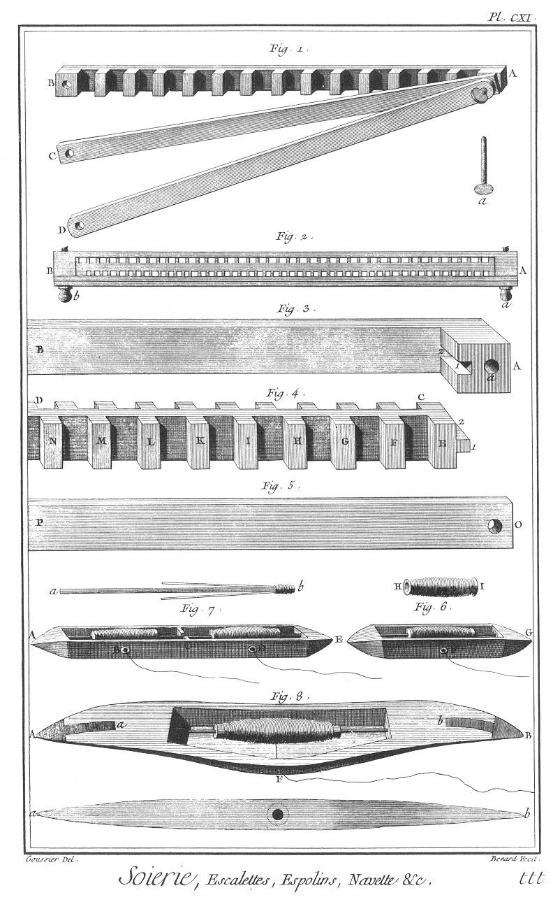](Planche_111.jpeg)

signée t t t.

Cette Planche contient deux sortes d'escalettes, les espolins & la navette.

Fig.
1. Escalette servant à contenir les cordes du sample & le dessein lorsqu'on en fait la lecture.
	- A B, la principale piece de l'escalette, dans chacune des entailles de laquelle on place autant de cordes du sample qu'il y a de rangs de carreaux sur la largeur de chaque division du dessein: ainsi le dessein étant sur du papier de huit en dix, par exemple, on placera huit cordes du sample prises de suite dans chacune des entailles de l'escalette.
	- A C, regle qui s'applique sur le corps de l'escalette pour enfermer les cordes dans les entailles.
	- A D, autre regle qui s'applique sur la premiere; c'est entre ces deux regles qu'on place le dessein.
	- a, cheville pour fixer les trois pieces ensemble.

Fig.
2. Escalette double servant aussi à lire les desseins. Elle est composée de quatre pieces.
	- A B, la piece coudée extérieure qui renferme celle qui a des entailles des deux côtés. Au-devant de cette piece sont deux regles fixées par les chevilles ou vis a & b; c'est entre ces deux dernieres pieces que le dessein doit être placé.

3. Partie de la piece coudée de l'escalette vue en perspective.
	- A, coude de la piece: il y en a un semblable du côté de B, qui n'a pu être réprésenté à cause du peu de largeur de la Planche.
	- a, trou pour recevoir la cheville.
	- 1 & 2, rainure horisontale qui reçoit le tenon de la piece suivante.

4. La piece entaillée de l'escalette.
	- 1 & 2, tenon qui entre dans la rainure de la figure précédente.
	- C, D, entailles d'un côté de l'escalette.
	- E, F, G, H, I, K, L, M, N, séparations des entailles dans lesquelles les cordes du sample sont placées lors de la lecture du dessein.

5.
	- O P, partie d'une des deux regles qui s'appliquent à la face des entailles.

6. Espolin garni de son canon chargé de soie.
	- E G, le corps de l'espolin qui est de buis.
	- F, trou garni d'un anneau de verre par lequel sort le fil dont le tuyau est chargé.
	- H I, le canon sur lequel est la soie qui sert de trame pour le broché, ou le fil d'or ou d'argent, si on broche avec ces matieres.

7. Espolin double.
	- A E, le corps de l'espolin.
	- B & D, les trous ou yeux par lesquels les soies sortent.
	- C, séparation des deux cases, dans chacune desquelles il y a un canon.
	- a b, axe ou essieu des canons, garni de deux brins de baleine ou de plume 1 & 2, liées avec un fil au point b. Ces barbes de plumes frottent en dedans du canon, & empêchent qu'il ne tourne trop librement.

8. Navette vue en perspective & garnie d'un tuyau revêtu de trame.
	- A B, le corps de la navette qui est de buis, & est d'environ un tiers plus long que la figure ne le représente, la largeur du format n'ayant pas permis de lui donner plus d'étendue.
	- F, trou garni d'un oeil de verre, par lequel sort la trame du tuyau.
	- A a, B b, pointes de fer aux extrémités de la navette: au-dessous en a b est le profil de la navette.

PLANCHE CXII,
-------------

[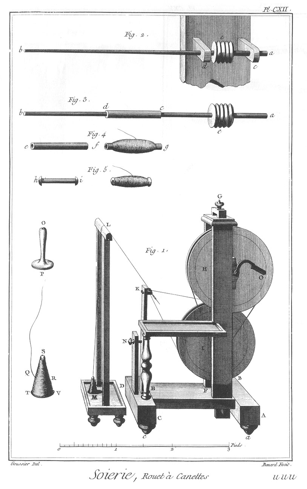](Planche_112.jpeg)

signée u u u.

Rouet à canettes vu du côté de la manivelle & accompagné du gec sur lequel passe la soie qui vient du volant.

Fig.
1. Le rouet à canettes vu en perspective.
	- A B, C D, les patins du pié assemblés par une entretoise E F, & soutenus par quatre boules a & c.
	- F G, les deux montans. En G est la tête de la vis qui sert à remonter la roue inférieure.
	- H, roue supérieure.
	- O, la manivelle par laquelle on la met en mouvement.
	- K, broche.
	- K L M, le fil qui passe sur le gec & vient du volant M.
	- N, vis qui sert à bander la corde sans fin de la seconde roue, comme la vis G sert à bander la corde de la premiere; au-devant est la tablette sur laquelle l'ouvriere pose les canons & les tuyaux vuides & chargés.
	- O P, volant dégarni de soie.
	- P Q R, fil de soie qui vient du volant S T V.

2. Partie du montant K de la figure premiere vu du côté de la broche.
	- a b, la broche.
	- c, d, les deux poupées faites de nerf de boeuf.
	- e, bobine sur laquelle passe la corde de boyau de la seconde roue du rouet.

3. La broche représentée séparément & garnie du tuyau c d.

4.
	- e f, tuyau de roseau, vuide.
	- f g, le même tuyau chargé de soie; c'est en cet état qu'il prend le nom de canette.

5.
	- h i, canon vuide; à côté est le même canon chargé de soie. 

PLANCHE CXIII,
--------------

[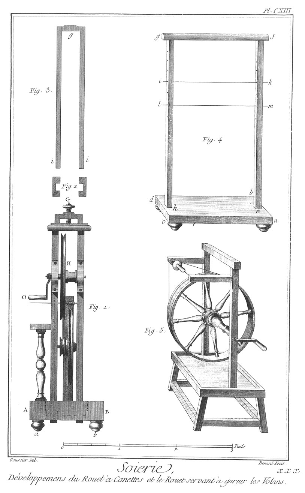](Planche_113.jpeg)

signée x x x.

Développemens du rouet à canettes, & le rouet servant à garnir les volans.

Fig.
1. Elévation géométrale du rouet vu du côté des roues.
	- A B, le patin. a & b les boules.
	- H, premiere roue.
	- I, seconde roue sur la noix de laquelle passe la corde sans fin de la premiere roue, dont la manivelle est indiquée par la lettre O.
	- G, vis qui sert à lever l'étrier de la premiere roue.

2. Coupe horisontale des deux montans où on voit les rainures dans lesquelles coulent les côtés de l'étrier.

3. L'étrier qui sert à remonter ou descendre la seconde roue I.
	- g i, g i, les côtés de l'étrier qui coulent dans les rainures des montans. En g est un trou taraudé qui reçoit la vis G de la fig. 1. & en i, i sont les trous qui reçoivent les tourillons de l'axe de la roue I.

4. Le gec vu en perspective & en face.
	- a b c d, pié du gec, ou jet, soutenu par quatre boules.
	- e f, g h, les deux montans.
	- f g, traverse arrondie en-dessus, sur laquelle est attaché un canon ou baguette de verre sur laquelle passe la soie que l'on devide de dessus les volans.
	- i k ou l m, broches de fil-de-fer sur lesquelles on enfile les rochets garnis de la soie que l'on veut devider.

5. Le rouet servant à garnir les volans.

PLANCHE CXIV,
-------------

[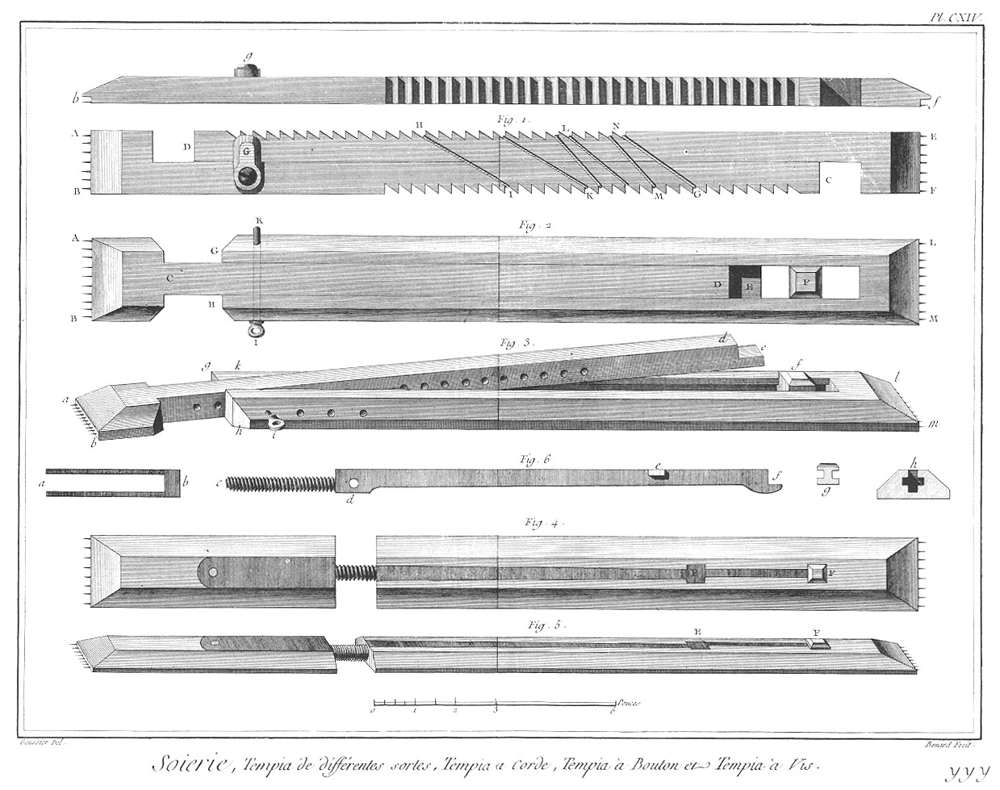](Planche_114.jpeg)

signée y y y.

Cette Planche contient trois sortes de tempia, savoit le tempia à corde, celui à bouton, & celui à vis.

Le tempia, ainsi qu'on nomme cet instrument à Lyon, sert à l'ouvrier pour tenir l'étoffe étendue en largeur; pour cela on pique les pointes dont ses extrémités sont garnies, dans les lisieres de l'étoffe, ce qui les écarte l'une de l'autre, autant que le tempia a d'étendue; sans cette précaution les différentes duittes de la trame auroient bien-tôt resserré la chaîne de l'étoffe au point que le peigne ne pourroit plus enfoncer autant qu'il est nécessaire, les duittes suivantes.

Fig.
1. Tempia à corde.
	- A B C, D E F, les deux parties du tempia entierement semblables l'une à l'autre.
	- A B & E F, les pointes qui doivent entrer dans la lisiere de l'étoffe; elles sont recouvertes par une petite plaque de fer ou de cuivre de maniere à ne point paroître lorsque le tempia est en place, ou bien on réserve au bois dont cette machine est faite une petite saillie qui recouvre les pointes, comme on le voit en b & en f, dans la figure qui est au-dessus. Il faut imaginer la même saillie à toutes les autres figures de la Planche.
	- H, I, K, L, M, N, O, différentes dents sur lesquelles passent les révolutions d'une corde sans-fin, qui avec les dentelures forme une espece de crémaillere, au moyen de laquelle on allonge ou on accourcit le le tempia.
	- G, tourniquet fixé à une des pieces par le moyen d'une vis; on tourne ce tourniquet comme la figure le représente, après que les pointes des extrémités du tempia sont fichées dans les deux lisieres, & qu'on a abaissé sur l'étoffe les extrémités.
	- C & D, les deux pieces qui composent le tempia.

2. Tempia à bouton vu en plan du côté opposé à celui qui s'applique à l'étoffe.
	- A B C D, la piece à queue.
	- G L M K, la piece à fourchette.
	- F, bouton qui coule à rainure & languette entre les deux côtés de la fourchette pour se placer sur l'extrémité E de la piece à queue C D, après que les pointes des deux pieces sont entrées dans les lisieres, & que la queue D a été abattue dans la fente de la fourchette.
	- I K, cheville servant de charniere aux deux pieces. On peut alonger ou accourcir le tempia, selon qu'on place cette cheville dans l'un ou l'autre des trous des deux pieces que l'on voit dans la figure suivante.

3. Le même tempia en perspective. Les mêmes lettres designent les mêmes objets.

Fig.
4. Tempia à vis vu en plan.

5. Le même tempia vu en perspective.

6. Bascule & vis de ce tempia.
	- a b, piece de fer dans laquelle en b est pratiqué l'écrou qui reçoit la vis c d de la bascule.
	- d, trou de la charniere.
	- e, couvercle de l'ouverture par laquelle on fait entrer le bouton.
	- f, extrémité de la bascule sur laquelle vient reposer le bouton comme dans la fig. 3.
	- g, élévation du bouton.
	- h, coupe ou profil du tempia, entre le couvercle E & le bouton F des fig. 4. & 5. espace où sont pratiquées les rainures qui reçoivent les languettes inférieures du bouton.

PLANCHE CXV,
------------

[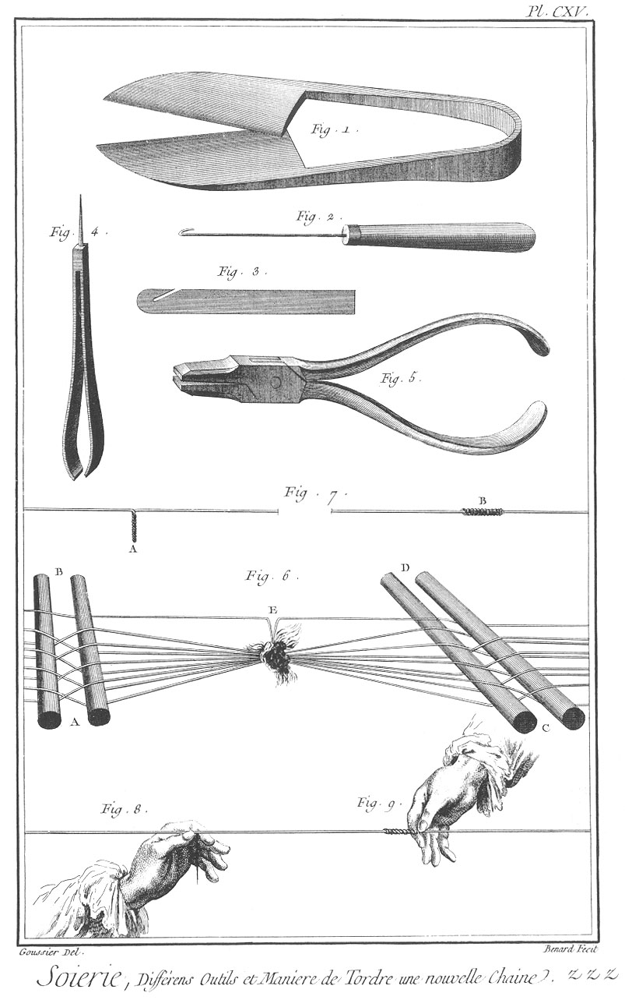](Planche_115.jpeg)

signée z z z. Différens outils & la maniere de tordre une nouvelle chaîne à la suite d'une piece qui est prête à finir.

Fig.
1. Forces servant à couper.

2. Passette pour passer les soies dans les maillons.

3. Passette pour passer les soies en peigne.

4. Epluchoir.

5. Pinces.

6. Maniere de joindre une nouvelle chaîne à une autre prête à finir, ce qu'on nomme tordre.
	- A B, envergeure  de la piece qui finit.
	- C D, envergeure de la nouvelle piece, l'une & l'autre par fils; les deux chaînes sont nouées ensemble, comme on voit au-dessous de E; l'opération de tordre se fait en joignant les fils d'une des chaînes à ceux de l'autre un à un; pour cela on prend avec deux doigts de la main gauche un fil de chacune des chaînes, on les éleve comme on voit en E en les tordant l'un sur l'autre, on les détache du noeud total des deux chaînes, alors achevant de tordre de la main droite, on les couche le long du fil de la nouvelle chaîne sur lequel on tord l'extrémité des deux fils.

Fig.
7.
	- A, les fils tordus l'un sur l'autre par la main gauche.
	- B, les mêmes fils tordus par la main droite sur le fil de la nouvelle piece.

8. La main gauche tordant deux fils des deux chaines, un de chacune.

9. La main droite tordant le doublage précédent sur le fil de la nouvelle chaîne, qui peut, aprês que tous les fils sont tordus, passer à-travers le corps, le remisse, le peigne, pour prendre la place de la chaîne employée à la fabrication de la piece d'étoffe qui vient de finir, à laquelle la nouvelle chaîne sert de continuation. 

[->](../6-Cinquieme_Section/Légende.md)
