SOIERIE - CINQUIEME SECTION
===========================

Contenant la maniere de chiner la chaîne de certaines Etoffes; les différens noeuds en usage dans la Fabrique; la maniere de faire les lisses. Les calendres & autres machines servant à apprêter les Etoffes après qu'elles sont fabriquées. 

PLANCHE CXVI,
-------------

[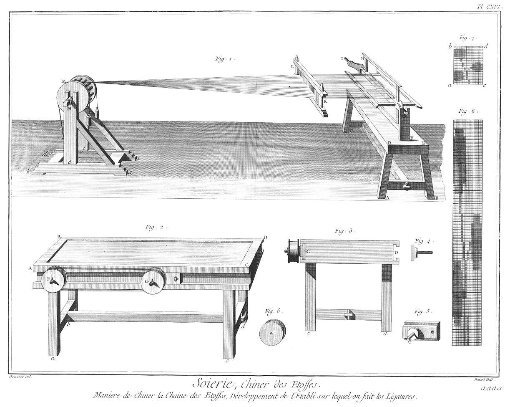](Planche_116.jpeg)

signée a a a a. Maniere de chiner la chaîne des étoffes, & développement de l'établi sur lequel on fait les ligatures.

Figure
1. Ployage de la chaîne sur l'asple.
	- A B C D E, banque ou sellette de l'asple.
	- G H, son axe.
	- I, sa manivelle. L'axe ou arbre de l'asple est garni de pointes auxquelles on accroche les différentes portées de la chaîne.
	- K L, rateau pour guider la chaîne sur l'asple.
	- M, lanterne sur laquelle la chaîne est roulée.
	- a b, c d, les patins du porte-lanterne.
	- e, f, les montans qui la supportent.
	- N, quarré où étoit une manivelle lorsqu'on a relevé la chaîne de dessus l'ourdissoir. Après que la chaîne est relevée par partie de dessus l'asple, on porte les différens écheveaux qui la composent sur la machine suivante, pour en faire les ligatures.

2. Etabli pour les ligatures des écheveaux des chaînes chinées.
	- A B C D, la table garnie de rebords.
	- a b c d, les piés assemblés par des traverses. Le long des deux grands côtés de la table; il y a une coulisse dans laquelle coule le porte-bobine mobile.
	- F, bobine fixe qui n'a que le mouvement de rotation.
	- G, bobine mobile que peut, outre le mouvement de rotation, s'approcher ou s'éloigner de l'autre bobine: c'est sur ces deux bobines qu'on place un des écheveaux de la chaîne, on renferme dans des rouleaux de papier, ensuite recouverts de parchemin, & liés par les deux bouts, les parties de cet écheveau qui ne doivent point prendre la teinture, observant les longueurs convenables au dessein qu'on veut former.

3. Profil de l'établi C & D, les rainures; la premiere est occupée par le porte-bobine, la seconde est vuide.

4. Le porte-bobine qui doit entrer dans la rainure D de la figure précédente.

5. le porte-bobine vu en perspective.
	- G, la broche sur laquelle tourne la bobine.

6. Bobine vue en perspective.

7. Citée 17. à l'article Chiner des Etoffes, dans l'Encyclopédie, dessein proposé à exécuter en velours chiné.

8. Anamorphose du dessein précédent, rendue six fois plus longue à cause que le poil du velours proposé s'emboit six fois plus que la chaîne, ensorte qu'il faut six aunes de poil pour faire une aune de velours.

PLANCHE CXVII,
--------------

[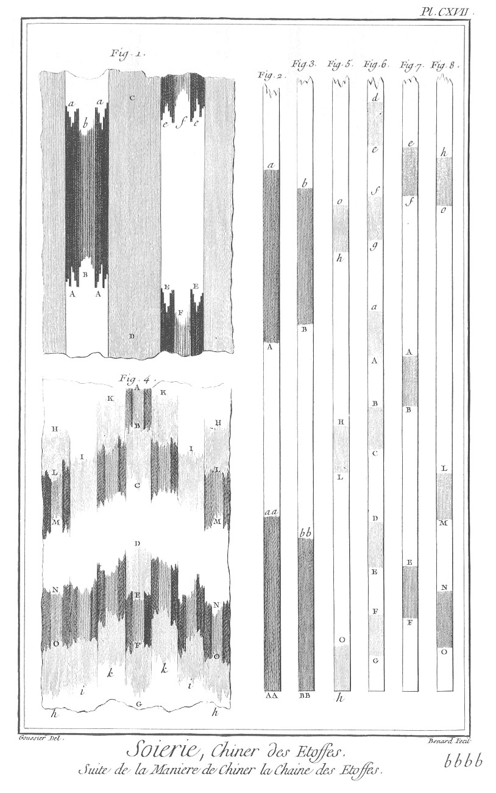](Planche_117.jpeg)

signée b b b b. Maniere de chiner la chaîne des siamoises pour meubles, des taffetas, ou autres etoffes.

Fig.
1. Echantillon de siamoise chiné en une seule couleur, à deux nuances. Cette étoffe est rayée par bandes; les unes comme C D, de la couleur qui fait le fond de l'étoffe, qui dans l'exemple est jaune; les autres bandes comme B b, F f sont blanches & chinées de bleu.
	- A a, A a, partie de la chaîne qui est restée découverte pour prendre la teinture de la nuance foncée, ainsi qu'il est marqué par la bande de parchemin, fig. 2. où les lettres A, a, A A, a a marquent les endroits où il faut faire les ligatures qui fixent les rouleaux de papier sur les parties de la chaîne qui doivent être réservées en blanc.
	- E e, E e, partie de la chaîne de la seconde rayure, nuance foncée qui a été recouverte par les rouleaux de papier; les points E e répondent aux points A & a a de la fig. 2.
	- B b, partie de la chaîne qui est restée découverte pour recevoir la teinture de la nuance claire. Cette partie répond à une des divisions B b ou B B b b de la bande de parchemin, fig. 3. où les lettres b, B: b b, B B marquent les endroits où il faut faire les ligatures des rouleaux de papier qui enveloppent la chaîne.
	- F f, partie de la chaîne de la seconde rayure, nuance claire, qui a été recouverte; les points F & f répondent aux points B & b b de la fig. 3.

2. Bande sur laquelle on a pris les mesures de la longueur & de la distance de la nuance foncée, pour être transportée le long de l'écheveau, fig. 2. de la Planche précédente, & faire par ce moyen connoître les endroits qu'il faut couvrir & ceux où il faut faire les ligatures. On observera que la longueur des bandes doit être contenue exactement dans la circonférence de l'écheveau.

3. Bande pour la seconde nuance.

4. Echantillon de taffetas chiné en plusieurs couleurs. C'est, dans l'exemple, le rouge & le verd. Le rouge qui a deux nuances est indiqué par la teinte foncée.
	- A G, partie du milieu du dessein; les parties A B, E F sont rouges, & les parties B C, D E, F G, sont vertes. Les longueurs des premieres qui sont de deux nuances, & le lieu des ligatures, sont indiqués par les mêmes lettres A B, E F, e f, de la fig. 7. & les longueurs des secondes le sont par les lettres B C, D E, F G, de la fig. 6.

Le compartiment ou division des deux couleurs des bandes collatérales K k, I i, H h, est indiqué par les bandes fig. 5. & fig. 8. La premiere fait connoître par les lettres H L, O h, les parties de la chaîne qui doivent être teintes en verd; & la seconde marque par les lettres L M, N O, les parties de la même chaîne qui doivent être teintes en rouge.

5. &
6. &
7. &
8. Les bandes des différentes couleurs, pour indiquer les endroits de la chaîne qu'il faut couvrir & le lieu des ligatures.

PLANCHE CXVIII,
---------------

[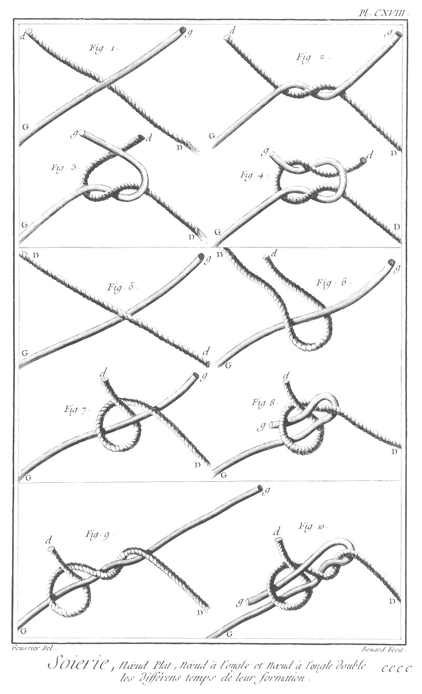](Planche_118.jpeg)

signée c c c c.

Cette Planche & les quatre suivantes, contiennent la formation des différens noeuds en usage dans la fabrique des étoffes, soit pour réunir les parties de la soie, ou pour les différens cordages & agrêts du métier. Dans toutes les figures où on représentera la réunion de deux fils ou de deux cordages, la lettre G indiquera celui qui est tenu par la main gauche, la lettre g le bout qu'il faut nouer: de même, les lettres D & d indiqueront le fil & sor extrémité pour la main droite.

Fig.
1. Premier tems de la formation du noeud plat.
	- G g, la soie, fil, ficelle ou corde, tenue en G par la main gauche.
	- g, bout du fil.
	- D d, la soie, fil, ficelle ou corde, tenue par la main droite.
	- D d, le bout du fil. On a eu attention de ne point faire cabler le premier fil, pour le mieux distinguer du second dans ses différentes circonvolutions. Le premier tems de la formation de ce noeud consiste à poser en croix le fil de la main gauche sur celui de la main droite.

2. Le second tems consiste à faire passer le bout g du fil gauche par dessous le fil D de la main droite, ou, ce qui revient au même, le fil d de la main droite par dessus le fil G de la gauche.

3. Troisieme tems. Il faut mettre le bout du fil gauche g sur le bout du fil droit d, de maniere qu'ils se croisent.

4. Quatrieme tems de la formation du noeud plat. Il faut tenir de la main gauche le bout g du fil de cette main, & faire passer le bout d dans la boucle du fil gauche, il faut ensuite serrer en tirant chaque fil de son côté.

5. Premier tems de la formation du noeud à l'ongle. Il consiste à poser le fil de la main droite D d, sur le fil de la main gauche, ensorte que les deux bouts d & g soient vers la droite.

6. Second tems. Il faut faire repasser le fil de la droite par dessous celui de la gauche; ils sont arrêtés en cet état par le pouce & le premier doigt de cette main.

7. Troisieme tems. Il consiste à ramener le fil D de la droite dans la fourche que forment les bouts d & g des deux fils.

8. Quatrieme & dernier tems de la formation du noeud à l'ongle. Il faut faire repasser le bout g du fil gauche dans la boucle du fil de la droite, & serrer ensuite en tirant les fils D & G chacun de leur côté.

9. Les deux derniers tems de la formation du noeud nommé à l'ongle double. Les trois premiers tems étant les mêmes que pour le noeud précédent, il consiste à faire passer le fil gauche g sous le fil droit.

10. Dernier tems de la formation du noeud à l'ongle double. Il faut faire passer le bout g du fil gauche dans la boucle du fil droit, & serrer ensuite. 

PLANCHE CXIX,
-------------

[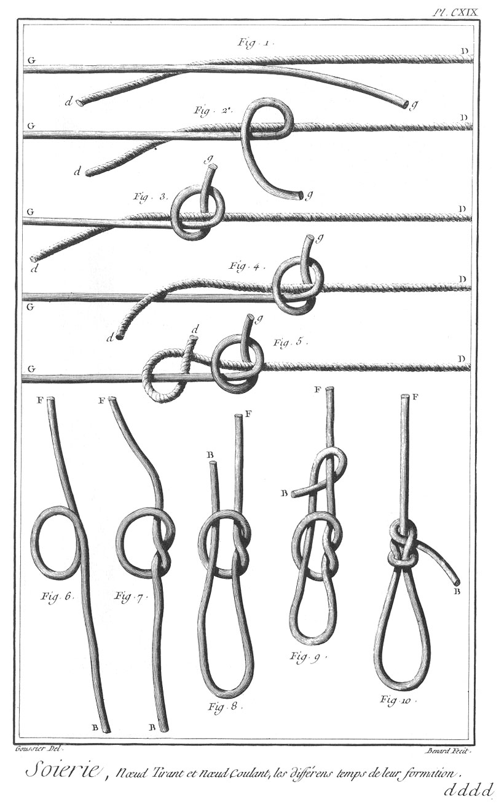](Planche_119.jpeg)

signée d d d d.

Cette Planche contient la formation de deux noeuds d'un usage fréquent dans la fabrique, savoir le noeud tirant & le noeud coulant, en cinq tems chacun.

Fig.
1. Premier tems de la formation du noeud tirant. Il faut disposer parallelement les deux bouts de la ficelle qu'on veut réunir.

2. Second tems de la formation du même noeud. Il consiste à former vers la gauche une boucle avec le bout g du fil de la gauche passé en dessus.

3. Troisieme tems. Il consiste à faire passer en-dessous le bout g du fil gauche dans la boucle qu'il a formée, de maniere qu'il embrasse en-dessous le fil de la droite.

4. Quatrieme tems. Il faut ramener en-dessus le fil d de la droite & former une boucle.

5. Cinquieme tems. Il faut faire passer le bout d par-dessous le fil de la gauche & le faire entrer dans la boucle que le même fil a formée serrer ensuite.

Les cinq figures suivantes représentent la formation du noeud coulant fait à un bout d'une seule ficelle; le bout de la ficelle sera indiqué par la lettre B, & sa longueur par la lettre F.

6. Premier tems de la formation du noeud coulant. Il faut, avec le bout B, former un anneau.

7. Second tems. Il faut faire passer le bout B dans l'anneau.

8. Troisieme tems. Faire repasser le même bout B dans l'anneau, en réservant une boucle vers le bas.

9. Quatrieme tems. Faire avec le bout B un tour autour de la corde F, & ramener le bout par-dessous lui même.

10. Le noeud entierement achevé & dont toutes les circonvolutions sont serrées sur elles-mêmes.

PLANCHE CXX,
------------

[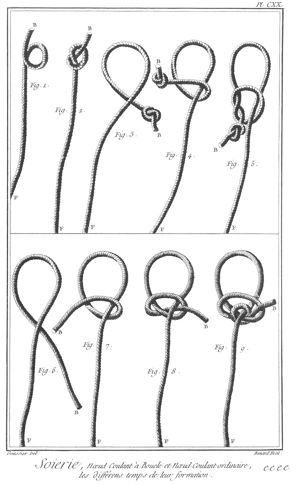](Planche_120.jpeg)

signée e e e e. Formation du noeud coulant à boucle & du noeud coulant ordinaire.

Ces deux noeuds se font à un bout d'une seule ficelle.

Fig.
1. Tems de la formation du noeud coulant à boucle. Il faut tourner le bout B sur la ficelle F, de maniere à former un anneau.

2. Second tems. Faire passer le bout B dans l'anneau formé au tems précédent.

3. Troisieme tems. Former une boucle en passant le bout sous la ficelle.

4. Quatrieme tems. Ramener en-dessus le bout B de la ficelle pour former un anneau autour d'elle.

5. Cinquieme tems. Faire passer le bout & le noeud qui le termine dans l'anneau formé au tems précédent, serrer ensuite cet anneau sur la ficelle reservant la boucle. Ce noeud a cela de commode qu'en tirant la ficelle F, il se défait entierement.

6. Premier tems de la formation du noeud coulant ordinaire. Il faut faire une boucle, le bout B passant sous la ficelle F.

7. Second tems de la formation du même noeud. Il faut entourer la ficelle avec le bout B en passant par-dessus.

8. Troisieme tems. Ramener le bout B par-dessous & le faire passer dans l'anneau formé au tems précédent.

9. Quatrieme tems. Ramener encore le bout B autour de la ficelle f, & le faire repasser dans le même anneau. Il faut ensuite serrer le tout, en réservant la boucle.

PLANCHE CXXI,
-------------

[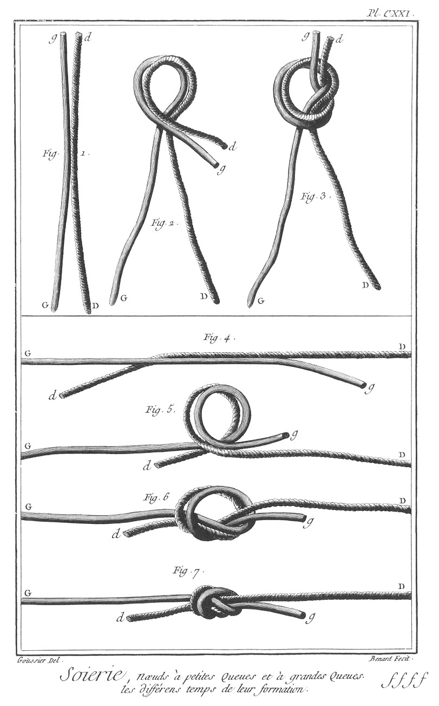](Planche_121.jpeg)

signée f f f f.

Cette Planche contient la formation des noeuds à petites & à grandes queues. Ces noeuds se font pour réunir deux parties séparées; c'est la raison pour laquelle on a coté des lettres D & d: G & g, les deux fils ou ficelles pour les distinguer en droite & gauche. Un des deux fils a aussi été reservé lisse, l'autre étant cablé, pour qu'il fût plus aisé de les reconnoître.

Fig.
1. Premier tems. Les deux bouts de fils placés parallelement entre eux.
	- G, le fil à gauche.
	- D, le fil à droite longs de ce côté, d'une grandeur arbitraire, g & d, les bouts du fil qu'il faut lier ensemble.

2. Second tems. Il faut faire une boucle en ramenant les deux fils parallelement entre eux par-dessus eux-mêmes.

3. Troisieme tems de la formation de ce noeud. Il faut faire passer les deux queues g & d par-dedans la boucle formée au second tems, & cela par-dessous les deux G & D que l'on veut lier ensemble, puis serrer le noeud, qui alors est achevé.

4. Premier tems de la formation du noeud à longues queues. Le fil de la main gauche G g doit être placé parallelement au fil d D de la main droite; on les a distingués l'un de l'autre par la maniere dont ils sont gravés.

5. Second tems de la formation de ce noeud. Il faut faire un anneau en-dessous avec le fil droit d, & un autre anneau en-dessus avec le fil gauche g.

6. Troisieme tems de la formation de ce noeud. Il faut passer un des deux fils en entier dans les deux anneaux, & y passer aussi le bout de l'autre fil; ainsi le fil droit D en entier & le petit bout g du fil gauche ont été tous deux passés en-dessous dans les anneaux de la fig. 5.

7. Le noeud entierement achevé, dont les différentes circonvolutions ont été serrées les unes contre les autres.

PLANCHE CXXII,
--------------

[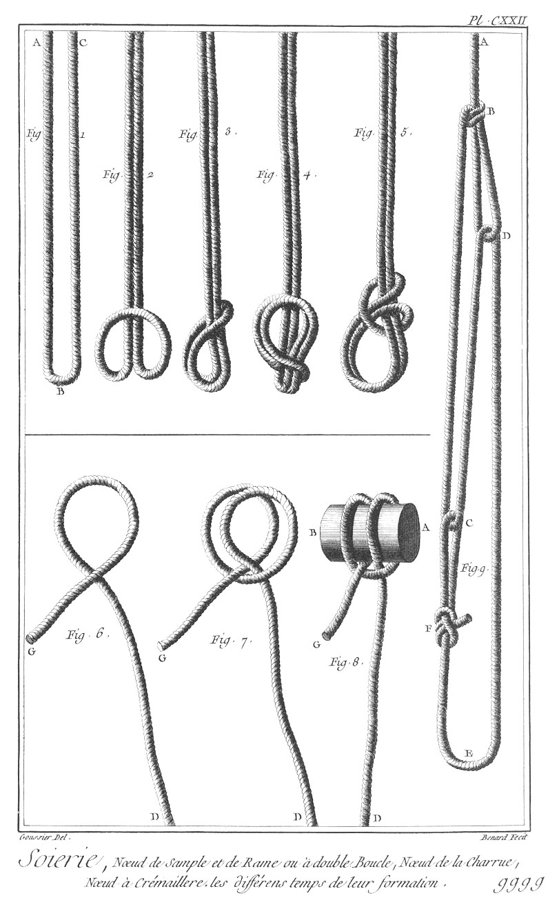](Planche_122.jpeg)

signée g g g g.

Cette Planche contient la formation du noeud par lequel les cordes du sample ou celles du rame sont attachées à leur bâton, le noeud de la charrue & celui à crémaillere.

Fig.
1. Corde de rame ou de sample ployée en deux; la longueur totale est d'environ vingt piés, ce qui donne dix piés pour la longueur des branches B A, B C.

2. Second tems de la formation de ce noeud. Il faut relever l'anse pour former une boucle dont la partie supérieure s'applique aux deux branches réunies.

3. Troisieme tems. Il faut joindre ensemble les deux côtés de la boucle.

4. Quatrieme tems. Il faut relever cette boucle & l'appliquer aux deux branches ou cordons.

5. Cinquieme tems. Il faut tirer les cordons par l'ouverture de la boucle, pour en former une autre. C'est dans cette nouvelle boucle que doit passer le bâton du rame, ou celui du sample. On serre ensuite cette boucle sur le bâton, & le noeud est achevé.

Le noeud suivant, nommé le noeud de la charrue, sert, au-lieu de celui dont nous venons de décrire la formation, pour attacher une corde soit au rame, soit au sample, & remplacer par ce moyen celles qu'un long service ou d'autres causes ont fait rompre.

6. Premier tems de la formation de ce noeud. Tenez le bout G de la main gauche, formez une boucle en-dessous du bout de la corde.

7. Second tems. formez une seconde boucle encore en-dessous de la corde, ce qui se fait en la tournant ou tordant sur elle-même après avoir formé une anse.

8. Le noeud achevé, dans les deux boucles duquel passe un bâton A B, qu'on peut également supposer être celui du sample ou celui du rame décrits ci-devant.

9. Noeud à crémaillere. Ce noeud est d'une grande commodité pour pouvoir élever ou abaisser à volonté, & de la quantité qu'on veut, ce qui y est suspendu; aussi il est employé fréquemment dans la fabrique.
	- A, partie de la corde qui est attachée à un point fixe.
	- B, noeud pour former une boucle D; ce noeud est de l'espece de celui représenté par la fig. 3. de la Planche précédente; l'autre partie de la corde après avoir descendu en C pour former une boucle, remonte passer dans la  boucle D; de-là elle descend en E, où elle forme une troisieme boucle, remonte ensuite & passe dans l'anse ou boucle C, redescend ensuite en F, où le bout est arrêté par un noeud coulant de l'espece de celui représenté au bas de la Planche CXIX. Il résulte de cette disposition de la corde que l'extrémité inférieure E peut s'approcher ou s'éloigner du noeud B, selon qu'on fait couler la partie du milieu C D d'un sens ou de l'autre dans les boucles où elle est passée.

PLANCHE CXXIII,
---------------

[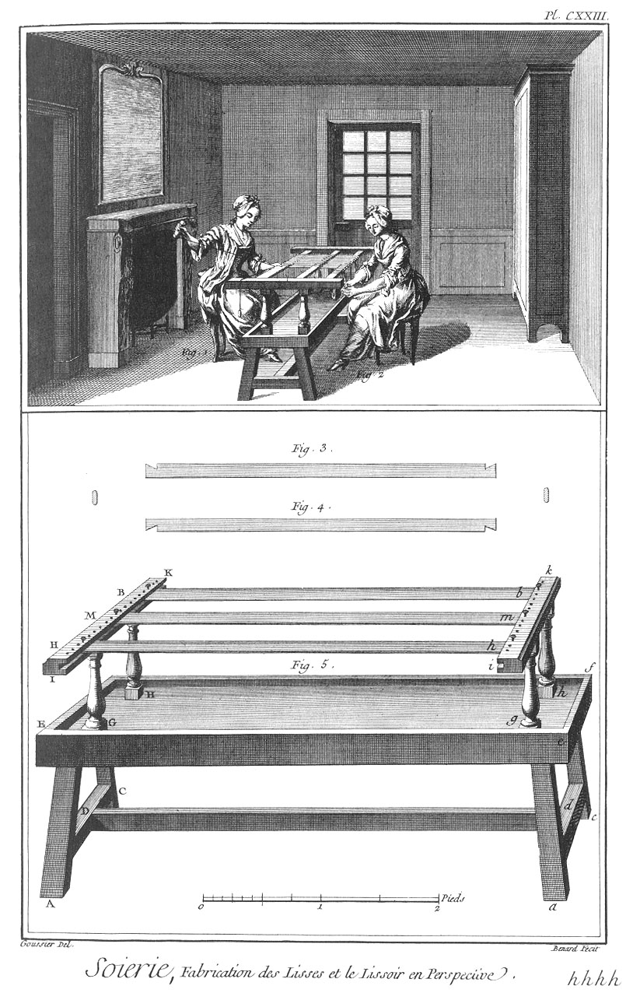](Planche_123.jpeg)

signée h h h h. Fabrication des lisses & le lissoir en perspective.

La vignette représente l'intérieur d'une chambre & deux ouvrieres occupées à fabriquer une lisse à noeud.

Fig.
1. Ouvriere, qui après avoir formé le noeud près la barre de bois du milieu, arrête le fil près de la barre qui est de son côté à la ficelle ou crête de la lisse, par l'opération que l'on nomme natter, que l'on trouvera représentée dans les Planches suivantes; la corde sur laquelle elle natte le fil de lisse chargé sur le rochet ou bobine qu'elle tient de la main droite est attachée d'un bout à une des chevilles des barres du lissoir, & de l'autre passe sur un des chevalets, d'où elle est tirée en bas par le poids dont elle est chargée, comme on le voit dans la vignette.

2. Seconde ouvriere qui présente les mailles du bas des lisses à la premiere; elle tient de la main gauche plusieurs mailles; elle choisit de la main droite celle qu'il faut présenter ouverte, observant de les prendre de suite comme elles ont été fabriquées.

Pour former le bas des lisses, il ne faut qu'une seule ouvriere. Bas de la Planche.

3. Lisseron d'en-haut des lisses.

4. Lisseron d'en-bas des lisses; on voit vers les extrémités de l'un & de l'autre les entailles qui servent à arrêter la ficelle ou crête des mailles supérieures & inférieures, pour qu'elles soient étendues & larges comme elles doivent l'être.

5. Le lissoir vu en perspective disposé comme il convient qu'il soit pour fabriquer le bas des lisses.

L'ourdissoir est composé d'une banque E F e f, de quatre piés & demi de long sur un pié de large & deux pouces d'épaisseur, entourée des quatre côtés d'un rebord d'un pouce de haut; cette banque est soutenue, à quinze pouces de hauteur, par quatre piés A, C, a, c, assemblés l'un à l'autre par des traverses, qui le sont elles-mêmes par une autre traverse D d.

Sur la banque s'élevent quatre piliers G, H, g, h, qui soutiennent, à dix ou onze pouces d'élévation, les deux coulisses I K, i k; c'est dans les rainures de ces deux pieces que coulent les regles B b, M m, H h, que l'on peut approcher & éloigner l'une de l'autre à volonté, & fixer où on veut, parallelement entre elles, par les chevilles de fer qui traversent les rainures des coulisses & l'extrémité des regles.

PLANCHE CXXIV,
--------------

[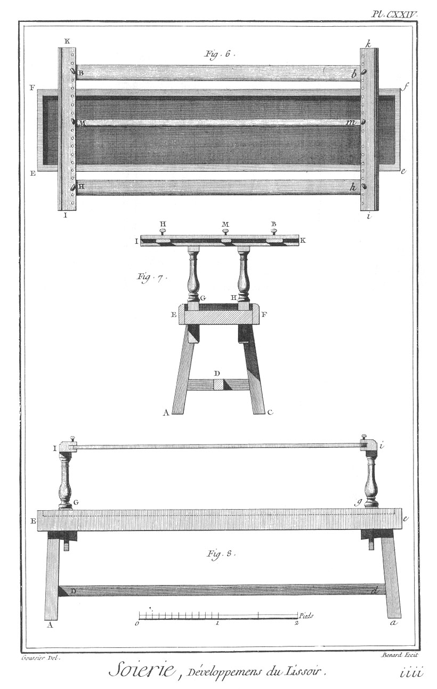](Planche_124.jpeg)

signée i i i i. Développemens du lissoir.

Fig.

6. Le lissoir vu en plan.
	- E F e f, la banque de quatre piés & demi de long sur un pié de large.
	- I K, i k, les deux coulisses, de deux piés de long & trois pouces de large chacune, percée d'une vingtaine de trous à distances égales, pour pouvoir fixer les trois regles où on veut.
	- B b, regle qui doit être enfilée dans les mailles du bas des lisses.
	- H h, regle qui doit être renfermée dans les mailles du haut des lisses à mesure qu'on les forme.
	- M m, troisieme regle qui sert à différens usages, comme on le verra dans la suite.

7. Coupe du lissoir par le milieu de sa longueur.
	- E F, la banque d'un pié de large & deux pouces d'épaisseur.
	- A C, les piés.
	- D, coupe de la longue traverse.
	- G & H, deux des quatre porte-coulisses ou piliers d'en-haut arrêtés sur la banque par des clés qui traversent leurs queues.
	- I K, la coulisse.
	- B, M, H, coupe des trois regles.

8. Elévation géométrale du devant du lissoir.
	- A a, les piés.
	- D d, longue traverse.
	- E e, banque.
	- G g, les porte-coulisses.
	- I i, les coulisses, dans les rainures desquelles on voit une des trois regles.

PLANCHE CXXV,
-------------

[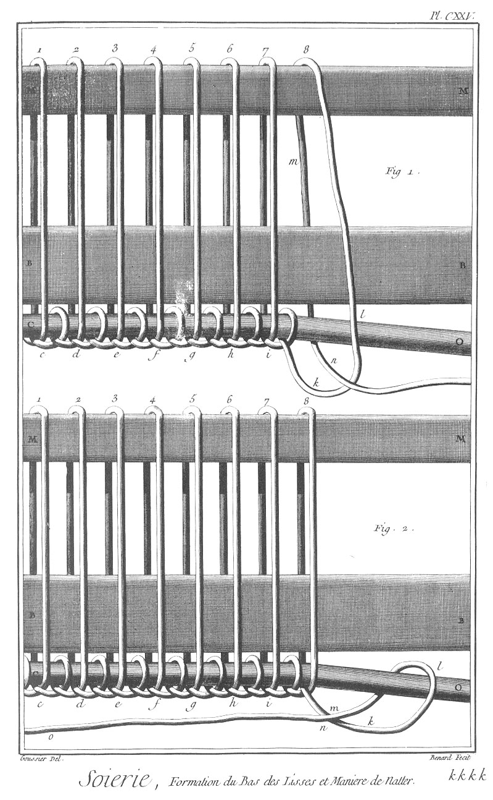](Planche_125.jpeg)

signée k k k k. Formation du bas des lisses & maniere de natter.

Fig.
1. Formation des mailles du bas des lisses.
	- M M, partie de la barre du milieu du lissoir.
	- B B, partie de la barre du bas des lisses; l'une & l'autre dessinées sur une largeur moitié moindre que celle qu'elles ont effectivement.
	- c 1, d 2, e 3, f 4, g 5, h 6, i 7, sept mailles séparées les unes des autres entre c, d, e, f, g, h, i, par autant de tours du natter sur la ficelle C O, qui a moins d'une ligne de diamètre, mais qu'on a représentée ici beaucoup plus grosse, ainsi que le fil de lisse, pour mieux distinguer les circonvolutions du dernier autour de la ficelle.

Premier tems de la formation de la maille. De la main gauche il faut abaisser une boucle k, dans laquelle tous les doigts de cette main seront passés; de la main droite, qui tient le rochet sur lequel est le fil de lisse, conduire ce rochet par dessus les deux regles B & M, le passer dessous la regle M, le donner à la main gauche, & le tirer avec cette main. Son fil l m n o, formera la nouvelle maille k 8, qu'il faudra serrer auprès des précédentes autant que le natter qui les sépare pourra le permettre.

2. Maniere de natter, c 1, d 2, e 3, f 4, g 5, h 6, i 7, 8, les mêmes mailles que dans la figure précédente. Pour natter il faut former de la main gauche une boucle K comme pour former la maille; passer ensuite le rochet en l par dessus la ficelle C O, le ramener en m par dedans la maille, & serrer du côté de n o. On natte ordinairement deux fois de suite, comme on le verra dans les Planches suivantes.

PLANCHE CXXVI,
--------------

[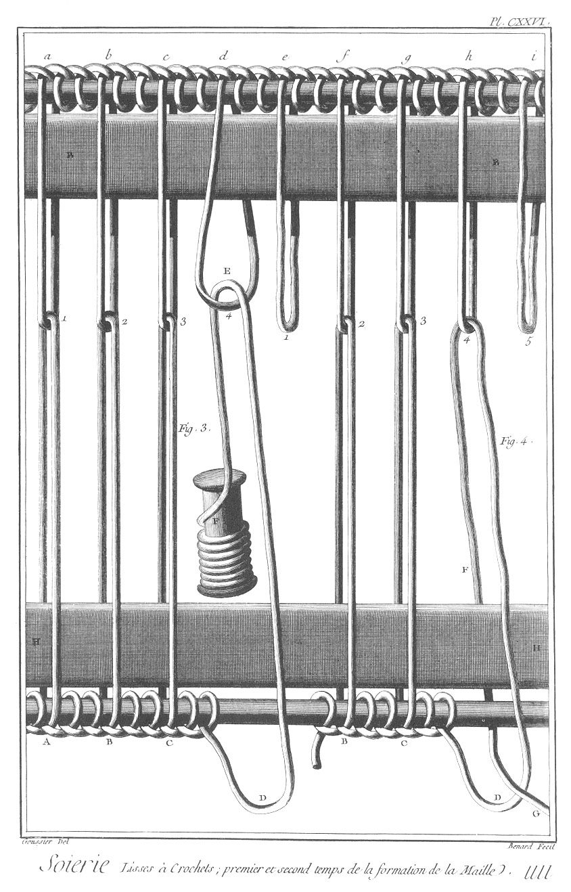](Planche_126.jpeg)

signée l l l l. Maniere de former les lisses à crochets.

Les mailles d'enbas étant formées comme il est représenté dans la Planche précédente, on les placera le long de la regle B B, en a b c d e f g h i, &c. ayant ensuite placé la regle H H du haut des lisses à la distance convenable, & l'ouvriere, fig. 2. de la vignette, étant placée du côté des lettres a b c d e f g h i, & la lisseuse, fig. 1. au-devant de la regle H H, elle procédera en cette sorte à la formation des mailles.

3. Premier tems de la formation de la maille.
	- A 1 a, B 2 b, C 3 c, trois mailles complettes suivies de deux natter. Pour former la quatrieme maille, la lisseuse fera de la main gauche une boucle D, dans laquelle tous les doigts seront passés; tenant de la main droite le rochet F, elle le conduira par dessus la regle H H dans la maille d 4, qui lui est présentée & tenue ouverte en E par la seconde ouvriere.

4. Second tems de la formation de la maille. La lisseuse passera le rochet qu'elle tient de la main droite dans la main gauche, qui le tirera par dedans la maille D, on serrera auprès des deux natter précédens, on nattera deux coups pour recommencer ensuite la maille suivante.

PLANCHE CXXVII,
---------------

[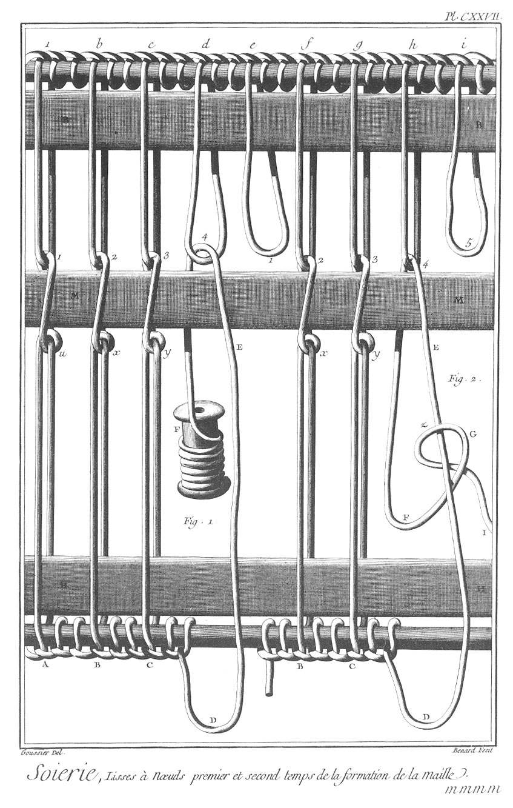](Planche_127.jpeg)

signée m m m m.

Cette Planche & la suivante appartiennent toutes deux à la fabrication des lisses à noeuds. 

Fig.
1. Premier tems de la formation de la maille.
	- A u 1 a, B x 2 b, C y 3 c, trois mailles complettes. Pour former la maille suivante, après deux natter, on formera de la main gauche une boucle D, dans laquelle cette main sera passée. De la main droite la lisseuse portera le rochet chargé du fil à lisse D E par dessus la barre M M du milieu, & le passera dans la maille 4 que la seconde ouvriere lui présente & tient ouverte; après que le rochet aura passé dans la maille & dessous la regle M M, il sera reçu entre les doigts de la main gauche.

2. Second tems de la formation de la maille. La lisseuse ayant reçu le rochet dans sa main gauche, elle le rendra à la main droite en retenant son fil pour former une boucle F. La main droite qui a reçu le rochet du côté de G, le fera passer par dessus le fil D E dans la boucle F que retient la main gauche, pour être repris en I par cette même main, qui lâchera en même tems la boucle F.

PLANCHE CXXVIII,
----------------

[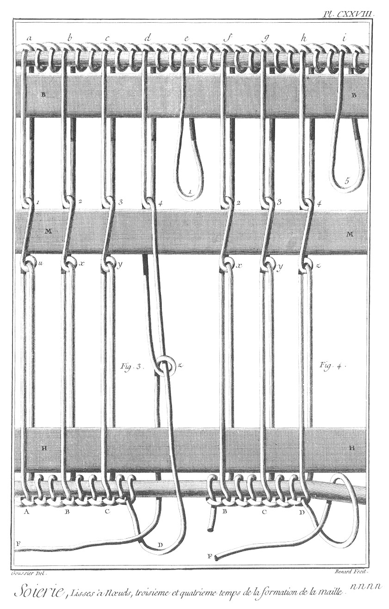](Planche_128.jpeg)

signée n n n n.

Fig.

3. Troisieme tems de la formation de la maille. La main gauche qui tient le rochet le fera passer dans la maille D vers F. On serrera ensuite, & le noeud z s'approchera de la barre du milieu M M & la boucle D de la corde à natter.

4. La maille précédente D z 4 h entiérement achevée, & le commencement du premier des deux natter qui suit.

PLANCHE CXXIX,
--------------

[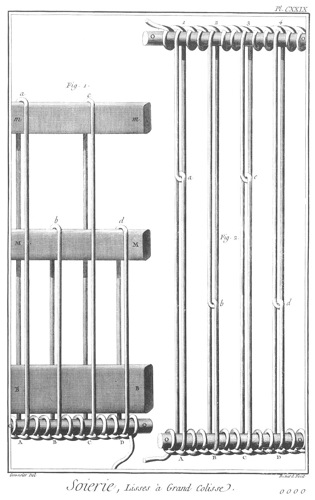](Planche_129.jpeg)

signée o o o o. Lisses à grand colisse.

Fig.
1. Le bas de ces lisses se travaille sur trois regles.
	- B B, regle du bas de lisses.
	- M M, regle du milieu.
	- m m, seconde regle du milieu.

Ces sortes de lisses ont alternativement une maille longue & une courte.
	- A a, maille longue.
	- B b, maille courte.
	- C c, maille longue.
	- D d, maille courte; les unes séparées des autres par deux natter sur la ficelle O O.

2. Echantillon de lisse à grand colisse entiérement achevé. Sa hauteur devroit être de seize pouces, mais la hauteur de la Planche ne l'a pas permis.
	- O O, O O, les deux ficelles du haut & du bas de la lisse.
	- A a, maille longue du bas passée en a dans la maille 1 a du haut.
	- B b, maille courte du bas passée en b dans la maille longue 2 b du haut.
	- C c, maille longue du bas passée en c dans la maille courte 3 c du haut.
	- D d, maille courte du bas passée dans la maille longue 4 d du haut: ainsi de suite alternativement.

PLANCHE CXXX,
-------------

[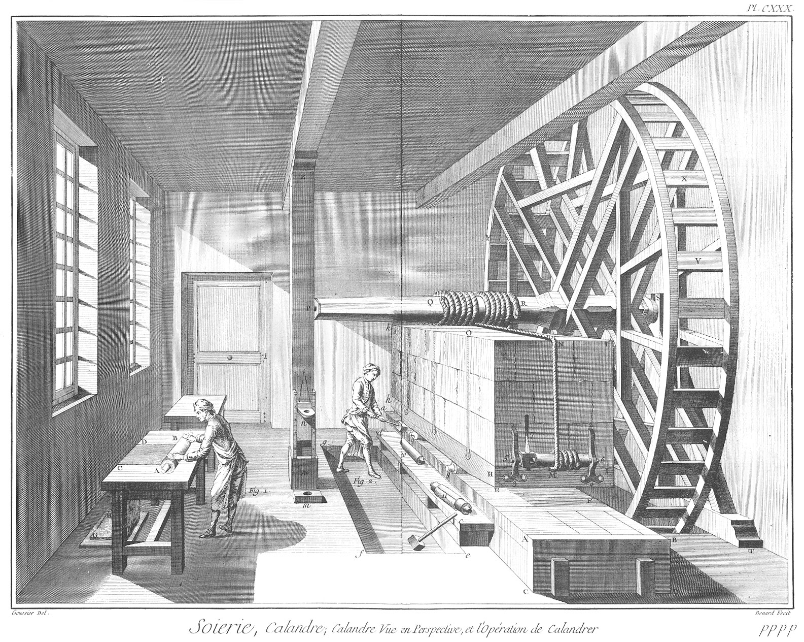](Planche_130.jpeg)

signée p p p p.

Cette Planche & celles qui suivent représentent les différentes machines qui servent à lustrer, calandrer, ou moirer certaines étoffes.

La Planche représente l'intérieur de l'attelier où est la calandre, composée principalement d'une forte table de marbre assise solidement, d'une table de cuivre qui est double inférieurement un fort madrier de bois qui est chargé d'une masse considérable, & de la roue qui sert à mettre cette masse en mouvement.

- A B C D, un des bouts de l'établi ou massif de pierre dans lequel & sur lequel la table de marbre est scellée.
- E F, un bout de la table de marbre qui a dix à douze piés de longueur, sur une largeur de trois à quatre piés.
- H I h, forte table de bois sur laquelle est établi le massif de mâçonnerie H I K L k du poids d'environ quatre-vingts milliers. Le dessous du madrier est doublé par une table de cuivre, entre laquelle & la table de marbre, on place les rouleaux 8, 9, sur lesquels les étoffes qu'on veut calandrer ou moirer sont roulées. Cette masse énorme est mise en mouvement par plusieurs hommes qui, en marchant dans la roue V X Y, font tourner l'arbre P Q R S de cette roue, sur lequel s'enveloppe d'un côté & se développe de l'autre deux cables arrêtés aux deux bouts de la masse par des treuils.

Le pivot S de l'arbre est soutenu par le poinçon d'une ferme de charpente, dont on voit en T le bout d'une des jambes de force & celui de l'entrait; l'autre pivot roule dans un trou pratiqué au poteau montant AE Z, affermi vers le haut par une des poutres du plancher. A ce poteau tient le valet n, avec lequel & la coquille m, on met les rouleaux dans la situation verticale pour dérouler commodément l'étoffe dont ils sont entourés.

Entre ce poteau & la calandre est une fosse e f g, d'environ un pié de profondeur, dans laquelle l'ouvrier descend pour être plus à portée d'agir & de châtier les rouleaux. Au-devant de la table de marbre est une tablette c d plus basse qu'elle d'environ dix pouces, sur laquelle le calandreur place les rouleaux 10 & 11, pour les substituer l'un après l'autre à ceux qui sont entre les deux tables. 10, rouleau nud. 11, rouleau chargé d'une piece d'étoffe, & d'un foureau qui l'environne.

Fig.
1. Ouvrier qui roule une piece d'étoffe sur le rouleau A B. La piece d'étoffe G H est pliée en zigzag sur un ais posé par terre; elle monte en C D sur le bord de la table, où elle est attirée par la rotation du rouleau.

2. Calandreur qui châtie un rouleau en le frappant avec une masse de bois pour le remettre dans la direction perpendiculaire à la longueur de la calandre, & par ce moyen ramener la masse lorsqu'elle s'est dérangée.

PLANCHE CXXXI,
--------------

[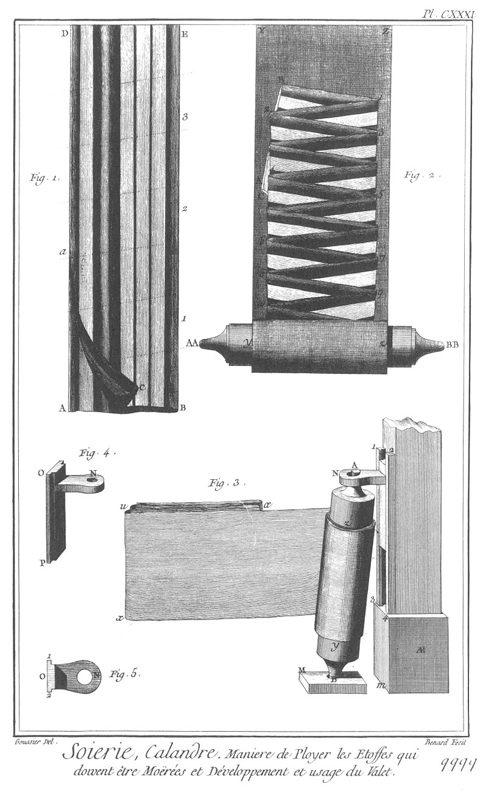](Planche_131.jpeg)

signée q q q q. Maniere de plier les étoffes qui doivent être moirées, & développement & usage du valet.

Fig.
1. La piece d'étoffe qu'on suppose pour exemple un gros-de-Tours rayé, pliée en deux sur la largeur, ensorte que les lisieres D a A, D a C soient appliquées l'une sur l'autre, & le milieu de l'étoffe en B, 1, 2, 3, E.

2. Maniere de plier l'étoffe préparée comme la figure précédente l'indique pour être moirée.
	- A A, B B, les bouts du rouleau.
	- y z, les lisieres du fourreau Y y z Z, qui accompagnent l'étoffe.
	- A C, les deux coins ou bouts des lisieres appliqués l'un sur l'autre comme dans la figure précédente.
	- B 1 2 3 4 5 6 7 8 9 10, &c. le pli du milieu de l'étoffe de la figure précédente, plié en zig zag sur elle-même, & roulée en cet état avec le fourreau.

3. Usage du valet appliqué au poteau AE Z, Planche précédente. AE, partie inférieure du poteau auquel sont attachées les deux coulisses 1, 3: 2, 4, entre lesquelles le valet peut glisser de haut en bas, pour que son oeil N puisse emboîter le pivot A du rouleau; l'autre pivot B repose sur la coquille M.

4. Le valet séparé de ses coulisses vu en perspective.
	- N, oeil du valet.
	- O P, piece coulante; ses languettes sont reçues dans les rainures des coulisses.

5. Le valet vu en plan.
	- 1 & 2, les languettes.

PLANCHE CXXXII,
---------------

[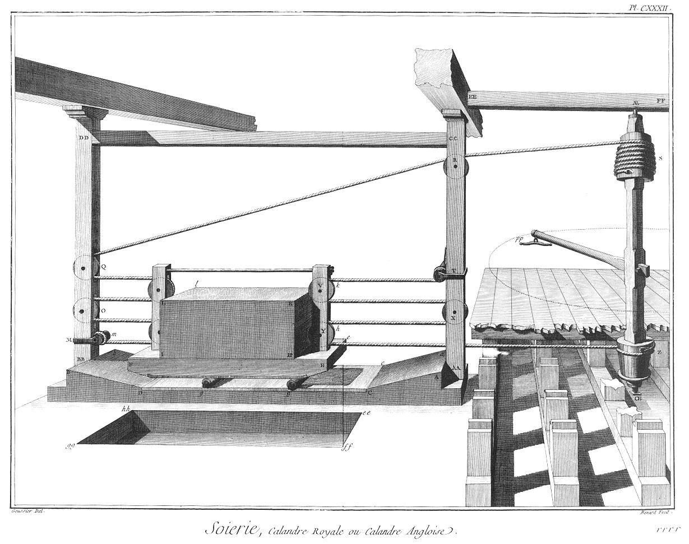](Planche_132.jpeg)

signée r r r r. Calandre royale ou Calandre angloise.

- A a B b, la table inférieure de la calandre; elle est de marbre.
- C D c d, table de cuivre entre les deux plans inclinés.
- F E e, forte table de bois doublée inférieurement d'une table de cuivre.
- H I K L h k l, masse pesante qui pose sur la table.
- 8 & 9, rouleaux entre les deux tables.
- A A, C C: B B, D D, poteaux montans affermis sous les poutres du plancher dans lesquels sont les poulies de renvoi des cordes qui font mouvoir la masse.
- M, treuil servant à bander une des cordes; cette corde après avoir passé sur la poulie N 	de la masse, vient passer sur la poulie O, de-là sur la poulie P de la masse, revient ensuite passer sur la poulie Q, de-là par R sur le tambour S.
- T, Second treuil pour bander l'autre corde, qui delà vient passer sur la poulie V de la masse, retourne ensuite passer sur la poulie X, revient passer sur la poulie Y de la masse, & de-là va s'enrouler sur le tambour inférieur Z de l'arbre vertical OE AE. Ce tambour est placé au-dessous du plancher sur lequel marchent circulairement ceux qui font mouvoir la calandre. On a fracturé ce plancher pour laisser voir le tambour inférieur & le pivot de l'arbre vertical.

PLANCHE CXXXIII,
----------------

[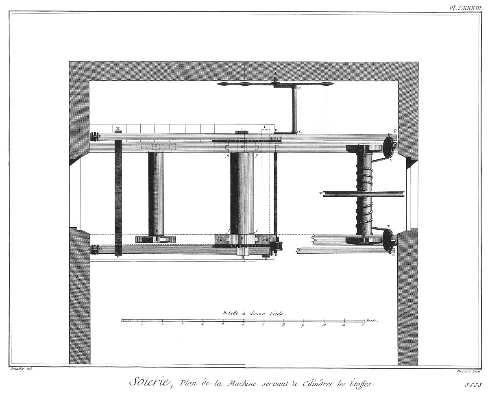](Planche_133.jpeg)

signée s s s s. Plan de la machine servant à cylindrer les étoffes.

Cette machine est composée de deux rouleaux disposés horizontalement l'un au-dessus de l'autre; l'inférieur est de bois & est massif; le supérieur est de cuivre & est percé pour recevoir des barres de fer rougies au feu, lesquelles lui communiquent un degré de chaleur convenable.

Les rouleaux sont comprimés l'un contre l'autre au moyen de plusieurs leviers, dont on verra la disposition dans la Planche suivante, & c'est le rouleau inférieur qui est mobile, & peut s'éloigner ou s'approcher du rouleau supérieur.

Le rouleau de cuivre est garni à chacune de ses extrémités d'une roue dentée, à laquelle le mouvement est communiqué par une lanterne; ces lanternes sont fixées sur l'axe de la manivelle, par le moyen de laquelle on met la machine en mouvement.

- A D E, axe de la manivelle.
- B C, manivelle garnie d'un rouleau de bois qui sert de poignée; près du pivot A est un volant pour rendre uniforme la vitesse imprimée à la manivelle.
- D E, les deux lanternes qui engrennent dans les roues fixées aux extrémités du cylindre de cuivre, dont F & G sont les tourillons.
- f f g g, le cylindre de bois.
- H I, extrémités du sommier sur lequel portent les appuis des tourillons du rouleau inférieur.
- K L, barre de fer qui traverse deux des quatre montans entre lesquels les rouleaux sont placés; les extrémités de cette barre servent de point d'appui ou d'hipomoclion au levier inférieur K H O, & à un autre levier semblable qui est caché par le levier supérieur P Q. Ces leviers, qui sont du second genre, sont placés au-dessous du rez-de-chaussée.
- M N, autre barre de fer posée sur les chapeaux qui assemblent les quatre montans; les extrémités de cette barre servent d'appui au levier supérieur P N Q, & à un autre levier semblable dont on voit seulement l'extrémité en R. Ces leviers, qui sont du premier genre, tirent les leviers inférieurs par des chaînes ou tirans de fer clavetées en-dessus des leviers supérieurs, comme on le voit en P, & en-dessous des leviers inférieurs comme on le voit en O; chacun des leviers supérieurs est chargé en Q & R, extrémité de leur plus long bras, d'un poids suffisant pour opérer la compression des cylindres.
- S & T, deux poulies sur lesquelles passent les cordes qui sont attachées aux leviers & vont s'enrouler sur le treuil X Y, qui est supporté par les chapeaux. Les chapeaux sont supportés dans leur milieu par les montans de la machine & par leurs extrémités par les murailles de l'attelier dans lesquelles ils sont scellés.
- V, roue ou poulie qui reçoit une corde sans-fin, par le moyen de laquelle on releve les leviers lorsqu'on veut desserrer les cylindres.
- Z z, rouleau sur lequel la piece d'étoffe est roulée, & de dessus lequel elle sort pour passer entre les cylindres.

PLANCHE CXXXIV,
---------------

[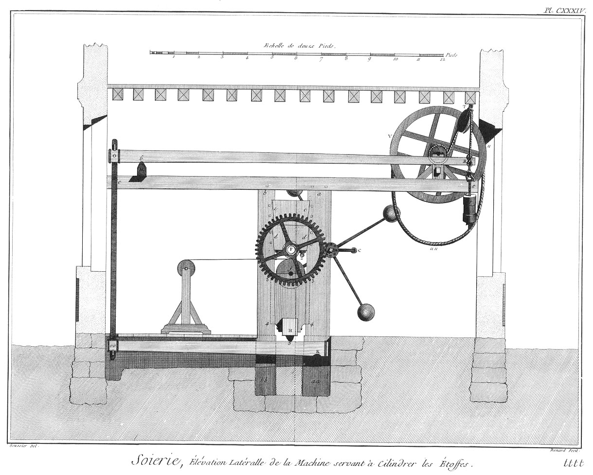](Planche_134.jpeg)

signée t t t t. Elévation latérale de la machine servant à cylindrer les etoffes.

- a a, a: b b, b, les deux montans de l'un des côtés de la machine; ces montans sont assemblés l'un à l'autre à leur partie supérieure par deux entretoises c c, d d, enbrevées dans les montans que le chapeau e e recouvre & contient dans la situation verticale. Aux parties inférieures des montans sont des rainures 3, 4: 3, 4, qui reçoivent les languettes du support du tourillon f; les supports reposent sur le sommier H, à la partie inférieure duquel sont des pieces de fer 5, qui appuient en 5 sur les leviers inférieurs K o o, qui
 sont du second genre, ainsi qu'il a été dit ci-devant.
- K, extrémité de la barre de fer qui sert d'appui aux leviers inférieurs.
- O o o, tirant ou chaîne de fer, par le moyen de laquelle le levier supérieur O R tire le levier inférieur; cette chaîne est clavetée en-dessous du levier inférieur & en-dessus du levier supérieur.
- M, extrémité de la barre de fer qui sert de point d'appui aux leviers supérieurs; le dessus est un peu arrondi au point 6, & le levier est un peu entaillé en cette partie pour l'empêcher de glisser sur son appui.

Les extrémités R des leviers supérieurs sont chargés par des poids r, que l'on augmente à discrétion. La corde qui suspend les poids, après avoir entouré l'extrémité du levier, va passer sur la poulie T, & de-là va s'enrouler sur le treuil Y, que l'on fait tourner pour relever les leviers au moyen de la corde sans-fin V u, u u, qui est reçue dans la cavité de la roue-poulie fixée sur le milieu du treuil.

- F, le cylindre de cuivre, dont les colets sont terminés en octogone, pour recevoir une roue dentée. Cette roue est menée par la lanterne E fixée sur l'axe de la manivelle.
- C, poignée de la manivelle, du centre de laquelle partent les quatre bras terminés par des boules de plomb, qui composent le volant: trois de ces quatre boules, de forme lenticulaire, sont visibles; la quatrieme est cachée par les montans de la machine.
- 2, 2, vis à pitons qui fixent le collier qui suspend le rouleau supérieur à l'entre-toise d d. Au-devant de la machine est le rouleau z, chargé de la piece d'étoffe que l'on veut cylindrer.

L'analogie de cette machine est facile à trouver en multipliant par ordre les analogies particulieres de chaque levier; ainsi l'effort du poid r est à l'effort qui se fait en O, comme M O est à M R, le levier étant du premier genre. L'effort fait en O est le même que celui fait en o o, extrémité du levier inférieur K o o, qui est du second genre; & par la nature de ce levier, on aura que l'effort fait en o o, est à celui fait en H, comme K H est à K o o. Voici donc les deux analogies ou proportions, nommant r le poids suspendu à l'extrémité R du levier supérieur, & O, l'effort de ce poids réduit à l'extrémité supérieure du tirant vertical O o o, qui unit les deux leviers, & H, l'effort fait en H pour comprimer les cylindres, le premier levier donne cette proportion,

r. O:: M O. M R

Le second levier donne celle-ci,

O. H:: K H. K o o

multipliant par ordre & divisant les deux premiers termes par O, on aura

r. H:: M O x K H. M R x K o o

proportion qui exprime le rapport de la puissance r, à l'effort fait en H; effort qui est la mesure de la compression des cylindres.

Dans les figures les distances M O & K H, sont chacunes de 13 pouces & demi, le bras de levier M R a 2 toises 1 pied 6 pouces = 162 pouces, & le levier inférieur K o o, 1 toise 2 pieds 5 pouces = 101 pouces. Substituant donc ces valeurs dans la proportion précédente, elle deviendra r. H:: 13½ x 13½. 162 x 101, d'où on tire que le poids r est à l'effort fait en H, comme 182¼. 16362. Divisant le conséquent de ce rapport par son antécédent, on aura celui de l'unité 1 à 367/729: rapport qui ne differe que très-peu de celui d'1 à 90; prenant donc ce dernier rapport, la proportion ci-dessus deviendra celle-ci r. H:: 1. 90, par laquelle on voit que si le poids r est de 1000 livres, la force avec laquelle les cylindres sont comprimés sera de quatre-vingt-dix milliers.

PLANCHE CXXXV,
--------------

[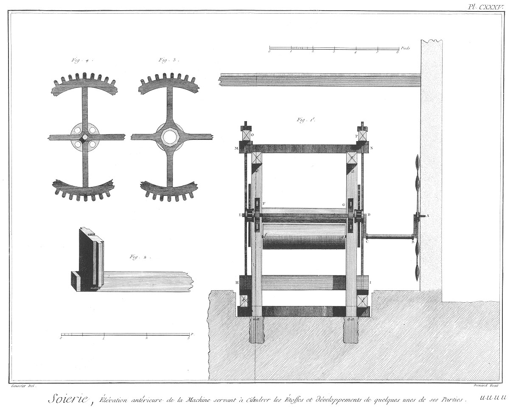](Planche_135.jpeg)

signée u u u u.

Fig.
1. Elévation antérieure de la machine à cylindrer les étoffes.
	- a a, a: a a, a, montans antérieurs signalés des mêmes lettres dans les Planches précédentes.
	- K L, barre de fer qui traverse ces montans & sert d'hipomoclion ou point d'appui aux leviers inférieurs.
	- k & l, extrémités des leviers inférieurs placés au-dessous du rez-de-chaussée où ils sont recouverts de planches.
	- H I, sommier qui soutient les supports des tourillons du cylindre de bois f g.
	- E, D, lanternes qui communiquent le mouvement aux roues dentées qui terminent le cylindre de cuivre F G. Entre la machine & la muraille, on voit la manivelle A B C D, réunie en D à l'axe commun des deux lanternes.
	- A, pivot de la manivelle, près duquel est fixé le volant.
	- e, e, chapeaux qui assemblent les montans & les contiennent dans la situation verticale.
	- M N, barre de fer qui sert de point d'appui aux leviers superieurs.
	- O, P, extrémité des leviers supérieurs au-dessus desquels on voit les clavettes qui fixent les tirans.

2. Elévation perspective d'un des deux supports des tourillons du cylindre inférieur & d'une partie du sommier auquel ils sont assemblés, on voit dans cette figure les languettes qui coulent dans les rainures des montans.

3. Elévation d'une partie de la roue & du cylindre de cuivre, pour faire voir comment la roue est assemblée sur le tourillon du cylindre: ce tourillon est de forme octogone dans la partie qui reçoit la roue.
	- F, ouverture par laquelle on introduit les barres de fer rougies sur un fourneau à grille, où elles sont chauffées avec du charbon; cette figure, ainsi que la suivante, sont dessinées sur une échelle double.

4. Autre maniere de construire le cylindre. Il a quatre trous dans lesquels on introduit des barres d'une grosseur convenable. Cette construction procure l'avantage d'avoir des tourillons de fer & d'un plus petit diametre; ce qui diminue considérablement les frottemens.

[->](../../12-Table_Alphabétique_des_Matieres.md)
